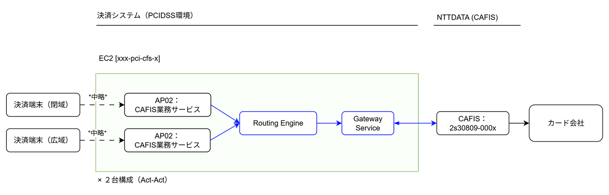
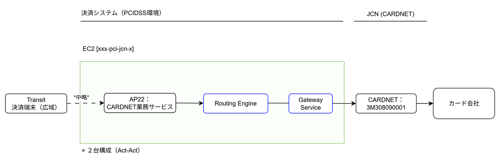

## システム構成

### CAFIS接続

**現行**

**変更後**

### CARDNET接続 (transit)

**現行**

**変更後**

### 移行方式の検討

- 変更後構成のリリース後は、不具合等によるリスク低減のため  
  段階的に顧客を新サービスに切り替える構成を採る。
- サーバ２台構成中の`１号機に現行顧客を寄せ、２号機を新サービス用`にする。  
  ※ 相手側から接続にくる方式のため、同一ホストでサービスの複数稼働はできない。  
  上記図にはでてこないが、決済端末入り口のコンポーネント（AP01, AP11）でサーバを振り分けることになる。  

