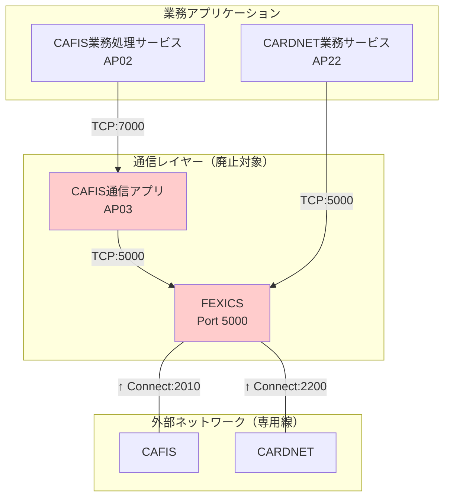
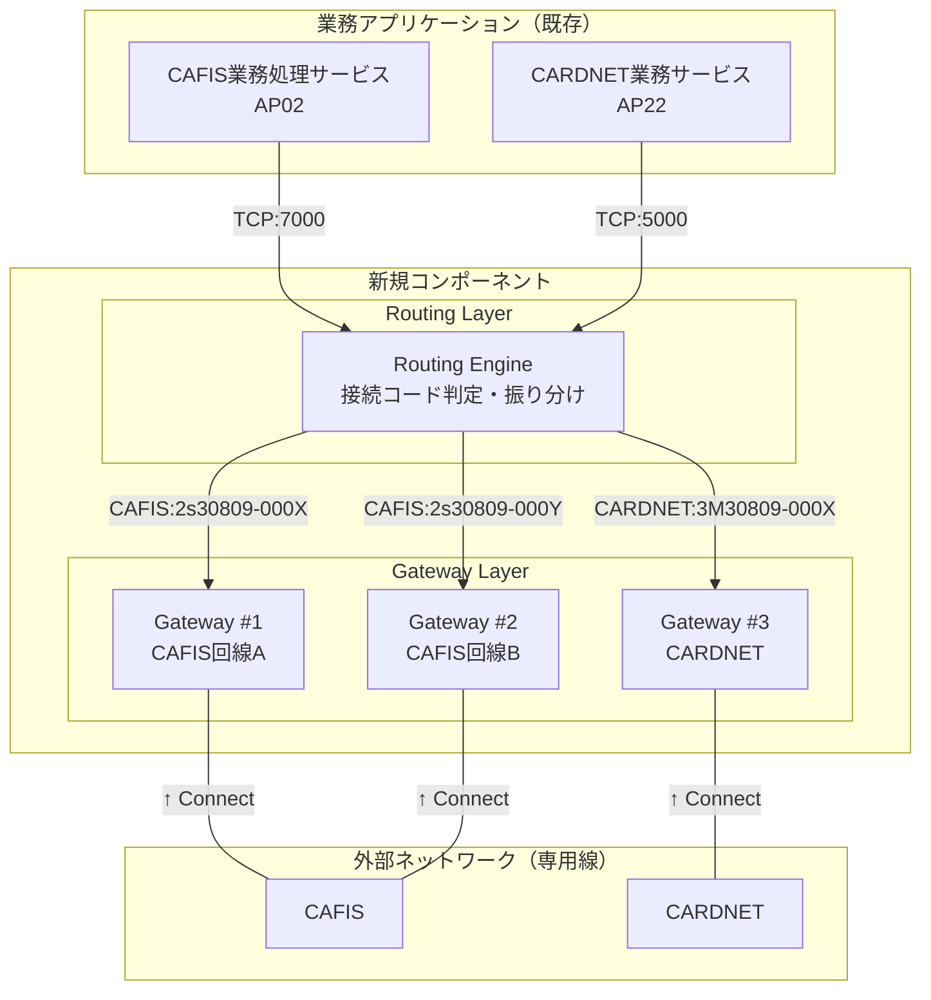
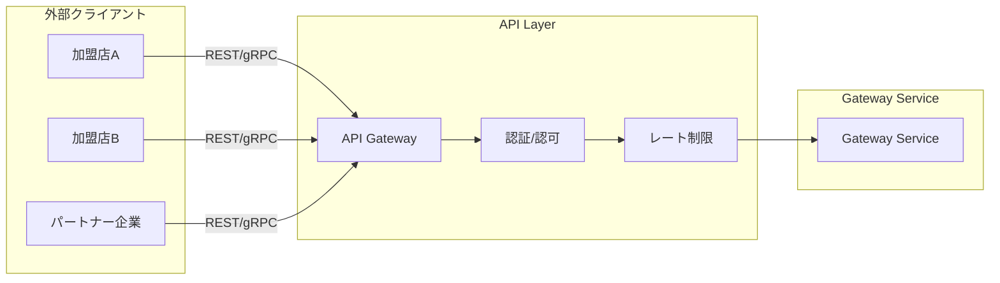

# アーキテクチャ設計

## 改訂履歴

| バージョン | 日付       | 改定内容                         | 改定者    |
| ---------- | ---------- | -------------------------------- | --------- |
| v0.1       | 2026-01-29 | 初版作成                         | 内川 修司 |
| v0.2       | 2026-02-09 | 文言の調整 (仕向け先⇒接続コードに変更) <br/> 言語選定のメモ | k_yoshizawa |
| v0.3       | 2026-02-19 | タイトルから(案)の除去、インフラ構成のレビュー結果反映 | k_yoshizawa |

---

## 1. 設計方針

### 基本原則

1. **既存構成の維持**: 現行のVPC構成、ネットワーク、PCI DSS範囲は変更しない
2. **インターフェース互換**: 既存アプリ（CAFIS業務処理サービス、CARDNET業務サービス）から同一データで同一の電文機能を実行できること
3. **段階的移行**: Phase 1でFEXICS置き換え、Phase 2以降で必要に応じてモダナイズ
4. **シンプルな構成**: 統合されたGateway Serviceで全機能を提供
5. **回線制約の考慮**: CAFIS/CARDNETからの接続を受け付ける構成

### スケール方針

| 方針 | 内容 |
|------|------|
| **基本戦略** | スケールアップで対応（CPU/メモリ増強） |
| **セッション数上限** | 契約変更でセッション数増加可能 |
| **帯域/セッション上限到達時** | 回線追加 + サーバー追加 |

### スコープ

| 項目 | Phase 1（本設計） | Phase 2（将来） |
|------|------------------|-----------------|
| FEXICS置き換え(新規サーバ環境構築) | ✅ | - |
| 接続コードによる顧客ルーティング | ✅ | 拡張 |
| 既存 cfs, jcnサーバ廃止 | ✅ | - |
| VPC分離 | ❌ | 検討 |
| 外部API公開（SaaS） | ❌ | 検討 |
| PCI DSS範囲見直し | ❌ | 検討 |

---

## 2. 現行システムと廃止対象

### 現行の接続パターン



### 廃止対象コンポーネント

| コンポーネント | 理由 |
|---------------|------|
| **FEXICS** | EOL対応（本プロジェクトの主目的） |
| **AP03 CAFIS通信アプリ** | FEXICS前提の設計、単純中継のため統合可能 |

### データフロー一覧（変更対象）

| データフロー | 現行 | 新規 | 用途 |
|-------------|------|------|------|
| DF01-6,7,8 | AP02→AP03→FEXICS→CAFIS | AP02→Gateway→CAFIS | CAFIS決済（VPT端末） |
| DF08-6,7,8 | AP02→AP03→FEXICS→CAFIS | AP02→Gateway→CAFIS | 広域端末操作 |
| DF16-9,10 | AP22→FEXICS→CARDNET | AP22→Gateway→CARDNET | トランジット端末操作 |
| DF17-5,6 | AP22→FEXICS→CARDNET | AP22→Gateway→CARDNET | JCN合算オーソリ・売上連携 |
| DF18-7,8 | AP22→FEXICS→CARDNET | AP22→Gateway→CARDNET | 会員登録 |
| DF19-6,7 | AP22→FEXICS→CARDNET | AP22→Gateway→CARDNET | 会員情報照会 |

---

## 3. 新システム構成（Phase 1）

### 設計上の制約

| 制約 | 内容 | 対応方針 |
|------|------|---------|
| 接続方向 | CAFIS/CARDNETから接続を受ける（自社がListen） | Gateway Serviceで常時Listen |
| 回線数制限 | CAFIS/CARDNETからの接続数に上限あり | 回線ごとにGateway Serviceを配置 |
| セッション数制限 | 同時セッション数に上限あり | 契約変更で増加可能、上限時は回線追加 |
| 接続コードルーティング | 接続コードに応じた回線選択が必要 | Routing Engine内でルーティング |

### 統合アーキテクチャ



### スケール戦略

| 状況 | 対応 |
|------|------|
| 処理負荷増加 | **スケールアップ**（CPU/メモリ増強） |
| セッション数不足 | 契約変更でセッション数増加 |
| 帯域/セッション上限到達 | **回線追加 + Gateway Service追加** |


### 言語選定（検討中）

| 候補 | フレームワーク | サポート期限 | 備考 |
|------|---------------|-------------|------|
| **C# (.NET 10)** | ASP.NET Core | 2028年11月（LTS） | 既存Windows環境との親和性 |
| **Kotlin** | Spring Boot / Ktor | Java 21 LTS: 2031年9月 | モダン、コルーチンによる非同期処理 |

**決定時期**: 詳細設計フェーズ

**Note:**
```
C# 優勢

■ 比較材料
C# (.NET 10)  移行作業は軽め　PCI環境で使用言語の統一ができる
Kotlin        EOLがやや長い
```

### 業務アプリ側の変更

| アプリ | 変更内容 |
|--------|---------|
| AP02 CAFIS業務処理サービス | 接続先を AP03→Routing Engine(Port 7000) に変更 |
| AP22 CARDNET業務サービス | 接続先を FEXICS→Routing Engine(Port 5000) に変更 |

### コンポーネント仕様

#### Routing Engine

| 項目 | 仕様 |
|------|------|
| 役割 | 電文解析、接続コードによるGateway振り分け |
| 実行環境 | Amazon ECS on EC2 |
| 待ち受けPort | 7000（CAFIS系）, 5000（CARDNET系） |
| スケール | 水平スケール可（ステートレス） |

**機能**:
- 電文ヘッダ解析（接続コード判定）
- ルーティングテーブルに基づくGateway選択
- Gateway障害時のフェイルオーバー

#### Gateway Service

| 項目 | 仕様 |
|------|------|
| 役割 | 電文変換、接続管理 |
| 実行環境 | Amazon ECS on EC2 |
| 待ち受けPort（外部向け） | 2010（CAFIS）, 2200（CARDNET） |
| 動作モード | **常時Listen**（CAFIS/CARDNETからの接続を受付） |
| スケール | **回線単位**（回線追加時にサーバー追加） |

**機能**:
- 電文フォーマット変換（業務アプリ ↔ CAFIS/CARDNET）
- CAFIS/CARDNETからの接続受付・維持
- A1/A2系切替、タイムアウト、リトライ
- 通信ログ出力（PCI DSS対応）

---

## 4. リスクと対策

| リスク | 影響 | 対策 |
|--------|------|------|
| 電文変換の不整合 | 決済失敗 | 既存FEXICSの電文ログを元に変換ロジックを検証 |
| 専用線接続の切替 | サービス断 | 並行稼働期間を設け段階的に移行 |
| 性能劣化 | レスポンス遅延 | 負荷テストで既存同等以上を確認 |
| コンテナ障害 | サービス断 | Multi-AZ + Auto Recovery |
| AP03の隠れた機能 | 機能欠落 | 切替前にAP03の動作ログを詳細分析、並行稼働で差異検出 |
| AP02の接続先変更 | 設定ミス | 環境変数/設定ファイルで接続先を外部化、段階的切替 |

---

## 5. 将来構想（Phase 2以降）

Phase 1完了後、以下を検討：

### 外部API公開（SaaS化）



| 機能 | 内容 |
|------|------|
| マルチテナント | 加盟店/パートナーごとの論理分離 |
| 認証・認可 | OAuth 2.0 / API Key |
| レート制限 | テナントごとのリクエスト制限 |
| 課金連携 | 利用量に応じた従量課金 |

### その他の拡張

- **VPC分離**: PCI DSS範囲最小化のための専用VPC構築
- **gRPCインターフェース**: 既存TCP→gRPCへのモダナイズ
- **ルーティング拡張**: 動的ルール変更、A/Bテスト対応
- **監視強化**: 分散トレーシング、リアルタイムダッシュボード
