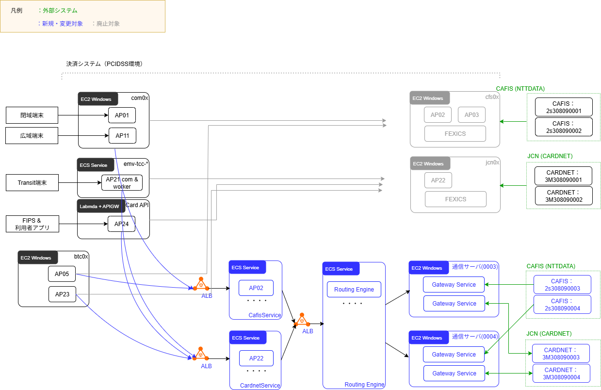
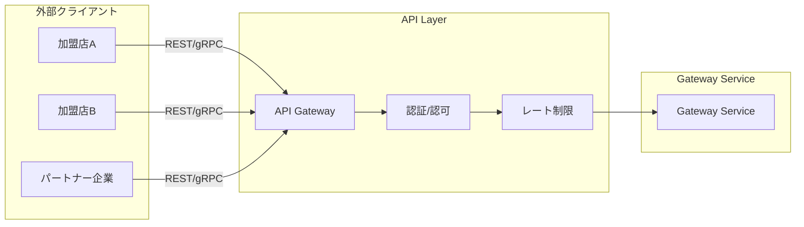

# アーキテクチャ設計

## 改訂履歴

| バージョン | 日付       | 改定内容                         | 改定者    |
| ---------- | ---------- | -------------------------------- | --------- |
| v0.1       | 2026-01-29 | 初版作成                         | 内川 修司 |
| v0.2       | 2026-02-09 | 文言の調整 (仕向け先⇒接続コードに変更) <br/> 言語選定のメモ | k_yoshizawa |
| v0.3       | 2026-02-19 | タイトルから(案)の除去、インフラ構成のレビュー結果反映 | k_yoshizawa |

---

## 1. 設計方針

### 基本原則

1. **既存構成の維持**: 現行のVPC構成、ネットワーク、PCI DSS範囲は変更しない
2. **インターフェース互換**: 既存アプリ（CAFIS業務処理サービス、CARDNET業務サービス）から同一データで同一の電文機能を実行できること
3. **段階的移行**: Phase 1でFEXICS置き換え、Phase 2以降で必要に応じてモダナイズ
4. **シンプルな構成**: 統合されたGateway Serviceで全機能を提供
5. **回線制約の考慮**: CAFIS/CARDNETからの接続を受け付ける構成

### スケール方針

| 方針 | 内容 |
|------|------|
| **基本戦略** | スケールアップで対応（CPU/メモリ増強） |
| **セッション数上限** | 契約変更でセッション数増加可能 |
| **帯域/セッション上限到達時** | 回線追加 + サーバー追加 |

### スコープ

| 項目 | Phase 1（本設計） | Phase 2（将来） |
|------|------------------|-----------------|
| FEXICS置き換え(新規サーバ環境構築) | ✅ | - |
| 接続コードによる顧客ルーティング | ✅ | 拡張 |
| 既存 cfs, jcnサーバ廃止 | ✅ | - |
| VPC分離 | ❌ | 検討 |
| 外部API公開（SaaS） | ❌ | 検討 |
| PCI DSS範囲見直し | ❌ | 検討 |

### 設計上の制約

| 制約 | 内容 | 対応方針 |
|------|------|---------|
| 接続方向 | CAFIS/CARDNETから接続を受ける（自社がListen） | Gateway Serviceで常時Listen |
| 常時接続 | CAFIS/CARDNETからの接続は常時維持する | Gateway Serviceで接続保持 |
| 回線数制限 | CAFIS/CARDNETからの接続数に上限あり | 回線ごとにGateway Serviceを配置 |
| セッション数制限 | 同時セッション数に上限あり | 契約変更で増加可能、上限時は回線追加 |
| 接続コードルーティング | 接続コードに応じた回線選択が必要 | Routing Engine内でルーティング |

---

## 2. 構築・変更対象

### 概要

FEXICSおよびCAFIS通信アプリ（AP03）を廃止し、新規に**Routing Engine**と**Gateway Service**を開発する。
業務アプリ（AP02/AP22）からの電文をRouting Engineで仕向け先判定し、回線ごとに配置されたGateway ServiceがCAFIS/CARDNETとの接続・電文変換を担う。

```
業務アプリ → Routing Engine → Gateway Service → CAFIS/CARDNET
                                    ↑
                              回線ごとに配置
```

### 一覧

**CAFIS関連**

| コンポーネント | 区分 | 現行配置サーバ | 詳細 |
| --- | --- | --- | --- |
| FEXICS | 廃止 | cfs0x | EOL対応（本プロジェクトの主目的） |
| AP03 (CAFIS通信制御) | 廃止 | cfs0x | FEXICS廃止に伴い |
| AP02 (CAFIS業務ロジック) | 更新 | cfs0x | ECSに対応し新規配置、接続先を routing engine に対応 |
| AP01 (端末間通信:閉域) | 更新 | com0x | 顧客指定での通信先切替 | 
| AP11 (端末間通信:広域) | 更新 | com0x | 顧客指定での通信先切替 | 
| routing engine | 新規 | - | 接続先コードによる gateway service への中継を行う |
| gateway service | 新規 | - | CAFIS / CARDNET への接続機能 |

**CARDNET関連**

| コンポーネント | 区分 | 現行配置サーバ | 詳細 |
| --- | --- | --- | --- |
| FEXICS | 廃止 | jcn0x | EOL対応（本プロジェクトの主目的） |
| AP22 (CARDNET業務ロジック) | 更新 | jcn0x | ECSに対応し新規配置、接続先を routing engine に対応 |
| AP21 (Transit端末間通信) | 更新 | ECS | 顧客指定での通信先切替 | 
| AP24 (Webアプリ向けAPI) | 更新 | Lambda | 通信先切替 |

**その他**

| コンポーネント | 区分 | 現行配置サーバ | 詳細 |
| --- | --- | --- | --- |
| cli | 新規 | - | routing engine 手動操作用 |
| dummy server | 新規 | - | 開発環境のみのサーバシミュレータ |

---

## 3. システム構成（Phase 1）

### 統合アーキテクチャ




各変更内容は 機能仕様 にて定義する。


### 言語選定

| 候補 | フレームワーク | サポート期限 | 備考 |
|------|---------------|-------------|------|
| **C# (.NET 10)** | ASP.NET Core | 2028年11月（LTS） | 既存Windows環境との親和性 |

**Note:**
```
■ 比較材料
C# (.NET 10)  移行作業は軽め　PCI環境で使用言語の統一ができる
Kotlin        EOLがやや長い
```

---


---

## 5. 将来構想（Phase 2以降）

Phase 1完了後、以下を検討：

### 外部API公開（SaaS化）



| 機能 | 内容 |
|------|------|
| マルチテナント | 加盟店/パートナーごとの論理分離 |
| 認証・認可 | OAuth 2.0 / API Key |
| レート制限 | テナントごとのリクエスト制限 |
| 課金連携 | 利用量に応じた従量課金 |

### その他の拡張

- **VPC分離**: PCI DSS範囲最小化のための専用VPC構築
- **gRPCインターフェース**: 既存TCP→gRPCへのモダナイズ
- **ルーティング拡張**: 動的ルール変更、A/Bテスト対応
- **監視強化**: 分散トレーシング、リアルタイムダッシュボード
