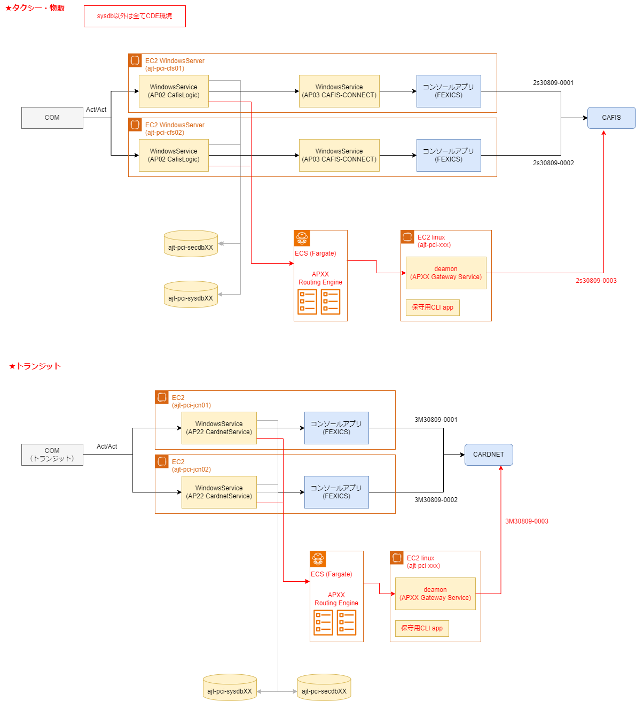
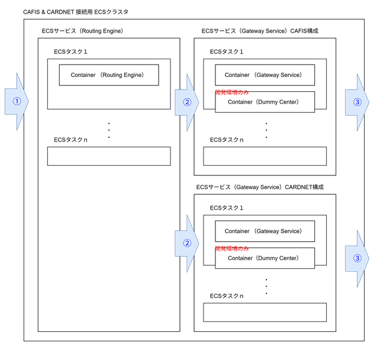
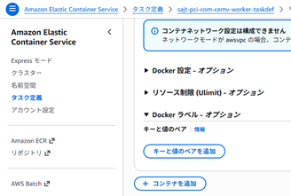
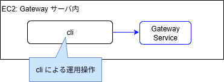

# 機能要件

## 改訂履歴

| バージョン | 日付       | 改定内容 | 改定者 |
| ---------- | ---------- | -------- | ------ |
| v0.1       | 2026-02-03 | 初版作成 | k_yoshizawa |

---

## 前説

本章では、FEXICS代替として新規開発する **Routing Engine** および **Gateway Service** の機能要件を定義する。
機能の洗い出しは、既存コンポーネント（AP02, AP03, AP22）のソースコード調査結果に基づく。

| コンポーネント | 役割 |
|---------------|------|
| **Routing Engine** | 業務アプリからの電文を受信し、適切な Gateway Service に振り分ける |
| **Gateway Service** | CAFIS/CARDNET との接続管理および電文変換を行う。決済ネットワーク事業者 = MC間の契約回線ごとに配置 |

#### INDEX

- 全体システム構成
- 実行環境
- ユースケース
- 機能要件（各コンポーネント機能）
    - 共通事項
    - Routing Engine
    - Gateway Service
- 機能要件（その他機能）
    - Dummy Center
    - Cli

## 1. 全体システム構成（変更後システム）




【TODO】ECS を使うとリタイアリングして CAFIS 接続がきれる？


## 2. 実行環境

**Routing Engine** および **Gateway Service** は Amazon ECS 内で動作するコンテナ環境で動作します。

**コンテナ動作イメージ**



- Routing Engine は CAFIS、CARDNET で共通のサービス構成を使用します。
  （AP02 -> CARDNET などの構成もネットワーク上は可能。
    これは現在 CAFIS サーバで利用している機能を CARDNET 側に繋ぎやすくするための考慮です）

- 処理は必ず Routing Engine 経由で行われます。
  Routing Engine は 受けた処理要求から CAFIS | CARDNET のどちらに接続するかを判断し、
  対応する Gateway Service にルーティングします。

- 受けた電文がどちらの仕様で動作するかは、各々の Gateway Service の起動設定で決定します。
  (Strategy Pattern の実装イメージ)

- Gateway Service は 各サービス タスク数 = 1 で運用します。

#### [処理フロー]

1. ① AP02 または AP22 からの通信を Routing Engine が受ける
2. ② 受けたデータを対応する Gateway Service の生存インスタンスに転送する（ヘッダ判定）
3. ③ カード会社ネットワークへの通信を行う
   ※ TCP接続は CAFIS | CARDNET 側から行われ常時接続となるため、データ部の送信となる。

#### 開発環境の動作

開発環境はカード会社ネットワークへの接続が行えないため、`Dummy Center` sidecar を構成し、そこに通信を行います。
※ タスク定義でデプロイする



#### データストア
Gateway Service は電文データの記録をもつ必要がある。
※ 主に、取引の前回処理結果を参照する必要のある電文対応： 障害取消など
※ その他用途： 電文解析、利用情報分析

データストアは 【🚧TODO】XXX に構築する。

※ SecureDB に保存で検討 : 新規テーブル : ストライプは持ちたくない

## 3. ユースケース

**Routing Engine** および **Gateway Service** は、以下のように利用されます。

1. 端末からのオンライン電文処理  
2. 運用時の手動操作  


### 3.1 オンライン電文処理 

オンライン電文処理は、決済端末またはシステム内部のイベントを起点として発生する電文を対象とします。

本処理には、ユーザによる端末操作に起因する電文（例：オンラインオーソリ、オーソリ取消など）に加え、障害発生時や運用上の要件によりシステムが自動的に生成する電文（例：障害取消、未完了取引の補正処理等）が含まれます。


### 3.2 運用時の手動操作  

運用時の手動操作は、通常のオンライン電文処理とは異なり、障害対応や調査対応など、運用担当者の判断に基づいて実行される処理を対象とします。

本処理には、電文内容の調査、処理結果の確認、および障害発生時のリカバリ操作（例：電文の再送、取消・補正電文の手動送信等）が含まれます。
これらの操作は、主に CLI（Command Line Interface） を通じて実行されることを想定しています。



## 4. 機能要件（コンポーネント機能）

## 4.1 共通事項

### ログ要件

##### 出力先

- ECS 動作を想定し、出力先は **console（標準出力）** とする。
  ※ これにより CloudWatch Logs に記録される。

##### 契機

- システムに対するデータの入出力（通信ログ、アクセスログ）
- 接続状態、セッションなどの内部状態変化（アプリログ）
- 要求電文の実行結果（オーソリ・取消・アドバイス等の成否）
- エラー発生（通信断、電文変換エラー等）
など

##### 保持期間

１年以上保持（PCI DSS 要件）

##### 留意事項

- レベル **ERROR** のログを通知対象とする。
- カード番号 / 有効期限は**マスクして出力**すること。（PCI DSS 要件）

##### フォーマット例

- フォーマットは Json 形式。以下のフィールドを含むこと。

| カラム | 内容 |
|--------|------|
| app | アプリケーション識別 |
| level | ログレベル （INFO, WARN, ERROR）|
| function | 機能識別 |
| message | 内容 |

**サンプル**
```
{"app": "AP30", "level": "INFO", "function": "Main", "message": "アプリケーションを終了します"}
```

### メトリクス

【🚧TODO】

### スレッド管理

Routing Engine はマルチスレッドで動作する。
以下の点を考慮すること。

| 機能 | 内容 |
|------|------|
| 処理スレッドプール数 | 環境変数により設定可能とする |
| グレースフルシャットダウン | 停止前に処理中トランザクションの完了を待機する（最大60秒）<br/> ※ 実装的には受付停止と終了時の待機を組み込めばいい |

## 4.2 Routing Engine

#### 機能一覧

| No | 機能 |
|---|---|
| F-01 | 電文受信 |
| F-02 | 接続コード判定 |
| F-03 | フェイルオーバー |

### 4.2.1 電文受信

業務アプリ（AP02/AP22）からの TCP 接続を受け付け、指定された要求を実行する。
また処理結果を業務アプリに返却する。

| 項目 | 仕様 |
|------|------|
| プロトコル | TCP (grpc) |
| 待ち受けポート | 7000（CAFIS系）、5000（CARDNET系） |
| 電文フォーマット | 詳細設計で決定 |

### 4.2.2 接続コード判定

| 機能 | 内容 |
|------|------|
| 電文解析 | 電文ヘッダから接続先を判定、対応する Gateway Service を送信先に選択 |

[サンプル]
```
X-Forward-Gateway: 2s30809-0001
```

接続ポートとヘッダ指定接続先の不一致はエラーとする。

### 4.2.3 フェイルオーバー

| 機能 | 内容 |
|------|------|
| Gateway 障害検知 | Gateway Service の生存を監視し、生存が確認できない場合は同種の別サービスを送信先とする |
| 処理不可の判断 | 自身が処理不可の場合、クライアントに Failover が必要である旨のエラーを返す |

## 4.3. Gateway Service

Routing Engine からの要求を受け、回線種別（CAFIS/CARDNET）に対応した電文処理を行う。


#### 機能一覧

| No | 分類１ | 分類２ | |
|----|---------------|------|---|
| G-01 | 回線種別毎処理 | - | core |
| G-02 | データ永続化 | - | core |
| G-03 | セッション管理・排他制御 | - | core |
| G-04 | 障害処理 | - | core |
| H-01 | CAFIS | 電文解析 | core |
| H-02 | CAFIS | 生存監視 | |
| H-03 | CAFIS | システム制御電文 | |
| H-04 | CAFIS | オンライン電文処理 | |
| H-05 | CAFIS | 運用操作処理 | |
| I-01 | CARDNET | 電文解析 | core |
| I-02 | CARDNET | 生存監視 | |
| I-03 | CARDNET | システム制御電文 | |
| I-04 | CARDNET | オンライン電文処理 | |
| I-05 | CARDNET | 運用操作処理 | |


### 4.3.1 回線種別毎処理

Gateway Service は、起動時に設定情報を読み込み、対象とする回線種別（CAFIS または CARDNET）を判定した上で、対応するモードで起動します。

回線種別の設定は、設定ファイルや環境変数等の外部設定として与えられ、Gateway Service は起動時にこれを参照して動作モードを確定します。
確定した回線種別に応じて、以下のように内部処理が切り替えられます。

使用する電文フォーマットおよび解析ロジック

オンライン電文処理および運用電文処理の制御フロー

生存監視やシステム制御電文の取り扱い方法

Gateway Service は 単一の回線種別に特化した状態で動作し、同一プロセス内で CAFIS / CARDNET の両回線を同時に扱うことは想定しません。

#### 接続待ち受け

Gateway Service は起動後、CAFIS または CARDNET からの TCP 接続を常時 Listen し、接続を受け付けます（自社がサーバー側）。
外部向けポートは回線種別により異なります。

| 回線種別 | 外部向けポート |
|----------|---------------|
| CAFIS | TCP: 2010 |
| CARDNET | TCP: 2200 |

接続状態は以下の状態遷移に従って管理します。

`DISCONNECTED → CONNECTING → CONNECTED → DISCONNECTING → ERROR`

開局・閉局などのシステム制御電文の処理中は、業務処理（オンライン電文処理）との同時実行を排他制御により防止します。

### 4.3.2 データ永続化

【🚧TODO】

### 4.3.3 セッション管理・排他制御

Gateway Service は、CAFIS / CARDNET との通信を`セッション`で管理します。
回線契約時に利用可能なセッション数が決まっているため、セッション超過時は電文処理を保留、
または、タイムアウトエラーにするなどの管理を行います。

| 機能 | 内容 |
|------|------|
| セッションプール | 複数セッションの保持・管理 |
| セッション枯渇対応 | セッション不足時の処理 |

### 4.3.4 障害処理

Gateway Service は、通信障害やタイムアウト等の異常発生時に、
CAFIS / CARDNET の手順にそった障害処理を備えます。

| 機能 | 内容 |
|------|------|
| 障害電文などの制御電文送信 | CAFIS / CARDNET 接続仕様で定義されたシーケンス制御 <br/> タイムアウト制御 , リカバリ など |

### 4.3.5 CAFIS

#### 電文解析

CAFIS 接続仕様に基づき、送受信される電文の構築および解析を行う機能を提供します。

CAFIS との通信においては、基本フォーマットとして ISO 8583 を採用しており、電文ヘッダ、MTI、ビットマップ、データエレメントの構成に従って電文を構築します。
Routing Engine から受け取った取引情報や制御情報を、CAFIS 接続仕様で定義された項目へマッピングし、送信可能な電文形式へ変換します。

#### 生存監視

Routing Engine に自身のヘルス状態異常を応答できること。
次の "システム制御電文：ステータス取得" を使用します。

#### システム制御電文

Gateway Service は、CAFIS との接続制御および運用管理を目的としたシステム制御電文をサポートします。
これらの電文は、回線の状態管理や日次運用に必要な制御処理を行うために使用され、オンライン取引電文とは独立した制御系の通信として扱われます。

| コマンド(AP03互換表記) | 機能 | 備考 |
|----------|------|------|
| C01 | 開局（接続確立） | |
| C02 | 閉局（接続切断） | |
| C03 | ステータス取得 | ヘルスチェックにも使用 |
| C11 | 締め日取得 | 日次更新 |
| C12 | 締め日更新 | 日次更新 |

※ 締め日処理は CAFIS 通信仕様ではないが、FEXICS 互換機能としてここに分類します。

#### オンライン電文処理

Gateway Service は、CAFIS との決済取引に使用するオンライン電文をサポートします。
これらの電文は、端末操作またはシステム内部イベントを起点として発生し、リアルタイムでの承認・取消処理を行います。

| コマンド(AP03互換表記) | 機能 | 備考 |
|----------|------|------|
| B01 | iD アクセスキー取得 | iD 決済で使用 |
| B11 | iD オンラインオーソリ | |
| B12 | iD オーソリ取消 | |
| B16 | MS（磁気）オンラインオーソリ | |
| B17 | MS オーソリ取消 | |
| B22 | IC オンラインオーソリ | SecureIC、Global Action からも利用 |
| B23 | IC オーソリ取消 | SecureIC、Global Action からも利用 |
| B24 | アドバイス（取引確定） | IC / SecureIC で使用 |
| B25 | 障害取消 | 障害時の取引復旧 |

##### 対象外

以下のコマンドは今回実装対象外とします。

| コマンド | 機能 | 理由 |
|----------|------|------|
| B20, B21 | 銀聯オーソリ / 取消 | ほぼ未使用のため対象外。切り替え後は銀聯処理はエラー応答となる |
| B30〜B33 | 売上オーソリ系 | 未使用のため対象外 |

#### 運用操作処理

【🚧TODO】

### 4.3.6 CARDNET

#### 電文解析

Gateway Service における CARDNET 向け電文解析処理は、CARDNET 接続仕様に基づき、送受信される電文の構築および解析を行う機能を提供します。

CARDNET との通信では、基本フォーマットとして ISO 8583 を採用しており、電文ヘッダ、MTI、ビットマップ、データエレメントの構成に従って電文を構築します。
Routing Engine から受け取った取引情報や制御情報を、CARDNET 接続仕様で定義された項目へマッピングし、送信可能な電文形式へ変換します。

#### 生存監視

【🚧TODO】

#### システム制御電文

Gateway Service は、CARDNET との接続制御および運用管理を目的としたシステム制御電文をサポートします。
これらの電文は、回線の状態管理や日次運用に必要な制御処理を行うために使用され、オンライン取引電文とは独立した制御系の通信として扱われます。

| コマンド(AP22互換表記) | 機能 | 備考 |
|----------|------|------|
| SignOn | 開局 | CAFIS の C01 相当 |
| SignOff | 閉局 | CAFIS の C02 相当 |
| GetStatus | ステータス取得 | CAFIS の C03 相当 |
| CutOver | 日次更新 | CAFIS の C12 相当 |
| Echo | 死活確認（ハートビート） | CAFIS 側には対応なし |

#### オンライン電文処理

Gateway Service は、CARDNET との決済取引に使用するオンライン電文をサポートします。
これらの電文は、端末操作またはシステム内部イベントを起点として発生し、リアルタイムでの承認・取消処理を行います。

| コマンド(AP22互換表記) | 機能 | 備考 |
|----------|------|------|
| OnlineAuthICC | IC オンラインオーソリ | CAFIS の B22 相当 |
| OnlineAuthICC_Cancel | IC オーソリ取消 | CAFIS の B23 相当 |
| SystemCancel | 障害取消 | CAFIS の B25 相当 |

#### 運用操作処理

【🚧TODO】

---

## 5. 機能要件（その他機能）

### 5.1 Dummy Center

【🚧TODO】

### 5.2 CLI

【🚧TODO】


### 5.3 業務アプリ側の変更

Routing Service に接続する以下の業務アプリについて、本方式に対応するための変更を行います。

`本方式へ接続を切り替えるためには、顧客（営業所）ごとに設定を行う必要があります。`  
設定内容に基づき、業務アプリは従来の接続方式ではなく、Routing Service を経由した電文送信を行うように動作します。

#### AP02（CAFIS業務処理サービス）

| 項目 | 現行 | 変更後 |
|------|------|--------|
| 接続先 | AP03 (TCP:7000) | Routing Engine (TCP:7000) |
| 変更内容 | 接続先の設定変更 | ポート番号維持のため設定変更のみ |

#### AP22（CARDNET業務サービス）

| 項目 | 現行 | 変更後 |
|------|------|--------|
| 接続先 | FEXICS (DLL直接呼出し) | Routing Engine (TCP:5000) |
| 変更内容 | FexicsAPI_CN パッケージの利用 | TCP クライアントへの置き換え |
