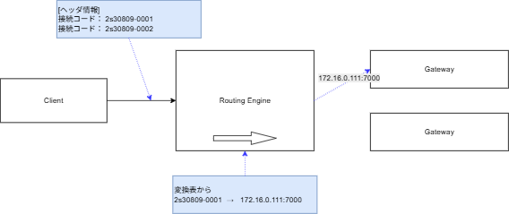
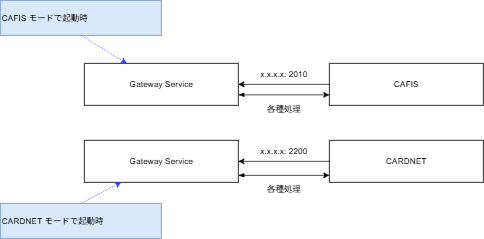
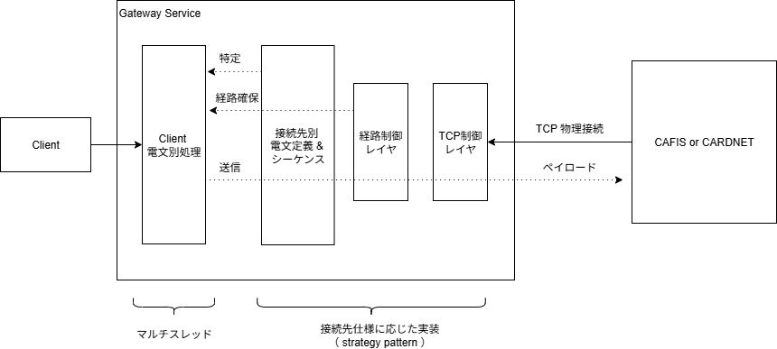

# 機能要件

## 改訂履歴

| バージョン | 日付       | 改定内容 | 改定者 |
| ---------- | ---------- | -------- | ------ |
| v0.1       | 2026-02-03 | 初版作成 | k_yoshizawa |
| v0.2       | 2026-02-19 | インフラレビュー結果反映、記載の整理 | k_yoshizawa |
| v0.3       | 2026-02-26 | レビュー結果反映 （バッチ関連追加） | k_yoshizawa |

---

## 概要

本章では、FEXICS代替として新規開発および変更が必要なコンポ－ネントの機能要件を定義する。
機能の洗い出しは、既存コンポーネント（AP02, AP03, AP22）のソースコード調査結果に基づく。

新規作成コンポーネントの共通事項については、別途以下にまとめる。

[共通事項](./04-functions_01_part1_common.md)

[ユースケース](./04-functions_02_part2_usecase.md)

#### INDEX

- 機能要件： Routing Engine
- 機能要件： Gateway Service
- 機能要件： Cli
- 機能要件： Dummy Server
- 機能要件： 更新対象のソフト (CAFIS系統)
- 機能要件： 更新対象のソフト (CARDNET系統)

## 1. 機能要件： Routing Engine

#### 分類

- 新規構築

#### 役割

- 電文解析、接続コードによる Gateway Service への中継
- Gateway Service 障害時のフォールバック
- 電文処理の負荷分散（スケーリング）

#### 実行環境

- Amazon ECS (Fargate)

#### 待ち受けPort 

-  7000（CAFIS系）, 5000（CARDNET系）

#### 利用プロトコル

-  gRPC 

※ クライアントからはSSL接続されるが、ALBでオフロードするため、
   アプリケーションは暗号無しの gRPC として処理すればよい。

#### DB通信

- 本ソフトは DB接続を利用しない

### 1.1  機能：電文中継

- Routing Engine は クライアントとなる `AP02`, `AP22` からの電文を受け、
  データを指定された接続コードの　Gateway Service に転送する。

- Routing Engine は 接続コード = 接続先の変換表を設定として持ち、
  対応するサーバへの接続を試行する。

- 候補となる Gateway が複数ある場合、クライアントから複数の接続コードを指定する。※ その際はいずれかのサーバへ接続される。

  [実行イメージ]

  

- CAFIS 用のポートで受けた場合、CAFIS の変換表から  
  CARDNET 用のポートで受けた場合、CARDNET の変換表から  
  接続先を決定する。

  **変換表サンプル**

    | 接続コード | 接続先 | 種別 |
    | --- | --- | --- |
    | 2s30809-0003 | 192.1.1.1:7000 | CAFIS |
    | 2s30809-0004 | 192.1.1.2:7000 | CAFIS |
    | 3M30809-0003 | 192.1.1.1:5000 | CARDNET |
    | 3M30809-0004 | 192.1.1.2:5000 | CARDNET |

    ※ 上記はイメージです。IPアドレスは実際のものとは異なります。また、実際の通信はホスト名を使用します。

- 変換表は環境変数からの設定とする。


### 1.2  機能：障害時のフォールバック

- Routing Engine は Gateway Service の生存監視機能を持つ。  
  生存監視はバックグラウンドで `設定` 秒ごとに行われる。

- クライアントから指定された接続コードのうち、現在障害中の接続先を避けて  
  電文中継を実行する。

- 指定されたすべての接続コードが利用できない場合、エラー応答とする。

### 1.3  機能：ヘルスチェック応答

- Routing Engine は自身が処理可能な間、 ALB からのヘルスチェックに応答する必要がある。

---
## 2. 機能要件： Gateway Service

#### 分類

- 新規構築

#### 役割

- CAFIS, CARDNET への接続
- クライアントの電文を CAFIS, CARDNET 形式に変換する 

#### 実行環境

- Amazon EC2 (Windows)

#### 待ち受けPort 

**カード会社側からの待ち受け**
-  2010（CAFIS系）※ 開発環境では 2009
-  2200（CARDNET系）

**routing engine側からの待ち受け**
-  7000（CAFIS系）, 5000（CARDNET系）

#### 利用プロトコル

-  gRPC (SSL)

※ ALB を挟まないため、アプリケーションが証明書処理を行う。  
※ 証明書管理が必要。

#### DB通信

- ジャーナル保存のため SecureDB の通信を行う。
- また、鍵情報を取り扱うため、AWS KMS へのアクセスが必要となる。 

### 2.1  機能：CAFIS/CARDNET電文処理

- Gateway Service は CAFIS/CARDNET の電文を解析し、適切なシーケンス処理および 
  Routing Engine との電文変換処理を行う。
  
- CAFIS/CARDNETの詳細仕様についてはここには記載しない。  
  別途、関連資料を参照すること。

- CAFIS / CARDNET のどちらの接続として振舞うかは、起動時の設定確認で決定する。

  [実行イメージ]

  

- 以下に続く CAFIS / CARDNET の電文処理はそれぞれの接続先仕様で実装する必要がある。

### 2.2  機能：既存互換の電文サポート(CAFIS)

- 以下、用途別に分類して記載する。

  | 分類名 | 概要 |
  |---|---|
  | 制御電文 | ソフトが自動または手動で行うシステム稼働に必要な制御電文 |
  | 業務電文 | 端末からの決済操作などで発生する電文 |

- 各電文はクライアントから見ての単位で記載しているが、  
  実装上は単発の電文送信ではなく、従来 FEXICS が担っていた複数回の電文交換シーケンスから成る場合がある。  
  それらの制御電文も実装対象とすること。  

  （※「障害電文／障害報告電文」の対応など）

#### 2.2.1 制御電文

- 電文一覧

  | コマンド | 機能 | 備考 |
  |---|---|---|
  | C01 | 開局（接続確立） | |
  | C02 | 閉局（接続切断） | |
  | C03 | ステータス取得 | ヘルスチェックにも使用 |
  | C11 | カット日付取得 | 日次更新 |
  | C12 | カット日付更新 | 日次更新 |

  **開閉局**
  - CAFIS はクライアントの開局状態というステータスを管理している。
  - CAFIS のすべての電文はクライアントが開局状態となっていることを条件に受け付ける。
  - Gateway Service としては、現在の状態管理を行い、手動および自動によるこれらの電文を実行できること。

  **自動処理**
  - Gateway Service はプロセスの開始時、終了時に、自身の状態を確認し、自動での開局・閉局を行うこと。

  **カット日付**
  - 運用日（１日分）の区切りを切り替えるための論理単位。
  - CAFISに日付更新の電文は定義されていないが、CARDNET互換としてクライアントから指定される。
  - Gateway Service としては、ジャーナルのローテーションや過去データ削除などの契機として利用する。

#### 2.2.2 業務電文

- 電文一覧

  | コマンド | 金種 | 機能 | 備考 |
  |---|---|---|---|
  | B01 | iD | iD アクセスキー取得 | iD 決済で使用 |
  | B11 | iD | iD オンラインオーソリ | |
  | B12 | iD | iD オーソリ取消 | |
  | B16 | クレジット（磁気） | MSオンラインオーソリ | |
  | B17 | クレジット（磁気） | MS オーソリ取消 | |
  | B22 | クレジット（IC） | IC オンラインオーソリ | SecureIC、Global Action からも利用 |
  | B23 | クレジット（IC） | IC オーソリ取消 | SecureIC、Global Action からも利用 |
  | B24 | クレジット（IC） | アドバイス（取引確定） | IC / SecureIC で使用 |
  | B25 | 共通 | 障害取消 | 端末側への情報未達時に行う電文の取消操作 |

  **オンラインオーソリ**
  - 決済確定の前操作として、カード会社に与信枠確保の承認を要求する。
  - 媒体の種別により、それぞれ必要なデータ項目が異なる。
  
  **オンラインオーソリ取消**
  - 確定した取引の取消をカード会社に要求する。
  - システムによる電文制御上の取消とは異なり、これは利用者が明示的に行う取消操作である。

  **障害取消の制約**
  - 障害取消は対象となる取引が処理された接続コードの回線で処理する必要がある。
  - また、障害取消が有効な期間は取引発生から３日間（カット日付単位）である。

  **iDアクセスキー**
  - iD決済手順に端末側で必要になる鍵情報を CAFIS から取得する。
  - 閉域端末でのみ使用。

  **対象外**

  - 以下の電文は既存 CAFIS-CONNECT に存在するが、実装対象外とする。

    | コマンド | 機能 | 理由 |
    |---|---|---|
    | B20, B21 | 銀聯オーソリ / 取消 | ほぼ未使用であり費用対効果が見合わないため今回実装対象外。<br/>切り替え後は銀聯処理はエラー応答とする。 |
    | B30〜B33 | 売上オーソリ系 | 未使用のため対象外 |


### 2.3  機能：既存互換の電文サポート(CARDNET)

- 以下、用途別に分類して記載する。

  | 分類名 | 概要 |
  |---|---|
  | 制御電文 | ソフトが自動または手動で行うシステム稼働に必要な制御電文 |
  | 業務電文 | 端末からの決済操作などで発生する電文 |

  **Note**
  ```
  CARDNET は現在、Transit 機能でのみ使用しています。
  ```

#### 2.3.1 制御電文

- 電文一覧

  | コマンド | 機能 | CAFIS 相当 | 備考 |
  |---|---|---|---|
  | SignOn | 開局（接続確立） | C01 | |
  | SignOff | 閉局（接続切断） | C02 | |
  | GetStatus | ステータス取得 | C03 | ヘルスチェックにも使用 |
  | CutOver | 日次更新 | C12 | |
  | Echo | 死活確認（ハートビート） | - | CARDNET 固有 |

  **開閉局**
  - CAFIS と同様。

  **カット日付**
  - CAFIS と異なり、CARDNET 固有の電文送信が存在する。
  - 用途は CAFIS と同様。

  **Echo（ハートビート）**
  - CARDNET 固有の死活確認電文。接続維持のため定期的に送信する。
  - CAFIS 側には対応する電文がない。

#### 2.3.2 業務電文

- CARDNET が対応する金種は **IC のみ**（iD・磁気は対象外）。

- 電文一覧

  | コマンド | 金種 | 機能 | CAFIS 相当 | 備考 |
  |---|---|---|---|---|
  | OnlineAuthICC | クレジット（IC） | IC オンラインオーソリ | B22 | |
  | OnlineAuthICC_Cancel | クレジット（IC） | IC オーソリ取消 | B23 | |
  | SystemCancel | 共通 | 障害取消 | B25 | 端末側への情報未達時に行う電文の取消操作 |

  **障害取消の制約**
  - CAFIS と同様、障害取消は対象取引が処理された接続コードの回線で処理する必要がある。

### 2.4 機能：運用操作用コマンドの処理

- 後述の cli から操作するコマンド （= 運用サポートに必要な電文）の実装を含むこと。

**MEMO**
```
cli からは要求だけ行い、処理本体は Gateway Service 側で実行する設計とする。
```

### 2.5 機能：経路処理

- CAFIS/CARDNET には、物理的なTCP接続のほかに "経路" と呼ばれる論理接続単位を定義している。  
  この経路管理の処理を実装すること。
- １つの操作に対する電文シーケンスは同一経路で行われる必要がある。  
  経路の使用中は別経路で処理 or 経路解放待ちの制御を行う。  
- "0000" は `システム制御用の経路番号` など、用途の取り決めがある。
  詳細はCAFIS/CARDNETの仕様書を参照。
- 以下に実装イメージを示す。

  

### 2.6 機能：ジャーナル保存と参照

- CAFIS/CARDNET に対して送受信するすべての通過電文を対象に、電文単位での記録をデータストアに残す。  
  この記録を `ジャーナル` と呼称する。

- ジャーナルは、ログとしての確認の他、取消などの際の過去データ整合確認などの際、システム内部で使用される。

  ※ その他用途： 利用情報分析

- データ量が多くなることが想定されるため、書き込みはバックグラウンド処理を用いるなど性能面の考慮をすること。

- 以下のキー情報で情報検索できること。これは `顧客から見ての取引単位` で、この単位で関連電文一覧が閲覧可能とする。
  - 端末番号
  - 端末通番
  - 処理日時

- ジャーナルの保持期間は30日とする。  
  削除タイミングはカット日付更新時。

- データストアの詳細は以下に記載。  
  [データストア設計](./04-functions_03_part3_datastore.md)


### 2.7  機能：ヘルスチェック応答

- Gateway Service は自身が処理可能な間、Routing Engine からのヘルスチェックに応答する必要がある。
- "処理可能な間" は CAFIS / CARDNET への疎通・開局状態も含まれる。  
  これらが確認できない場合、ヘルスチェック = NG とならなければいけない。


### 2.8  機能：鍵管理機能（CARDNET のみ）

- CARDNETの手順では、運用開始時に通信に必要な KEK をシステムに投入する。  
  これを設定し、取り扱うための機能を実装すること。

---
## 3. 機能要件： Cli

#### 分類

- 新規構築

#### 役割

- Gateway Service に対する運用操作の実行
  - 障害対応・調査のためのジャーナル参照　など

#### 実行環境

- Amazon EC2 (Windows)
  - コマンドベースで動作

#### 利用プロトコル

- gRPC（Gateway Service への接続）

#### DB通信

- 利用しない

---

### 3.1 機能：ステータス確認

- Gateway Service の稼働状態（CAFIS/CARDNET への疎通・開局状態）を確認できること。
- Routing Engine の接続先変換表および各 Gateway Service の生存状態を確認できること。

### 3.2 機能：開局 / 閉局

- Gateway Service の開局・閉局を手動で実行できること。
- 対象の接続コードを指定して実行する。

### 3.3 機能：カット日付操作

- カット日付の現在値を取得できること（C11 / GetStatus 相当）。
- カット日付を手動で更新できること（C12 / CutOver 相当）。

### 3.4 機能：ジャーナル参照

- 以下のキーでジャーナルを検索・閲覧できること。
  - 端末番号
  - 端末通番
  - 処理日時
- 該当取引の関連電文一覧を表示できること。

### 3.5 機能：障害取消の手動実行

- 障害が発生した取引に対して、手動で障害取消電文を送信できること。
- 対象取引が処理された接続コードを指定して実行すること。
- 制約：取引発生から３カット日付以内であること。

### 3.6 機能：サーバの取り外し / 組み込み

- 対象となる接続先コードをメンテナンス状態とし、Routing Engine からの振り分け対象外にできること。
- メンテナンス状態の解除（組み込み）も実行できること。

### 3.7 機能：鍵管理（CARDNET のみ）

- CARDNET の通信に必要な KEK をシステムに初期投入できること。

### 3.8 機能：テストコマンド

- オンラインオーソリなどをテスト発生させることができる機能。
  カード情報はダミーデータを使用するため、本番環境で使用することはできない。
- 必要な各種データはあらかじめ決められた固定値を使用する。
- 主に負荷試験時に利用する。

---
## 4. 機能要件： Dummy Server

#### 分類

- 新規構築

#### 役割

- 開発環境において CAFIS / CARDNET の動作をエミュレートする
- 開発用端末の通常動作、テスト時の応答をサポートする。
- コマンド上で動作し、設定はコンソール上の標準入力から行う。

#### 実行環境

- Amazon EC2 (Windows)
  - 開発環境のみ動作

#### 待ち受けPort

- 特になし（接続を行う側）

#### 利用プロトコル

- TCP（CAFIS / CARDNET プロトコルに準拠）

#### DB通信

- 利用しない

---

### 4.1 機能：電文応答エミュレート

- CAFIS / CARDNET の仕様に準じた正常応答を返すこと。
- CAFIS / CARDNET のどちらとして振る舞うかは、起動時の設定により切り替えられること。
- 制御電文（開閉局、カット日付、ステータス取得）および業務電文（オーソリ、取消 等）に応答できること。

### 4.2 機能：テスト応答設定

- 端末番号・電文種別を指定して、以下の項目を設定した任意の応答に設定できること。
  - エラーコード
  - IC関連データ 
- 設定内容の確認・解除も実行できること。

### 4.3 機能：応答ディレイ設定

- 端末番号・電文種別を指定して、応答に任意の遅延（ミリ秒単位）を付加できること。
- タイムアウト試験などに使用する。
- 設定内容の確認・解除も実行できること。

### 4.4 機能：通信断エミュレート

- 通信エラー（接続切断など）を再現できること。
- Gateway Service 側の障害対応処理の動作確認に使用する。

### 4.5 機能：現設定の確認

- 上記の現在設定状態を確認できること。


---
## 5. 機能要件： 更新対象のソフト (CAFIS系統)

以下の業務アプリについて、Routing Engine への接続および ECS 化に対応するための変更を行います。

### 5.1 AP01（端末間通信:閉域）

#### 分類

- 変更

#### 役割

- 端末に対してのエンドポイント提供

#### 実行環境

- 既存同様。

#### 機能：新環境への接続

- 顧客（=営業所単位）を指定して、設定した顧客を新環境のAP02に接続するように設定する
- どの接続コードを対象にするかも設定可能とする


### 5.2 AP11（端末間通信:広域）

#### 分類

- 変更

#### 役割

- 端末に対してのエンドポイント提供

#### 実行環境

- 既存同様。

#### 機能：新環境への接続

- 顧客（=営業所単位）を指定して、設定した顧客を新環境のAP02に接続するように設定する
- どの接続コードを対象にするかも設定可能とする

### 5.3 AP02（CAFIS業務処理サービス）

#### 分類

- 変更

#### 役割

- オンライン電文のアルゴリズム処理

#### 実行環境

- Amazon ECS on Fargate
  - （変更前： Amazon EC2 (Windows) ）

#### 機能：ECS での動作

- ECS を利用して既存と同じ機能が動作するように改修する。

#### 機能：Routing Engine への接続

- 各種 CAFIS通信機能が Routing Engine を利用して動作するように  
  クライアントの実装を行う。

### 5.4 AP05（CAFISバッチ処理）

#### 分類

- 変更

#### 役割

- CAFIS に対するバッチ系処理（開閉局・カット日付更新・iDアクセスキー更新・オーソリ障害取消）

#### 実行環境

- 既存同様。

#### 機能：新環境への接続

以下のコマンドが CAFIS-LOGIC（AP02）に対して gRPC で接続するため、これらを新環境に接続する対応を行う。
接続先は、各コマンドで以下のとおり決定される。

| コマンド | 処理内容 | 接続コードの決まり方 |
|---|---|---|
| CF0001 CAFIS開閉局 | 開局 / 閉局 / 状態確認 | 既存・新規 両方に接続 |
| CF0002 カット日付更新 | カット日付更新 | 既存・新規 両方に接続 |
| CF0003 iDアクセスキーバージョン更新 | iD アクセスキーのバージョン更新 | 新規接続に対応し優先的に接続 |
| CF0004 オーソリ障害取消 | オーソリの障害取消 | 新規接続に対応する。オーソリ履歴（`CafisConnectCd`）から接続先が取得される |

---
## 6. 機能要件： 更新対象のソフト (CARDNET系統)

以下の業務アプリについて、Routing Engine への接続および ECS 化に対応するための変更を行います。

### 6.1 AP21（Transit端末間通信）

#### 分類

- 変更

#### 役割

- 端末に対してのエンドポイント提供

#### 実行環境

- 既存同様。

#### 機能：新環境への接続

- 顧客（=営業所単位）を指定して、設定した顧客を新環境の AP22 に接続するように設定する
- どの接続コードを対象にするかも設定可能とする

### 6.2 AP22（CARDNET業務サービス）

#### 分類

- 変更

#### 役割

- オンライン電文(Transit)のアルゴリズム処理

#### 実行環境

- Amazon ECS on Fargate
  - （変更前： Amazon EC2 (Windows) ）

#### 機能：ECS での動作

- ECS を利用して既存と同じ機能が動作するように改修する。

#### 機能：Routing Engine への接続

- 各種 CARDNET 通信機能が Routing Engine を利用して動作するように   
  クライアントの実装を行う。

### 6.3 AP23（CARDNETバッチ処理）

#### 分類

- 変更

#### 役割

- CARDNET に対するバッチ系処理（開閉局・カット日付更新・合算オーソリ送信）

#### 実行環境

- 既存同様。

#### 機能：CARDNET業務サービスへの接続

以下のコマンドが CARDNET業務サービス（AP22）に対して gRPC で接続するため、これらを新環境に接続する対応を行う。
接続先のサーバは、各コマンドで以下のとおり決定される。

| コマンド | 処理内容 | 接続コードの決まり方 |
|---|---|---|
| CN0006 CARDNET開閉局 | 開局 / 閉局 / 状態確認 | 既存・新規 両方に接続 |
| CN0001 カット日付更新 | カット日付更新 | 既存・新規 両方に接続 |
| CN0002 合算オーソリ送信 | 合算オーソリ送信・売上作成 | 新規接続に対応し優先的に接続 |

### 6.4 AP24（Webアプリ向けAPI）

#### 分類

- 変更

#### 役割

- Web アプリケーション向けの CARDNET 決済 API コマンド提供

#### 実行環境

- 既存提供

#### 機能：新環境への接続

- このコンポーネントは対象の顧客情報を知らないため、切り替えは一律設定とする。

