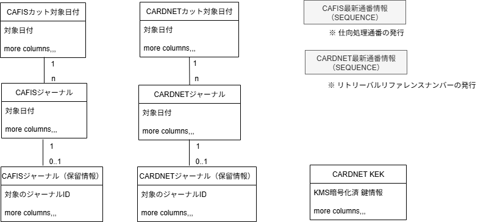

## データストア

### 1. 保存・定義場所

#### サーバ

- 既存サーバ `secdb0x` を使用する。

#### カタログ

- 新規カタログとして、以下を定義する

    | カタログ名 | 用途 | 
    | --- | --- |
    | Journal | Gateway 専用のデータストア | 

#### 保持期間の定義

ジャーナルレコードは保存から３０日保持する。

#### セキュリティ配慮

- カードストライプ情報は本カタログに保存しないこと。  
  代替情報として SecureDB で既に保存済のカードデータ参照IDを保持する。

- 通信の生データ情報など、形式上特定の位置にカード情報が存在する場合は、  
  該当箇所をマスク処理でトランケーションした上で保存する。

### 2. テーブル構造一覧

- CAFIS カット対象日付
- CAFIS ジャーナル
- CAFIS 最新通番情報
- CARDNET カット対象日付
- CARDNET ジャーナル
- CARDNET 最新通番情報
- CARDNET KEK

#### リレーション

#### メモ

・保留電文フラグ
・カード番号の参照番号
・生データとわかりやすい表現

---

## 3. テーブル詳細

### 3.1 CAFIS カット対象日付

CAFIS の日次バッチ処理において、カット（締め）処理の対象となる日付を管理するテーブル。

| カラム名 | 型 | NOT NULL | 説明 |
| --- | --- | :---: | --- |
| cut_date | DATE | ○ | カット対象日付（主キー） |
| status | CHAR(1) | ○ | 処理状態（`0`：未処理、`1`：処理中、`2`：完了） |
| delete_date | DATE | ○ | 削除予定日（`cut_date` + 30日）。カット日付更新コマンド実行時にこの日付に達したレコードをジャーナルごと削除する |
| created_at | DATETIME | ○ | レコード作成日時 |
| updated_at | DATETIME | ○ | レコード更新日時 |

---

### 3.2 CAFIS ジャーナル

CAFIS との送受信電文を記録するテーブル。カード番号の生値は保存しない。

| カラム名 | 型 | NOT NULL | 説明 |
| --- | --- | :---: | --- |
| journal_id | BIGINT | ○ | ジャーナルID（主キー、自動採番） |
| cut_date | DATE | ○ | カット対象日付（`cafis_cut_date.cut_date` FK）cascade delete |
| sequence_no | CHAR(6) | ○ | CAFIS 通番 |
| direction | CHAR(1) | ○ | 送受信区分（`S`：送信、`R`：受信） |
| message_type | VARCHAR(10) | ○ | 電文種別コード |
| raw_data | VARBINARY | ○ | 電文生データ（カード情報該当箇所はトランケーション済） |
| readable_data | NVARCHAR(MAX) | | 電文のわかりやすい表現（フィールド名と値を対応させたJSON形式）※ 負荷軽減のため cli が要求したらセットする |
| secure_data_id | BIGINT | | カード番号の参照番号（SecureDB 上のカードデータ参照ID） |
| hold_flag | CHAR(1) | ○ | 保留電文フラグ（`0`：通常、`1`：保留中） |
| processed_at | DATETIME | ○ | 電文送受信日時 |
| created_at | DATETIME | ○ | レコード作成日時 |
| updated_at | DATETIME | ○ | レコード更新日時 |

---

### 3.4 CARDNET カット対象日付

CARDNET の日次バッチ処理において、カット（締め）処理の対象となる日付を管理するテーブル。

| カラム名 | 型 | NOT NULL | 説明 |
| --- | --- | :---: | --- |
| cut_date | DATE | ○ | カット対象日付（主キー） |
| status | CHAR(1) | ○ | 処理状態（`0`：未処理、`1`：処理中、`2`：完了） |
| delete_date | DATE | ○ | 削除予定日（`cut_date` + 30日）。カット日付更新コマンド実行時にこの日付に達したレコードをジャーナルごと削除する |
| created_at | DATETIME | ○ | レコード作成日時 |
| updated_at | DATETIME | ○ | レコード更新日時 |

