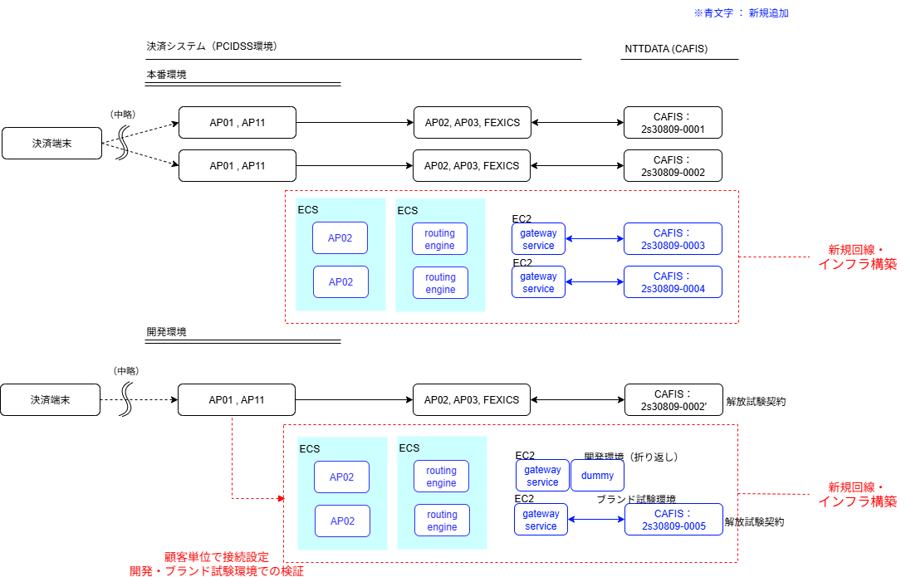
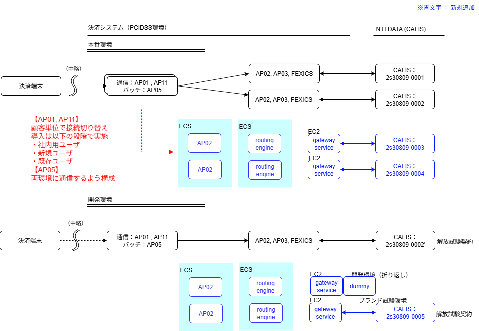

# 移行計画

## 改訂履歴

| バージョン | 日付       | 改定内容 | 改定者 |
| ---------- | ---------- | -------- | ------ |
| v0.1       | 2026-02-05 | 初版作成 | k_yoshizawa |

---

## 1. 移行計画 概略

本計画は、本番稼働中の Act-Act 構成サーバに影響を与えることなく  
FEXICS 新実装のフィールド導入を行うことを目的とする。

そのため、既存の本番環境とは独立した新規サーバ環境を構築し、  
あわせて専用回線の新規敷設を行う方針とする。

この方針は、「専用線接続の切替」に伴うリスク低減対策である。

## 2. ロードマップ（STEP1）

CAFIS 接続を先行して開発・移行し、完了後に CARDNET 接続の移行に着手する。  
これは、CAFIS 側はブランド試験環境を事前調整なく利用できるため開発サイクルを回しやすく、
ここで得た知見・共通基盤を CARDNET 側に横展開することで、全体のリスクと工数を低減する狙いである。

### CAFIS

| フェーズ | 内容 |
| ------ | ---- |
| 開発期間中 | 新規回線契約 |
|           | インフラ環境構築 |
|           | ブランド試験用環境（新規環境）に接続し、開発中の検証を実施 |
| 実装完了   | 認定試験： CAFIS 伝送試験 |
|           | 認定試験： CAFIS 機能試験 |
| リリース   | 本番環境リリース |
|           | 認定試験： CAFIS 総合確認試験 |
| 顧客導入   | 顧客単位で新環境に接続する設定（新規ユーザ）|
|           | 顧客単位で新環境に接続する設定（既存ユーザ）|
| 全顧客切替完了   | 問題ないと判断できた場合、既存回線の解約およびサーバ撤去を実施 |

> **Note**  
> CAFIS のブランド試験環境は、特段の対外調整を行うことなく試験可能である（AMEX のみアクワイヤラまで自動疎通している）。

### CARDNET

| フェーズ | 内容 |
| ------ | ---- |
| 開発期間中 | 新規回線契約 |
|           | インフラ環境構築 |
|           | ブランド試験用環境（新規環境）に接続し、開発中の検証を実施 |
| 実装完了   | 認定試験： CARDNET 伝送試験 |
|           | 認定試験： CARDNET 機能試験 |
| リリース   | 本番環境リリース |
|           | 認定試験： CARDNET 総合確認試験 |
|           | 開発用顧客新環境に接続する設定（社内用ユーザ） |
| 顧客導入   | 顧客単位で新環境に接続する設定（新規ユーザ）|
|           | 顧客単位で新環境に接続する設定（既存ユーザ）|
| 全顧客切替完了   | 問題ないと判断できた場合、既存回線の解約およびサーバ撤去を実施 |

> **Note**  
> CARDNET のブランド試験環境は、利用時、事前予約が必要。

## 3. 回線契約

現行の回線契約状況と、追加する想定の契約。

**CAFIS**

| 区分 | 契約コード | 環境 |
|---|---|---|
| 現行 | 2s30809-0001 | 本番 |
| 現行 | 2s30809-0002 | 本番 |
| 現行 | 2s30809-0002' | 解放試験 |
| `新規` | 2s30809-0003 | 本番 |
| `新規` | 2s30809-0004 | 本番 |
| `新規` | 2s30809-0005 | 解放試験 |

**CARDNET**

| 区分 | 契約コード | 環境 |
|---|---|---|
| 現行 | 3M30809-0001 | 本番 |
| 現行 | 3M30809-0002 | 本番 |
| 現行 | 3M30809-0002' | 解放試験 |
| `新規` | 3M30809-0003 | 本番 |
| `新規` | 3M30809-0004 | 本番 |
| `新規` | 3M30809-0005 | 解放試験 |

> **Note**  
> 解放試験用の契約コードは、既存コードと混同しないよう別コードとしている。

## 4. 移行イメージ

### 4.1 開発期間中 ～ 実装完了 

- 通常開発で使用するため、ブランド試験環境と別に`開発環境での折り返し機能`が必要になる  
- 顧客単位で任意の接続先への変更が行えること  
- 伝送試験はおそらくブランド試験環境で実施可能
- 機能試験も実施できればブランド試験環境で行う

### 4.2 リリース ～ 顧客導入

本番用回線（0003, 0004）を CAFIS / CARDNET 本番に接続し、新環境を本番稼働させる。

- 総合確認試験を実施し、本番環境での正常動作を確認する
- 問題がなければ順次顧客を新環境に向ける
- 切替後、一定期間（1週間程度）の安定稼働を確認してから次の顧客へ進む
- 全顧客の切替と安定稼働を確認後、現行環境（AP03 / FEXICS + 回線 0001, 0002）の解約・撤去を実施する

