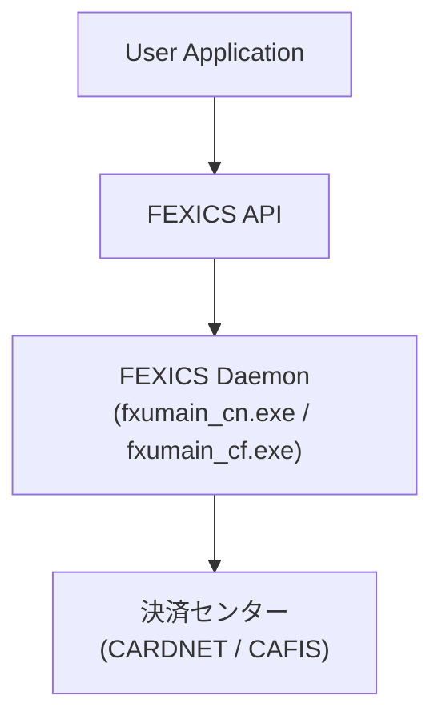

# 第1章 FEXICS Daemon プロセスと API インターフェイス

## 1. FEXICS Daemon プロセスと API インターフェイス

FEXICS API インターフェイスは、以下のオンライントランザクション処理を行う  
アプリケーションプログラムをサポートする。

- クレジットカード
- IC カード
- デビットカード
- ギフトカード

これらの取引は、各クレジットブランド系ネットワークのサービスを利用して行われる。

アプリケーションプログラムは、  
**各クレジットブランド系ネットワークセンターの通信手順や ISO8583 を意識することなく**  
開発できるように設計されている。

### CAFIS 接続に関する注意

CAFIS センター接続サービスのみ、  
FEXICS API によるデータ部作成を行わない **スルーフォワーディング方式** を採用する。

- 共通制御ヘッダを除く業務電文は  
  **アプリケーションプログラム側で編集・解析が必要**
- CAFIS 仕様についての知識が必要

---

## 1.1. FEXICS プログラム構造

FEXICS は以下を **単一プロセス** で処理する。

- クレジット接続センターとの接続制御
- 電文の送受信
- ジャーナル管理
- エラーログなどの履歴管理

このプロセスは以下の実行ファイルで起動され、**マルチスレッド動作**を行う。

### 実行ファイル

- `fxumain_cn.exe`  
  - CARDNET センター接続サービス
- `fxumain_cf.exe`  
  - CAFIS センター接続サービス

### アプリケーション構成

- ユーザーアプリケーションは **独立したプロセス**
- FEXICS Daemon と API を通じて連携する

### 構成イメージ（Mermaid）




---

## 1.2. API の使用とアプリケーションの構築

FEXICS Development Kit では、以下のインクルードファイルが提供される。

### 公開ヘッダ

- `fxapi.h`
  - 全 API のプロトタイプ
  - 各種定義・型定義
  - FEXICS エラーコード

### 必須マクロ定義

アプリケーションでは、接続サービスに応じて  
**以下のマクロ定義が必要**。

#### CARDNET 接続

```c
#define CARDNET_SERVICE3
```

#### CAFIS 接続

```c
#define CAFIS_SERVICE3
```

### ライブラリ設定

#### CARDNET 接続

- `\include`
- `\lib\fxapi.lib`
- `\lib\fxsvc_cn.lib`

#### CAFIS 接続

- `\include`
- `\lib\fxapi.lib`
- `\lib\fxsvc_cf.lib`

### 実行時環境の注意

アプリケーション実行プロセスに対して、以下が有効である必要がある。

- `BIN` ディレクトリ
- `TOOL` ディレクトリ

これらは `PATH` または `LD_LIBRARY_PATH` に設定する。

### 旧バージョン互換（Version2 → Version3 以降）

Version2 系 API で構築されたアプリケーションは、  
以下のマクロ定義によりリビルドで互換利用可能。

```c
#define CARDNET_SERVICE2
#define CAFIS_SERVICE2
```

※ 新機能・修正内容は反映されない

## 1.3. マルチスレッドの考慮

アプリケーションは **マルチスレッド構成** で作成することができる。

### セッション ID の扱い

- スレッドごとに **専用のセッション ID** を割り当てる  
- 同一セッション ID を **複数スレッドで使用してはいけない**

### 注意点

- セッション ID の共有は **競合の原因** となる  
- 各スレッドは **独立したセッション ID** を使用すること
