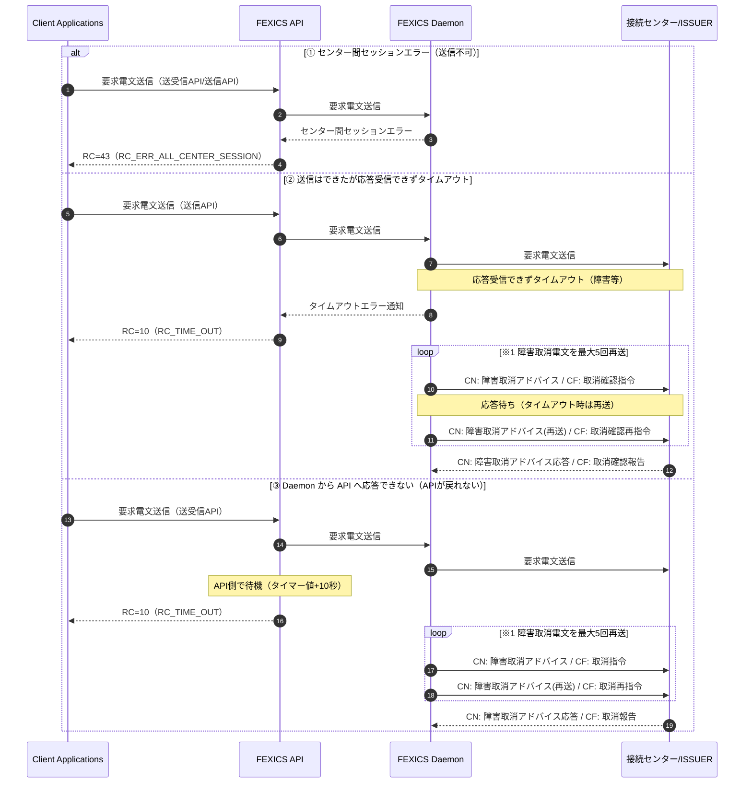
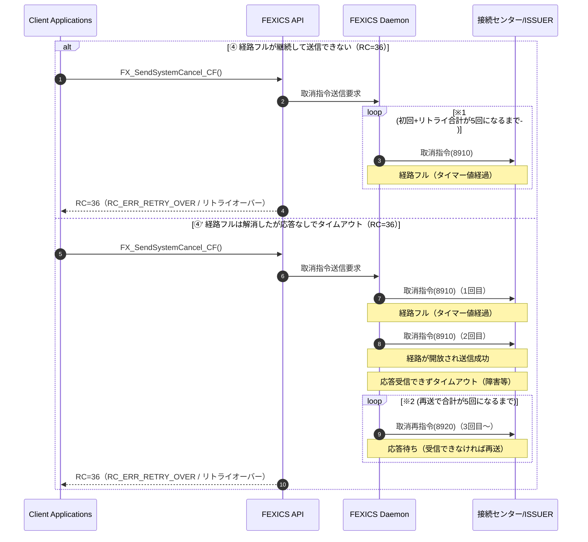

# 第3章 サービス共通のプログラミング要素

## 3. サービス共通のプログラミング要素

本章では、FEXICS を使用する上で重要となる  
**サービス共通のプログラミング要素**について説明する。

各接続サービス固有の事項については、  
それぞれ該当する章を参照すること。

---

## 3.1. セッション

FEXICS Daemon と通信を行うために指定するハンドルを  
**セッション（Session ID）** と呼ぶ。

### セッションの基本概念

- セッションは **アプリケーションプロセス単位**、または **スレッド単位** で取得する
- 同一セッションを複数スレッドで共有してはならない

### セッションの取得と解放

- セッションの取得（open）は、アプリケーション起動時に 1 回行えばよい
- セッションの解放（close）は、アプリケーション終了時に行う

毎回の電文送受信ごとに open / close を行う必要はない。

### 使用 API

- セッション取得  
  - `FX_OpenSession_CN()`  
  - `FX_OpenSession_CF()`  
  - `FX_OpenSession_iD()`
- セッション解放  
  - `FX_CloseSession()`

---

## 3.2. API 使用上の注意

FEXICS API を使用する際は、以下の点に注意する。

### (1) セッションの事前取得

すべての API を呼び出す前に、  
必ず `FX_OpenSession()` を呼び出し、セッション ID を取得すること。

### (2) サインオン状態の確認

FEXICS Daemon が **サインオン状態** でない場合、  
電文の送受信は行われない。

- サインオン状態：決済センターと開局中
- サインオフ状態：決済センターと閉局中

### (3) CHAR* 型パラメータの扱い

- 入力パラメータ  
  - `\0` による終端は不要
  - 規定フォーマットおよび長さが正当であることが必須
- 出力パラメータ  
  - `\0` 終端されない点に注意すること

---

## 3.3. API 使用型定義

本節では、FEXICS API で使用される型定義について説明する。

### 3.3.1. 基本定義

FEXICS API は ANSI-C 言語の型定義に準拠する。  
ただし、ポータビリティを考慮し、以下の基本型を使用する。

| 型 | サイズ | 説明 |
|---|---|---|
| `CHAR` | 1 | 8bit ASCII 文字 |
| `BYTE` | 1 | 8bit 符号なし整数 / Packed BCD |
| `SHORT` | 2 | 16bit 符号あり整数 |
| `USHORT` | 2 | 16bit 符号なし整数 |
| `INT` | 2 or 4 | 16bit / 32bit 符号あり整数 |
| `UINT` | 2 or 4 | 16bit / 32bit 符号なし整数 |
| `LONG` | 4 | 32bit 符号なし整数 |
| `ULONG` | 4 | 32bit 符号あり整数 |
| `VOID*` | 4 | ポインタ |

※ `INT` / `UINT` のサイズはマシン環境に依存する。

### 補足事項

- 構造体メンバーのパッキング（アライメント）は環境依存
- メンバーのメモリ上の順序は定義順
- エンディアン形式に規定はなく、各プラットフォームに従う

---

## 3.4. タイムアウト時の処理方式

要求電文、または障害取消電文が  
**タイムアウトした場合の処理方式**について説明する。

---

## 3.4.1. 要求電文のタイムアウト

要求電文送信後、  
設定ファイルに指定されたタイマー値を超過しても  
応答電文を受信できなかった場合、FEXICS Daemon は以下の処理を行う。

### ケース別処理

#### (1) センターへ送信できない場合

- API に `RC_ERR_ALL_CENTER_SESSION` を返却

#### (2) 送信はできたが応答がない場合

1. FEXICS Daemon がタイムアウトを検知
2. API に `RC_TIME_OUT` を通知
3. 障害取消電文を接続センターへ送信
4. 応答受信、または再送回数が 5 回に達するまで再送

#### (3) Daemon から API へ応答できない場合

- 障害取消電文を送信
- 再送回数が 5 回に達、または応答受信まで再送
- API は「タイマー値 + 10 秒」経過後に `RC_TIME_OUT` を返却

#### (4) CAFIS 経路フル時（障害取消）

- タイマー値内で送信待機
- 経路開放、または再送回数 5 回で終了
- 上限到達時は `RC_ERR_RETRY_OVER` を返却

### 備考

- 処理結果はログおよびジャーナルに出力される
- 必要に応じて以下の API を使用する  
  - `FX_SendSystemCancel_CN()`  
  - `FX_SendSystemCancel_CF()`  
  - `FX_CtrlRecovery()`

---

---

### 図 3.4.1 タイムアウト時の処理方式（Mermaid）

> ※1 接続センターから障害取消電文の応答を受信できなかった場合、障害取消電文の再送電文を 5 回まで送信。  
> ※2 受信専用関数 `FX_ReceiveMsg()` で電文受信する場合、タイマー計測は当関数コール後から。  
> ※3 図中の「送受信 API」は同期 API、「送信 API」「受信 API」は非同期 API の表記。

---

### 図 3.4.2 タイムアウト時の処理方式（CAFIS：障害取消電文送信時 経路フル状態）（Mermaid）

> ※1 経路フルで取消指令の送信ができない場合、タイマー値経過後に再試行。  
> 初回の取消指令＋経路フルによるリトライ回数の合計が 5 回になっても送信できない場合、API はリトライオーバーで復帰。  
> ※2 取消指令送信後に応答を受信できずタイムアウトした場合、タイマー値経過後に取消再指令（8920）を送信。  
> 初回＋経路フルのリトライ回数＋取消再指令のリトライ回数の合計が 5 回になっても応答を受信できない場合、API はリトライオーバーで復帰。

## 3.4.2. タイマー規定値

本節では、FEXICS において使用される  
**主要なタイマー規定値**を一覧として示す。

---

### CARDNET タイマー規定値

| タイマ | 内容 | 対象 MTI | 設定値（秒） |
|---|---|---|---|
| T100 | オーソリ応答待ちタイマー | 1110 | 60 |
| T120 | オーソリアドバイス応答待ちタイマー | 1130 | 30 |
| T200 | 売上応答待ちタイマー | 1210 | 60 |
| T220 | 売上アドバイス応答待ちタイマー | 1230 | 30 |
| T420 | 障害取消アドバイス応答待ちタイマー | 1430 | 30 |
| T500 | オンライン精査応答待ちタイマー | 1530 / 1532 | - |
| T800 | 制御応答待ちタイマー（開局・キー交換等） | 1814 | 45 |
| T801 | 閉局応答待ちタイマー | 1814 | 70 |
| T802 | エコーテスト応答待ちタイマー | 1814 | 90 |

---

### CAFIS タイマー規定値

| タイマ | 内容 | 対象電文種別 | 設定値（秒） |
|---|---|---|---|
| t31 | 一般電文報告待ちタイマー | 3110, 3210, 3310, 3410, 3510, 6110 | 58 |
| t32 | 障害取消電文報告待ちタイマー | 8910, 8920, 8930, 8940 | 58 |
| t33 | 回線障害回復報告待ちタイマー | 9210 | 30 |
| t34 | 再開始許可指令待ちタイマー | 7020 | 30 |
| t35 | 終了許可指令待ちタイマー | 0720 | 750 |
