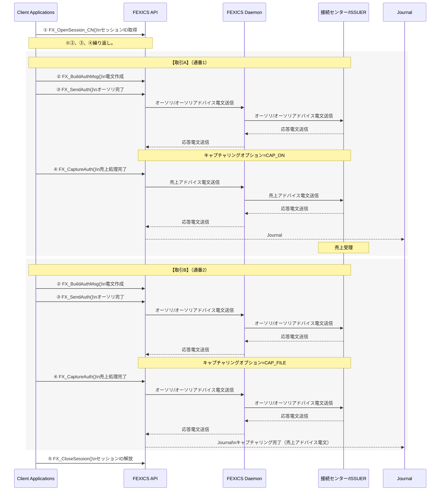
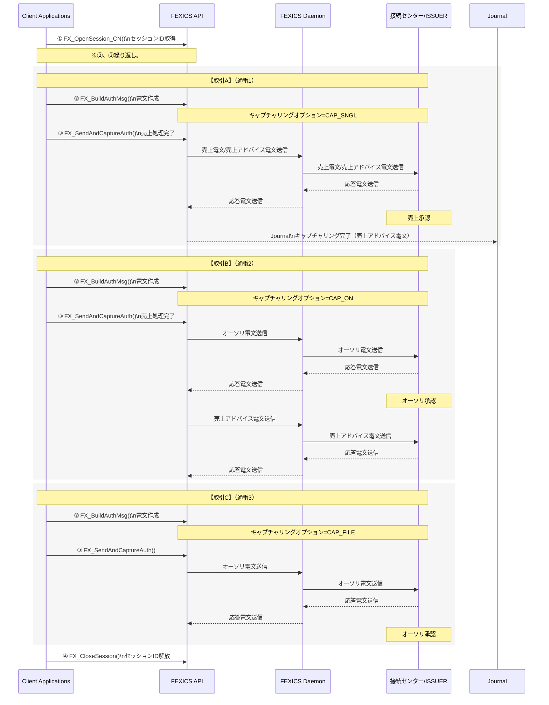
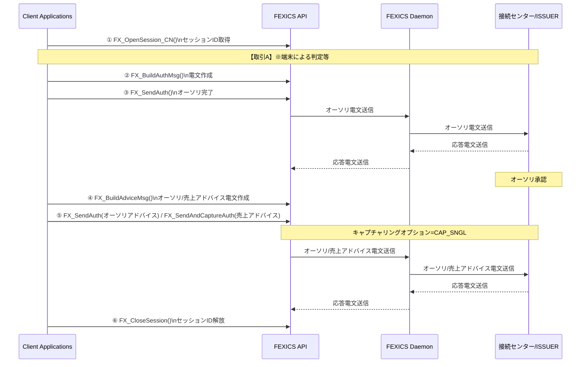
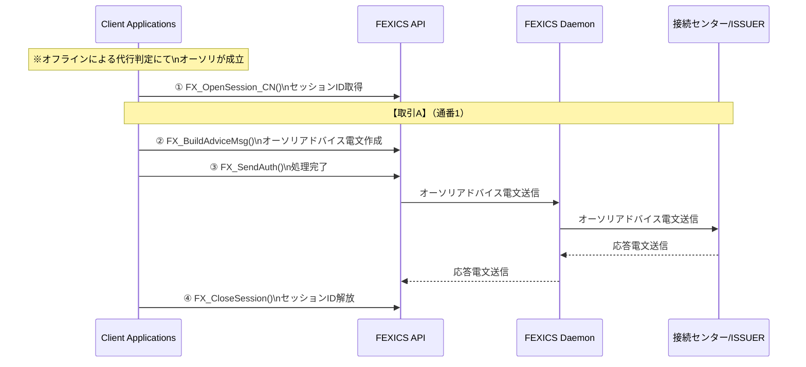
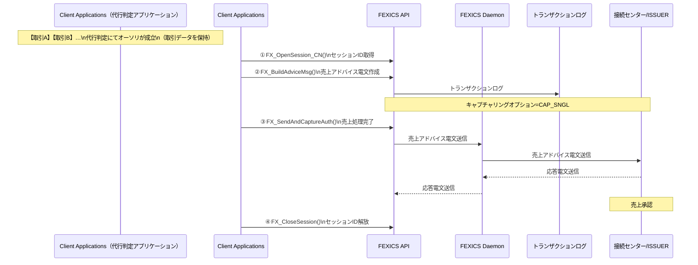

# 4.13 仕向電文の処理パターン

CARDNETセンター接続サービスでは通常、加盟店側からの仕向要求形式として下記の業務処理パターンが存在します。  
FEXICSでは、それぞれの業務処理パターンに合わせてAPIを使い分けられるように設計されています。

1. **Dual Message方式**  
   加盟店からオーソリゼーションとキャプチャリング2段階で処理要求するケース。
2. **Single Message方式**  
   加盟店からオーソリゼーションとキャプチャリングを1回で処理要求するケース。
3. **Customize Message方式**  
   加盟店からオーソリゼーション後にオーソリアドバイス／売上アドバイスを送信するなど、個別の業務処理パターンに対応するケース。  
   ※ 主にICカードにおける取引において用いる方式です。オンラインによるオーソリゼーション後、端末における判定の結果を  
   オーソリアドバイス／売上アドバイスとしてCARDNETセンターに送信する場合等に用います。
4. **代行判定後のアドバイス処理方式**  
   オーソリゼーションの代行判定を行い、後でオーソリアドバイス／売上アドバイスを送信するケース。

---

## 4.13.1 Dual Message 処理方式

### 図 4.13.1 Dual Message 処理方式（Mermaid）

Dual Message 処理における使用APIと、処理の手順は次のようになります。

1. `FX_OpenSession_CN()`  
2. `FX_BuildAuthMsg()`  
3. `FX_SendAuth()`  
4. `FX_CaptureAuth()`  
   ※②、③、④繰り返し。  
5. `FX_CloseSession()`

- ①：FEXICS Daemon とのセッションを取得。  
- ②：オーソリ電文の作成。  
- ③：オーソリ電文送信。  
- ④：キャプチャリング操作。  
- ⑤：終了時にFEXICS Daemonとのセッションを解放。  

上記の `FX_SendAuth()` と `FX_CaptureAuth()` の対応付けは、APIパラメータの通番（`pulSeqNum`）を使います。  

キャプチャリングをせずにオーソリ取得成立のみで取引不成立の場合は、カード会社のデータベース内で該当会員のオーソリ枠だけ減っている可能性がありますので、運用での対処を原則とします。

---

## 4.13.2 Single Message 処理方式

### 図 4.13.2 Single Message 処理方式（Mermaid）

Single Message 処理における使用APIと、処理の手順は次のようになります。

1. `FX_OpenSession_CN()`  
2. `FX_BuildAuthMsg()`  
3. `FX_SendAndCaptureAuth()`  
   ※②、③繰り返し。  
4. `FX_CloseSession()`

- ①：FEXICS Daemon とのセッションを取得。  
- ②：売上要求電文の作成。  
- ③：売上要求電文送信。  
- ④：終了時にFEXICS Daemonとのセッションを解放。  

それぞれの方式は、各導入先でのCARDNETセンターとの契約によります。

---

## 4.13.3 Customize Message 処理方式

### 図 4.13.3 Customize Message 処理方式（Mermaid）

Customize Message 処理における使用APIと、処理の手順は次のようになります。

1. `FX_OpenSession_CN()`：FEXICS Daemonとのセッションを取得。  
2. `FX_BuildAuthMsg()`：オーソリ電文の作成。  
3. `FX_SendAuth()`：オーソリ電文送信。  
4. `FX_BuildAdviceMsg()`：アドバイス電文の作成。  
5. `FX_SendAuth(オーソリアドバイス)` / `FX_SendAndCaptureAuth(売上アドバイス)`：アドバイス電文送信。  
   ※②、③、④、⑤繰り返し。  
6. `FX_CloseSession()`：終了時にFEXICS Daemonとのセッションを解放。  

---

## 4.13.4 代行判定後のアドバイス処理方式

カード発行会社へのオーソリ要求をせずに、自社内でネガファイルなどを保有して代行するケースがあります。  
この場合、代行判定によるオーソリ処理を行った取引についてCARDNETにオーソリ結果を送信するケースと、後で売上を一括送信するケースとがあります。

### (1) オーソリ結果を送信するケース

CARDNETへのオーソリ結果の送信には、オーソリアドバイス電文を使用します。

#### 図 4.13.4 代行判定後のアドバイス処理方式（オーソリ結果送信）（Mermaid）

代行判定後のアドバイス処理における使用APIと、処理の手順は次のようになります。

1. `FX_OpenSession_CN()`  
2. `FX_BuildAdviceMsg()`  
3. `FX_SendAuth()`  
   ※②、③繰り返し。  
4. `FX_CloseSession()`

- ①：FEXICS Daemon とのセッションを取得。  
- ②：代行判定された取引Aに対するオーソリアドバイス電文の作成。  
- ③：オーソリアドバイス電文送信。  
- ④：終了時にFEXICS Daemonとのセッションを解放。  

### (2) 売上を一括送信するケース

代行判定を行った取引のデータをユーザにて保持し、後からFEXICS APIを使用して個々の取引に対する売上結果通知をCARDNETへオンライン送信することが可能です。  
売上結果通知の送信には売上アドバイス電文を使用します。

#### 図 4.13.5 代行判定後のアドバイス処理方式（売上一括送信）（Mermaid）

代行判定後のアドバイス処理における使用APIと、処理の手順は次のようになります。

1. `FX_OpenSession_CN()`  
2. `FX_BuildAdviceMsg()`  
3. `FX_SendAndCaptureAuth()`  
   ※②、③繰り返し。  
4. `FX_CloseSession()`

- ①：FEXICS Daemon とのセッションを取得。  
- ②：代行処理された取引に対する売上アドバイス電文の作成。  
- ③：売上アドバイス電文送信。  
- ④：終了時にFEXICS Daemonとのセッションを解放。  
