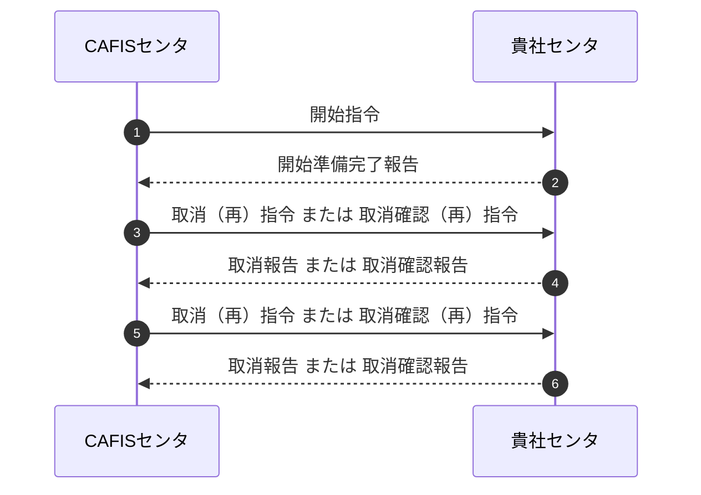
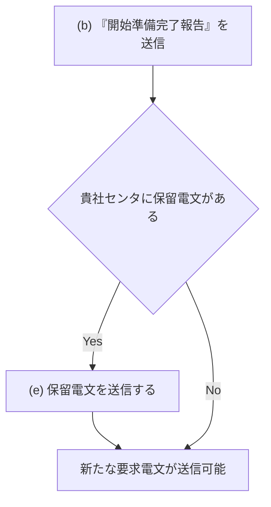
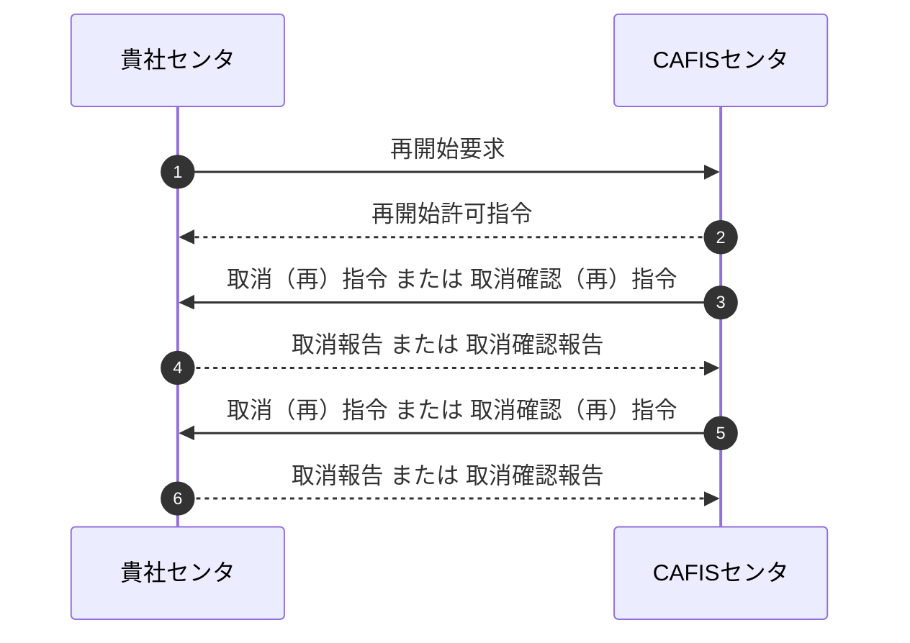
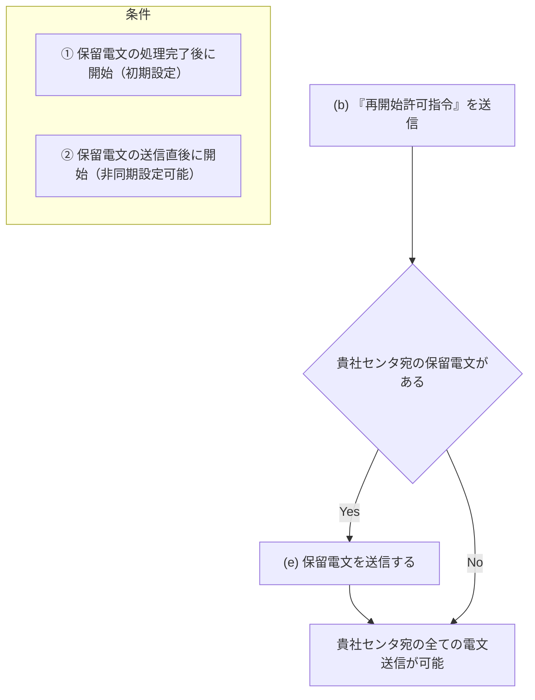
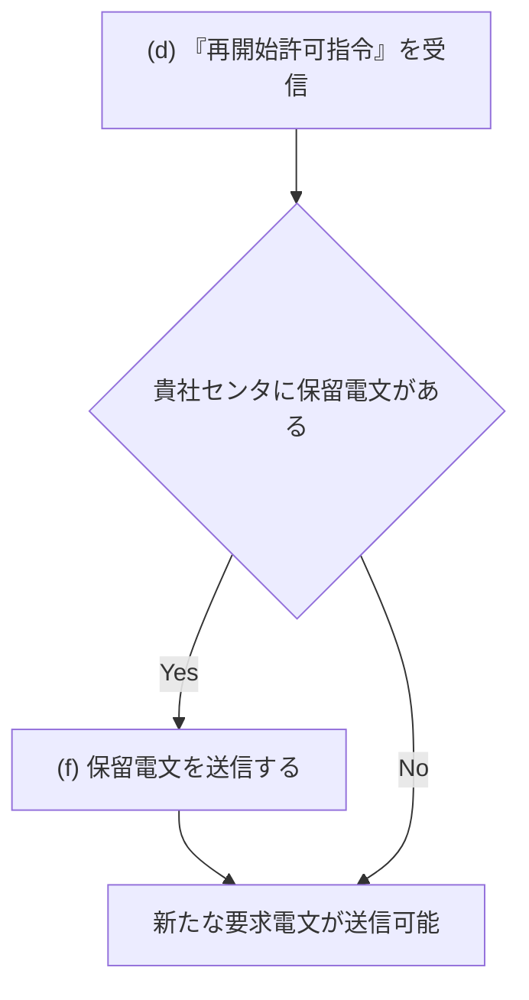
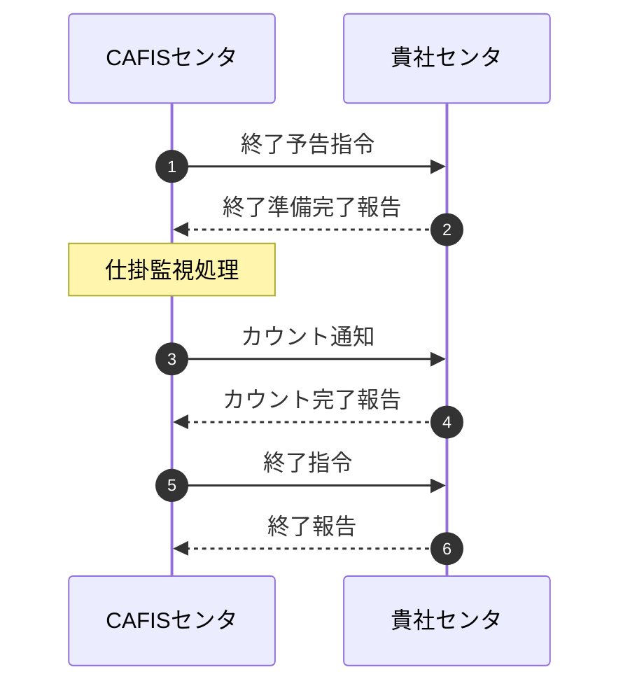

# 第２章　制御仕様

## 2.1　システム制御

### 2.1.1　オンライン開始

ＣＡＦＩＳセンタは、センタ設備のメンテナンス作業や、センタ障害等の原因により停止したオンラインサービスを、「開始指令」または「再開要求」により貴社センタや端末に対してオンライン開始する。

（1）貴社センタでの準備\
ＣＡＦＩＳセンタのオンライン開始が、貴社センタのオンラインサービス時間帯の場合、あらかじめオンライン開始処理を行い、ＣＡＦＩＳセンタからの「開始指令」を受信可能な状態、または貴社センタから「再開要求」を送信可能な状態とする。

（2）オンライン開始処理\
Ａ．開始指令による開局\
オンライン開始時の、開始指令による開局手順を図２．１．１－１に示す。

【図 2.1.1-1　開始指令による開局手順】

（a）開始指令送信（ＣＡＦＩＳセンタ）\
ＣＡＦＩＳセンタは、ＣＡＦＩＳからの「開始指令」を「要」で契約された貴社センタ、または、サービス開始時に障害状態の貴社センタに対し、「開始指令」を送信する。

（b）開始指令受信（貴社センタ）\
貴社センタがオンライン準備完了状態で、「開始指令」を受信した場合は、ＣＡＦＩＳセンタへ「開始準備完了報告」を送信する。貴社センタのオンライン開始し、新たな要求電文が送信可能になるまでのフローを図２．１．１－２に示す。

（c）開始準備完了報告受信（ＣＡＦＩＳセンタ）\
ＣＡＦＩＳセンタは、貴社センタから「開始準備完了報告」を受信した場合は、貴社センタのオンラインを開始し、貴社センタからの保留電文または新たな要求電文を受け付ける。\
貴社センタ宛の全ての電文送信が可能になるまでのフローを図２．１．１－３に示す。\
なお、貴社センタから規定時間内に「開始準備完了報告」を受信しなかった場合、ＣＡＦＩＳセンタは一定間隔で「開始指令」を送信する。

（d）保留電文送信（ＣＡＦＩＳセンタ）\
ＣＡＦＩＳセンタが貴社センタ宛の取消（再）指令、または取消確認（再）指令の保留電文がある場合、貴社センタへ保留電文を送信する。\
貴社センタ宛の全ての電文送信が可能になるまでの条件を以下に、フローを図２．１．１－３に示す。

① 保留電文の処理完了後に開始する場合（初期設定）\
ＣＡＦＩＳセンタが保留電文を送信中は、貴社センタからの保留電文または新たな要求電文は受け付けない。貴社センタの保留電文以外は送信しない。\
取消報告や取消確認報告の受信により、ＣＡＦＩＳセンタに貴社センタ宛の保留電文が無くなった場合、貴社センタ宛の全ての電文送信を開始する。

② 保留電文の送信中に開始する場合（非同期設定可能）\
ＣＡＦＩＳセンタが保留電文を送信中であっても、貴社センタからの保留電文または新たな要求電文を受け付け、貴社センタ宛の全ての電文送信を開始する。

（e）保留電文送信（貴社センタ）\
貴社センタに取消（再）指令、または取消確認（再）指令がある場合は、新たな要求電文より優先して、ＣＡＦＩＳセンタへ保留電文を送信する。貴社センタのオンライン開始し、新たな要求電文が送信可能になるまでのフローを図２．１．１－２に示す。

【図 2.1.1-2　貴社センタが新たな要求電文を送信可能になるまでのフロー】

【図 2.1.1-3　CAFISセンタが貴社センタ宛の全ての電文を送信可能になるまでのフロー】

B．再開始要求による開局

ＣＡＦＩＳセンタのオンライン開始時間中の、再開始要求による貴社センタ開局手順を図２．１．１－４に示す。

【図 2.1.1-4　再開始要求による開局手順】

（a）再開始要求送信（貴社センタ）\
貴社センタはＣＡＦＩＳセンタに「再開始要求」を送信する。

（b）再開始要求受信（ＣＡＦＩＳセンタ）\
ＣＡＦＩＳセンタは貴社センタから「再開始要求」を受信した場合、「再開始許可指令」を送信する。

（c）再開始許可指令送信（ＣＡＦＩＳセンタ）\
「再開始許可指令」が貴社センタへ送信正常となった場合、貴社センタのオンラインを開始し、貴社センタからの保留電文または新たな要求電文を受け付ける。\
貴社センタ宛の全ての電文送信が可能になるまでのフローを図２．１．１－５に示す。

（d）再開始許可指令受信（貴社センタ）\
ＣＡＦＩＳセンタから「再開始許可指令」を受信後、貴社センタのオンラインを開始し、新たな要求電文が送信可能になるまでのフローを図２．１．１－６に示す。

（e）保留電文送信（ＣＡＦＩＳセンタ）\
ＣＡＦＩＳセンタに貴社センタ宛の取消（再）指令、または取消確認（再）指令の保留電文がある場合、貴社センタへ保留電文を送信する。\
貴社センタ宛の全ての電文送信が可能になるまでの条件を以下に、フローを図２．１．１－６に示す。

① 保留電文の処理完了後に開始する場合（初期設定）\
ＣＡＦＩＳセンタが保留電文を送信中は、貴社センタからの保留電文または新たな要求電文は受け付けない。貴社センタの保留電文以外は送信しない。\
取消報告や取消確認報告の受信により、ＣＡＦＩＳセンタに貴社センタ宛の保留電文が無くなった場合、貴社センタ宛の全ての電文の送信を開始する。

② 保留電文の送信中に開始する場合（非同期設定可能）\
ＣＡＦＩＳセンタが保留電文を送信中であっても、貴社センタからの保留電文または新たな要求電文を受け付け、貴社センタ宛の全ての電文の送信を開始する。

（f）保留電文送信（貴社センタ）\
貴社センタに取消（再）指令、または取消確認（再）指令がある場合は、新たな要求電文より優先して、ＣＡＦＩＳセンタへ保留電文を送信する。貴社センタのオンラインを開始し、新たな要求電文が送信可能になるまでのフローを図２．１．１－５に示す。

【図
2.1.1-5　CAFISセンタが貴社センタ宛の全ての電文を送信可能になるまでのフロー】

【図 2.1.1-6　貴社センタが新たな要求電文を送信可能になるまでのフロー】

### 2.1.2　オンライン一斉終了

ＣＡＦＩＳは、センタ設備のメンテナンス作業等のため、一斉終了処理をもって貴社センタや端末に対するオンラインサービスを終了する。\
ＣＡＦＩＳセンタのオンライン一斉終了手順を図２．１．２－１に示す。

【図 2.1.2-1　オンライン一斉終了手順】

（1）終了予告指令送信\
ＣＡＦＩＳセンタとの接続状態が、オンライン開局中の全ての貴社センタに対して、ＣＡＦＩＳセンタから「終了予告指令」を送信する。\
「終了予告指令」送信後に貴社センタから新たな要求電文を受信した場合に、ＣＡＦＩＳセンタは「ＣＡＦＩＳセンタ終了」の旨の応答電文を送信する。

（2）終了予告指令受信\
「終了予告指令」を受信した貴社センタは、「終了準備完了報告」を送信し、新たな要求電文をＣＡＦＩＳセンタに送信しない。

（3）終了準備完了報告受信\
ＣＡＦＩＳセンタは、貴社センタから「終了準備完了報告」を受信した場合に、仕掛電文の監視処理を行う。\
なお、貴社センタから規定時間内に「終了準備完了報告」を受信しなかった場合、ＣＡＦＩＳセンタは、貴社センタをオンライン終了として仕掛電文を送信せずに全てを保留し、該当電文を送信した端末または仕向センタに、「被仕向センタ終了」の旨の応答電文を送信する。

（4）仕掛電文監視処理\
「終了予告指令」送信時に、完了待ち状態の電文を仕掛電文とし、仕掛電文が無くなった時点で仕掛電文監視を完了する。\
なお、仕掛電文にタイムアウトや異常終了により、完了しなかった仕掛電文は、ＣＡＦＩＳ折返し業務電文を除き、ＣＡＦＩＳセンタで保留する。\
仕掛電文処理一覧を表２．１．２－１に、各処理概要図を図２．１．２－２～１１に示す。

【表 2.1.2-1　仕掛電文処理一覧】

| 項番 | 仕向 | 完了条件 | 図番 |
|---|---|---|---|
| 1 | 端末 | 一般電文の完結 | 図 2.1.2-2 |
| 2 |  | 一般電文のタイムアウトをＣＡＦＩＳが検出 | 図 2.1.2-3 |
| 3 |  | 端末回線の障害をＣＡＦＩＳが検出 | 図 2.1.2-4 |
| 4 |  | 被仕向センタの障害をＣＡＦＩＳが検出 | 図 2.1.2-5 |
| 5 | センタ | 一般および障害電文の完結 | 図 2.1.2-6 |
| 6 |  | 一般および障害電文のタイムアウトをＣＡＦＩＳが検出 | 図 2.1.2-7 |
| 7 |  | 一般および障害電文のタイムアウトを仕向センタが検出 | 図 2.1.2-8 |
| 8 |  | 仕掛電文処理中に仕向センタが終了指令を受信 | 図 2.1.2-9 |
| 9 |  | 仕向センタの障害をＣＡＦＩＳが検出 | 図 2.1.2-10 |
| 10 |  | 被仕向センタの障害をＣＡＦＩＳが検出 | 図 2.1.2-11 |

※ 2-9 ページまで.
