# 第２章　制御仕様

## 2.1　システム制御

### 2.1.1　オンライン開始

ＣＡＦＩＳセンタは、センタ設備のメンテナンス作業や、センタ障害等の原因により停止したオンラインサービスを、「開始指令」または「再開要求」により貴社センタや端末に対してオンライン開始する。

（1）貴社センタでの準備\
ＣＡＦＩＳセンタのオンライン開始が、貴社センタのオンラインサービス時間帯の場合、あらかじめオンライン開始処理を行い、ＣＡＦＩＳセンタからの「開始指令」を受信可能な状態、または貴社センタから「再開要求」を送信可能な状態とする。

（2）オンライン開始処理\
Ａ．開始指令による開局\
オンライン開始時の、開始指令による開局手順を図２．１．１－１に示す。

【図 2.1.1-1　開始指令による開局手順】

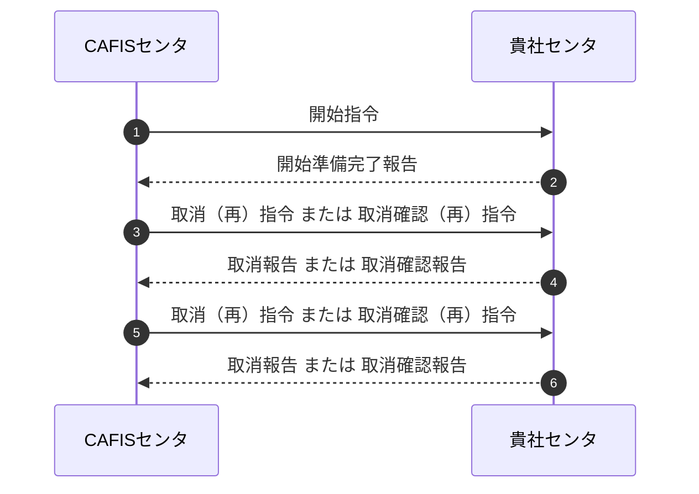

（a）開始指令送信（ＣＡＦＩＳセンタ）\
ＣＡＦＩＳセンタは、ＣＡＦＩＳからの「開始指令」を「要」で契約された貴社センタ、または、サービス開始時に障害状態の貴社センタに対し、「開始指令」を送信する。

（b）開始指令受信（貴社センタ）\
貴社センタがオンライン準備完了状態で、「開始指令」を受信した場合は、ＣＡＦＩＳセンタへ「開始準備完了報告」を送信する。貴社センタのオンライン開始し、新たな要求電文が送信可能になるまでのフローを図２．１．１－２に示す。

（c）開始準備完了報告受信（ＣＡＦＩＳセンタ）\
ＣＡＦＩＳセンタは、貴社センタから「開始準備完了報告」を受信した場合は、貴社センタのオンラインを開始し、貴社センタからの保留電文または新たな要求電文を受け付ける。\
貴社センタ宛の全ての電文送信が可能になるまでのフローを図２．１．１－３に示す。\
なお、貴社センタから規定時間内に「開始準備完了報告」を受信しなかった場合、ＣＡＦＩＳセンタは一定間隔で「開始指令」を送信する。

（d）保留電文送信（ＣＡＦＩＳセンタ）\
ＣＡＦＩＳセンタが貴社センタ宛の取消（再）指令、または取消確認（再）指令の保留電文がある場合、貴社センタへ保留電文を送信する。\
貴社センタ宛の全ての電文送信が可能になるまでの条件を以下に、フローを図２．１．１－３に示す。

① 保留電文の処理完了後に開始する場合（初期設定）\
ＣＡＦＩＳセンタが保留電文を送信中は、貴社センタからの保留電文または新たな要求電文は受け付けない。貴社センタの保留電文以外は送信しない。\
取消報告や取消確認報告の受信により、ＣＡＦＩＳセンタに貴社センタ宛の保留電文が無くなった場合、貴社センタ宛の全ての電文送信を開始する。

② 保留電文の送信中に開始する場合（非同期設定可能）\
ＣＡＦＩＳセンタが保留電文を送信中であっても、貴社センタからの保留電文または新たな要求電文を受け付け、貴社センタ宛の全ての電文送信を開始する。

（e）保留電文送信（貴社センタ）\
貴社センタに取消（再）指令、または取消確認（再）指令がある場合は、新たな要求電文より優先して、ＣＡＦＩＳセンタへ保留電文を送信する。貴社センタのオンライン開始し、新たな要求電文が送信可能になるまでのフローを図２．１．１－２に示す。

【図 2.1.1-2　貴社センタが新たな要求電文を送信可能になるまでのフロー】

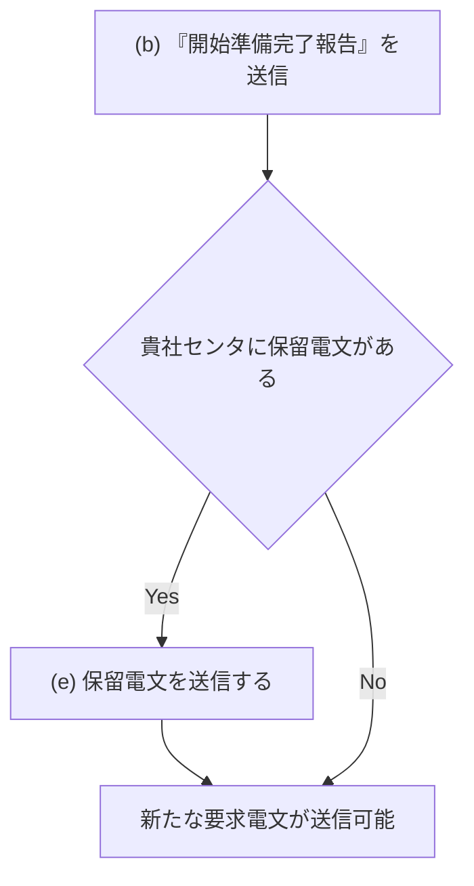

【図 2.1.1-3　CAFISセンタが貴社センタ宛の全ての電文を送信可能になるまでのフロー】

B．再開始要求による開局

ＣＡＦＩＳセンタのオンライン開始時間中の、再開始要求による貴社センタ開局手順を図２．１．１－４に示す。

【図 2.1.1-4　再開始要求による開局手順】

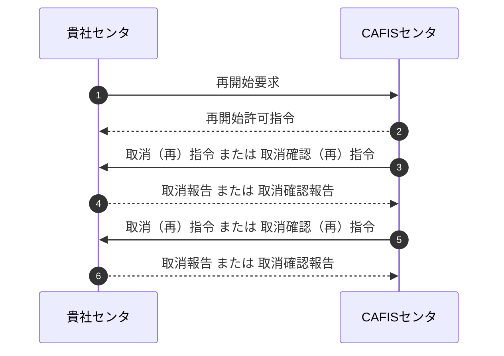

（a）再開始要求送信（貴社センタ）\
貴社センタはＣＡＦＩＳセンタに「再開始要求」を送信する。

（b）再開始要求受信（ＣＡＦＩＳセンタ）\
ＣＡＦＩＳセンタは貴社センタから「再開始要求」を受信した場合、「再開始許可指令」を送信する。

（c）再開始許可指令送信（ＣＡＦＩＳセンタ）\
「再開始許可指令」が貴社センタへ送信正常となった場合、貴社センタのオンラインを開始し、貴社センタからの保留電文または新たな要求電文を受け付ける。\
貴社センタ宛の全ての電文送信が可能になるまでのフローを図２．１．１－５に示す。

（d）再開始許可指令受信（貴社センタ）\
ＣＡＦＩＳセンタから「再開始許可指令」を受信後、貴社センタのオンラインを開始し、新たな要求電文が送信可能になるまでのフローを図２．１．１－６に示す。

（e）保留電文送信（ＣＡＦＩＳセンタ）\
ＣＡＦＩＳセンタに貴社センタ宛の取消（再）指令、または取消確認（再）指令の保留電文がある場合、貴社センタへ保留電文を送信する。\
貴社センタ宛の全ての電文送信が可能になるまでの条件を以下に、フローを図２．１．１－６に示す。

① 保留電文の処理完了後に開始する場合（初期設定）\
ＣＡＦＩＳセンタが保留電文を送信中は、貴社センタからの保留電文または新たな要求電文は受け付けない。貴社センタの保留電文以外は送信しない。\
取消報告や取消確認報告の受信により、ＣＡＦＩＳセンタに貴社センタ宛の保留電文が無くなった場合、貴社センタ宛の全ての電文の送信を開始する。

② 保留電文の送信中に開始する場合（非同期設定可能）\
ＣＡＦＩＳセンタが保留電文を送信中であっても、貴社センタからの保留電文または新たな要求電文を受け付け、貴社センタ宛の全ての電文の送信を開始する。

（f）保留電文送信（貴社センタ）\
貴社センタに取消（再）指令、または取消確認（再）指令がある場合は、新たな要求電文より優先して、ＣＡＦＩＳセンタへ保留電文を送信する。貴社センタのオンラインを開始し、新たな要求電文が送信可能になるまでのフローを図２．１．１－５に示す。

【図
2.1.1-5　CAFISセンタが貴社センタ宛の全ての電文を送信可能になるまでのフロー】

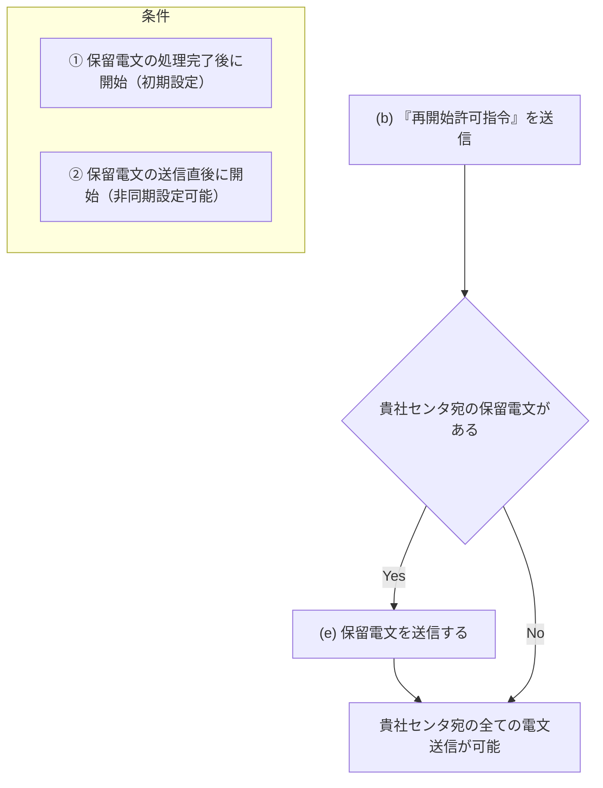

【図 2.1.1-6　貴社センタが新たな要求電文を送信可能になるまでのフロー】

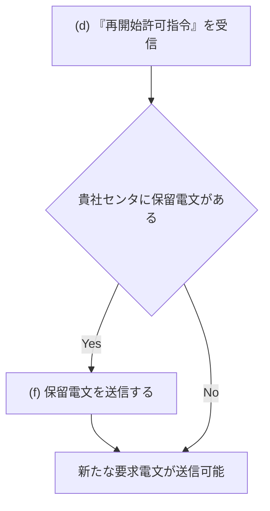

### 2.1.2　オンライン一斉終了

ＣＡＦＩＳは、センタ設備のメンテナンス作業等のため、一斉終了処理をもって貴社センタや端末に対するオンラインサービスを終了する。\
ＣＡＦＩＳセンタのオンライン一斉終了手順を図２．１．２－１に示す。

【図 2.1.2-1　オンライン一斉終了手順】

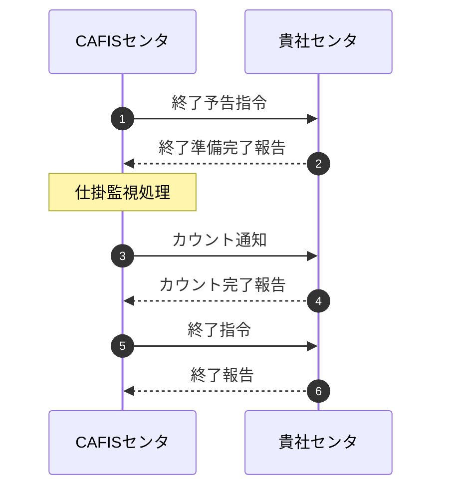

（1）終了予告指令送信\
ＣＡＦＩＳセンタとの接続状態が、オンライン開局中の全ての貴社センタに対して、ＣＡＦＩＳセンタから「終了予告指令」を送信する。\
「終了予告指令」送信後に貴社センタから新たな要求電文を受信した場合に、ＣＡＦＩＳセンタは「ＣＡＦＩＳセンタ終了」の旨の応答電文を送信する。

（2）終了予告指令受信\
「終了予告指令」を受信した貴社センタは、「終了準備完了報告」を送信し、新たな要求電文をＣＡＦＩＳセンタに送信しない。

（3）終了準備完了報告受信\
ＣＡＦＩＳセンタは、貴社センタから「終了準備完了報告」を受信した場合に、仕掛電文の監視処理を行う。\
なお、貴社センタから規定時間内に「終了準備完了報告」を受信しなかった場合、ＣＡＦＩＳセンタは、貴社センタをオンライン終了として仕掛電文を送信せずに全てを保留し、該当電文を送信した端末または仕向センタに、「被仕向センタ終了」の旨の応答電文を送信する。

（4）仕掛電文監視処理\
「終了予告指令」送信時に、完了待ち状態の電文を仕掛電文とし、仕掛電文が無くなった時点で仕掛電文監視を完了する。\
なお、仕掛電文にタイムアウトや異常終了により、完了しなかった仕掛電文は、ＣＡＦＩＳ折返し業務電文を除き、ＣＡＦＩＳセンタで保留する。\
仕掛電文処理一覧を表２．１．２－１に、各処理概要図を図２．１．２－２～１１に示す。

【表 2.1.2-1　仕掛電文処理一覧】

| 項番 | 仕向 | 完了条件 | 図番 |
|---|---|---|---|
| 1 | 端末 | 一般電文の完結 | 図 2.1.2-2 |
| 2 |  | 一般電文のタイムアウトをＣＡＦＩＳが検出 | 図 2.1.2-3 |
| 3 |  | 端末回線の障害をＣＡＦＩＳが検出 | 図 2.1.2-4 |
| 4 |  | 被仕向センタの障害をＣＡＦＩＳが検出 | 図 2.1.2-5 |
| 5 | センタ | 一般および障害電文の完結 | 図 2.1.2-6 |
| 6 |  | 一般および障害電文のタイムアウトをＣＡＦＩＳが検出 | 図 2.1.2-7 |
| 7 |  | 一般および障害電文のタイムアウトを仕向センタが検出 | 図 2.1.2-8 |
| 8 |  | 仕掛電文処理中に仕向センタが終了指令を受信 | 図 2.1.2-9 |
| 9 |  | 仕向センタの障害をＣＡＦＩＳが検出 | 図 2.1.2-10 |
| 10 |  | 被仕向センタの障害をＣＡＦＩＳが検出 | 図 2.1.2-11 |

【図 2.1.2-2　一般電文の完結】

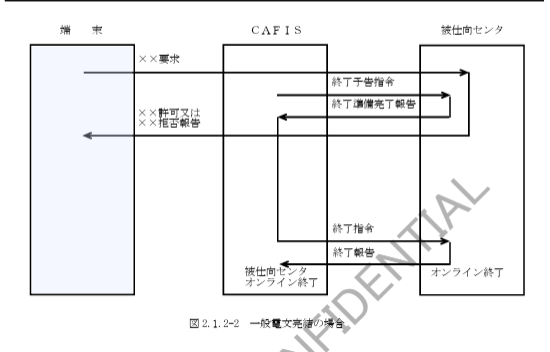

【図 2.1.2-3　一般電文タイムアウト時】

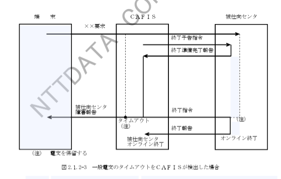

【図 2.1.2-4　端末回線の障害をCAFISが検出した場合】

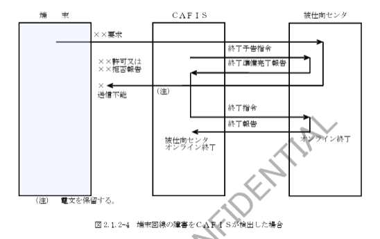

【図 2.1.2-5　被仕向センタ障害をCAFISが検出した場合】

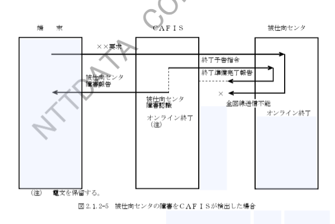

【図 2.1.2-6　一般および障害電文完結の場合】

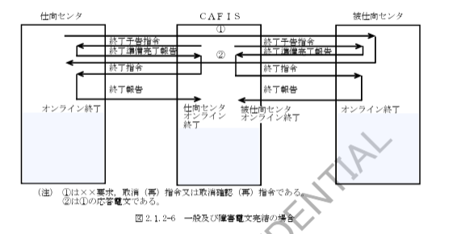

【図 2.1.2-7　一般および障害電文タイムアウトをCAFISが検出した場合】

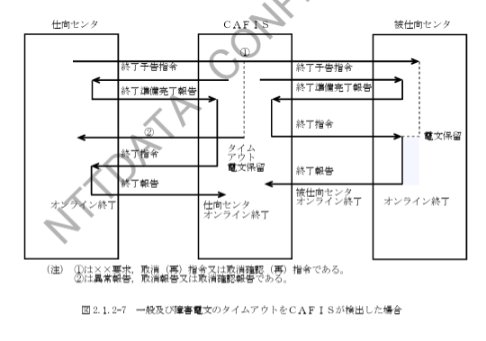

【図 2.1.2-8　一般および障害電文のタイムアウトを仕向センタが検出した場合】

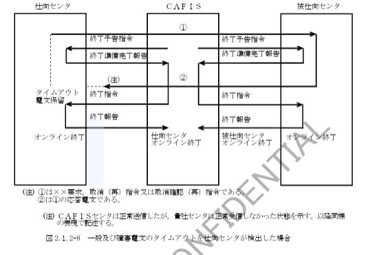

【図 2.1.2-9　仕掛電文処理中に仕向センタが終了指令を受信した場合】

【図 2.1.2-10　仕向センタの障害をCAFISが検出した場合】

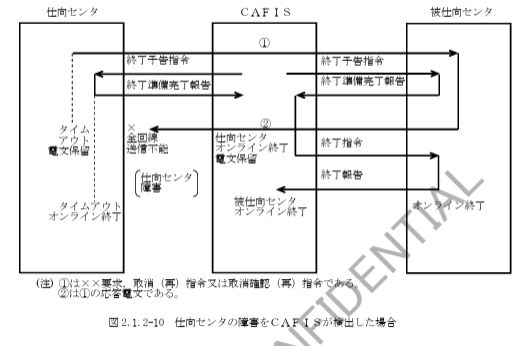

【図 2.1.2-11　被仕向センタの障害をCAFISが検出した場合】

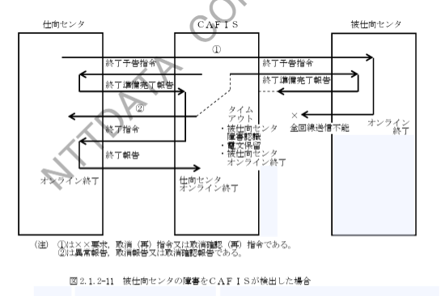

（5）カウント通知送信  
ＣＡＦＩＳセンタは、「カウント通知」が「有」または「必要」で契約された貴社センタに対し、規約時間内に電文内容の「カウント通知」を送信する。  

（6）カウント通知受信  
「カウント通知」を受信した貴社センタは、「カウント完了報告」を送信する。  

（7）カウント完了報告受信  
ＣＡＦＩＳセンタは、貴社センタから「カウント完了報告」を受信した場合、または、規約時間内に「カウント完了報告」を受信しなかった場合は、貴社センタへ「終了指令」を送信する。  

（8）終了指令送信  
ＣＡＦＩＳセンタは、「カウント通知」が「無」または「不要」で契約された貴社センタの仕掛電文監視が完了した場合、または、「カウント通知」が「有」または「必要」で契約された貴社センタとのカウント通知処理が完了した場合は、貴社センタへ「終了指令」を送信する。  

（9）終了指令受信  
「終了指令」を受信した貴社センタは、ＣＡＦＩＳセンタへ「終了報告」を送信する。  
また、規約時間内に「終了報告」を受信しなかった場合は、ＣＡＦＩＳセンタはＣＡＦＩＳとのオンラインを終了する。  

（10）終了報告受信  
ＣＡＦＩＳセンタは、貴社センタからの「終了報告」を受信した場合、または、規約時間内に「終了報告」を受信しなかった場合に、貴社センタとのオンラインを終了する。

## 2.1.3　CAFISセンタ障害

ＣＡＦＩＳセンタ障害時の処理手順を図２．１．３－１に示す。

【図 2.1.3-1　CAFISセンタ障害時の処理手順】

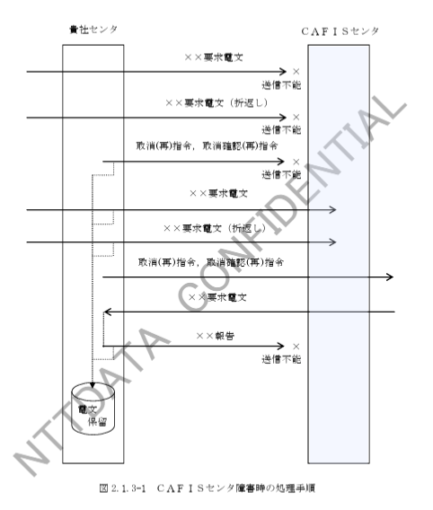

（1）ＣＡＦＩＳセンタ障害検知  
貴社センタは、ＣＡＦＩＳセンタと接続する全回線において、各接続プロトコルにおける回線障害を検知した場合は、ＣＡＦＩＳセンタ障害とする。  

（2）貴社センタでの仕掛電文処理  

Ａ．貴社センタ仕向電文  

（a）送信不能電文  
貴社センタでは、一般電文は保留電文対象外として処理を中止する。  
また、障害電文は保留電文対象とし、オンライン再開始後に取消再指令または取消確認再指令としてＣＡＦＩＳセンタへ送信する。  

（b）報告待ち電文  
貴社センタでは、一般要求電文は保留電文対象外として処理を中止し、オンライン再開後に取消確認（再）指令としてＣＡＦＩＳセンタへ送信する。  
なお、ＣＡＦＩＳセンタ折返し電文は、保留電文対象外としオンライン再開後に該当電文を再送する。  
また、障害電文は保留電文対象とし、オンライン再開後に取消再指令または取消確認再指令としてＣＡＦＩＳセンタへ送信する。  

Ｂ．貴社センタ被仕向電文  
貴社センタでは、ＣＡＦＩＳセンタへ送信不能となった報告電文は、保留電文対象とし、ＣＡＦＩＳセンタ再開後のＣＡＦＩＳセンタから送信される取消（再）指令または取消確認（再）指令を受信時に、当該電文の取消処理を行う。  
なお、ＣＡＦＩＳセンタ発信となる一般電文の報告電文は、保留対象外とする。  

（3）ＣＡＦＩＳセンタでの仕掛電文処理  
ＣＡＦＩＳセンタでは、ＣＡＦＩＳセンタ発信となる一般電文を除く貴社センタ宛の仕掛電文は全て保留対象とし、オンライン再開時に取消（再）指令または取消確認（再）指令として貴社センタへ送信する。

## 2.2　貴社センタ制御

### 2.2.1　貴社センタ個別開始

貴社センタは、ＣＡＦＩＳのオンライン一斉開始とは別に以下に示す場合に、個別にＣＡＦＩＳセンタとのオンラインの再開始を行うことができる。  

① 貴社センタの終了後  
② 貴社センタの障害回復後  
③ 貴社センタでのＣＡＦＩＳセンタ障害検知後  

（1）貴社センタの準備  
貴社センタが個別にオンラインを再開始する場合は、あらかじめオンライン開始処理を行い、ＣＡＦＩＳセンタからの「開始指令」を受信可能な状態、または、貴社センタから「再開始要求」を送信可能な状態とする。  

（2）開始指令による開局  
開始指令による貴社センタ開局手順は、オンライン一斉開始時の開始指令による開局と同様である。（「2.1.1 オンライン一斉開始」（2）のＡ．開始指令による開局 と同様）  
なお、ＣＡＦＩＳセンタは、「ＣＡＦＩＳからの開始指令」を「要」で契約された貴社センタが終了中の場合、または、貴社センタが障害中の場合に、「開始指令」を送信する。  

（3）再開始要求による開局  
再開始要求による貴社センタ開局手順は、オンライン一斉開始時の再開始要求による開局と同様である。（「2.1.1 オンライン一斉開始」（2）のＢ．再開始要求による開局 と同様）

## 2.2.2　貴社センタ個別終了

貴社センタは、ＣＡＦＩＳのオンライン一斉終了とは別に、ＣＡＦＩＳセンタと個別にオンライン終了処理を行うことができる。  
貴社センタのオンライン個別終了手順を、図２．２．２－１に示す。

【図 2.2.2-1　貴社センタのオンライン個別終了手順】

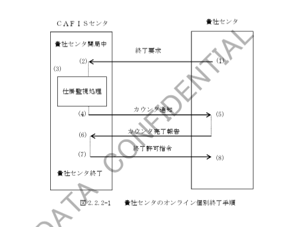

（1）終了要求送信  
貴社センタは、ＣＡＦＩＳセンタとのオンライン終了時に、ＣＡＦＩＳセンタへ「終了要求」を送信する。  

（2）終了要求受信  
ＣＡＦＩＳセンタは、貴社センタから「終了要求」を受信した場合に、仕掛電文の監視処理を行う。  
また、ＣＡＦＩＳセンタでは「終了要求」受信後に端末および仕向センタから新たな要求電文を受信した場合は、「被仕向センタ終了中」の旨の応答電文を送信する。  

（3）仕掛電文監視  
「終了要求」受信前に、ＣＡＦＩＳセンタが貴社センタへ送信した貴社センタ宛の要求電文により、使用中状態となった貴社センタ被仕向回線および報告電文受信や規定時間のタイムアウト等で、全て未使用状態となるまで監視する。  
仕掛電文処理一覧を表２．２．２－１に、各処理概要図を図２．２．２－２～１１に示す。  

【表 2.2.2-1　仕掛電文処理一覧】

| 項番 | 仕向 | 完了条件 | 図番 |
|---|---|---|---|
| 1 | 端末 | 一般電文の完結 | 図 2.2.2-2 |
| 2 | 端末 | 一般電文のタイムアウトをCAFISが検出 | 図 2.2.2-3 |
| 3 | 端末 | 端末回線の障害をCAFISが検出 | 図 2.2.2-4 |
| 4 | 端末 | 被仕向センタの障害をCAFISが検出 | 図 2.2.2-5 |
| 5 | センタ | 一般および障害電文の完結 | 図 2.2.2-6 |
| 6 | センタ | 一般および障害電文のタイムアウトをCAFISが検出 | 図 2.2.2-7 |
| 7 | センタ | 一般および障害電文のタイムアウトを仕向センタが検出 | 図 2.2.2-8 |
| 8 | センタ | 仕掛電文処理中に仕向センタが終了許可指令を受信 | 図 2.2.2-9 |
| 9 | センタ | 仕向センタの障害をCAFISが検出 | 図 2.2.2-10 |
| 10 | センタ | 被仕向センタの障害をCAFISが検出 | 図 2.2.2-11 |

【図 2.2.2-2　一般電文完結の場合】

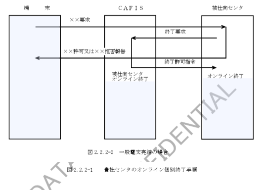

【図 2.2.2-3　一般電文のタイムアウトをCAFISが検出した場合】

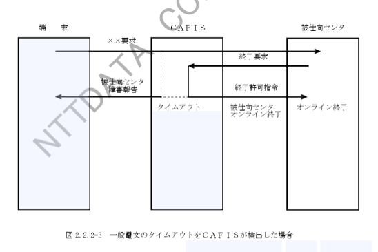

【図 2.2.2-4　端末回線の障害をCAFISが検出した場合】

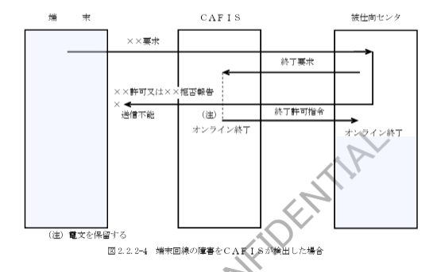

【図 2.2.2-5　被仕向けセンタの障害をCAFISが検出した場合】

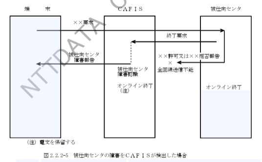

【図 2.2.2-6　一般及び障害電文完結の場合】

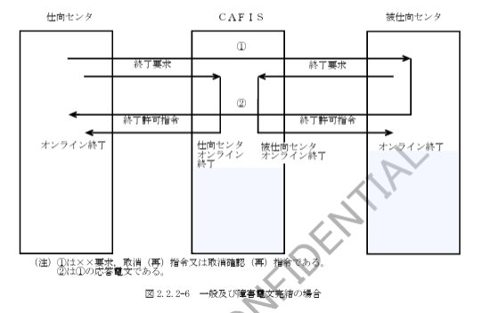

【図 2.2.2-7　一般及び障害電文のタイムアウトをCAFISセンタが検出した場合】

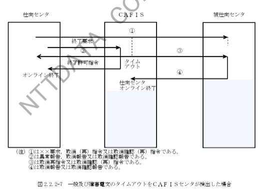

【図 2.2.2-8　一般及び障害電文のタイムアウトを仕向センタが検出した場合】

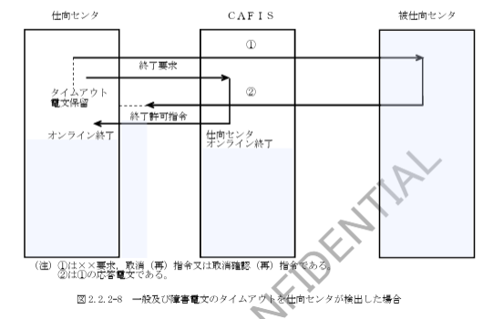

【図 2.2.2-9　仕掛電文処理中に仕向センタが終了許可指令を受信した場合】

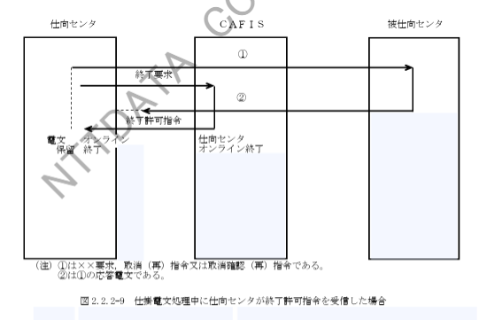

【図 2.2.2-10　仕向センタの障害をCAFISが検出した場合】

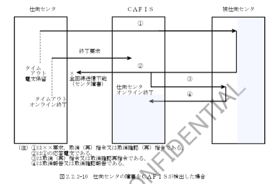

【図 2.2.2-11　一般及び障害電文のタイムアウトをCAFISが検出した場合】

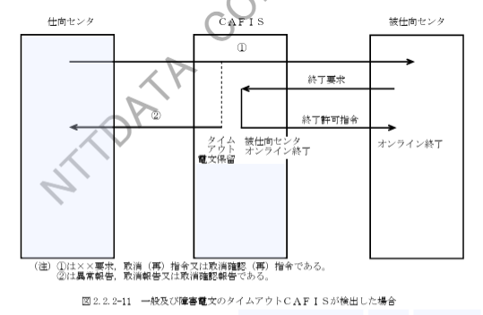

（4）カウント通知送信  
ＣＡＦＩＳセンタは、「カウント通知」が「有」または「必要」で契約された貴社センタに対し、契約内容に応じた「カウント通知」を送信する。  

（5）カウント通知受信  
「カウント通知」を受信した貴社センタは、「カウント完了報告」を送信する。  

（6）カウント完了報告受信  
ＣＡＦＩＳセンタは、貴社センタから「カウント完了報告」を受信した場合、または、規定時間内に「カウント完了報告」を受信しなかった場合に、貴社センタへ「終了許可指令」を送信する。  

（7）終了許可指令送信  
ＣＡＦＩＳセンタは、「カウント通知」が「無」または「不要」で契約された貴社センタの仕掛電文監視が完了した場合、または、「カウント通知」が「有」または「必要」で契約された貴社センタとのカウント通知処理が完了した場合に、貴社センタへ「終了許可指令」を送信する。  

（8）終了許可指令受信  
貴社センタは、「終了許可指令」を受信した場合、または、規定時間内に「終了許可指令」を受信しなかった場合に、ＣＡＦＩＳセンタとのオンラインを終了する。  

## 2.2.3　貴社センタ障害

ＣＡＦＩＳセンタは、貴社センタ障害を検知した場合に、貴社センタ障害復旧処理を行い、貴社センタ宛の電文に対しては仕向センタまたは端末に、「被仕向センタ障害中」の旨の応答電文を送信する。  

（1）ＣＡＦＩＳセンタでの貴社センタ障害検知  

A．全国障害による貴社センタ障害  
ＣＡＦＩＳセンタは、貴社センタがＣＡＦＩＳセンタと接続する全国回線において、各接続プロトコルにおける回線障害を検知した場合に貴社センタ障害とし、貴社センタの仕掛電文処理を行う。  
なお、貴社センタ宛電文送信処理中に全国回線障害が発生した場合は、貴社センタ障害とせず終了処理を行う。  

B．再開始要求受信による貴社センタ障害  
ＣＡＦＩＳセンタは、貴社センタとオンライン開始中に貴社センタから「再開始要求」を受信した場合に貴社センタ障害とし、貴社センタの仕掛電文処理を行う。  
ＣＡＦＩＳセンタは、受信した「再開始要求」に対する「再開始許可指令」が貴社センタへ送信正常となった場合に障害回復とみなす。  

（2）ＣＡＦＩＳセンタでの仕掛電文処理  

A．貴社センタ向電文  
ＣＡＦＩＳセンタでは、送信不能となった一般報告電文は、当該電文の被仕向センタへ取消（再）指令として送信する。  
なお、貴社センタでは、ＣＡＦＩＳセンタ障害時と同様に、保留電文を作成する。  

仕向センタ障害時のＣＡＦＩＳセンタの処理を図２．２．３－１に示す。  

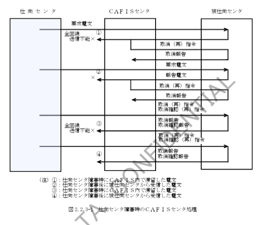

B．貴社センタ被仕向電文  

被仕向センタ障害時のＣＡＦＩＳセンタの処理（仕向センタからの電文）を図２．２．３－２に示す。  

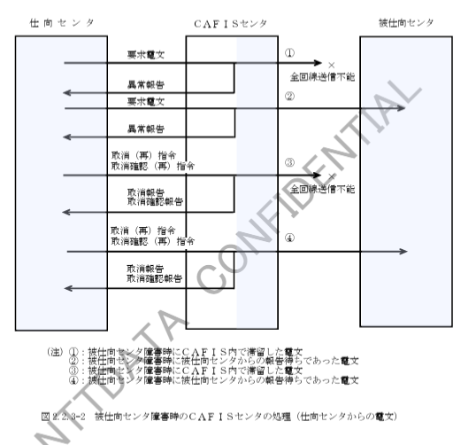

（A）送信不能電文  

ＣＡＦＩＳセンタでは、送信不能となった一般要求電文は、当該電文の仕向となる仕向センタまたは端末に「被仕向センタ障害中」の旨の応答電文を送信する。  

また、障害電文は保留対象とし、オンライン再開始後に取消（再）指令または取消確認（再）指令として被仕向センタへ送信する。  

（B）報告待ち電文  

ＣＡＦＩＳセンタでは、報告待ち状態で被仕向センタ障害となった一般電文は、当該電文の仕向となる仕向センタまたは端末に「被仕向センタ障害中」の旨の応答電文を送信し、当該電文を保留対象とし被仕向センタのオンライン再開始後に取消確認（再）指令として送信する。  

※ 2-9 ページまで.
