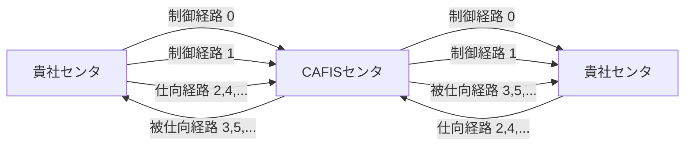

## 2.3　回線制御

### 2.3.1　回線管理

経路と回線は別管理とし、経路選択と回線選択は非同期で行う。  

### 2.3.2　回線選択

（1）ＣＡＦＩＳセンタ  

ＣＡＦＩＳセンタでの回線選択は以下の通りに行う。  

① 複数回線接続の貴社センタへ電文を送信する場合は、貴社センタ単位にラウンドロビン方式で回線を選択する。  

② 障害中の回線や、他の電文送信のため使用中の回線は回線選択対象外とし回線迂回を行う。  
なお、回線迂回によって規定時間内に回線選択ができなかった場合は、当該電文は送信異常とする。  

（2）貴社センタ  

貴社センタでの回線選択は以下の通りに行う。  

① 複数回線接続の場合は、各回線の使用頻度が平均する回線選択方式とする。  

② 障害中の回線や、他の電文送信のため使用中の回線は回線選択対象外とし回線迂回を行う。  
なお、回線迂回によって規定時間内に回線選択ができなかった場合は、当該電文は送信異常とする。  

## 2.4　経路制御

### 2.4.1　経路種別

経路種別概要を図2.4.1-1に示す。

【図 2.4.1-1　経路種別概要】

（注）括弧内の数字は経路番号を示す。

（1）制御経路  

制御電文の送受信は制御経路を使用し、貴社センタからの要求は経路番号「００００」を、ＣＡＦＩＳセンタからの指令は経路番号「０００１」を使用する。  
なお、テストコールは経路制御対象外とする。  

（2）仕向経路  

貴社センタが一般電文や障害電文をＣＡＦＩＳセンタへ送信する場合は、仕向経路を使用し経路番号は「０００２」以降の偶数経路番号を使用する。  

（3）被仕向経路  

ＣＡＦＩＳセンタが一般電文や障害電文を貴社センタへ送信する場合は、被仕向経路を使用し経路番号は「０００３」以降の奇数経路番号を使用する。  

## 2.4.2　経路数  

ＣＡＦＩＳセンタと貴社センタ間の有効経路数は、各プロトコルにおける回線数や回線構成に応じて異なる。  

## 2.4.3　経路選択  

ＣＡＦＩＳセンタでの取引発生時の被仕向経路は、経路番号が小さい未使用経路を選択する。  

また、貴社センタにおける仕向経路選択においても、回線を均等に使用する。  

## 2.4.4　経路保留  

回線障害、貴社センタ障害、およびＣＡＦＩＳセンタ障害等に起因して送信する電文の経路保留条件を以下に示す。  

（1）取消確認（再）指令  
取消確認（再）指令は、当該取引の要求電文と同一経路を使用して送信する。  

（2）取消指令  
取消指令は、取消確認と同一経路を使用して送信する。  

## 2.5　時間監視制御

### 2.5.1　対向センタ監視タイマ

表 2.5.1-1　CAFISセンタの対向センタ監視タイマ

| 番号 | 名称 | タイマ値 | 用途 |
|---|---|---|---|
| t10 | 開始準備完了報告または終了報告待ちタイマ | 30秒 | CAFISが開始指令または終了指令を送信してから貴社センタより開始準備完了報告または終了報告を受信する迄の時間監視 |
| t11 | 開始指令送信タイマ | 50秒 又は 210秒（注1） | CAFISが開始指令送信時無応答の場合、次の開始指令を送信する迄のインターバルタイマ |
| t12 | 終了準備完了報告待ちタイマ | 30秒 | CAFISが終了予告指令を送信してから、貴社センタより終了準備完了報告を受信する迄の時間監視 |
| t13 | 電文報告待ちタイマ | 150秒 又は 55秒（注2） | CAFISが××要求を送信してから貴社センタより各種報告電文を受信する迄の時間監視 |
| t15 | 取消報告待ちタイマ（取消確認報告） | 150秒 又は 55秒（注2） | 取消（再）指令又は取消確認（再）指令に対する報告電文を受信する迄の時間監視 |
| t16 | 回線障害回復報告待ちタイマ | 30秒 | CAFISが回線障害回復報告指令を送信してから貴社センタより回復報告を受信する迄の時間監視 |
| t21 | 迂回中止タイマ | 25秒 | 回線選択時における回線迂回中止タイマ |

**注1** 初期設定は手順に関わらず210秒となります。伝送制御手順がCAFIS‑TCP/IP手順の場合のみ、50秒と210秒から選択できます。  
**注2** 端末からの電文は150秒、仕向センタからの電文は55秒。

## 2.5.2　対CAFIS監視タイマ

表 2.5.1-2　貴社センタの対CAFIS監視タイマ

| 番号 | 名称 | タイマ値 | 用途 |
|---|---|---|---|
| t31 | 一般電文報告待ちタイマ | 58秒 | 仕向センタが××要求を送信してからCAFISより各種報告電文を受信する迄の時間監視 |
| t32 | 障害電文報告待ちタイマ | 58秒 | 障害電文（取消（再）指令・取消確認（再）指令）を仕向センタが送信してから各種報告電文を受信する迄の時間監視 |
| t33 | 回線障害回復報告待ちタイマ | 30秒 | 貴社センタが回線障害回復報告を送信してからCAFISより回線障害回復報告を受信する迄の時間監視 |
| t34 | 再開始許可指令待ちタイマ | 30秒 | 貴社センタが再開始要求を送信してからCAFISより再開始許可指令を受信する迄の時間監視 |
| t35 | 終了許可指令待ちタイマ | 12分30秒 | 貴社センタが終了要求を送信してからCAFISより終了許可指令を受信する迄の時間監視 |
| t36 | 再開始要求送信間隔タイマ | 任意 | 貴社センタが再開始要求送信時に無応答の場合、次の再開始要求を送信する迄の時間監視 |

