# ３．１  電文仕様 

## ３．１．１  電文種別 

ＣＡＦＩＳで使用する制御電文、および障害電文の電文種別一覧を表3.1.1-1 に 
示す。

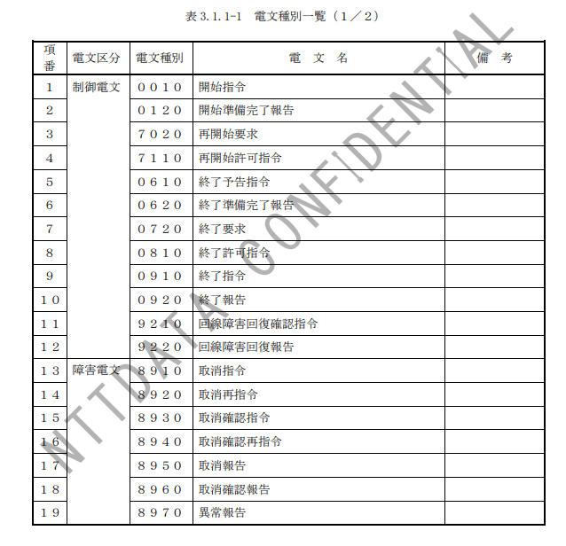
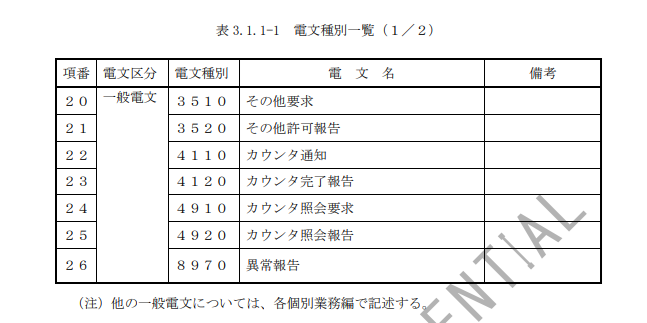

## ３．１．２  電文処理形態 

制御電文処理形態を表3.1.2-1 に、一般電文処理形態を表3.1.2-2 に、障害電文処理形態を表3.1.2-3 に
示す。 

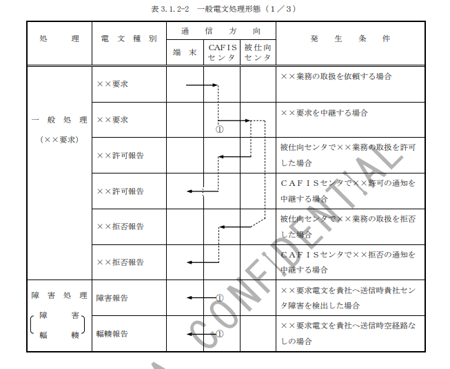
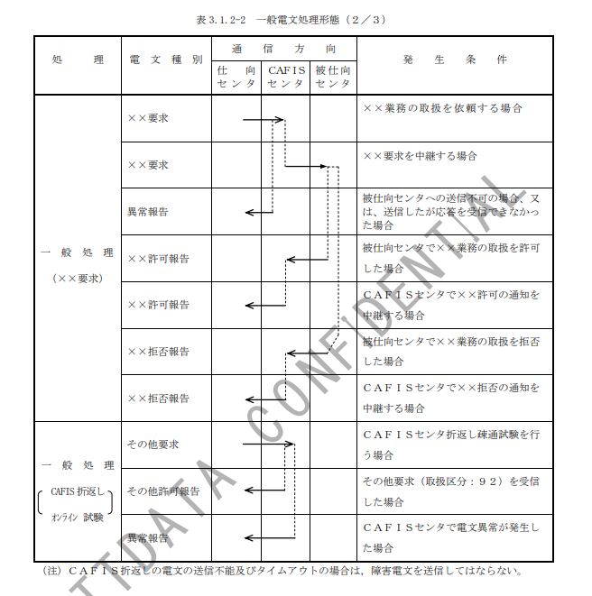
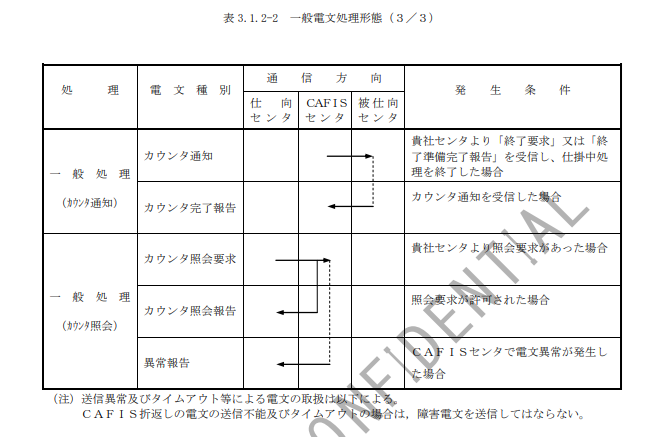

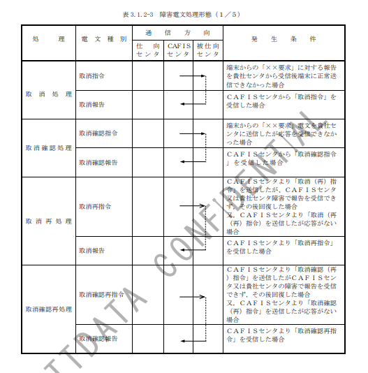
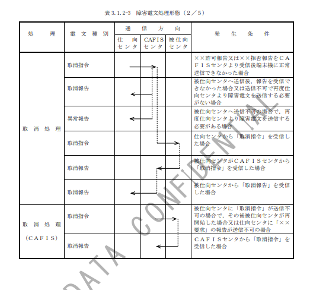
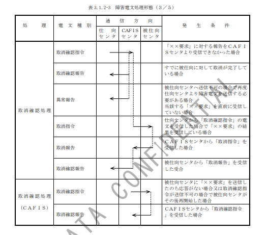
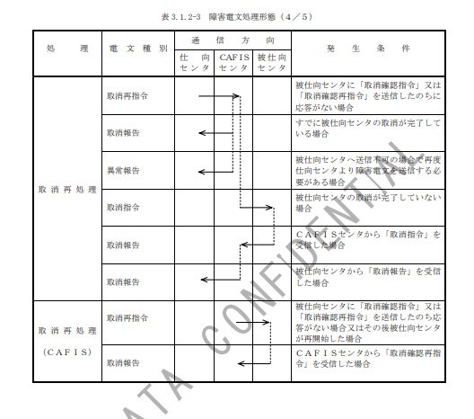
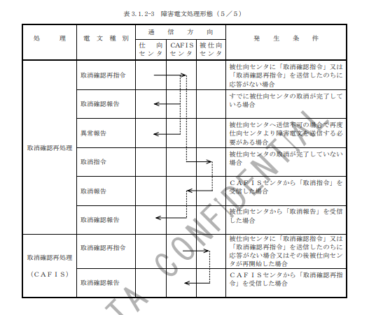

## ３．１．３  電文構成 

ＣＡＦＩＳセンタと貴社センタ間で使用する電文構成一覧表（制御電文）を表3.1. 
3-1 に、電文構成一覧表（一般電文）を表3.1.3-2 に示す。 

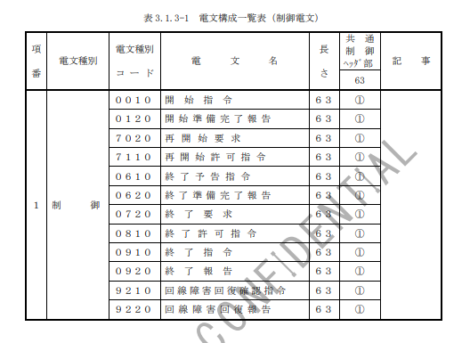

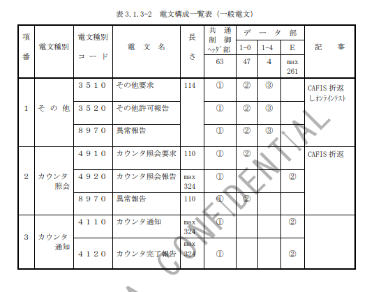

## ３．１．４  電文様式 

ＣＡＦＩＳセンタが、端末および貴社センタ間で使用する電文構成を、以下に説明
する。 
(1) 基本電文構成 
   基本電文構成を表3.1.4-1に示す。 
 
表3.1.4-1 基本電文構成（１／２） 

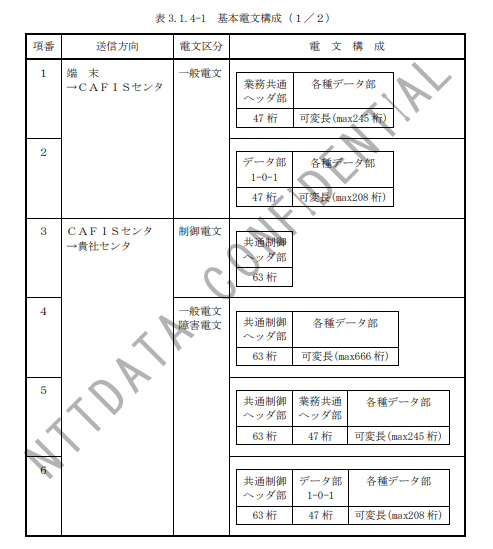
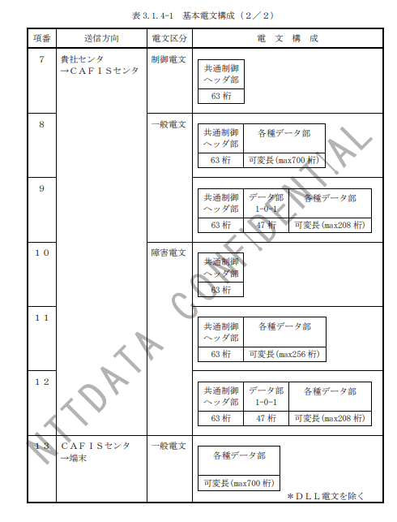

(2) 電文内容 
 ① 共通制御ヘッダ部 
    ＣＡＦＩＳと貴社センタ間の経路、電文種別等の共通的な項目を設定する。 
共通制御ヘッダ部のフォーマットを図3.1.4-1 に、共通制御ヘッダ部の項目説明 
を表3.1.4-1 に示す。 
 ② データ部１－４ 
    データ部１－４のフォーマットを図3.1.4-2 に、データ部１－４の項目説明を表 
3.1.4-2 に示す。 
 ③ データ部Ｅ 
データ部Ｅのフォーマットを図3.1.4-3 および図3.1.4-4 に、データ部Ｅの項 
目説明を表3.1.4-3 および表3.1.4-4 に示す。 
 ④ その他のデータ部 
各業務の接続条件設計書を参照すること。

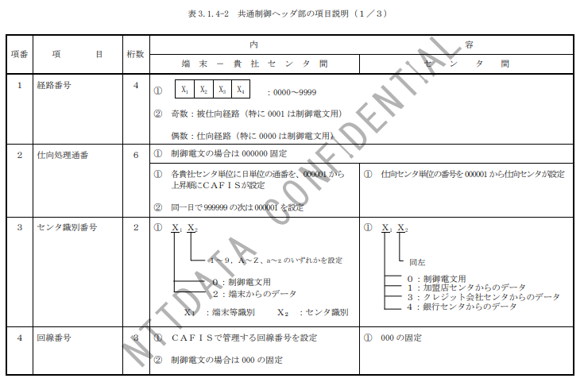
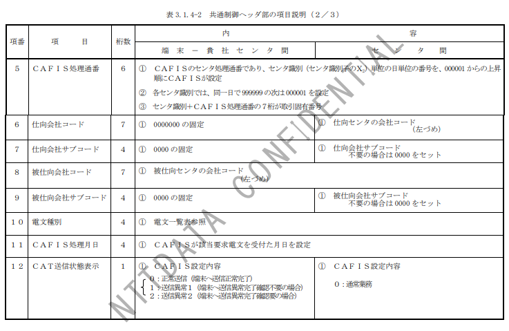
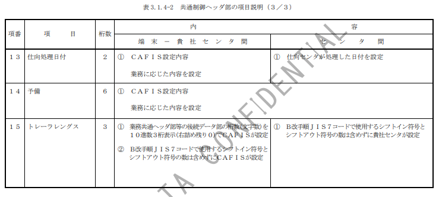

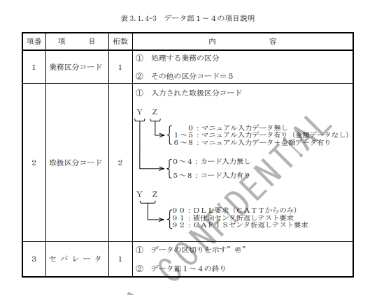

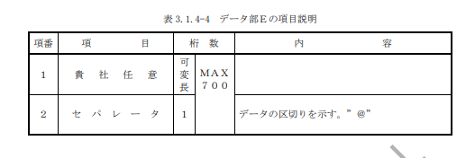

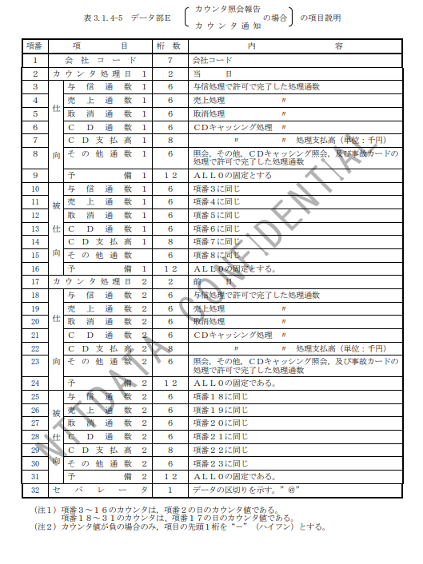