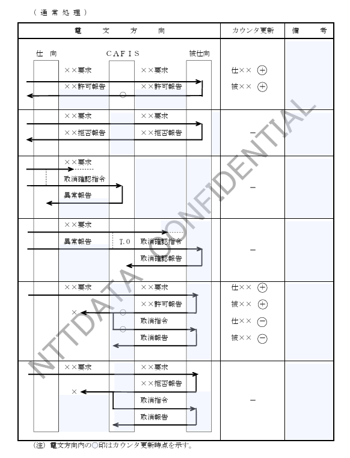
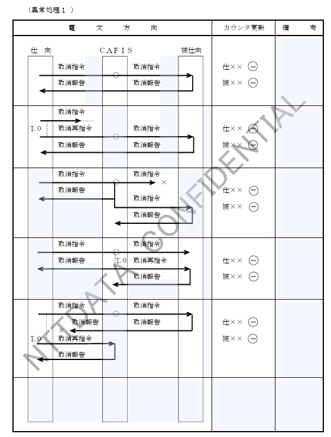
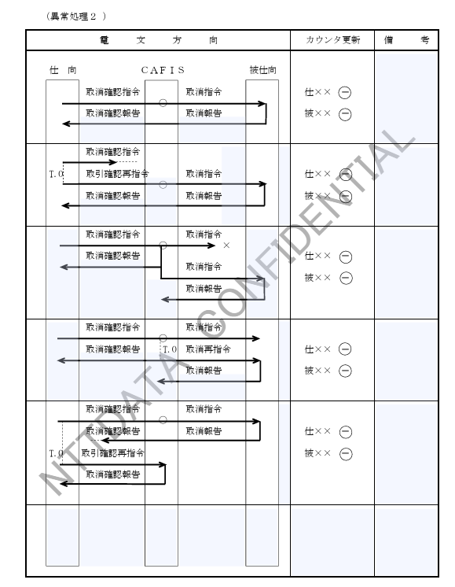

## 3.4 カウンタ仕様

### 3.4.1 CAFISで管理するカウンタ

CAFISセンタでは、貴社センタとCAFISセンタ間の、オンライン業務における取引を、オンラインカウンタとして更新する。  
カウンタは、センタ間業務に対応する一般業務カウンタと、個別業務カウンタを保有するが、本設計書では一般業務カウンタについて記述し、個別業務カウンタについては機能要件設計書（個別業務編）を参照すること。  

---

### (1) カウンタの種類と内容

カウンタは、仕向カウンタと被仕向カウンタの2種類がある。  
一般業務カウンタ内容を表3.4.1-1に示す。  

---

【表 3.4.1-1 一般業務カウンタ内容】

| 仕向カウンタ | 被仕向カウンタ | 更新対象業務 |
|--------------|----------------|--------------|
| 与信通数 | 与信通数 | 仕向センタからの与信処理 |
| 売上通数 | 売上通数 | 仕向センタからの売上処理 |
| 取消通数 | 取消通数 | 仕向センタからの取消処理 |
| CD通数 | CD通数 | CDキャッシング処理 |
| CD支払高 | CD支払高 | CDキャッシング処理 |
| その他通数 | その他通数 | 仕向センタからの照会処理、CDキャッシング照会処理、事故カード処理、および上記以外のセンタ間業務処理 |

---

### (2) カウンタの更新

#### A. CAFISセンタ側

(a) カウンタ更新機能  
CAFISセンタのカウンタ更新機能を表3.4.1-2に示す。

【表 3.4.1-2 CAFISセンタのカウンタ更新方法（1/3）】

【表 3.4.1-2 CAFISセンタのカウンタ更新方法（2/3）】

【表 3.4.1-2 CAFISセンタのカウンタ更新方法（3/3）】

(b) カウンタ更新条件

① 仕向カウンタ

××許可報告が仕向センタへ送信正常となった場合、または、仕向センタから××許可報告に対する取消指令を受信した場合は当該カウンタの更新を行う。  

② 被仕向カウンタ

××許可報告を被仕向センタから受信した場合、または、××許可報告に対する取消指令を被仕向センタへ送信する場合は当該カウンタの更新を行う。  

####  B. 貴社センタ

(a) 仕向カウンタ

① ××許可報告を受信した場合に当該カウンタを加算する。  
② ××許可報告に対する取消指令を送信する場合に当該カウンタを減算する。  

(b) 被仕向カウンタ

① ××許可報告を送信する場合に当該カウンタを加算する。  
② 取消（再）指令または取消確認（再）指令を受信し、対応する××許可報告を送信済の場合に当該カウンタを減算する。  

---

### (3) カウンタ内容の通知

① CAFISセンタの一斉終了時に、カウンタ通知契約をされている貴社センタへ契約に応じたカウンタ通知電文を送信する。  

② 貴社センタの個別終了時に、カウンタ通知契約されている貴社センタへ契約に応じたカウンタ通知電文を送信する。  

③ 貴社センタからカウンタ照会要求を受信時に、貴社のカウンタ通知契約に応じたカウンタ照会報告電文を送信する。なお、契約が無い場合は一般業務カウンタ内容のカウンタ報告を送信する。  

