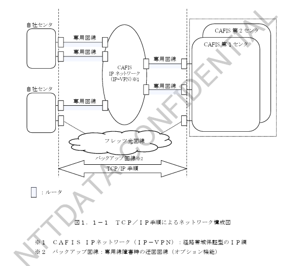
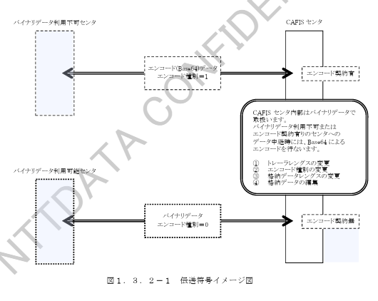

# 第１章　概要

## 1.1 ネットワーク構成

ＴＣＰ／ＩＰ手順による接続を行う場合のネットワーク構成を図１．１－１に示します。

（図１．１－１　ＴＣＰ／ＩＰ手順によるネットワーク構成図）

※１　ＣＡＦＩＳ
ＩＰネットワーク（ＩＰ－ＶＰＮ）：距離帯域保証型のＩＰ網\
※２　バックアップ回線：専用線障害時の迂回回線（オプション機能）

## 1.2 接続回線

本手順で利用できる接続回線は、光専用回線（イーサ回線）および光専用回線（イーサ回線）障害時のバックアップ回線（オプション機能）であるフレッツ光回線となります。

## 1.3 伝送符号

### 1.3.1 文字コード

本インターフェースでの伝送符号は、「シフトＪＩＳコード」とします。

１バイト文字：\
JIS X 0201（ANK文字）および\
JIS X 0211（C0集合制御文字の一部）（注１）

２バイト文字：\
JIS X 0208 - 1997\
（漢字JISは第１水準、第２水準とし外字は認めません）（注２）

（注１）使用できる文字コード

| コード値 | 定義文字 | 説明 |
|----------|----------|------|
| 07 | BEL | BEL符号 |
| 0A | NL（LF） | 改行 |
| 12 | DC2 | 出力装置制御 |
| 18 | CAN | 取消 |
| 1A | SUB | 置換 |

上記コード値は使用においてＣＡＦＩＳセンタで利用可能な伝送符号（JIS7,
EBCDIC）に変換可能な文字となります。\
上記以外の制御文字を受信した場合、ＣＡＦＩＳセンタにて電文破棄する場合があります。

（注２）漢字コード

本手順としてシフトＪＩＳコードを利用することにより、漢字コードの利用が可能となります。\
ただし、漢字コードが利用できるのは、各業務の接続条件設計書においてデータ部内の項目属性に漢字コードの利用が可能となっている業務のみとします。\
漢字コードの利用が許容されていない業務において利用された場合、接続先のセンタに正しく通知できない場合があります。

### 1.3.2 バイナリデータ

本手順においては、８単位符号での伝送が可能となることから、バイナリデータの疎通を可能とします。

バイナリデータの転送は、各業務の接続条件設計書において、データ部の項目属性がバイナリデータの利用可能となっている項目のみとします。

本手順を利用頂く場合には、利用申込時にバイナリデータの取扱について「透過的に扱う」または「エンコード実施後キャラクタ扱う」のどちらかを選択して頂きます。「エンコード実施後キャラクタで扱う」を選択された場合には、ＣＡＦＩＳセンタから送信する電文については一律エンコードを実施した状態で送信します。

（１）バイナリデータの使用方法

バイナリデータ項目を扱う場合には、使用可能な業務において以下に示す共通フォーマットを利用します。共通フォーマットを表１．３．２－１に示します。
共通フォーマットは、各業務の接続条件設計書で記載されているデータ部の一部です。

表１．３．２－１　バイナリデータ転送時のフォーマット

| 項番 | 項目名 | 桁数 | 内容 |
|----------------|----------------|----------------|----------------|
| 1 | フォーマット種別 | 1 | “B”固定（バイナリデータ利用可能を示す） |
| 2 | エンコード種別 | 1 | エンコード有無を示す：「0」エンコード無、「1」Base64によるエンコード |
| 3 | 予備 | 2 | スペース |
| 4 | 格納データレングス | 4 | 後続データのレングスを10進数で示す |
| 5 | 格納データ | 可変 | バイナリデータ（項番2が1の場合はエンコード後データ） |

（2）取扱コードの変換について

ＣＡＦＩＳセンタの手順には、バイナリデータを透過的に扱えない手順があります。\
また、本手順をご利用であってもバイナリデータの取扱を「エンコード後キャラクタで扱う」と指定された場合、バイナリデータを透過的に扱えないことになります。

したがって、前列の接続センタの手順いかんによってはバイナリデータを中継できない場合があります。\
この場合にはＣＡＦＩＳセンタで接続センタデータを中継する際に、表１．３．２－１で示した項目内容に準拠してエンコード種別を変更し、格納データ部をキャラクタにエンコードした後、中継します。

また、バイナリデータの中継が出来ない手順のお客様から本手順をご利用のセンタ（透過的な伝送可能）へ取引を中継する場合には、逆にＣＡＦＩＳセンタでデコードしバイナリデータに変換した後、取引を中継します。

図１．３．２－１にイメージ図を示します。

（3）チェック

ＣＡＦＩＳセンタではバイナリデータのエンコード／デコードを行うために、各手順に対応したエンコード種別が設定されていることのチェックを行います。  
本手順におけるチェック内容を表１．３．２－２に示します。

表１．３．２－２　チェック内容

| チェック機能 | 事象 | エラーの内容および原因 | ＣＡＦＩＳセンタでの処理 | エラー発生時の対応 |
|---|---|---|---|---|
| 要求受信 | エンコード種別不正 | エンコード種別に「1」（Base64でエンコード）と設定されている場合、Base64で規定されている文字以外が設定されている | 異常報告応答（C17） | 処理を中止し、電文内容を障害電文とする |
| 報告受信 | エンコード種別不正 | エンコード種別に「1」（Base64でエンコード）と設定されている場合、Base64で規定されている文字以外が設定されている | 電文破棄（取消確認報告電文）（注） | 接続センタからの申告により、電文内容を調査する |

（注）障害電文に対する報告電文（取消報告・取消確認報告）に対してはチェックは行いません。
