# 第２章　通信制御仕様

## 2.1 概要

本章で説明する通信制御仕様は、単一回線による接続・複数回線による接続等、物理的なネットワーク構成には依存せず、全て同じ制御仕様で動作することとします。

ＴＣＰ／ＩＰ手順では、ＣＡＦＩＳセンタから要求を行い、自社センタの応答によって確立されたＴＣＰコネクションを論理回線とみなし、電文の送受信を行います。  
電文送受信における概要図を図２．１－１に示します。

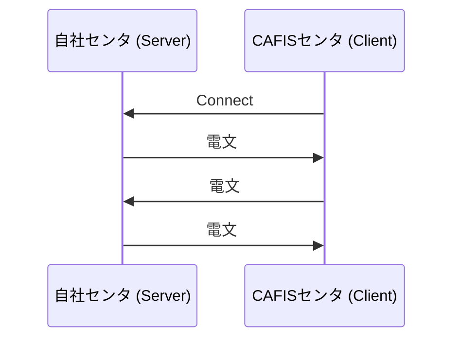

図２．１－１　電文送受信概要図

## 2.2 TCP（Transmission Control Protocol）

### 2.2.1 実装仕様

ＴＣＰの仕様については、ＲＦＣ７９３に準拠します。

### 2.2.2 コネクション数

接続コネクション数は、自社センタ毎に任意にご指定可能です。  
（１会社コードあたり最大１０コネクション）

### 2.2.3 ポート番号

（１）自社センタ（コネクション応答側）

コネクション応答側である自社センタのＣＡＦＩＳセンタ接続用ポート番号は、予めＣＡＦＩＳセンタから指定した番号となります。

【ＣＡＦＩＳセンタ接続用ポート番号】  
商用サービス　：２０１０  
試験用（伝送制御試験・機能試験・総合確認試験）：２００９  

上記ポート番号での取り扱いが出来ない場合は、商用サービスは２０Ｎ０（Ｎは１～９の整数）、試験用は２０Ｎ９（Ｎは７～９の整数）を指定して頂きます。

（２）ＣＡＦＩＳセンタ（コネクション要求側）

コネクション要求側であるＣＡＦＩＳセンタのポート番号は、特に規定せずＣＡＦＩＳセンタ側で動的に割り当ていたします。

## 2.3 IP（Internet Protocol）

### 2.3.1 実装仕様

ＩＰの仕様については、ＲＦＣ７９１に準拠します。

### 2.3.2 ＩＰアドレス

（１）自社センタ側

自社センタ側（サーバ、ルータ）のＩＰアドレスは、任意にご指定可能です。  
ただし、一部使用できないＩＰアドレスがあります。ご指定のＩＰアドレスが使用不可であるＩＰアドレスと重複した場合の対処については、ＣＡＦＩＳセンタで決定させて頂きます。

（２）ＣＡＦＩＳセンタ側

ＣＡＦＩＳセンタのＩＰアドレスは、ＣＡＦＩＳセンタ側の収容位置およびネットワークの切替により複数存在します。  
自社センタからの、電文送信時の宛先ＩＰアドレスは、コネクション要求時のＣＡＦＩＳセンタのＩＰアドレスを使用することとします。  
また、使用するＩＰアドレスの範囲は事前にＣＡＦＩＳセンタより通知します。

（３）ＮＡＴ変換（Network Address Translation）

自社センタ側に設置するルータでは、ＮＡＴ変換を実施しています。

## 2.4 ソケット制御

### 2.4.1 コネクション制御

（１）コネクションの確立

ＴＣＰコネクションの確立は、ＣＡＦＩＳセンタから予め指定された自社センタのポート番号およびＩＰアドレス宛にコネクション確立要求を発行することにより行います。  
コネクションの確立は、予め指定されたコネクション数分行います。コネクションが確立できない場合には、一定間隔で新たな確立を試みます。  
コネクション確立イメージについて、図２．４．１－１、図２．４．１－２に示します。

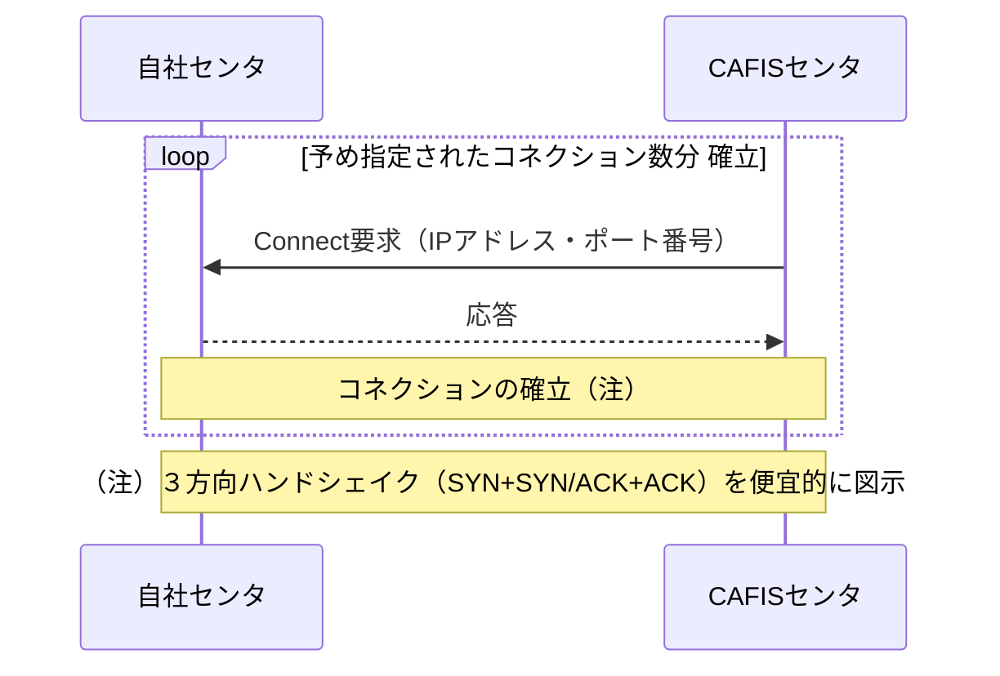

図２．４．１－１　コネクション確立イメージ（正常）

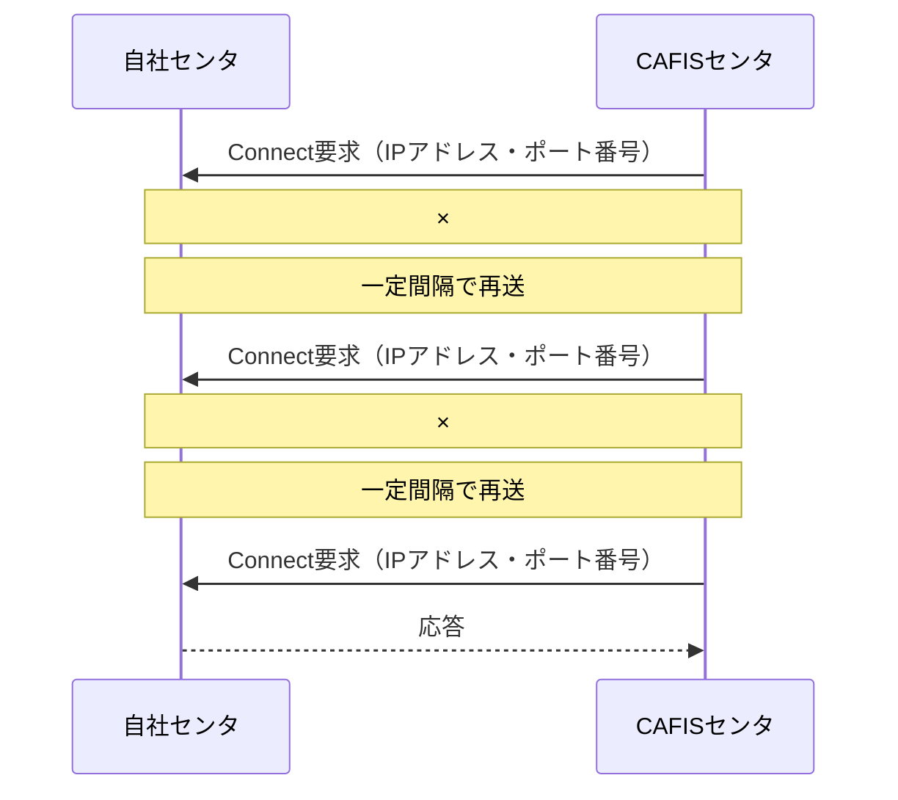

図２．４．１－２　コネクション確立イメージ（再送）

（２）コネクション数

１自社センタあたりの最大コネクション数は１０とします。  
ご利用頂くコネクション数については、任意にご指定可能です。  
自社センタ側は、決められた数以上のコネクションをＣＡＦＩＳセンタから受け付けた場合には全コネクションを切断し、再度ＣＡＦＩＳセンタからのコネクション確立を待ちます。

（３）コネクションの切断

自社センタからコネクションの切断が行われた場合、ＣＡＦＩＳセンタから新たなコネクション確立を行います。

（４）コネクションの監視

ＣＡＦＩＳセンタはコネクション確立後、コネクションの接続状態を Keep Alive 機能により監視します。  
Keep Alive において一定時間監視することにより接続状態を確認できなかった場合には、新たなコネクションの確立を行います。

また、自社センタで使用できる全てのコネクションが切断された場合、ＣＡＦＩＳセンタは自社センタの障害と認識します。  
（障害認識後の処理は、ＣＡＦＩＳセンタからコネクション要求を自社センタへ送信し、コネクションが確立した場合、障害解除の処理を行います。）

Keep Alive 機能の詳細については、ＲＦＣ１１２２を参照して下さい。

### 2.4.2 データ伝送

（１）単一コネクションの場合のデータ伝送方式

１コネクションにより接続を行う場合は、コネクションレベルで全二重通信を行います。  
単一コネクションの場合のデータ伝送方式例を図２．４．２－１に示します。

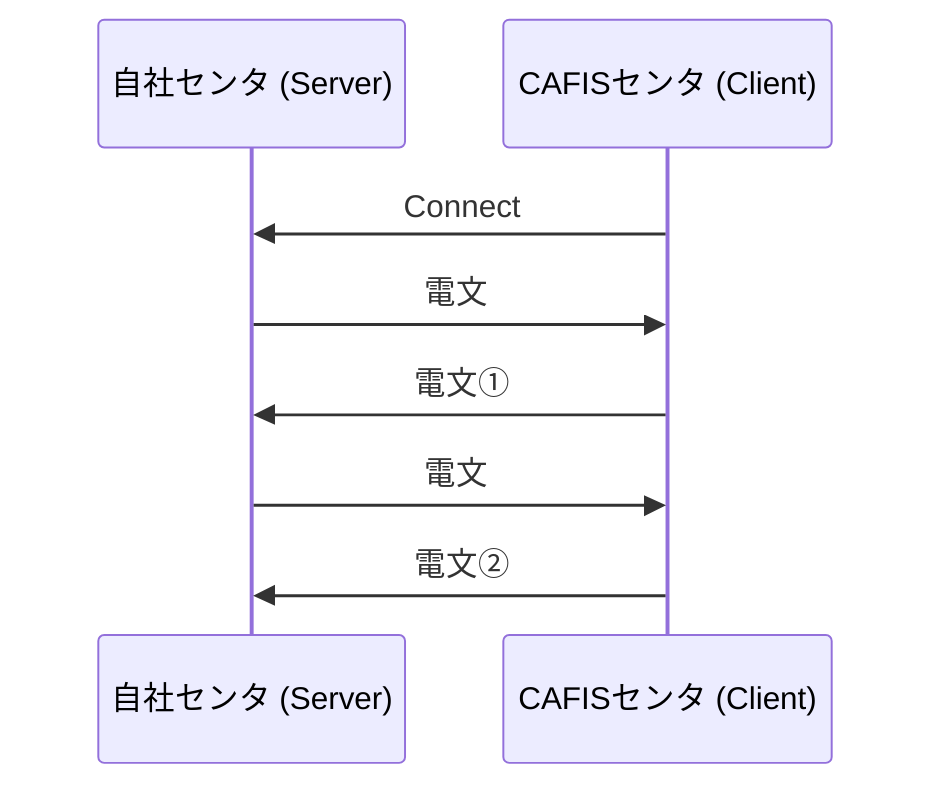

図２．４．２－１　単一コネクションの場合のデータ伝送方式例

（２）複数コネクションの場合のデータ伝送方式

電文送信時、確立されたコネクションをラウンドロビンで選択し、電文の送受信を行います。  
（要求電文と応答電文が同一コネクションで取り扱われるとは限りません）  
複数コネクションの場合のデータ伝送方式例を図２．４．２－２に示します。

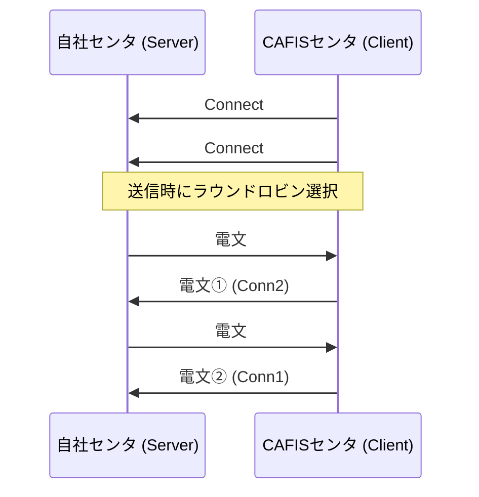

（３）電文組立／分割

データパケットの再送に伴うバッファリング等で、１データパケット内に複数電文が存在する場合や１電文が複数パケットに分割される場合があります。このため、共通制御ヘッダ部のトレーリング長をもとに電文の組立／分割を行います。

電文組立／分割において、トレーリング長分の電文を受信できず電文組立に失敗した場合は、電文受信側で当該コネクションを切断し、ＣＡＦＩＳセンタから新たにコネクションを確立します。

＜パケットイメージ＞

① 電文組立／分割が不要な場合  
◆ 受信データ長 ＝ 共通制御ヘッダ部（６３）＋トレーラレングス長

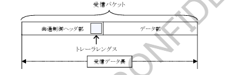

② 電文組立／分割が必要な場合  
◆ 受信データ長 ＝ 共通制御ヘッダ部（６３）＋トレーラレングス長

（a）先頭パケットにトレーリング長を含む場合

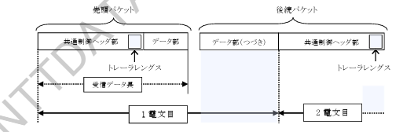

（b）先頭パケットにトレーリング長を含まない場合

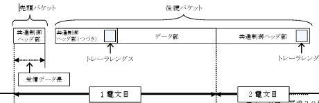

（４）電文組立／分割における後続パケット受信待ちタイマ

１電文が複数パケットに分割された場合において正常な電文受信は、先頭パケットを受信後、受信側で設定した後続パケット受信待ちタイマ内で後続パケットを受信します。その後、共通制御ヘッダ部のトレーリング長をもとに受信した先頭パケットと後続パケットを電文に組立てます。

複数パケットに分割された電文の正常な受信の概要図を図２．４．２－３に示します。なお、後続パケット受信待ちタイマは、受信側で任意に設定可能です。

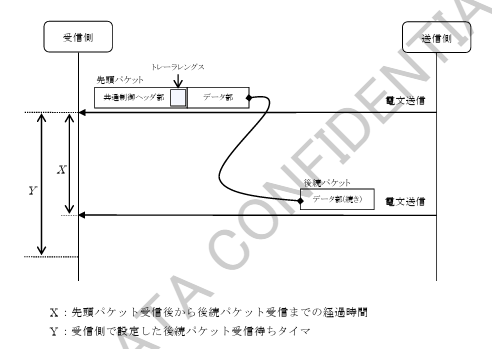

図２．４．２－３　複数パケットに分割された電文の正常受信概要図

ネットワーク障害が発生した場合、現状のＣＡＦＩＳセンタでは通信断を検知してから無通信状態が４８秒以上経過した回線を回線障害と認識します。回線や通信機器が冗長化されている箇所では、回線障害を認識する前に障害箇所の切替処理を行います。

自社センタが電文受信中にネットワーク障害が発生し、切替処理をした場合においても自社センタで該当コネクションを切断し、正常に電文送受信を処理させるには、後続パケット受信待ちタイマとして４８秒以上に設定することを推奨いたします。（本件はＣＡＦＩＳセンタとの接続にあたっての必要要件ではありません）

なお、４８秒未満に設定された場合は、メンテナンスや障害発生時のネットワーク切替完了前に該当コネクションが切断され、回線障害となる可能性がございますことにご注意ください。

（５）ＴＣＰ再送制御

ＴＣＰデータパケットを送信後、応答確認パケット（ＡＣＫ）を受信しない場合（※）、再送制御により、設定した再送タイマ（Ｔｎ：ｎは回数）経過後に同一データパケットが再送されます。  
設定した再送回数（Ｎ回）分再送が行われますが、それでもＡＣＫを受信しないと、送信側はＲＳＴパケットを送信し、コネクションを切断します。  
ＴＣＰデータパケットの再送処理の概要図を図２．４．２－４に示します。

（※）送信したパケットは受信側で正常に受信されるが、ＡＣＫが送信側にて正常に受信できない場合、もしくは送信したパケットが受信側で正常に受信できない場合を指します。

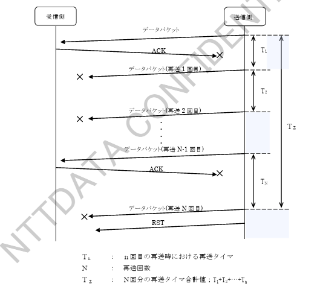

図２．４．２－４　ＴＣＰデータパケットの再送処理概要図

後続パケット受信待ちタイマ同様、再送タイマ合計値（ＴΣ）を４８秒以上になるよう設定することを推奨いたします。（本件はＣＡＦＩＳセンタとの接続にあたっての必要要件ではありません）

（６）Keep Alive 監視

ＣＡＦＩＳセンタから自社センタへの Keep Alive 監視の処理・設定値については、後述する「２．４．３ ネットワーク監視」をご参照ください。

自社センタにおきまして Keep Alive 監視を有効とする場合は、後続パケット受信待ちタイマ同様、Keep Alive による監視がコネクション異常と判断するまでの時間（Keep Alive 応答待ちタイマと Keep Alive 応答待ちカウンタの掛け合わせ値（※））を４８秒以上になるよう設定することを推奨いたします。（本件はＣＡＦＩＳセンタとの接続にあたっての必要要件ではありません。）

（※）表２．４．３－１参照。タイマ②×カウンタ①のことを示す。

（７）ＭＳＳ・ＭＴＵについて（データ長の制限）

ＣＡＦＩＳ－ＴＣＰ／ＩＰでは、暗号化のためのオーバーヘッドを考慮して下記の値を推奨します。  
（本件はＣＡＦＩＳセンタとの接続にあたっての必要要件ではありません。）

推奨ＭＴＵ：１４１４［byte］  
推奨ＭＳＳ：１３７４［byte］

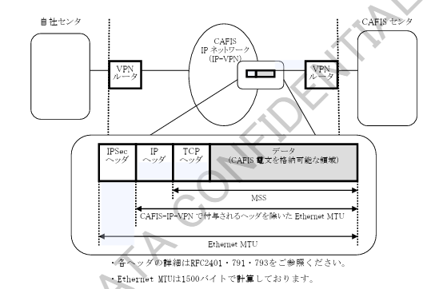

図２．４．２－５　ＩＰパケット概念図

・各ヘッダの詳細はＲＦＣ２４０１・７９１・７９３をご参照ください。  
・Ethernet MTUは１５００バイトで計算しております。

## 2.4.3 ネットワーク監視

（１）各種タイマおよびカウンタ

本手順で使用するＣＡＦＩＳセンタ側でのネットワーク監視タイマおよびカウンタ、処理説明の図番を表２．４．３－１に示します。

表２．４．３－１　ネットワーク監視タイマおよびカウンタ

| 項番 | '名称 | 数値 | 用途 | 図番（図中タイマ名） |
|---|---|---|---|---|
| 1 | 無通信監視タイマ | 40秒 | 自社センタ～ＣＡＦＩＳセンタ間の無通信状態が継続した場合、Keep Alive 送信による接続状態の有効確認の監視タイマ | 図2.4.3-1（タイマ①） |
| 2 | Keep Alive 応答待ちタイマ | 6秒 | ＣＡＦＩＳセンタから自社センタへの Keep Alive が無応答の場合、無通信状態の有効確認 Keep Alive 応答待ちタイマ | 図2.4.3-2（タイマ②） |
| 3 | Connect 要求応答待ちタイマ1 | 80秒 | ＣＡＦＩＳセンタが回線障害を認識した場合、ＣＡＦＩＳセンタから自社センタへの Connect 要求応答待ちタイマ | 図2.4.3-3（タイマ③） |
| 4 | Connect 要求応答待ちタイマ2 | 180秒 | ＣＡＦＩＳセンタが回線障害を認識し、Connect 要求応答待ちタイマ1がタイムアウトした場合、ＣＡＦＩＳセンタから自社センタへの Connect 要求応答待ちタイマ | 図2.4.3-3（タイマ④） |
| 5 | Keep Alive 応答待ちカウンタ | 8回 | ＣＡＦＩＳセンタから自社センタへの Keep Alive が無応答の場合、無通信状態の有効確認 Keep Alive 応答待ちカウンタ | 図2.4.3-2（カウンタ①） |
| 6 | Connect 要求送信カウンタ | 4回 | ＣＡＦＩＳセンタが回線障害を認識した場合、ＣＡＦＩＳセンタから自社センタへの Connect 要求送信カウンタ | 図2.4.3-3（カウンタ②） |

（注）表２．４．３－１に記述した数値は、現状のＣＡＦＩＳセンタにおける設定値であり、今後変更することがあります。

（２）各種監視手順

本手順でのネットワーク監視手順を以下に示します。

① Keep Alive 応答正常受信時の処理

自社センタ～ＣＡＦＩＳセンタ間における Keep Alive 応答正常受信時の処理を図２．４．３－１に示します。

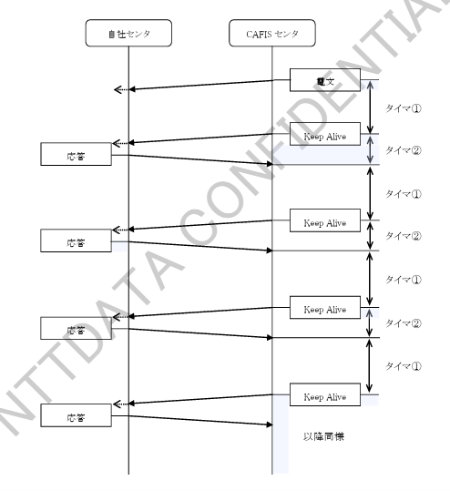

図２．４．３－１　Keep Alive 応答正常受信時の処理

② Keep Alive 応答受信タイムオーバ時の処理

自社センタ～ＣＡＦＩＳセンタ間における Keep Alive 応答受信タイムオーバ時の処理を図２．４．３－２に示します。

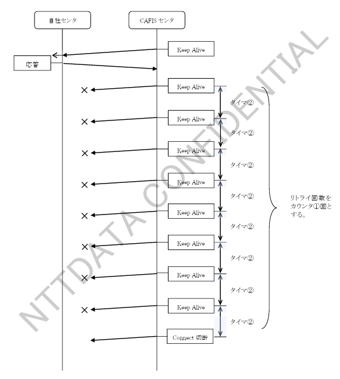

図２．４．３－２　Keep Alive 応答受信タイムオーバ時の処理

③ Connect 応答受信タイムオーバ時の処理

自社センタ～ＣＡＦＩＳセンタ間における Connect 応答受信タイムオーバ時の処理を図２．４．３－３に示します。

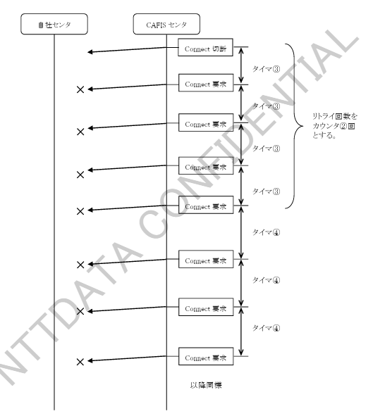

図２．４．３－３　Connect 要求応答受信タイムオーバ時の処理
