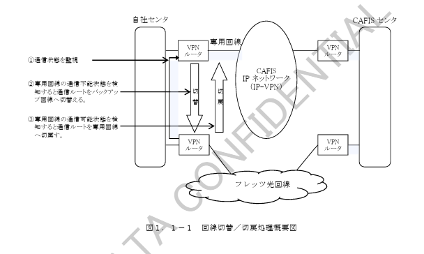

# ＜付録＞ バックアップ回線機能概要

オプション機能であるバックアップ回線における処理内容について以下に示します。

# 第１章 概要

バックアップ回線を設定している自社センタにおいて専用回線に障害が発生した場合、専用回線からバックアップ回線へ自動的に切替り、フレッツ光回線を経由したルートでＣＡＦＩＳセンタと通信を確立します。また、障害が復旧した場合には、バックアップ回線から専用回線へ自動的に切戻ります。

専用回線からバックアップ回線への回線切替／切戻処理概要を図１．１－１に示します。

図１．１－１　回線切替／切戻処理概要図

自社センタ側のバックアップ回線接続ＶＰＮルータが専用回線接続ＶＰＮルータの通信状態を監視しており、専用回線の障害発生により通信不能状態を検知するとフレッツ光回線を経由した通信ルートへ回線切替を行います。また、専用回線の通信可能状態を検知すると専用回線を経由した通信ルートへ回線切戻処理を行います。

回線切替／切戻処理は、専用回線の通信可否状態で自動的に行われます。また処理により送信出来なかったパケットは、処理動作後に再送されます。
