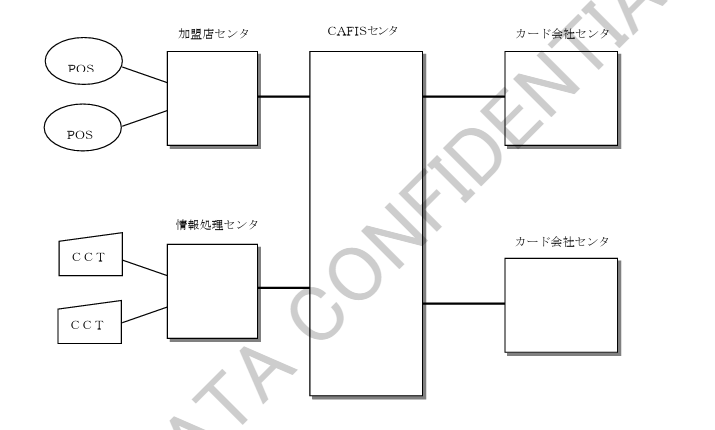

# 1. 概要

## 1.1 概要

加盟店ショッピング業務は加盟店で取り扱われたクレジットカードでの各種データを、加盟店センタまたは情報処理センタ経由で受付け、各カード会社センタへ中継するサービスです。

また、カード会社センタから加盟店センタへ取引を中継する場合もあります。

本業務における接続形態を図 1.1-1 に示します。

---

### 図 1.1-1 接続形態

【図】

