# 3. 接続条件

本章は、加盟店ショッピング業務における接続条件について述べたものです。

## 3.1 電文形態

### 3.1.1 電文種別

加盟店ショッピング業務で使用する一般電文および障害電文の電文種別を表 3.1-1 に示します。

---

### 表 3.1-1 電文種別一覧表

| 項番 | 電文区分 | 業務区分 | 電文種別 | 電文名 | 備考 |
|------|----------|----------|----------|--------|------|
| 1 | 一般電文 | 与信 | 3110 | 与信要求 | |
| 2 |  |  | 3120 | 与信許可報告 | |
| 3 |  |  | 3150 | 与信拒否報告 | |
| 4 |  | 売上 | 3210 | 売上要求 | |
| 5 |  |  | 3220 | 売上許可報告 | |
| 6 |  |  | 3250 | 売上拒否報告 | |
| 7 |  | 取消 | 3310 | 取消要求 | |
| 8 |  |  | 3320 | 取消許可報告 | |
| 9 |  |  | 3350 | 取消拒否報告 | |
| 10 |  | 照会 | 3410 | 照会要求 | |
| 11 |  |  | 3420 | 照会許可報告 | |
| 12 |  |  | 3450 | 照会拒否報告 | |
| 13 |  | その他 | 3510 | その他要求 | 取引カウンタ精査オンラインテスト アドバイス |
| 14 |  |  | 3520 | その他許可報告 | |
| 15 |  |  | 3550 | その他拒否報告 | |
| 16 |  | 事故カード中継 | 6110 | 事故カード中継要求 | |
| 17 |  |  | 6120 | 事故カード中継許可報告 | |
| 18 |  |  | 6150 | 事故カード中継拒否報告 | |
| 19 | 障害電文 | 一般要求に対する障害処理 | 8910 | 取消指令 | |
| 20 |  |  | 8920 | 取消再指令 | |
| 21 |  |  | 8930 | 取消確認指令 | |
| 22 |  |  | 8940 | 取消確認再指令 | |
| 23 |  |  | 8950 | 取消報告 | |
| 24 |  |  | 8960 | 取消確認報告 | |

### 3.1.2 電文処理形態

仕向センタ、CAFISセンタ、被仕向センタ間でやりとりされる電文の処理形態一覧表を表 3.1-2 ～ 表 3.1-6 に示します。

**表 3.1-2 一般電文処理形態１（一般要求）**

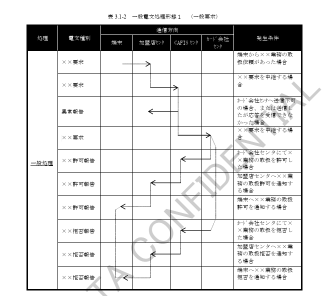

**表 3.1-3 障害電文処理形態２（取消指令）**

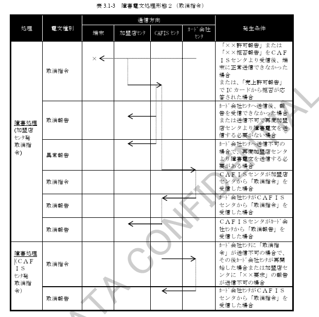

**表 3.1-4 障害電文処理形態３（取消確認指令）**

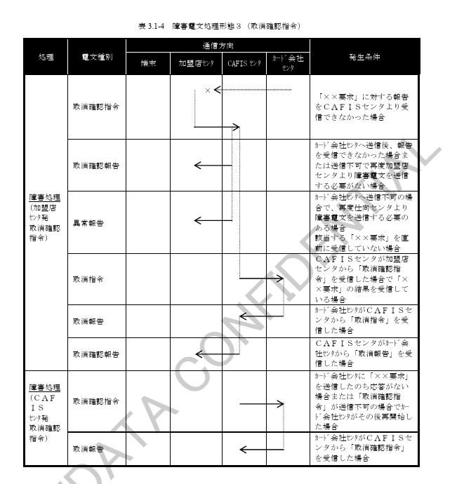

**表 3.1-5 障害電文処理形態４（取消再指令）**

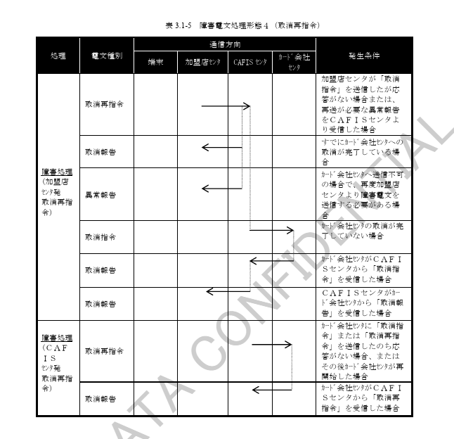

**表 3.1-6 障害電文処理形態５（取消確認再指令）**

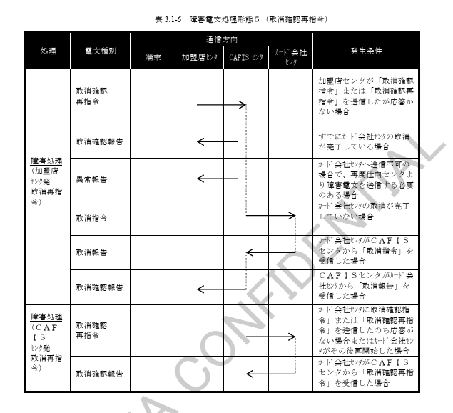

### 3.1.3 電文構成

仕向センタ、CAFISセンタ、被仕向センタ間でやりとりされる電文構成を表 3.1-7 ～ 表 3.1-16 に示します。

電文構成欄の①～⑥はデータの順番を示します。

---

#### 業務一覧

| 項番 | 業務名 | 表番号 | 備考（注） |
|------|--------|--------|------------|
| 1 | 与信業務 | 表 3.1-7 | |
| 2 | 売上業務 | 表 3.1-8 | MS売上 |
| 3 | 売上業務 | 表 3.1-9 | IC売上結果通知 |
| 4 | 売上業務 | 表 3.1-10 | ICオンラインオーソリ |
| 5 | 取消業務 | 表 3.1-11 | |
| 6 | 照会業務 | 表 3.1-12 | |
| 7 | その他業務（アドバイス） | 表 3.1-13 | |
| 8 | その他業務（取引カウンタ精査） | 表 3.1-14 | |
| 9 | その他業務 | 表 3.1-15 | |
| 10 | 事故カード中継業務 | 表 3.1-16 | |

---

（注）売上業務（電文種別＝3210）における判定条件について以下に示します。

#### 売上業務判定条件

| 電文送信区分 | カード区分 | PAN入力モード | IC関連データ格納データインデックス | 判定結果 |
|--------------|------------|----------------|-------------------------------------|-----------|
| 1（メモリ送信） | 1～4 | ― | ― | MS売上 |
|  | 5、6 | 05、07 | ＝0 | MS売上 |
|  | 5、6 | 05、07 | ＞0 | エラー |
| 2（オンライン送信） | 1～4 | ― | ― | MS売上 |
|  | 5、6 | 05、07 | ＝0 | MS売上 |
|  | 5、6 | 05、07 | ＞0 | ICオンラインオーソリ |
| 4（IC売上結果送信） | ― | ― | ― | IC売上結果通知 |

**表 3.1-7 電文構成表（与信業務）**

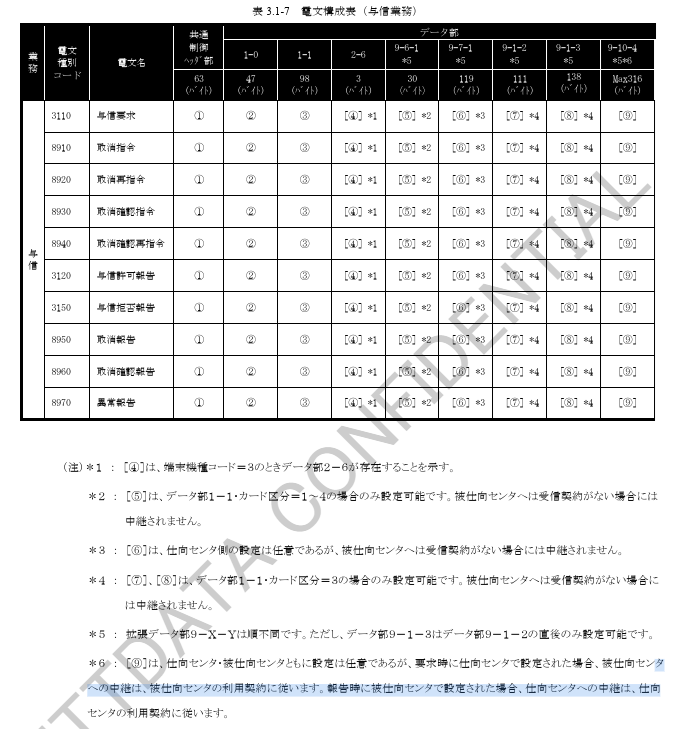

**表 3.1-8 電文構成表（売上業務ーMS売上処理時）**

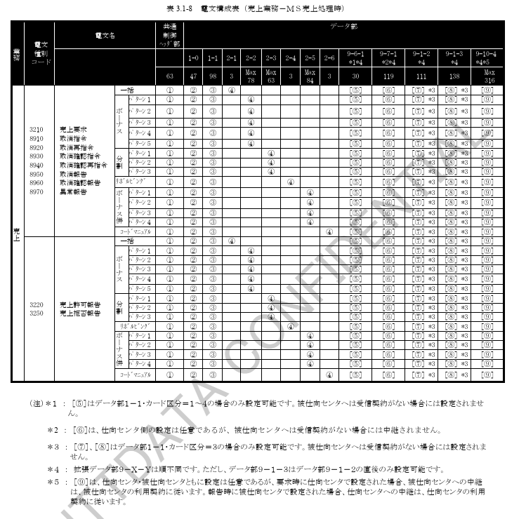

**表 3.1-9 電文構成表（売上業務ーIC売上結果通知処理時）**

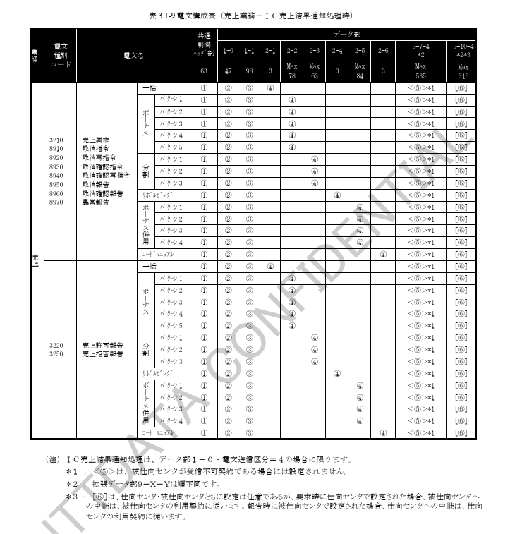

**表 3.1-10 電文構成表（売上業務ーICオンラインオーソリ処理時）**

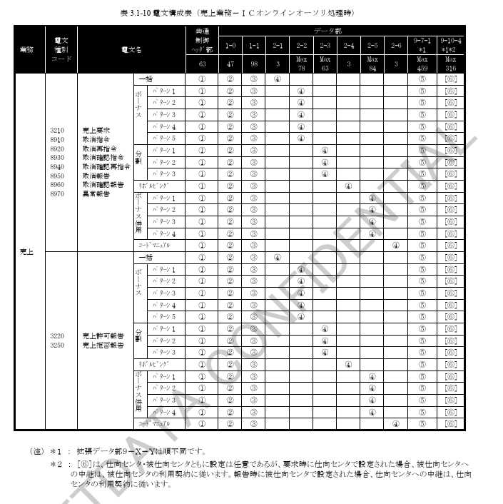

**表 3.1-11 電文構成表（取消業務）**

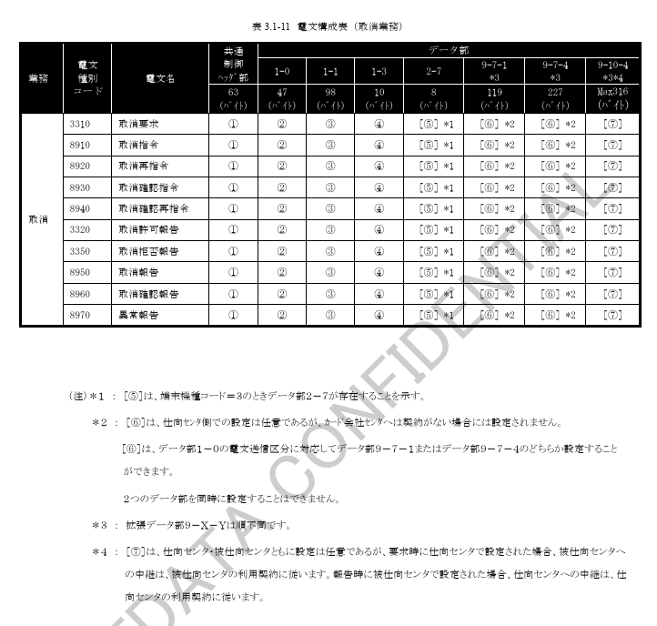

**表 3.1-12 電文構成表（照会業務）**

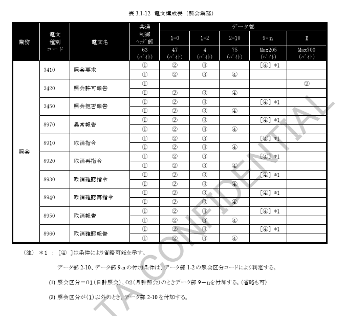

**表 3.1-13 電文構成表（その他業務：アドバイス）**

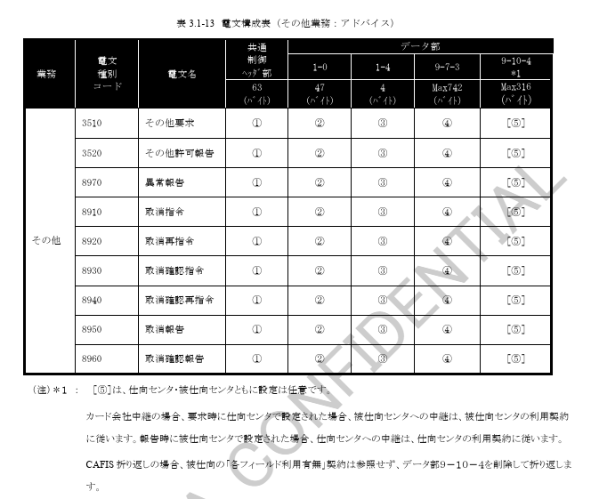

**表 3.1-14 電文構成表（その他業務：取引カウンタ精査）**

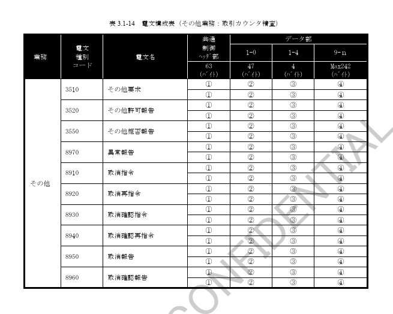

**表 3.1-15 電文構成表（その他業務）**

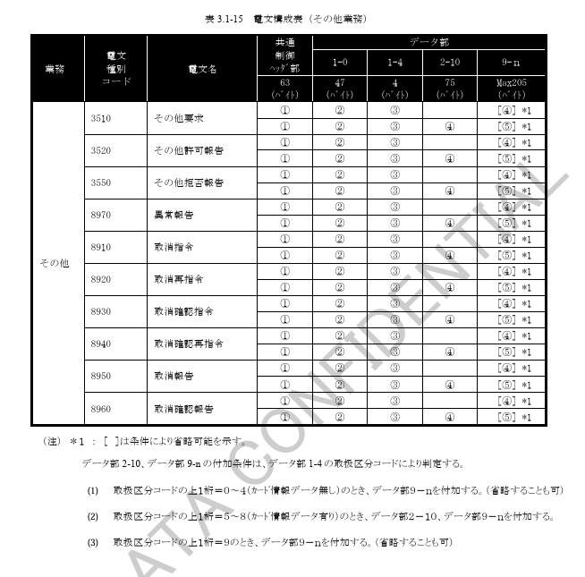

**表 3.1-16 電文構成表（事故カード中継業務）**

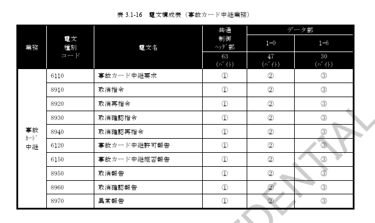

### 3.1.4 電文様式

加盟店センタ、CAFISセンタ、カード会社センタ間でやりとりされる電文の電文様式を以下に示します。

#### (1) 基本電文様式

| 項番 | 区分 | フォーマット |
|------|------|--------------|
| 1 | 要求、指令、および報告電文 | 共通制御ヘッダ部：63バイト ／ データ部：（可変長） |

