## 3.2　電文内容の推移

仕向センタ、CAFISセンタ、被仕向センタ間でやりとりされる電文の電文推移一覧を表3.2-1に示します。また、電文内容の推移について表3.2-2～表3.2-14に示します。

なお、表3.2-2～表3.2-14の表中の＊は受信した内容を変更しない項目（以下、保留項目と記します）です。

### 表3.2-1 電文推移一覧表

| 番号 | 区分 | 電文内容 | 表示 | 対象業務 |
|---|---|---|---|---|
| 1 | 一般電文 | 一般要求電文処理1（与信・売上・取消・照会・事故カード中継） | 表3.2-2 | MS売上処理など |
| 2 | 一般電文 | 一般要求電文処理2（IC売上） | 表3.2-3 | IC売上標準処理 |
| 3 | 一般電文 | 一般要求電文処理3（ICオンラインオーソリ売上） | 表3.2-4 | ICオンラインオーソリ処理 |
| 4 | 一般電文 | 一般要求電文処理4（その他要求：アドバイス・CAFIS折返し） | 表3.2-5 |  |
| 5 | 一般電文 | 一般要求電文処理5（その他要求：アドバイス・カード会社中継） | 表3.2-6 |  |
| 6 | 一般電文 | 一般要求電文処理6（その他要求：ギフト残高照会） | 表3.2-7 |  |
| 7 | 一般電文 | 一般要求電文処理7（その他要求：ギフト残高・代金処理） | 表3.2-8 |  |
| 8 | 障害電文 | 取消（再）処理 | 表3.2-9 | 仕向センタ発 |
| 9 | 障害電文 | 取消（再）処理 | 表3.2-10 | CAFIS発 |
| 10 | 障害電文 | 取消（再）処理 | 表3.2-11 |  |
| 11 | 障害電文 | 取消（再）処理 | 表3.2-12 |  |
| 12 | 最終報告 | 一般電文 | 表3.2-13 |  |
| 13 | 最終報告 | 障害電文 | 表3.2-14 | CAFISでコード付与ケース |

### 表 3.2-2　一般要求電文処理の電文推移１（与信・MS売上・取消・照会・事故カード中継）1/2

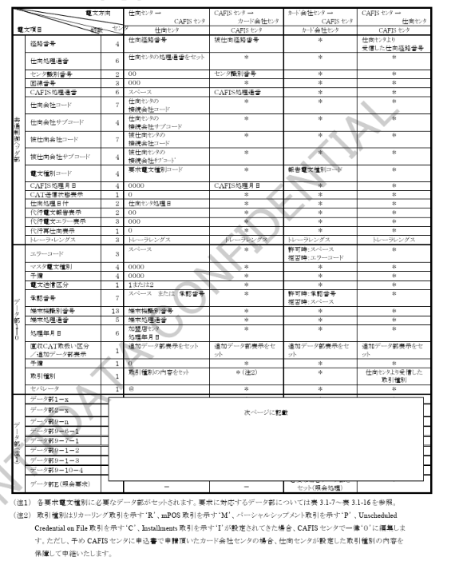

### 表 3.2-2　一般要求電文処理の電文推移１（与信・MS売上・取消・照会・事故カード中継）2/2

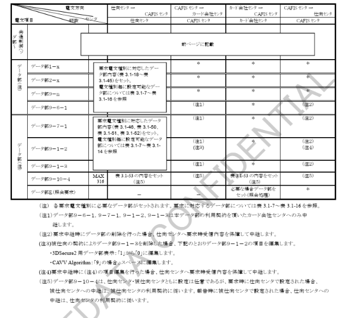

### 表 3.2-3　一般要求電文処理の電文推移２（IC売上結果通知）

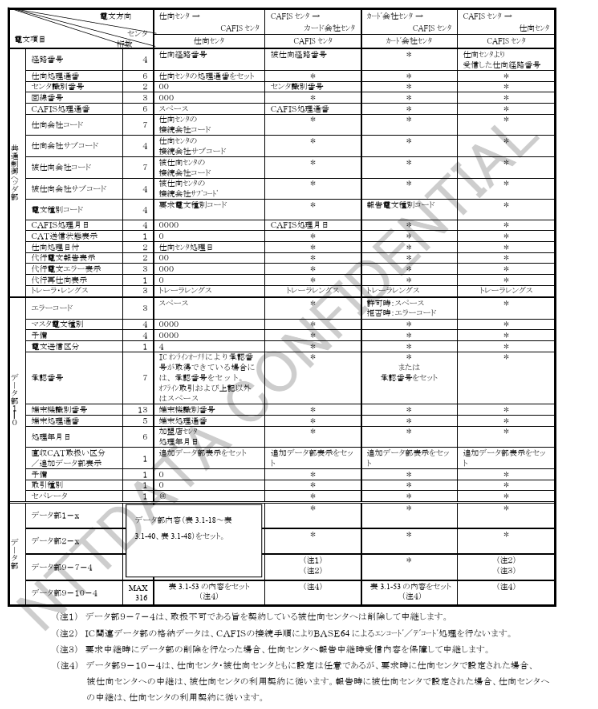

### 表 3.2-4　一般要求電文処理の電文推移３（ICオンラインオーソリ）

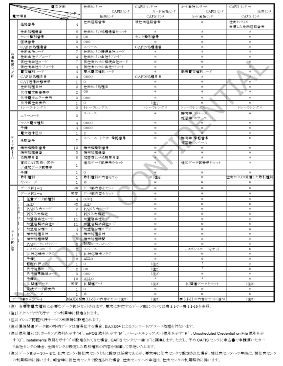

#### ICオンラインオーソリ処理における注意点

【ICオンラインオーソリ処理において自社発行以外のICカードに対してIC固有業務を実施するカード会社センタまたはIC処理代行事業者での注意点】

ICオンラインオーソリ処理に対してIC固有業務のみを実施し、利用されたカードに対するオーソリセンタを行わないセンタは、オーソリセンタを行うために再度当該取引をカード会社センタへ再送向けに行う場合があります。

CAFIS経由で再送向けに行う場合には、既にIC固有業務が実施されている取引ということでデータ部9-7-1を以下のように編集することが必要となります。（下記の2種類から選択可能）

#### （1）データ部9-7-1のIC関連データ（格納データ）の削除

・IC関連データの格納データを削除します。  
（格納データレングス＝0000、格納データ削除）

#### （2）データ部9-7-1の削除

・データ部9-7-1自体を削除

それぞれの場合のIC固有業務実施後の再送向けを行う場合の電文推移については表3.2.4（付録1、2）に示します。

---

※IC固有業務：  
TVRチェック、CVRチェック、ARQC検証、データ認証結果検証等

### 表 3.2-4（付録1） IC固有業務実施センタの再中継処理における電文推移

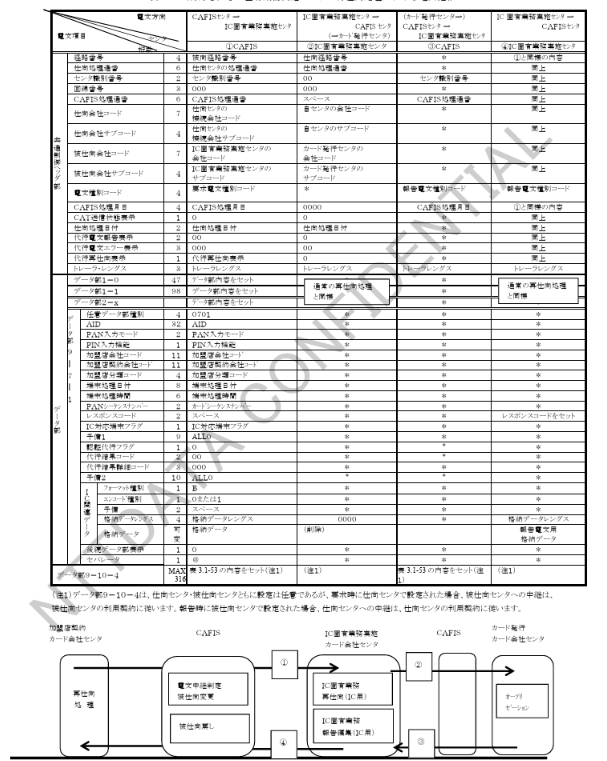

### 表 3.2-4（付録2） IC固有業務実施センタの再中継処理における電文推移

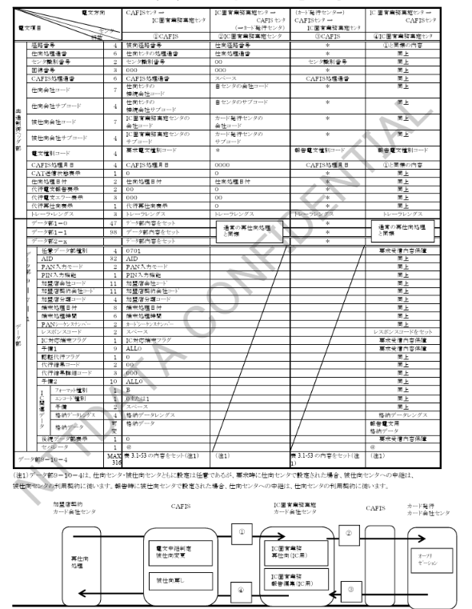

### 表 3.2-5　一般要求電文処理の電文推移 4（アドバイス・CAFIS 折返し）

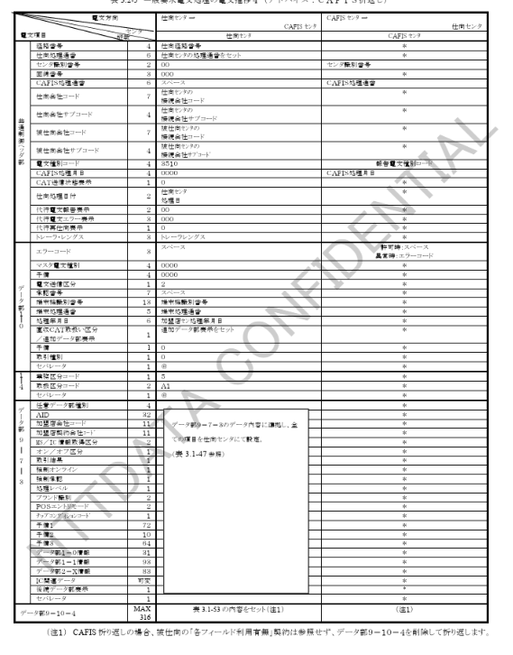

### 表 3.2-6　一般要求電文処理の電文推移 5（アドバイス・カード会社中継）

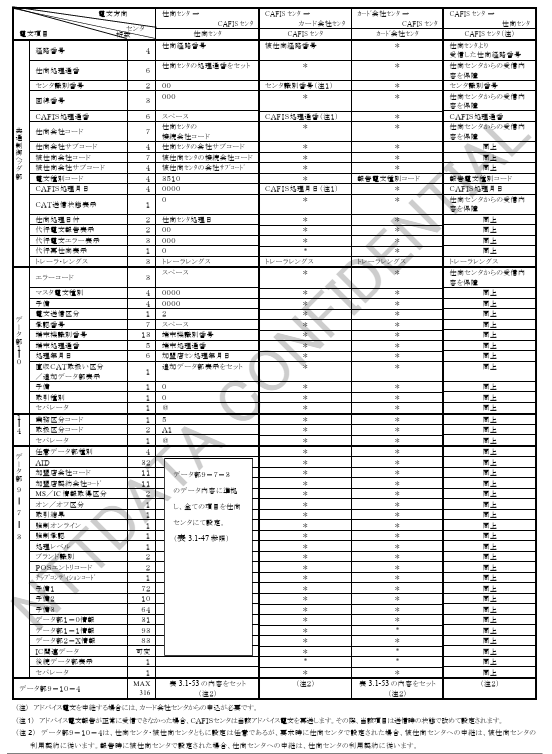

### 表 3.2-7　一般要求電文処理の電文推移 6（サービス終了予告）

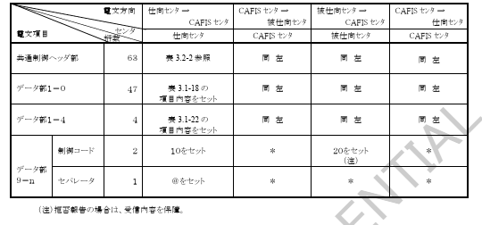

---

### 表 3.2-8　一般要求電文処理の電文推移 7（サービス終了 サービスカウンタ照会）

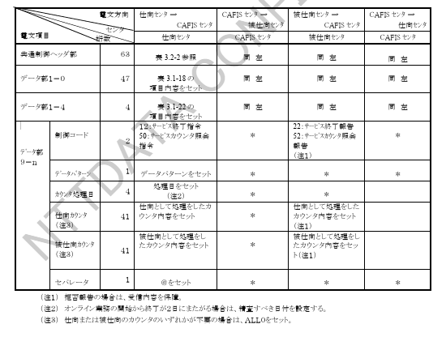

### 表 3.2-9　取消（累）処理の電文推移（仕向センタ発）

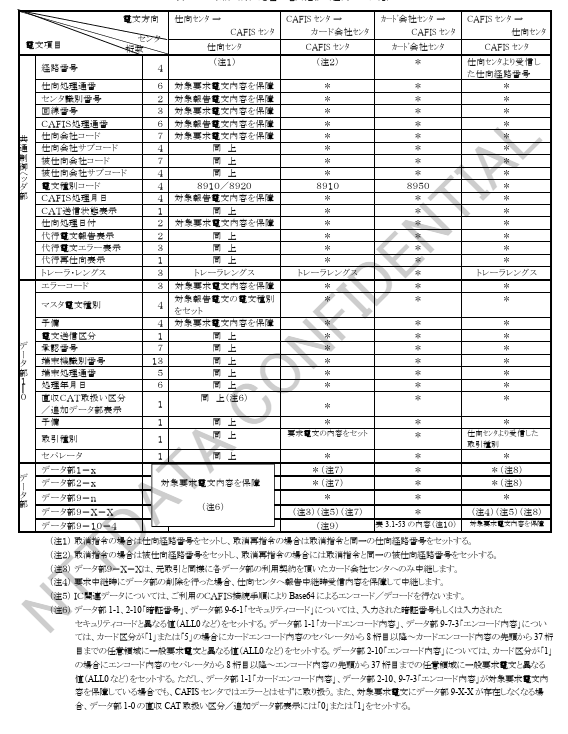

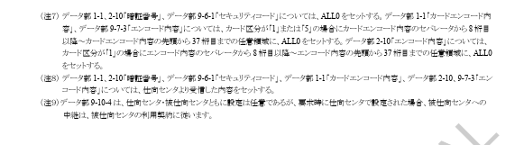

### 表 3.2-10　取消確認（累）処理の電文推移（仕向センタ発）

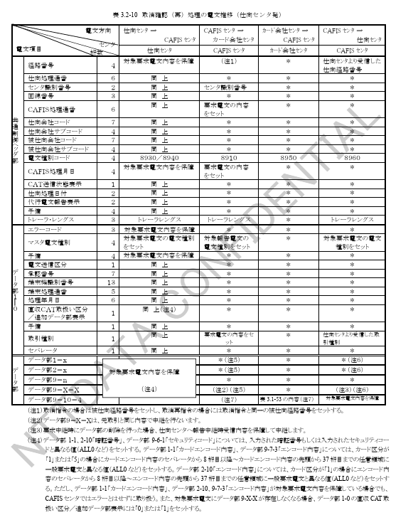

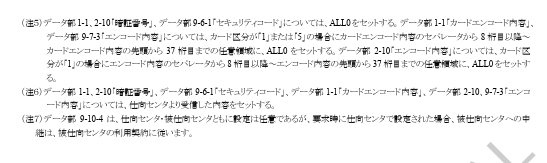

### 表 3.2-11　取消（累）処理の電文推移（CAFISセンタ発）

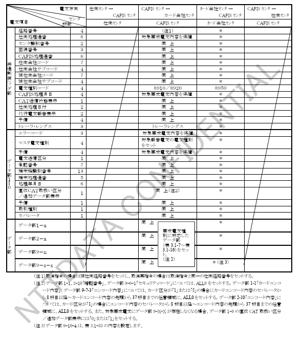

### 表 3.2-12　取消確認（累）処理の電文推移（CAFISセンタ発）

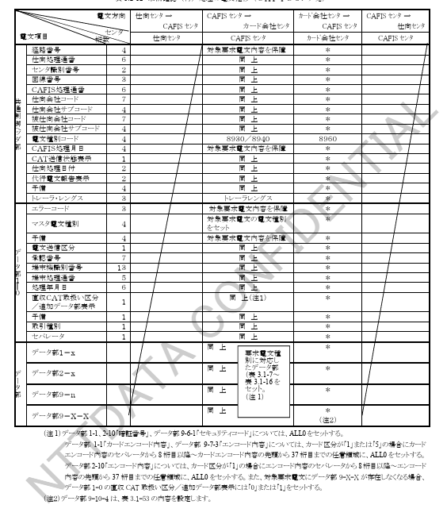

### 表 3.2-13　一般要求電文処理の電文推移（最終報告）

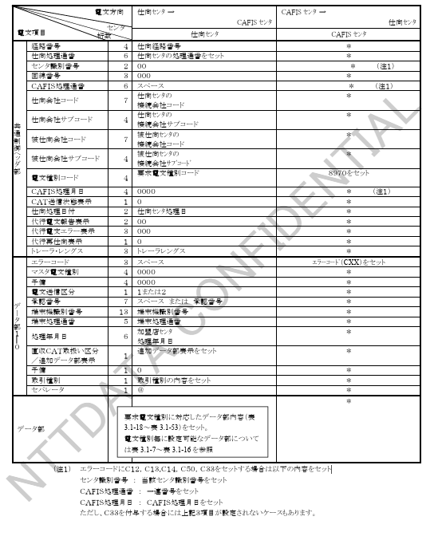

### 表 3.2-14　障害電文処理の電文推移（最終報告）

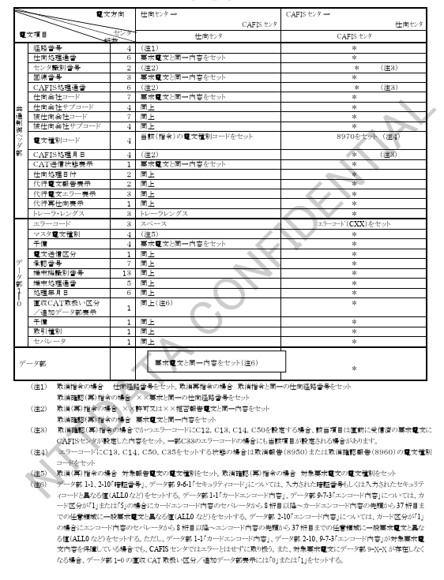

