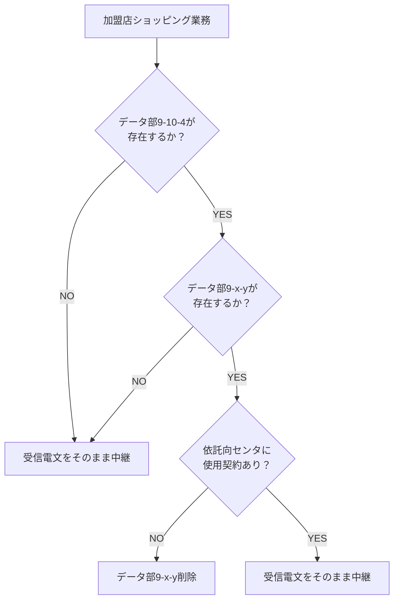
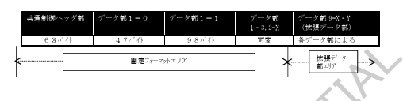
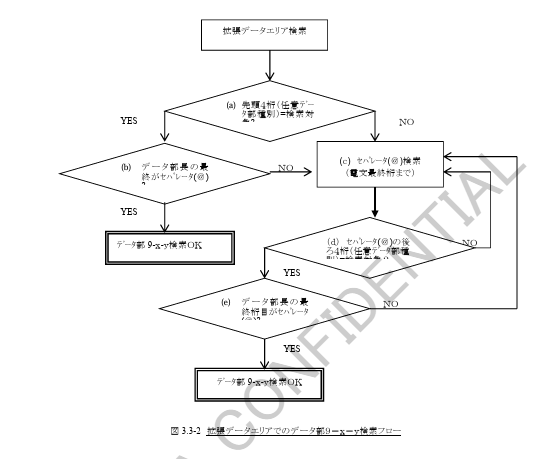

# 3.3 処理機能

## 3.3.1 監視タイマの設定

本業務における、CAFISの被仕向センタ監視タイマを表3.3‑1に、仕向センタのCAFIS監視タイマを表3.3‑2に示します。

### 表3.3‑1 CAFISの被仕向センタ監視タイマ

| 番号 | 名称                     | タイマ値 | 用途 |
|------|--------------------------|----------|------|
| t13  | 報告電文待ちタイマ       | 55秒     | CAFISが××要求を送信してから被仕向センタから報告電文を受信するまでの時間監視 |
| t15  | 取消報告、取消確認報告待ちタイマ | 55秒 | 取消（再）指令又は取消確認（再）指令に対する報告電文を受信するまでの時間監視 |

### 表3.3‑2 仕向センタのCAFIS監視タイマ

| 番号 | 名称                 | タイマ値 | 用途 |
|------|----------------------|----------|------|
| t31  | 一般報告電文待ちタイマ | 58秒     | 仕向センタが電文を送信してからCAFISより各種報告電文を受信するまでの時間監視 |
| t32  | 障害電文報告待ちタイマ | 58秒     | 障害電文（取消（再）指令、取消確認（再）指令）を仕向センタが送信してからCAFISより報告電文を受信するまでの時間監視 |

## 3.3.3 CAFISカウンタ

### (1) CAFISが保有するカウンタ

加盟店ショッピング業務に関して、CAFISが保有するカウンタを表3.3‑3に示します。

### 表3.3‑3 CAFISが保有するカウンタ

| 項番 | カウンタ名     | 概要 |
|------|----------------|------|
| 1 | 一般業務カウンタ | 加盟店ショッピング業務において取り扱った電文種別毎の通数をカウントするカウンタです。 一般カウンタにおけるカウンタの管理、更新等詳細については「CAFIS接続条件設計書（接続共通編）」を参照してください。 |

## 3.3.4 取引カウンタ精査

オンライン業務取引において、提携会社間で仕向取引分、被仕向取引分のカウンタを用意し、許可報告で完了した取引の通数および金額をカウントし、オンライン業務終了時または任意のタイミングで提携会社間でカウンタの精査を行うことができます。

### (1) 精査項目

以下の電文種別を用いる取引に対し、許可報告で完了した取引の通数および金額（与信・売上・取消は税を含む）を精査します。

1.  与信\
2.  売上\
3.  取消\
4.  照会\
5.  その他\
6.  事故カード\
7.  CDキャッシング（本業務では使用しない）\
8.  CDキャッシング照会（本業務では使用しない）\
9.  ICオンラインオーソリ売上

①～⑧までのカウンタの場合には、データパターンコード＝0（表3.1-42）を、⑨～⑧までのカウンタの場合にはデータパターンコード＝B（表3.1-43）を使用します。

どのカウンタパターンを利用になるかは、接続会社側で決定してください。

＜参考　データパターンコード“0”と“B”の使用例＞

データパターンコード＝0
・ICクレジットを利用していない接続会社側でのカウンタ精査の場合
・CAFISで処理を行ったオンライン電文の精査をする場合
（ICオンラインオーソリ売上が売上の件数・金額に計上されるため、実際の売上データの件数・金額とは一致しない場合がある）

データパターンコード＝B
・ICクレジットを利用しており、売上件数／金額にICオンラインオーソリ売上を含まずにカウンタ精査を行う場合

## (2) 機能仕様

### A. 電文処理形態

表3.3-4に電文処理形態を示します。

#### 表 3.3-4 電文処理形態

| 電文種別コード | 電文名 | カウンタ精査用電文名 | 通信方向（主局／従局） | カウンタ精査の有無 | 備考 |
|---|---|---|---|---|---|
| 3510 | その他要求 | サービス終了予告指令 | 主局 → 従局 | 無 | |
| 3520 | その他許可報告 | サービス終了準備完了報告 | 従局 → 主局 | 無 | |
| 3510 | その他要求 | サービス終了指令 | 主局 → 従局 | 有 | |
| 3520 | その他許可報告 | サービス終了報告 | 従局 → 主局 | 有 | |
| 3550 | その他拒否報告 | ― | ― | ― | |
| 3510 | その他要求 | サービスカウンタ照会指令 | 主局 → 従局 | 有 | 随時 |
| 3520 | その他許可報告 | サービスカウンタ照会報告 | 従局 → 主局 | 有 | |
| 3550 | その他拒否報告 | ― | ― | ― | |

---

（注）電文の起動

(a) サービス終了予告及びサービス終了指令の起動  
1. 提携会社双方で取り決められた終了「時刻」の到来により、主局よりサービス終了予告及びサービス終了指令を送信する。  
2. 提携会社間で主局、従局を決定する。  

(b) サービスカウンタ照会指令の起動  
1. 照会は提携会社双方のサービス時間内であれば随時可能とする。  
2. オンラインサービスが24時間運転でサービス終了手順を行わない場合には、0時以降に前日分のカウンタを照会することにより精査を行なう。  
3. 電文の起動は各仕向会社とする。  

## B. 電文構成

表 3.3-5 に電文形式の概要を示します。

### 表 3.3-5 電文形式の概要（取引カウンタ精査）

| カウンタ精査用電文名 | 電文形式の概要 | 備考 |
|---|---|---|
| ①サービス終了予告指令 ②サービス終了準備完了報告 | 共通制御ヘッダ部：63バイト データ部1-0：47 データ部1-4：4 データ部9-n：3 | データの構成については表3.1-18、表3.1-22、表3.1-41～表3.1-44を参照 |
| ①サービス終了指令 ②サービス終了報告 ③サービスカウンタ照会指令 ④サービスカウンタ照会報告 | 共通制御ヘッダ部：63バイト データ部1-0：47 データ部1-4：4 データ部9-n：Max302 | 同上 |

## C. 貴社センタで保有するカウンタ

貴社センタでは、2日分（当日、前日）のカウンタを保有します。

## D. 貴社センタで保有するカウンタの更新

### (a) カウンタ更新日の決定

共通制御ヘッダ部のCAFIS処理年月日により、前日分、当日分のいずれかのカウンタを更新するかを決定します。

### (b) 更新契機

| 加盟店センタカウンタ | 被加盟店センタカウンタ |
|---|---|
| XX許可報告を受信した場合 | XX許可報告を正常に受信した場合 |
| XX完了報告を受信した場合 | XX完了報告を正常に受信した場合 |
| XX照会報告を受信した場合 | XX照会報告を正常に受信した場合 |

### (c) カウンタクリア

① カウンタのクリアは、加盟店センタ側オンライン取引終了後、翌日の業務開始前に行います。  
② カウンタクリアの方法は当日分のカウンタを前日分にシフトし、当日分のカウンタをゼロクリアします。

## 3.3.5　拡張データ部の取扱

### (1) 概要

加盟店ショッピング業務では、依託センタとして事前に当該データ部を受信する／しないの契約をすることによりCAFISで中継時に当該データ部の取扱を制御します。

この制御により、依託センター内中継時にデータ部の制御が行なわれた場合には、無償電文を仕向センターへ応答する際に、削除したデータ部を要求電文を受信した状態と同じエリアに戻して送信します。

拡張データ部として取り扱うデータ部は複数ありますが、それぞれのデータ部について取扱の契約を保有することになります。

表3.3-6に拡張データ部の一覧を示します。

| 項番 | データ部名称     | データ部概要                                                                                                  | 備考                    |
| -- | ---------- | ------------------------------------------------------------------------------------------------------- | --------------------- |
| 1  | データ部9-6-1  | 認証ストライプデータを用いて加盟店ミドルセンターが必要な処理を行なう場合に、親センターのデータ部に付加して送信する。認証ストライプデータは、認証要求電文を起票することにより、カード情報等の関連データを含む。 | 与信、MS売上               |
| 2  | データ部9-7-1  | IC処理を行なうために必要な項目を設定するデータ部。IC処理を行なう場合には、加盟店ミドルセンターで設定した当該データ部の設定を可能とする。                                  | 与信、MS売上、取消（注）         |
| 3  | データ部9-7-4  | IC処理に必要な項目を設定するデータ部。                                                                                    | IC売上、取消               |
| 4  | データ部9-9-1  | 「3-D Secure」のスキームを利用した場合に必要な項目を設定したデータ部。                                                                | 与信、MS売上               |
| 5  | データ部9-9-3  | 「3-D Secure」のスキームを利用した場合に必要な項目を設定したデータ部。                                                                | 与信、MS売上               |
| 6  | データ部9-10-4 | ブランド特有の情報を設定するデータ部。                                                                                     | 与信、MS売上、IC売上、取消、アドバイス |

### (2) 拡張データ部に対する電文編集条件

拡張データ部「データ部9-x-y」に対するCAFISでの取扱条件を以下に示します。\
また、処理の流れについて、図3.3-1に示します。

① 拡張データ部（データ部9-x-y）の中継条件

a)  仕向センタから加盟店ショッピング業務の拡張データ部対象業務を受信した。\
b)  CAFISが受信したデータに拡張データ部（データ部9-x-y）が存在している。\
    （検索方法については後述の(3)を参照）\
c)  依託向けとなるカード会社センタが、検索したデータ部に対する使用契約を保有している。

上記3条件を満たした場合に、拡張データ部を依託向センタへ中継します。

② 拡張データ部（データ部9-x-y）の削除条件

a)  仕向センタから加盟店ショッピング業務の拡張データ部対象業務を受信した。\
b)  CAFISが受信したデータに拡張データ部（データ部9-x-y）が存在している。\
    （検索方法については後述の(3)を参照）\
c)  依託向けとなるカード会社センタが、検索したデータ部に対する使用契約を保有していない。

上記3条件を満たした場合に、拡張データ部を削除して依託向センタへ中継します。

------------------------------------------------------------------------

### 図3.3-1　処理フロー

## (3) 拡張データ部の検索方法

CAFISセンタでの拡張データ部（データ部9-x-y）の検索は、本接続条件設計書「3.1.3
電文構成」に準拠して行ないます。

① 固定フォーマット検索

固定フォーマットは共通制御ヘッダ部からデータ部2-Xまでとします。\
本書「3.1.3
電文構成」に従い、拡張電文領域に対応したデータ部の判定を行ないます。可変長となるデータ部2-Xについては、セパレータ(④)を検索することにより、データ部2-Xの終端位置を特定します。

② 拡張データ部検索

固定フォーマットエリアの後ろから拡張データ部エリア（データ部9-x-y）の検索を行ないます。\
拡張データ部エリアは以下の流れによりデータ部9-x-yを検索します。\
流れについての説明を(a)〜(e)に、フロー図を図3.3-2に示します。

(a) 拡張データ部エリアの先頭4桁（任意データ識別）を検索し、データ部9-x-yの識別であるかどうかを判定する。（例：データ部9-6-1の場合は「0601」）

(b) 識別が検索対象の値である場合には、データ部9-x-yのデータ長のところにセパレータ(④)が設定されているかどうかを確認する。\
    　・④の場合 → データ部9-x-yが存在したと判断\
    　・④以外の場合 →
    検索対象のデータ部9-x-yではないと判断し、(c)のセパレータ検索を行なう。

(c) 識別が検索対象の値でなかった場合には、検索中のエリアは検索対象のデータ部9-x-yではないと判断し、データ部の終端（④）を検索する。

(d) (c)のセパレータ検索後で、セパレータ後ろ4桁を任意データ識別とし、検索対象のデータ部9-x-yの識別であるかどうかを判定する。

上記(a)〜(d)を検索対象が見つかるか、データの終端となるまで繰り返します。

## (4) 拡張データ部削除時の電文編集

「(2)
拡張データ部に対する電文編集条件」により、CAFISセンタにてデータ部9-x-yの削除が必要となった場合に、CAFISで電文の編集を行なう内容について以下に示します。

### (1) 要求電文（一般要求・取消（再）指令・取消確認（再）指令）

① 「共通制御ヘッダ部 トレーシング」の編集

データ部9-x-yを削除することにより、共通制御ヘッダ部のトレーシングの値を変更します。

② 「データ部1-0 追加データ表示」の編集

データ部9-x-yを削除することにより、拡張データ部が存在しない場合以下のように編集します。

追加データ表示＝2の場合 → 0\
追加データ表示＝3の場合 → 1

③ 「データ部9-x-y」の削除

(3)の検索により、データ部9-x-yと判定されたエリアを削除します。\
データ部9-x-yと後続データが存在する場合には、後続データ部は残します。

### (2) 報告電文（一般報告・取消確認・取消確認報告）

カード会社センタへ要求電文を中継時に電文編集を行なった場合には、仕向センタへ報告電文を中継時、元の状態に戻します。

元の状態とは、要求電文受信時に削除対象のデータ部が存在していた箇所（データの最初からの桁数により判定）に削除したデータ部を設定します。

また、挿入箇所の後ろにデータ部が存在していた場合には、当該データ部を挿入した後、後続のデータ部はそのまま後ろへずれます。
