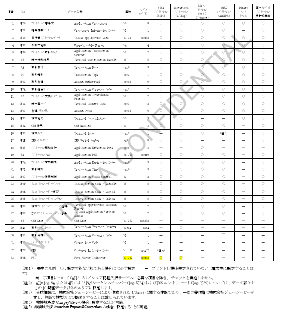
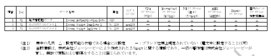
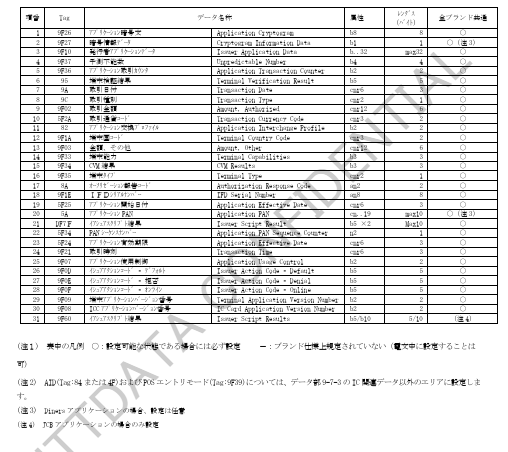
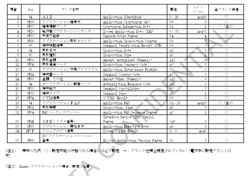

## ＜付録＞　ＩＣ関連データ設定内容（参考値）

加盟店ショッピング業務で使用するＩＣ関連データの設定内容について以下に示します。

※ 本資料は、各ブランド毎に規定されているアプリケーション仕様を参考に作成しているため、内容が変更になる場合があります。

CAFISでは、ＩＣ関連データについては設定項目および内容の妥当性についてはチェックを行いません。（イシュア側端末において必要な項目については個別にチェックを行います。）

### 1. データ部9-7-1　IC関連データ（ICオンラインオーソリ売上）

#### 1.1 要求電文
【表：データ部9-7-1 要求電文設定内容】

#### 1.2 報告電文
【表：データ部9-7-1 報告電文設定内容】

---

### 2. データ部9-7-3　IC関連データ（アドバイス要求）

#### 2.1 要求電文
【表：データ部9-7-3 要求電文設定内容】

---

### 3. データ部9-7-4　IC関連データ（IC売上結果通知）

#### 3.1 要求電文
【表：データ部9-7-4 要求電文設定内容】

## ＜付録2＞　ブランド情報取り扱い項目一覧

ブランドデータ部（9-10-4）のブランド情報に設定可能な各ブランドのField-SubFieldについて示します。

※ 本資料は、各ブランド毎に規定されているアプリケーション仕様を参考に作成しているため、内容が変更になる場合があります。

CAFISでは共通で規定しているField-SubFieldのみ利用可能です。

CAFISでは、ブランド情報について設定項目および内容の妥当性のチェックは行いません。

【VISA】

## 付録2‑1‑1　VISA ブランド情報（1/2）

VISAブランドのブランド情報に設定可能な Field‑SubField を示す。

---

### 設定項目一覧

| No | FieldNo | SubField | Length | 内容 |
|---|---|---|---|---|
| 1 | 0x16(22) | 0x00 | 0x02 (2byte) | Field22 Point‑of‑Service Entry Mode Code を BCD で設定 |
| 2 | 0x22(34) | 0x00 | 可変 | Field34 Acceptance Environment Data を TLV 形式で設定 |
| 3 | 0x27(39) | 0x00 | 0x02 | Field39 Response Code を EBCDIC で設定 |
| 4 | 0x2C(44) | 0x03 | 0x01 | Field44.3 Additional Token Response Information |
| 5 | 0x2C(44) | 0x0F | 0x04 | Field44.15 PAN Last Four Digits |
| 6 | 0x38(56) | 0x00 | 可変 | Field56 Payment Account Reference |
| 7 | 0x3C(60) | 0x0A | 0x01 | Field60.10 Additional Authorization Indicator |
| 8 | 0x3E(62) | 0x02 | 0x08 | Field62.2 Transaction Identifier |
| 9 | 0x3E(62) | 0x17 | 0x02 | Field62.23 Product ID |
| 10 | 0x3E(62) | 0x19 | 0x01 | Field62.25 Spend Qualified Indicator |
| 11 | 0x3F(63) | 0x03 | 0x02 | Field63.3 Message Reason Code |
| 12 | 0x68(104) | 0x00 | 可変 | Field104 Transaction Specific Data |

## 表 付録2-1-1　VISAブランド情報（2/2）

| 項番 | FieldNo | SubFieldNo | Length | Value |
|---|---|---|---|---|
| 13 | 0x7B (123) | 0x00 (0) | 可変 | Visaレギュレーション Field123 (Verification Data) の値を「Dataset ID (1byte) + Dataset length (Binary,2byte) + Verification Data TLV elements」で設定。例：Dataset ID 08 (Token data), Tag 03 (Token Requestor ID) |
| 14 | 0x7E (126) | 0x08 | 0x14 (20byte) | Visaレギュレーション Field126.8 (Transaction ID/XID) の値を Binary で設定。Token Authentication Verification Value の値を Binary で設定。 |

---

### 注記

- データ部9‑7‑1が存在しない場合のみ設定可能。データ部9‑7‑1が存在する場合はPOSエントリーモードに設定。
- Token取引かつ3‑D Secure取引の場合のみ設定。Token取引のみの場合はデータ部9‑12のTAVVを設定。
- Value全体の byte 数をバイナリで設定。
- 3‑D Secure取引のTransaction ID(XID)はデータ部9‑12に設定。

### 1.1　IC取引以外でのPOSエントリーモードの設定

データ部9-7-1が存在しない取引においてPOSエントリーモードを設定する必要がある場合、Point-of-Service Entry Mode Code（VisaレギュレーションのField22）はデータ部9-10-4に設定してください。

---

### 1.2　MIT時のCITと紐づけ情報の設定

MIT（加盟店主導の取引）ではカード保有者認証が実施されませんが、トークン取引の場合はカード保有者認証結果が存在しない取引はVISAのネットワークで承認されません。

このケースでMITカード取引の対処として、CIT（カードホルダー主導の取引）と紐づけることによりカード保有者認証の識別情報を設定します。紐づけに必要な以下の値はデータ部9-10-4に設定してください。

・Transaction Identifier（VisaレギュレーションのField62.2）  
　※CIT時にブランドから受信し、MIT時に設定  

・Message Reason Code（VisaレギュレーションのField63.3）  
　※MIT時に設定  

### 1.2.1　CIT/MIT取引の留意事項

CIT/MIT取引におけるユースケースにより、各設定値の設定方法が異なるため、以下に参考情報を記載します。  
（詳細はブランドルールをご確認ください。）

| 分類 | ユースケース | 補足説明 | データ部1-0 取引種別 | Field22 | Field62.2 | Field63.3 | データ部9-12 TAVV / Field126.8 |
|---|---|---|---|---|---|---|---|
| CIT | ゲストチェックアウト | 会員がカード番号を入力して購入 | 0 | 10以外 | ― | ― | 要（※4） |
| CIT | COF登録CIT | 会員がカード番号入力してMITの登録または初回取引を行う | 0,R,C（※1） | 10以外 | ※2 | ― | 要（※4） |
| CIT | COF CIT | 会員が加盟店に登録済のカード番号で購入 | 0 | 10 | ― | ― | 要（※4） |
| MIT | 継続払い | 加盟店に登録されたカード番号を利用して継続払いを行う | R,C | 10 | 要（※3） | ― | ― |
| MIT | 事前承諾による後続処理 | 加盟店に登録されたカード番号を利用して後続オーソリを行う | 0 | 01,10 | 要（※3） | 要 | ― |

---

**注記**

※1 認証MITで使用する種別を設定する  
※2 応答時の値を後続MITに利用するため、加盟店側で管理が必要  
※3 対応するCIT取引の応答時の値を設定する  
※4 トークン取引の場合はTAVVを設定する  

### 1.3　inApp/COFトークン取引時に必要な情報

inApp/COFトークン取引では、以下の情報がVisaレギュレーション上必要となります。

#### 1.3.1　加盟店からカード会社への要求電文

- Point-of-Service Entry Mode Code（VisaレギュレーションのField22）
- Token Requestor ID（VisaレギュレーションのField123, Dataset ID 68, Tag 03）
- Token Authentication Verification Value（「1.4 トークン取引かつ3D-Secure取引のTAVVの設定」参照）
- POS Environment（VisaレギュレーションのField126.13）
- Additional Authorization Indicator（VisaレギュレーションのField60.10）

（※）データ部1-0の「取引種別」に設定

---

#### 1.3.2　カード会社から加盟店への報告電文

- Authentication Program（VisaレギュレーションのField34, Dataset ID 01, Tag C0）
- Additional Token Response Information（VisaレギュレーションのField44.3）
- Primary Account Number, Last Four Digits for Receipt（VisaレギュレーションのField44.15）
- Payment Account Reference（VisaレギュレーションのField56, Dataset ID 01, Tag 01）

---

### 1.4　トークン取引かつ3D‑Secure取引のTAVVの設定

トークン（inApp、COF）取引ではトークン取引に関する情報をデータ部9‑12に設定します。

ただし、トークン取引かつ3D‑Secure取引である場合、データ部9‑12には3D‑Secure取引の情報を設定し、Token Authentication Verification Value（VisaレギュレーションのField126.8）の値は、データ部9‑12ではなくデータ部9‑10‑4に設定してください。

## 付録2-1-2　MasterCard ブランド情報

MasterCardブランドのブランド情報に設定可能な Field-SubField を示す。

---

### 設定項目一覧

| No | FieldNo(DE) | SubField(SE) | Length | 内容 |
|---|---|---|---|---|
| 1 | 0x0F(15) | 0x00 | 0x04 (4byte) | DE15 Date Settlement をキャラクタで設定 |
| 2 | 0x16(22) | 0x00 | 0x03 (3byte) | DE22 POS Entry Mode をキャラクタで設定 |
| 3 | 0x30(48) | 0x16(22) | 可変 | DE48.SE22 Multi‑Purpose Merchant Indicator |
| 4 | 0x30(48) | 0x2A(42) | 0x07 or 0x13 | DE48.SE42 Electronic Commerce Indicators |
| 5 | 0x30(48) | 0x3F(63) | 0x0F | DE48.SE63 Trace ID |
| 6 | 0x3F(63) | 0x00 | 可変 | DE63 Network Data |
| 7 | 0x68(104) | 0x01(001) | 0x1C (28byte) | DE104.SE001 Digital Payment Cryptogram |

（注1）データ部9-7-1が存在しない場合のみ設定。データ部9-7-1が存在する場合はPOSエントリーモードに設定。  
（注2）Token取引かつ3D‑Secure取引の場合の設定。Token取引のみの場合はデータ部9‑12‑2のToken Authentication Verification Valueに設定。  
（注3）当該項目におけるレングスは、Subelement lengthをバイナリ値で設定。  
（注4）当該項目におけるレングスは、Data Element lengthをバイナリ値で設定。  

---

## 2.1　IC取引以外でのPOSエントリーモードの設定

データ部9‑7‑1が存在しない取引においてPOSエントリーモードを設定する必要がある場合、Point‑of‑Service (POS) Entry Mode（MasterCardレギュレーションのDE22）はデータ部9‑10‑4に設定してください。

## 2.2　MIT時のCITと紐づけ情報の設定

2022年10月14日より、トークン、PAN、およびCOF取引のそれぞれにおいて Multi‑Purpose Merchant Indicator（MasterCardレギュレーションの DE48, subelement 22, subfield 05）を設定する必要があります。

データ部9‑10‑4の「Value」に、Subfield ID（05固定）＋ Subfield Length（04固定）＋ Data Field（CIT/MIT Indicator の値）の形式で設定してください。

また、CIT時のTrace IDをMIT時に設定する必要がある場合は、データ部9‑10‑4に設定してください。

・Network Data（MasterCardレギュレーションの DE63）  
　※CIT時にブランドから受信  

・Trace ID（MasterCardレギュレーションの DE48.63）  
　※MIT時にCIT時にブランドから受信した Network Data を設定

## 2.2.1　CIT/MIT取引の留意事項

CIT/MIT取引におけるユースケースにより、各設定値の設定方法が異なるため、以下に参考情報を記載します。  
（詳細はブランドルールをご確認ください。）

---

### 設定一覧

| 分類 | ユースケース | 補足説明 | データ部1-0取引種別 | DE22 | DE48.22 | DE48.63 | DE63 | データ部9-12 TAVV / DE104.001 |
|---|---|---|---|---|---|---|---|---|
| CIT | COF(adhoc) | 会員登録後にトークン番号を用いて購入 | 0 | 10 | C101 | ― | ― | 要 |
| CIT | COF登録CIT | MITの登録時に加盟店に登録 | 0,R,C | 要 | C102,C103 | ― | ※2 | 要 |
| MIT | 継続払い | トークン番号による継続決済 | R,C | 10 | M101,M102,M103 | 要 | ― | ※3 |
| MIT | 後続処理 | 継続課金・後続処理 | 0,P | 10 | M205,M206,M207,M208 | 要 | ― | ※3 |

（注）
※1 後続MITで使用する値を設定  
※2 DE63はMIT時に使用するため加盟店管理が必要  
※3 TAVVはDE48.63に対応するCIT時の値を設定  
※4 トークン取引の場合はTAVVを設定  
※5 COF登録CIT時と同様に設定  

---

## 2.3　トークン取引かつ3D-Secure取引のTAVV設定

トークン（inApp、COF）取引ではトークン取引に関する情報をデータ部9-12に設定します。

ただし、トークン取引かつ3D-Secure取引である場合、データ部9-12には3D-Secure取引の情報を設定し、Digital Payment Cryptogram（MasterCardレギュレーションのDE104.SE001）の値は、データ部9-10-4に設定してください。

---

## 3.　JCB

JCBブランドのブランド情報に設定可能な Field-SubField は、決定次第掲載します。

---

## 4.　iD

iDブランドのブランド情報に設定可能な Field-SubField は、別冊「接続条件設計書（iDサービス編）」に掲載しています。
