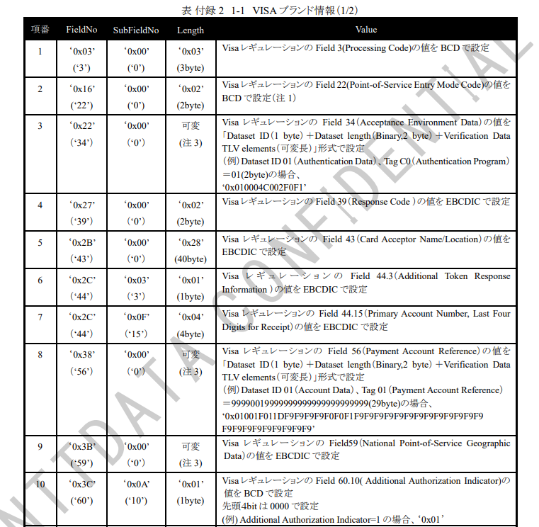
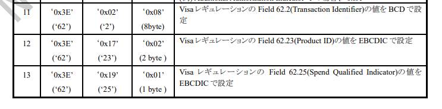
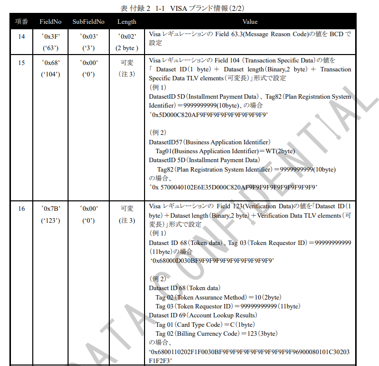
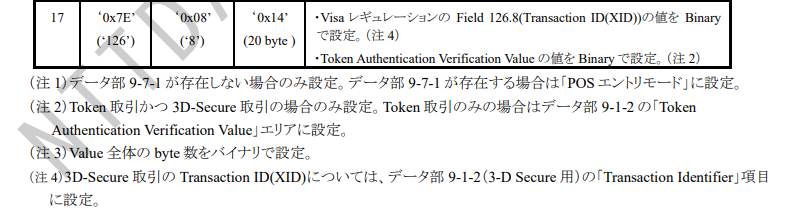
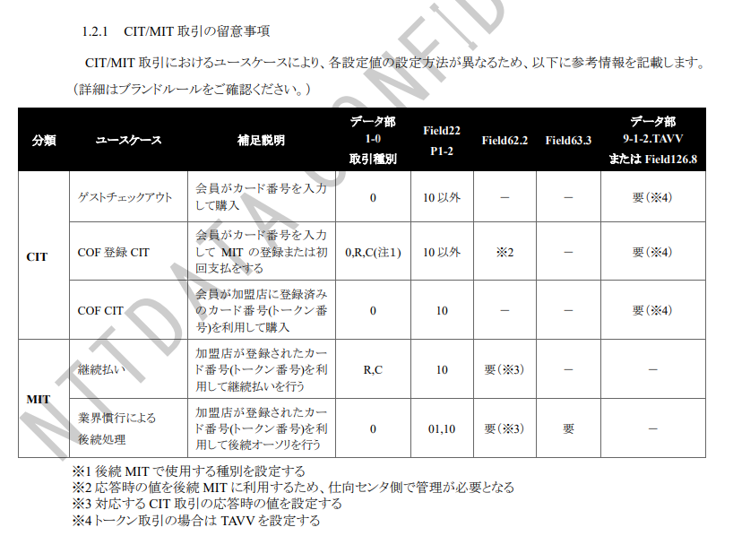
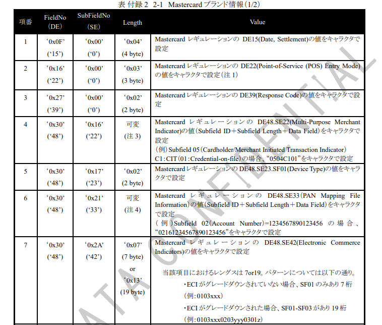
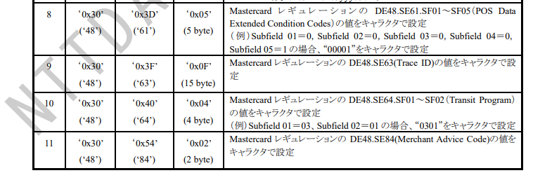
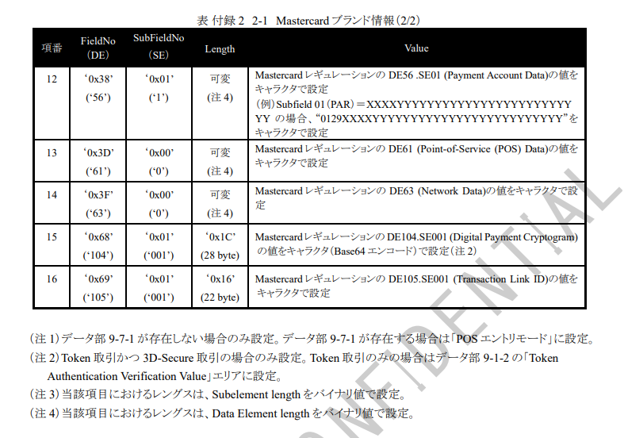
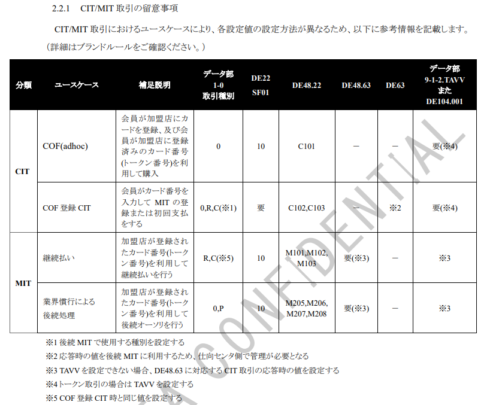

## ＜付録２＞　ブランド情報取り扱い項目一覧

ブランドデータ部（9-10-4）のブランド情報に設定可能な各ブランドのField-SubFieldついてに示します。
尚、本資料は、各ブランド毎に規定されているアプリケーション仕様を参考に作成しているため、内容が変更になる場合があります。
CAFISでは本書で規定しているField-SubFieldのみ利用可能です。
CAFISでは、ブランド情報について設定項目および内容の妥当性のチェックは行いません。

## 1. VISA

VISAブランドのブランド情報に設定可能なField-SubFieldを示します。
データ部9-10-4内に同一FieldNo/SubFieldNoを複数設定することはできません。複数のDataset ID、Tagを設定する際は、
ブランド仕様に準拠し、同一FieldNo/SubFieldNo内に設定してください。

### 1.1　IC取引以外でのPOSエントリーモードの設定

データ部9-7-1が存在しない取引においてPOSエントリーモードを設定する必要がある場合、Point-of-Service Entry Mode Code（VisaレギュレーションのField 22）はデータ部9-10-4に設定してください。

### 1.2　MIT時のCITと紐づけ情報の設定

MIT（加盟店実施の取引）ではカード保有者検証が実施されませんが、トークン取引の場合はカード保有者検証結果が存在しない取引はVISAのネットワークで承認されません。

このケース「MITかつトークン取引」の対応として、CIT（カードホルダー実施の取引）と紐づけることによりカード保有者検証の割愛が許容されています。紐づけに必要な以下の値はデータ部9-10-4に設定してください。

・Transaction Identifier（VisaレギュレーションのField 62.2）　※CIT時にブランドから受信し、MIT時に設定

・Message Reason Code（VisaレギュレーションのField 63.3）　※MIT時に設定

### 1.3　inApp/COFトークン取引時に必要な情報

inApp/COFトークン取引では、以下の情報がVisaレギュレーション上必要となります。

1.3.1　加盟店からカード会社への要求電文

・Point-of-Service Entry Mode Code（VisaレギュレーションのField 22）

・Token Requestor ID（VisaレギュレーションのField 123、Dataset ID 68、Tag 03）

・Token Authentication Verification Value（「1.4 トークン取引かつ3D-Secure取引のTAVVの設定」参照）

・POS Environment（VisaレギュレーションのField 126.13）（※）

・Additional Authorization Indicator（VisaレギュレーションのField 60.10）

（※）データ部1-0の「取引種別」に設定

1.3.2　カード会社から加盟店への報告電文

・Authentication Program（VisaレギュレーションのField 34、Dataset ID 01、Tag C0）

・Additional Token Response Information（VisaレギュレーションのField 44.3）

・Primary Account Number, Last Four Digits for Receipt（VisaレギュレーションのField 44.15）

・Payment Account Reference（VisaレギュレーションのField 56、Dataset ID 01、Tag 01）

### 1.4　トークン取引かつ3D-Secure取引のTAVVの設定

トークン（inApp、COF）取引ではトークン取引に関する情報をデータ部9-1-2に設定します。

ただし、トークン取引かつ3D-Secure取引である場合、データ部9-1-2には3D-Secure取引の情報を設定し、Token Authentication Verification Value（VisaレギュレーションのField 126.8）の値は、データ部9-1-2ではなくデータ部9-10-4に設定してください。

## 2. MasterCard

MasterCardブランドのブランド情報に設定可能なField-SubFieldを示します。

### 2.1　IC取引以外での POS エントリーモードの設定

データ部 9-7-1 が存在しない取引において POS エントリーモードを設定する必要がある場合、Point-of-Service (POS) Entry Mode (Mastercard レギュレーションの DE22) はデータ部 9-10-4 に設定してください。

### 2.2　MIT 時の CIT と紐づけ情報の設定

2022 年 10 月 14 日より、トークン、PAN、および COF 取引のそれぞれにおいて Multi-Purpose Merchant Indicator (Mastercard レギュレーションの DE 48, subelement 22, subfield 05) を設定する必要があります。

データ部 9-10-4 の「Value」に、Subfield ID (05 固定) + Subfield Length (04 固定) + Data Field (CIT/MIT Indicator の値) の形式で設定してください。

また、CIT 時の Trace ID を MIT 時に設定する必要がある場合は、データ部 9-10-4 に設定してください。

・Network Data (Mastercard レギュレーションの DE63)　※CIT 時にブランドから受信

・Trace ID (Mastercard レギュレーションの DE48.63)　※MIT 時に CIT 時にブランドから受信した Network Data を設定

### 2.3　トークン取引かつ 3D-Secure 取引の TAVV の設定

トークン（inApp、COF）取引ではトークン取引に関する情報をデータ部 9-1-2 に設定します。

ただし、トークン取引かつ 3D-Secure 取引である場合、データ部 9-1-2 には 3D-Secure 取引の情報を設定し、Digital Payment Cryptogram（Mastercard レギュレーションの DE104.SE001）の値は、データ部 9-1-2 ではなくデータ部 9-10-4 に設定してください。
