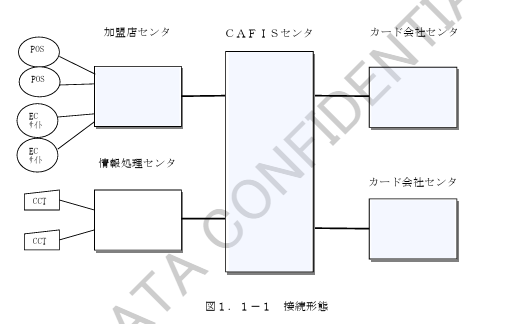
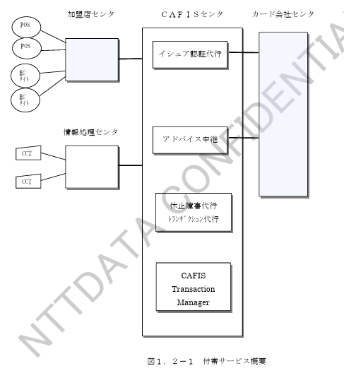

# 第１章　概　要

## 1.1　接続概要

　加盟店ショッピング業務は加盟店で取り扱われたクレジットカードでの各種データを、加盟店センタまたは情報処理センタ経由で受付け、各カード会社センタへ中継するサービスです。
　また、カード会社センタから加盟店センタへ取引を中継する場合もあります。
　本業務における接続形態を図１．１－１に示します。

図１．１－１　接続形態

## 1.2　付帯サービス概要

　加盟店ショッピング業務に付帯するカード会社向けサービスとして、ＣＡＦＩＳは以下のサービスを提供します。
　付帯サービス業務における付帯サービス概要を図１．２－１に示します。

図１．２－１　付帯サービス概要

## 1.3　業務処理概要

　本業務におけるＩＣカード、ＭＳカード、マニュアル入力により搬入されたクレジットカードショッピング基本業務の処理概要を表１．３－１に、ショッピング付帯業務の処理概要を表１．３－２に示します。

#### 表１．３－１　ショッピング基本業務　処理概要

| 項番 | 業務名 | 処理内容 |
|---|---|---|
| 1 | 与信業務 | クレジットカード（ＭＳカード、ＩＣカードまたはマニュアル入力）による取扱に対するオーソリ予約を行なうための与信要求をカード会社センタへ中継します。 |
| 2 | 売上業務 | クレジットカード（ＭＳカード、ＩＣカードまたはマニュアル入力）による売上を行なうための売上要求をカード会社センタへ中継します。 ＣＡＦＩＳの売上業務には以下の３種類があります。 ①　ＭＳ読込みまたはマニュアルによる売上 ②　ＩＣ読込み（接触・非接触）取引に対する売上結果通知 　　（ＩＣカード取扱後の売上通知） ③　ＩＣ読込みによるオンラインオーソリ 　　（ＩＣカードからのオンラインオーソリ取扱指示） |
| 3 | 取消業務 | クレジットカード（ＭＳカード、ＩＣカードまたはマニュアル入力）による与信または売上に対する取消処理を行なうための取消要求をカード会社センタへ中継します。 |

#### 表１．３－２　ショッピング付帯業務　処理概要

| 項番 | 業務名 | 処理内容 |
|---|---|---|
| 1 | 照会業務 | クレジットカードに関する照会や日計照会等、クレジットカード取扱に関する照会要求をカード会社センタへ中継します。 |
| 2 | 事故カード申請業務 | 事故カードデータを加盟店センタへ通知するために、カード会社センタからの事故カードデータを加盟店センタへ中継します。 |
| 3 | 取引カウンタ精査業務 | クレジットカードにおけるショッピング業務に関わるカウンタを、必要に応じて加盟店センタ－カード会社センタ間で交換することにより、お互いのカウンタの精査を行ないます。 |
| 4 | アドバイス業務 | ＩＣカードから読込まれた売上拒否取引の取扱結果に対するアドバイスデータをカード会社センタに中継します。 カード会社からデータ受信の希望がない場合には、ＣＡＦＩＳセンタで折返します。 （オフライン取引による取扱結果を含みます） |
