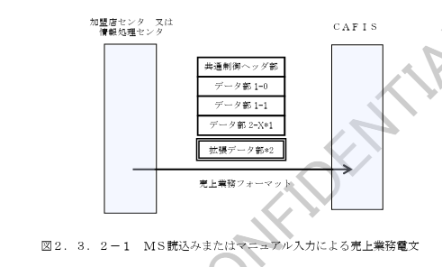
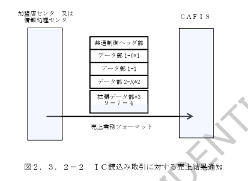
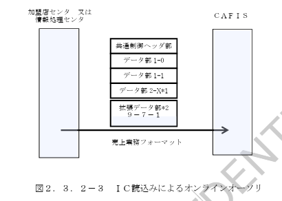
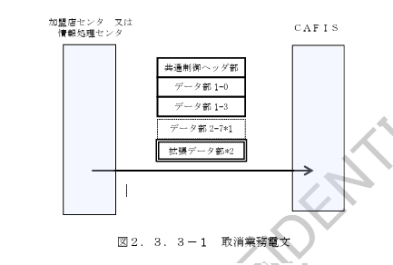

# 第２章　機能仕様

## 2.1　業務処理の流れ

　基本業務処理の流れを表２．１－１に、付帯業務処理の流れを表２．１－２に示します。

### 表２．１－１　基本業務処理の流れ

| 項番 | 業務処理 | 仕向センタ | 被仕向センタ | 主な電文設定項目 |
|---|---|---|---|---|
| 1 | 与信業務 | 与信要求／与信報告 |  | カードエンコード相当内容、商品コード、金額 与信可否結果 |
| 2 | 売上業務（ＭＳ読込み・マニュアル入力による売上） | 売上要求／売上報告 |  | カードエンコード内容、商品コード、金額 売上可否結果 |
| 2 | 売上業務（ＩＣ読込み取引に対する売上結果通知） | 売上要求／売上報告 |  | カードエンコード相当内容、商品コード、金額、売上通知用ＩＣ関連データ 売上結果通知受信結果 |
| 2 | 売上業務（ＩＣ読込みによるオンラインオーソリ） | 売上要求／売上報告 |  | カードエンコード相当内容、商品コード、金額、オンラインオーソリ用要求時ＩＣ関連データ（ＡＲＱＣ等） 売上可否結果、応答時ＩＣ関連データ（ＡＲＰＣ、イシュアスクリプト等） |
| 3 | 取消業務 | 取消要求／取消報告 |  | カードエンコード相当内容、商品コード、金額、伝票番号、区分 取消可否結果 |

### 表２．１－２　付帯業務処理の流れ

| 項番 | 業務処理 | 仕向センタ | 被仕向センタ | 主な電文設定項目 |
|---|---|---|---|---|
| 1 | 照会業務 | 照会要求／照会報告 |  | 照会区分 照会結果 |
| 2 | 事故カード中継業務 | 事故カード中継要求／事故カード中継報告 |  | 事故カードデータ 取扱結果 |
| 3 | 取引カウンタ精査業務 | その他要求／その他報告 |  | 仕向カウンタ（被仕向カウンタ） 被仕向カウンタ（仕向カウンタ） |
| 4 | アドバイス業務 | その他要求／その他報告 |  | アドバイス対象取引情報（端末番号、カード情報、ＩＣ関連データ） アドバイス受信結果 |
| 4 | アドバイス業務（ＣＡＦＩＳセンタ） | その他要求／その他報告 | ＣＡＦＩＳセンタ | アドバイス対象取引情報（端末番号、カード情報、ＩＣ関連データ） アドバイス受信結果 |

## 2.2　業務概要

### 2.2.1　与信業務

与信業務における業務処理概要図を図２．２．１－１に示します。

### 2.2.2　売上業務

　売上業務における業務処理概要図を３つの種類毎に図２．２．２－１～３に示します。

（１）　ＭＳ読込みまたはマニュアル入力による売上業務

　ＭＳカードおよびＩＣカードによる売上で、磁気ストライプ読込みまたはマニュアル入力により取り扱われた場合の売上業務です。

（２）　ＩＣ読込み取引に対する売上結果通知

　ＩＣチップ読込みにより取り扱われた場合の売上で、オンライン／オフライン取引に対するＩＣカードからの最終取扱が完了した場合に、売上結果をカード会社センタへ通知するための売上業務です。

（３）　ＩＣ読込み（接触・非接触）によるオンラインオーソリ

　ＩＣチップ読込みにより取り扱われた場合の売上で、ＩＣカードからオンラインオーソリを指示（ＩＣカードからの応答がＡＲＱＣ）された場合に、イシュアでＩＣカードおよび取扱に対する認証を行なうための売上業務です。  
　この売上取引はオーソリであり、売取引で売上確定を行なうことはできません。

### 2.2.3　取消業務

　取消業務における業務処理概要図を図２．２．３－１に示します。

### 2.2.4　照会業務

　照会業務における処理概要図を図２．２．４－１に示します。

### 2.2.5　事故カード中継業務

　事故カード中継業務における処理概要図を図２．２．５－１に示します。

### 2.2.6　取引カウンタ精査業務

　取引カウンタ精査業務における処理概要図を図２．２．６－１に示します。

### 2.2.7　アドバイス業務

　アドバイス業務における業務処理概要図を図２．２．７－１に示します。

（注）アドバイス業務として取り扱う必要のある取引ケースを表２．２．７－１に示します。

### 表２．２．７－１　アドバイス業務として取り扱う取引ケース

| 項番 | 業務 | ON/OFF | 成否結果 | 拒否判断 | ICカード | 端末 | イシュア | アドバイス要否 |
|---|---|---|---|---|---|---|---|---|
| 1 | 売上 | OFF（オフライン取引） | 許可 | ― | 許可（TC） | → | 許可（TC） | 否 |
| 2 | 売上 | OFF（オフライン取引） | 拒否 | ICカード | 拒否（AAC） | → | 許可（TC） | 要 |
| 3 | 売上 | OFF（オフライン取引） | 拒否 | 端末 | 拒否（AAC） | → | 拒否（AAC） | 要 |
| 4 | 売上 | OFF（オフライン取引） | 拒否 | ICカード（端末からのオンライン指示） | 拒否（AAC） | → | オンライン指示（ARQC） | 要 |
| 5 | 売上 | ON（オンライン取引） | 許可 | ― | ARQC | → | オンライン指示（ARQC） 許可（TC） | 否 |
| 6 | 売上 | ON（オンライン取引） | 拒否 | ICカード | ARQC 拒否（AAC） | → | オンライン指示（ARQC） 許可（TC） | 要 |
| 7 | 売上 | ON（オンライン取引） | 拒否 | イシュア | ARQC 拒否（AAC） | → | オンライン指示（ARQC） 拒否（AAC） | 要 |

## 2.3　加盟店ショッピング基本業務の電文フォーマット

### 2.3.1　与信業務電文フォーマット

　与信業務の電文フォーマットの概念を図２．３．１－１に示します。

＊1　データ部２－６は機種コード＝３（S-CAT）の場合に付加されるデータ部です。  
　端末機識別番号の機種コードエリアが識別コードを示す場合、データ部２－６は付与されません。

＊2　拡張データ部はデータ部９－ｘ－ｙの構成のデータ部です。  
　仕向センタからの設定は任意とし、被仕向センタへの中継時にはＣＡＦＩＳセンタにて該当する拡張データ部の利用契約によりデータ部中継の制御を行ないます。  
　（詳細は「２．４項」参照）

与信業務で取扱が可能な拡張データ部を表２．３．１－１に示します。

**表２．３．１－１　与信業務で取扱が可能な拡張データ部一覧**

| 項番 | データ部 | データ部名称 | データ部説明 | 利用方法 |
|---|---|---|---|---|
| 1 | データ部 9-6-1 | セキュリティコード対応データ部 | 磁気ストライプ以外の各種セキュリティ情報を格納するデータ部。磁気ストライプカードおよびマニュアル入力時の不正利用防止に利用。 | セキュリティ情報を通知したい場合に設定可能（カード区分1～4のみ設定可） |
| 2 | データ部 9-7-1 | ICカードオンラインオーソリ用データ部 | ICカード取引においてイシュアへ通知する必要のある項目を設定したデータ部。 | IC関連データ以外の本データ部項目をイシュアに通知する場合に設定可能（IC関連データの設定は不可） |
| 3 | データ部 9-1-2 | 3D Secure対応データ部 | 3D Secureで必要となる情報を格納するデータ部。マニュアル入力時の不正利用防止に利用。 | 3D Secureに情報を通知したい場合に設定可能（カード区分＝3の場合のみ設定可） |
| 4 | データ部 9-1-3 | 属性確認用データ部 | 属性確認用（カード情報以外の個人情報）を格納するデータ部。不正利用防止に利用。 | 属性確認情報を通知したい場合に設定可能（カード区分1～4のみ設定可） |
| 5 | データ部 9-6-6 | 属性確認用データ部 | 属性確認情報（カード情報以外の個人情報）を格納するデータ部。不正利用防止に利用。 | 属性確認情報を通知したい場合に設定可能（カード区分1～4のみ設定可） |

（注）各データ部の具体的な項目内容については接続条件設計書を参照ください。

### 2.3.2　売上業務電文フォーマット

　売上業務の電文フォーマットの概念を図２．３．２－１～３に示します。  
　売上業務における（１）～（３）の識別方法については「２．５項」を参照してください。

（１）　ＭＳ読込みまたはマニュアル入力による売上業務

＊1　データ部２－Ｘは取り扱われた支払区分ごとに可変となるデータ部です。  
＊2　拡張データ部はデータ部９－ｘ－ｙの構成のデータ部です。  
　仕向センタからの設定は任意とし、被仕向センタへの中継時にはＣＡＦＩＳセンタにて該当する拡張データ部の利用契約によりデータ部中継の制御を行ないます。  
　（詳細は「２．４項」参照）

ＭＳ読込みまたはマニュアル入力による売上業務で取扱が可能な拡張データ部を表２．３．２－１に示します。

**表２．３．２－１　ＭＳ読込みまたはマニュアル入力による売上業務で取扱が可能な拡張データ部一覧**

| 項番 | データ部 | データ部名称 | データ部説明 | 利用方法 |
|---|---|---|---|---|
| 1 | データ部 9-6-1 | セキュリティコード対応データ部 | 磁気ストライプ以外の各種セキュリティ情報を格納するデータ部。磁気ストライプカードの不正利用防止に利用。 | セキュリティ情報を通知したい場合に設定可能（カード区分1～4のみ設定可） |
| 2 | データ部 9-7-1 | ICカードオンラインオーソリ用データ部 | ICカード取引においてイシュアへ通知する必要のある項目を設定したデータ部。 | IC関連データ以外の本データ部項目をイシュアへ通知する場合に設定可能（IC関連データの設定は不可） |
| 3 | データ部 9-1-2 | 3D Secure対応データ部 | 3D Secureで必要となる情報を格納するデータ部。マニュアル入力時の不正利用防止に利用。 | 3D Secureに情報を通知したい場合に設定可能（カード区分＝3の場合のみ設定可） |
| 4 | データ部 9-1-3 | 属性確認用データ部 | 属性確認用（カード情報以外の個人情報）を格納するデータ部。不正利用防止に利用。 | 属性確認情報を通知したい場合に設定可能（カード区分1～4のみ設定可） |
| 5 | データ部 9-6-6 | 属性確認用データ部 | 属性確認情報（カード情報以外の個人情報）を格納するデータ部。不正利用防止に利用。 | 属性確認情報を通知したい場合に設定可能（カード区分1～4のみ設定可） |

（注）各データ部の具体的な項目内容については接続条件設計書を参照してください。

（２）　ＩＣ読込み取引に対する売上結果通知

＊1　電文送信区分＝４の固定です。  
＊2　データ部２－Ｘは取り扱われた支払区分ごとに可変となるデータ部です。  
＊3　拡張データ部はデータ部９－ｘ－ｙの構成のデータ部です。  
　データ部９－７－４は仕向センタからの設定は必須とし被仕向センタへ中継します。  
　データ部９－７－４を受信できないカード会社センタに対しては、事前に契約頂くことにより当該データ部をＣＡＦＩＳで削除し、削除したデータについて一定期間保管し情報還元することができます。（詳細は「２．４項」参照）  
　本売上業務で取扱う拡張データ部を表２．３．２－２に示します。

**表２．３．２－２　ＩＣ読込みによる売上業務で取扱う拡張データ部一覧**

| 項番 | データ部 | データ部名称 | データ部説明 | 利用方法 |
|---|---|---|---|---|
| 1 | データ部 9-7-4 | ＩＣ売上通知用データ部 | ＩＣ売上結果通知に必要となる項目を設定したデータ部。 | ＩＣ売上結果通知に必要な売上情報を通知したい場合に設定。電文送信区分＝４（ＩＣ売上通知）のみ設定可能。 |

（注）各データ部の具体的な項目内容については接続条件設計書を参照ください。

（３）　ＩＣ読込みによるオンラインオーソリ

＊1　データ部２－Ｘは取り扱われた支払区分ごとに可変となるデータ部です。  
＊2　拡張データ部はデータ部９－ｘ－ｙの構成のデータ部です。  
　データ部９－７－１は仕向センタからの設定は必須とし被仕向センタへ中継します。  
　被仕向センタでの本売上業務の取扱が実施できない場合には、事前にご契約頂くことにより、一部機能をＣＡＦＩＳセンタで代行するサービスを提供いたします。  
　ＩＣ読込みによる売上業務で取扱う拡張データ部を表２．３．２－３に、当該拡張データ部の取扱に対するＣＡＦＩＳでの付帯サービス一覧を表２．３．２－４に示します。

**表２．３．２－３　ＩＣ読込みによる売上業務で取扱う拡張データ部一覧**

| 項番 | データ部 | データ部名称 | データ部説明 | 利用方法 |
|---|---|---|---|---|
| 1 | データ部 9-7-1 | ＩＣカードオンラインオーソリ用データ部 | ＩＣカード取引においてイシュア等に通知する必要のある項目を設定したデータ部。 | ＩＣカードからオンラインオーソリ要求があった取引について設定必須。 |

**表２．３．２－４　ＩＣオンラインオーソリ業務関連付加サービス一覧**

| 項番 | サービス名 | サービス内容 | 対象 |
|---|---|---|---|
| 1 | イシュア認証代行サービス | ＣＡＦＩＳにて、データ部９－７－１に関する処理（ＩＣ関連処理）を実施し、データ部９－７－１を削除後、イシュア認証代行サービスによりご契約内容に応じて制御を行います。電文を中継しない場合もあります。 | ＩＣクレジットカードを発行しており、ＡＲＱＣ検証・ＡＲＰＣ生成等のＩＣ関連処理をＣＡＦＩＳに委託されるカード会社様 |

（注）各サービスの概要については第３章を参照してください。  

※なおブランドアプリケーション（ＡＩＤの先頭４バイトがＤ３９２以外）において、カード区分＝６の場合、被仕向のカード会社がイシュア認証代行サービスを利用している場合、ＣＡＦＩＳでＣ３４のエラーとなります。

### 2.3.3　取消業務電文フォーマット

　取消業務の電文フォーマットの概念を図２．３．３－１に示します。

＊1　データ部２－７は機種コード＝３（S-CAT）の場合に付加されるデータ部です。  
　端末機識別番号の機種コードエリアが識別コードを示す場合、データ部２－６は付与されません。

＊2　拡張データ部はデータ部９－ｘ－ｙの構成のデータ部です。  
　仕向センタからの設定は任意とし、被仕向センタへの中継時にはＣＡＦＩＳセンタにて該当する拡張データ部の利用契約によりデータ部中継の制御を行ないます。  
　（詳細は「２．４項」参照）

　取消業務で取扱が可能な拡張データ部を表２．３．３－１に示します。

**表２．３．３－１　取消業務で取扱が可能な拡張データ部一覧**

| 項番 | データ部 | データ部名称 | データ部説明 | 利用方法（条件） |
|---|---|---|---|---|
| 1 | データ部 9-7-1 | ICカードオンラインオーソリ用データ部 | ICカード取引においてイシュア等に通知する必要のある項目を設定したデータ部。 | IC関連データ以外の本データ部項目をイシュア等に通知する場合に設定可能（IC関連データの設定は不可）。電文送信区分＝４のみ設定可能。 |
| 2 | データ部 9-7-4 | IC売上通知用データ部 | IC読込みによる売上通知に必要となる項目を設定したデータ部。 | ICカード取引に必要な売上（オフライン承認）情報を通知したい場合に設定可能。MSカードまたはマニュアル入力取引においても使用することも可能。電文送信区分＝４（IC売上通知）のみ設定可能。 |

（注）データ部9-7-1とデータ部9-7-4の共存はできません。  
各データ部の具体的な項目内容については接続条件設計書を参照ください。

## 2.4　拡張データ部の取扱

### 2.4.1　拡張データ部

　拡張データ部はデータ部を９－ｘ－ｙと定義したデータ部です。  
　拡張データ部は、被仕向センタとして事前に当該データ部を受信する／しないの契約をすることによりＣＡＦＩＳで中継時に当該データ部の取扱を制御することができます。  

　対象となるデータ部および契約内容、ＣＡＦＩＳでの取扱方法について表２．４．１－１、２に示します。  

　また、表２．４．１－１、２のデータ部に対して仕向センタまたは被仕向センタでの取扱条件について表２．４．１－２、３に示します。

**表２．４．１－１　被仕向センタの契約により中継制御を行なう拡張データ部**

| 項番 | データ部 | 被仕向センタの契約 | CAFISでの処理 | 対象業務 |
|---|---|---|---|---|
| 1 | データ部 9-6-1（セキュリティコード対応データ部） | ・データ部受信不要（初期値） ・データ部受信要 | 「データ部受信要」である被仕向センタに当該データ部を中継し、それ以外はCAFISで削除して取引を中継します。 | ・与信 ・MS読込みまたはマニュアル入力による売上 |
| 2 | データ部 9-7-1（ICカードオンラインオーソリ用データ部） | ・データ部受信不要（初期値） ・データ部受信要 | 「データ部受信要」である被仕向センタに当該データ部を中継し、それ以外はCAFISで削除して取引を中継します。 | ・MS読込みまたはマニュアル入力による売上 ・取消 |
| 3 | データ部 9-7-4（IC売上通知用データ部） | ・データ部受信不可（情報還元要） ・データ部受信可（初期値） | 「データ部受信不可」である被仕向センタに対し、当該データ部を削除して中継します。削除した内容は一定期間保管します。 | ・IC売上結果通知 ・取消 |
| 4 | データ部 9-1-2 | ・データ部受信不要（初期値） ・データ部受信要 | 「データ部受信要」である被仕向センタに当該データ部を中継し、それ以外はCAFISで削除して取引を中継します。 | ・MS読込みまたはマニュアル入力による売上 |
| 5 | データ部 9-1-3（※データ部9-1-2が設定されているときのみ設定可能） | ・データ部受信不要（初期値） ・データ部受信要 | 「データ部受信要」である被仕向センタに当該データ部を中継し、それ以外はCAFISで削除して取引を中継します。 | ・MS読込みまたはマニュアル入力による売上 |
| 6 | データ部 9-6-6 | ・データ部受信不要（初期値） ・データ部受信要 | 「データ部受信要」である被仕向センタに当該データ部を中継し、それ以外はCAFISで削除して取引を中継します。 | ・与信 ・MS読込みまたはマニュアル入力による売上 |

（注）各データ部が利用可能な電文種別等の電文構成については接続条件設計書を参照してください。

**表２．４．１－２　仕向センタ側での拡張データ部の取扱可否**

| 拡張データ部 | 与信業務 MS・マニュアル | 与信業務 IC | 売上業務 MS・マニュアル | 売上業務 IC結果通知 | 売上業務 ICオーソリ | 取消業務 MS・マニュアル | 取消業務 IC |
|---|---|---|---|---|---|---|---|
| 9-6-1 | ○ | × | ○ | × | × | × | × |
| 9-7-1 | ○ | ○ | ○ | × | ◎ | ○ | ○ |
| 9-7-4 | × | × | × | ◎ | × | ▲（送信区分＝4） | ▲（送信区分＝4） |
| 9-1-2 | ▲（カード区分＝3） | × | ▲（カード区分＝3） | × | × | × | × |
| 9-1-3 | ▲（カード区分＝3） | × | ▲（カード区分＝3） | × | × | × | × |
| 9-6-6 | ○ | × | ○ | × | × | × | × |

【凡例】  
◎：設定必須／○：設定任意／▲：条件付き設定可能  
×：設定不可（CAFISでチェック実施）

