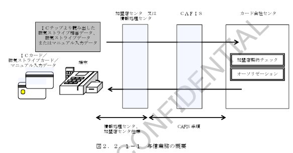
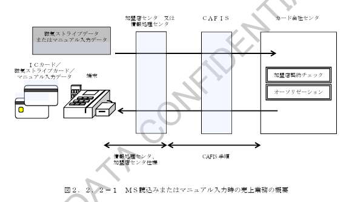
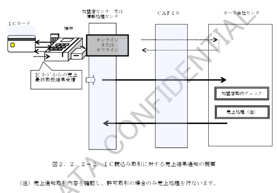
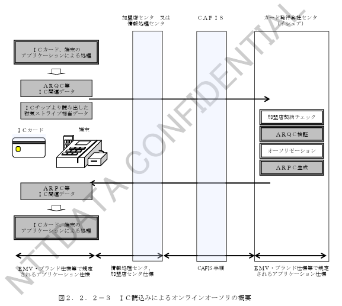
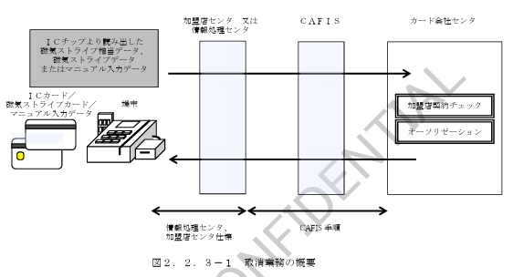
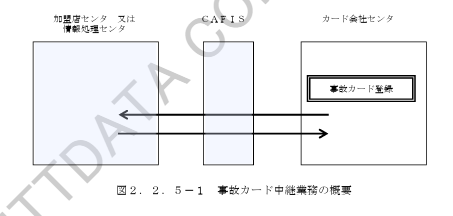
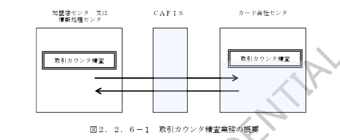
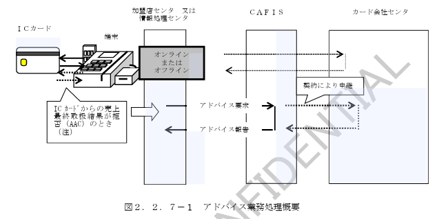

# 第２章　機能仕様

## 2.1　業務処理の流れ

　基本業務処理の流れを表２．１－１に、付帯業務処理の流れを表２．１－２に示します。

### 表２．１－１　基本業務処理の流れ

| 項番 | 業務処理 | 仕向センタ | 被仕向センタ | 主な電文設定項目 |
|---|---|---|---|---|
| 1 | 与信業務 | 与信要求／与信報告 |  | カードエンコード相当内容、商品コード、金額 与信可否結果 |
| 2 | 売上業務（ＭＳ読込み・マニュアル入力による売上） | 売上要求／売上報告 |  | カードエンコード内容、商品コード、金額 売上可否結果 |
| 2 | 売上業務（ＩＣ読込み取引に対する売上結果通知） | 売上要求／売上報告 |  | カードエンコード相当内容、商品コード、金額、売上通知用ＩＣ関連データ 売上結果通知受信結果 |
| 2 | 売上業務（ＩＣ読込みによるオンラインオーソリ） | 売上要求／売上報告 |  | カードエンコード相当内容、商品コード、金額、オンラインオーソリ用要求時ＩＣ関連データ（ＡＲＱＣ等） 売上可否結果、応答時ＩＣ関連データ（ＡＲＰＣ、イシュアスクリプト等） |
| 3 | 取消業務 | 取消要求／取消報告 |  | カードエンコード相当内容、商品コード、金額、伝票番号、区分 取消可否結果 |

### 表２．１－２　付帯業務処理の流れ

| 項番 | 業務処理 | 仕向センタ | 被仕向センタ | 主な電文設定項目 |
|---|---|---|---|---|
| 1 | 照会業務 | 照会要求／照会報告 |  | 照会区分 照会結果 |
| 2 | 事故カード中継業務 | 事故カード中継要求／事故カード中継報告 |  | 事故カードデータ 取扱結果 |
| 3 | 取引カウンタ精査業務 | その他要求／その他報告 |  | 仕向カウンタ（被仕向カウンタ） 被仕向カウンタ（仕向カウンタ） |
| 4 | アドバイス業務 | その他要求／その他報告 |  | アドバイス対象取引情報（端末番号、カード情報、ＩＣ関連データ） アドバイス受信結果 |
| 4 | アドバイス業務（ＣＡＦＩＳセンタ） | その他要求／その他報告 | ＣＡＦＩＳセンタ | アドバイス対象取引情報（端末番号、カード情報、ＩＣ関連データ） アドバイス受信結果 |

## 2.2　業務概要

### 2.2.1　与信業務

与信業務における業務処理概要図を図２．２．１－１に示します。

### 2.2.2　売上業務

　売上業務における業務処理概要図を３つの種類毎に図２．２．２－１～３に示します。

（１）　ＭＳ読込みまたはマニュアル入力による売上業務

　ＭＳカードおよびＩＣカードによる売上で、磁気ストライプ読込みまたはマニュアル入力により取り扱われた場合の売上業務です。

（２）　ＩＣ読込み取引に対する売上結果通知

　ＩＣチップ読込みにより取り扱われた場合の売上で、オンライン／オフライン取引に対するＩＣカードからの最終取扱が完了した場合に、売上結果をカード会社センタへ通知するための売上業務です。

（３）　ＩＣ読込み（接触・非接触）によるオンラインオーソリ

　ＩＣチップ読込みにより取り扱われた場合の売上で、ＩＣカードからオンラインオーソリを指示（ＩＣカードからの応答がＡＲＱＣ）された場合に、イシュアでＩＣカードおよび取扱に対する認証を行なうための売上業務です。  
　この売上取引はオーソリであり、売取引で売上確定を行なうことはできません。

### 2.2.3　取消業務

　取消業務における業務処理概要図を図２．２．３－１に示します。

### 2.2.4　照会業務

　照会業務における処理概要図を図２．２．４－１に示します。

### 2.2.5　事故カード中継業務

　事故カード中継業務における処理概要図を図２．２．５－１に示します。

### 2.2.6　取引カウンタ精査業務

　取引カウンタ精査業務における処理概要図を図２．２．６－１に示します。

### 2.2.7　アドバイス業務

　アドバイス業務における業務処理概要図を図２．２．７－１に示します。

（注）アドバイス業務として取り扱う必要のある取引ケースを表２．２．７－１に示します。

### 表２．２．７－１　アドバイス業務として取り扱う取引ケース

| 項番 | 業務 | ON/OFF | 成否結果 | 拒否判断 | ICカード | 端末 | イシュア | アドバイス要否 |
|---|---|---|---|---|---|---|---|---|
| 1 | 売上 | OFF（オフライン取引） | 許可 | ― | 許可（TC） | → | 許可（TC） | 否 |
| 2 | 売上 | OFF（オフライン取引） | 拒否 | ICカード | 拒否（AAC） | → | 許可（TC） | 要 |
| 3 | 売上 | OFF（オフライン取引） | 拒否 | 端末 | 拒否（AAC） | → | 拒否（AAC） | 要 |
| 4 | 売上 | OFF（オフライン取引） | 拒否 | ICカード（端末からのオンライン指示） | 拒否（AAC） | → | オンライン指示（ARQC） | 要 |
| 5 | 売上 | ON（オンライン取引） | 許可 | ― | ARQC | → | オンライン指示（ARQC） 許可（TC） | 否 |
| 6 | 売上 | ON（オンライン取引） | 拒否 | ICカード | ARQC 拒否（AAC） | → | オンライン指示（ARQC） 許可（TC） | 要 |
| 7 | 売上 | ON（オンライン取引） | 拒否 | イシュア | ARQC 拒否（AAC） | → | オンライン指示（ARQC） 拒否（AAC） | 要 |

## 2.3　加盟店ショッピング基本業務の電文フォーマット

### 2.3.1　与信業務電文フォーマット

　与信業務の電文フォーマットの概念を図２．３．１－１に示します。

＊1　データ部２－６は機種コード＝３（S-CAT）の場合に付加されるデータ部です。  
　端末機識別番号の機種コードエリアが識別コードを示す場合、データ部２－６は付与されません。

＊2　拡張データ部はデータ部９－ｘ－ｙの構成のデータ部です。  
　仕向センタからの設定は任意とし、被仕向センタへの中継時にはＣＡＦＩＳセンタにて該当する拡張データ部の利用契約によりデータ部中継の制御を行ないます。  
　（詳細は「２．４項」参照）

与信業務で取扱が可能な拡張データ部を表２．３．１－１に示します。

### 表２．３．１－１　与信業務で取扱が可能な拡張データ部一覧

| 項番 | データ部 | データ部名称 | データ部説明 | 利用方法 |
|---|---|---|---|---|
| 1 | データ部 9-6-1 | セキュリティコード対応データ部 | 磁気ストライプ以外の各種セキュリティ情報を格納するデータ部。磁気ストライプカードおよびマニュアル入力時の不正利用防止に利用。 | セキュリティ情報を通知したい場合に設定可能（カード区分1～4のみ設定可） |
| 2 | データ部 9-7-1 | ICカードオンラインオーソリ用データ部 | ICカード取引においてイシュアへ通知する必要のある項目を設定したデータ部。 | IC関連データ以外の本データ部項目をイシュアに通知する場合に設定可能（IC関連データの設定は不可） |
| 3 | データ部 9-1-2 | 3D Secure対応データ部 | 3D Secureで必要となる情報を格納するデータ部。マニュアル入力時の不正利用防止に利用。 | 3D Secureに情報を通知したい場合に設定可能（カード区分＝3の場合のみ設定可） |
| 4 | データ部 9-1-3 | 属性確認用データ部 | 属性確認用（カード情報以外の個人情報）を格納するデータ部。不正利用防止に利用。 | 属性確認情報を通知したい場合に設定可能（カード区分1～4のみ設定可） |
| 5 | データ部 9-6-6 | 属性確認用データ部 | 属性確認情報（カード情報以外の個人情報）を格納するデータ部。不正利用防止に利用。 | 属性確認情報を通知したい場合に設定可能（カード区分1～4のみ設定可） |

（注）各データ部の具体的な項目内容については接続条件設計書を参照ください。

