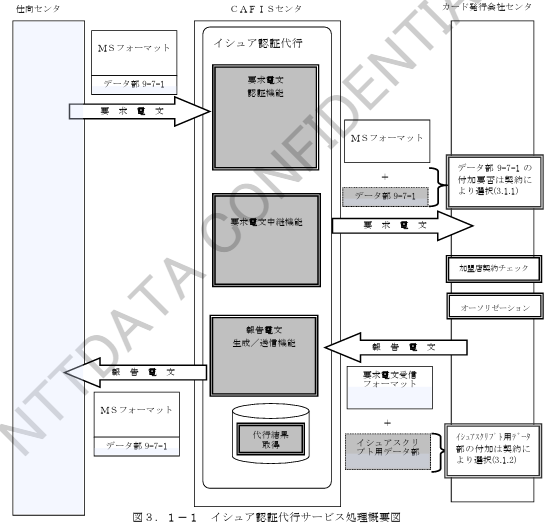
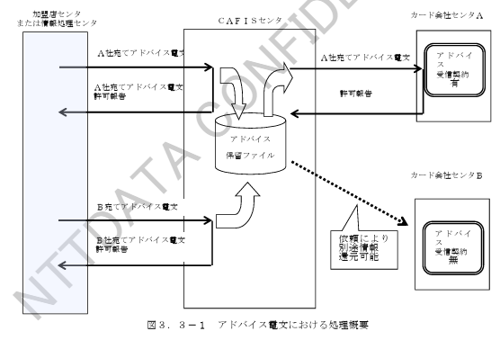
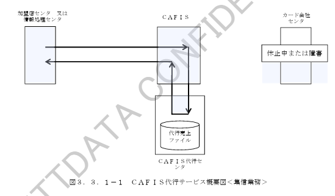
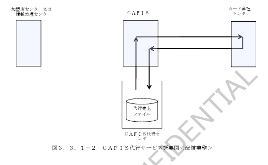
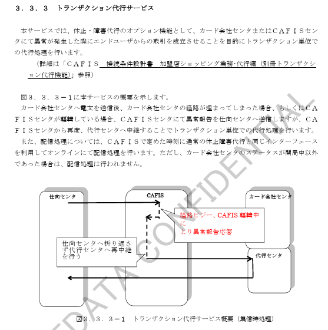
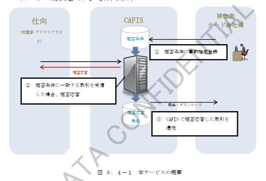

# 第３章　付帯サービス

## 3.1　イシュア認証代行サービス

　カード発行会社様から各種専用キーをお預かりし、仕向センタからのＩＣチップ読込みのオンラインオーソリ売上要求に対する認証処理を代行するサービスです。  
　ＣＡＦＩＳで代行する認証処理の概要図を図３．１－１に、図に対応した説明を表３．１－１に示します。

＊ＭＳフォーマット：拡張データ部（データ部９－７－１）が付与されていないフォーマット（共通制御ヘッダ部～データ部２－Ｘ）

**表３．１－１　イシュア認証代行処理の概要**

| 項番 | 代行処理名 | 処理概要 | 備考 |
|---|---|---|---|
| 1 | TVRチェック処理 | カード会社様が事前に登録した内容に従い、端末が生成したTVRをチェックします。 | |
| 2 | CVRチェック処理 | カード会社様が事前に登録した内容に従い、ICカードが生成したCVRをチェックします。 | |
| 3 | ARQC検証 | カード会社様が事前に登録した各種専用キーにより、ARQCを検証するとともに、ICカードの正当性、取引の正当性を検証します。 | |
| 5 | 要求電文中継機能 | 要求電文認証機能によって、認証結果正常または異常時、当サービス利用センタへ認証結果を付与した要求電文を中継します。中継方法については事前に選択することができます。 | 3.1.1参照 |
| 6 | ARPC生成 | ICカードでイシュア認証に使用する暗号文を作成します。 | |
| 7 | イシュアスクリプトコマンド発行 | カード会社様からの指示により、ICカードに対してイシュアスクリプトコマンドを発行します。 | 3.1.2参照 |
| 8 | 報告電文送信機能 | 本サービス利用センタからの報告電文を基に、報告用IC関連データを作成し、仕向センタへ報告電文を送信します。また、要求電文認証処理で異常であった場合CAFISで応答電文を作成し仕向センタへ送信することもできます。 | 3.1.1参照 |

＊：本機能は契約により実施されます。

### 3.1.1　イシュア認証代行要求電文認証処理後の取扱

　イシュア認証代行サービスにおいて、要求電文認証処理後の取扱について処理方式を選択することができます。  
　選択できる処理内容の一覧を表３．１．１－１に示します。

**表３．１．１－１　選択により処理が異なる機能一覧**

| 項番 | 選択により処理が異なる機能 | 選択内容 | 備考 |
|---|---|---|---|
| 1 | 認証正常時の処理 | MSフォーマットで受信 | 認証結果をデータ部9-7-1に格納 |
|  |  | ICフォーマットで受信 |  |
|  |  | 拒否報告代行応答 | CAFISで拒否報告を送信 |
| 2 | 認証異常時の処理 | MSフォーマットで受信 | データ部1-0のエラーコードに認証結果を格納 |
|  |  | ICフォーマットで受信 | 認証結果をデータ部9-7-1に格納 |

＊MSフォーマット：拡張データ部（データ部9-7-1）が付与されていないフォーマット  
＊ICフォーマット：拡張データ部（データ部9-7-1）が付与されているフォーマット  

　詳細な処理方法については、「CAFIS接続条件設計書　加盟店ショッピング業務　イシュア認証代行編」を参照してください。

---

### 3.1.2　イシュア認証代行イシュアスクリプト発行の取扱

　イシュア認証代行サービスにおいて、イシュアスクリプトコマンドを発行することができます。  
　イシュアスクリプトコマンドの発行方法はご契約により選択することが可能です。  
　また、複数の発行方法について契約することもできます。  
　イシュアスクリプトコマンド発行方法における選択可能な処理方式を表３．１．２－１に示します。

**表３．１．２－１　選択可能なイシュアスクリプトコマンド発行方式**

| 項番 | 機能 | 選択内容 | 内容 |
|---|---|---|---|
| 1 | イシュアスクリプト発行 | なし | イシュアスクリプトの発行は行わない |
|  |  | エラーコードによる自動発行 | サービス利用センタからの報告電文のデータ部1-1にエラーコードが格納されている場合に、自動発行する |
|  |  | オンライン指示による発行 | オンライン応答電文の指示により発行する |
|  |  | 事前登録による発行 | 事前登録した内容に基づき発行する |

## 3.2　アドバイス中継サービス

　加盟店センタまたは情報処理センタから送信されるアドバイス要求をカード会社センタへ中継するサービスです。  
　アドバイス要求は、仕向センタ側から被仕向となるカード会社センタを指定して送信されます。  

　ＣＡＦＩＳではアドバイス電文の受信が可能でないカード会社センタを考慮し、通常はＣＡＦＩＳが指定しますが、カード会社センタからのお申込によりアドバイス電文のカード会社センタへ中継します。  

　カード会社センタへ送信したアドバイス電文は、カード会社センタからの報告が正常に完了しない場合には、障害電文処理の後、ＣＡＦＩＳセンタから再送いたします。  
　また、アドバイス電文はＣＡＦＩＳにより「障害代行サービス」対象とします。  

　アドバイス電文における基本的な電文の流れを図３．３－１に示します。  
　尚、アドバイス電文に関する詳細な電文中継制御方法については、「ＣＡＦＩＳ接続条件設計書　加盟店ショッピング業務　基本接続編」を参照してください。

# 3.3 CAFIS代行サービス

## 3.3.1 休止・障害時代行サービス

カード会社センタが休止中もしくは障害中の場合に、CAFIS代行センタにてカード会社センタの業務を代行するサービスです。

（詳細は「CAFIS接続条件設計書 ネガ代行業務共通編」および「CAFIS接続条件設計書 加盟店ショッピング業務」参照）

カード会社センタが休止・障害中の場合、集信業務として、仕向センタからの要求電文をCAFIS代行センタで受信して、事故カードチェック・無効カードチェック等を実施後、電文を送信します。

取引データは後日カード会社センタに引き渡すため、代行売上ファイルに蓄積します。

また、カード会社センタがオンライン開始または再開した場合、配信業務として、集信時に蓄積した取引データをCAFIS経由でカード会社センタに送信します。

概要図を図3.5.1-1に示します。

### 3.3.2 IC読込みによるオンラインオーソリ売上に対するCAFIS代行サービス

CAFIS代行センタではICオンラインオーソリ電文に対して必要となるICカードに関する認証処理等は実施しません。

そのため、当該売上に対するCAFIS代行サービスは、ご利用の形態により以下の2通りのサービス形態となります。

#### （1）CAFISにおいてイシュア認証代行サービスをご利用されている場合

CAFIS代行センタでは、イシュア認証代行処理後に送信される認証結果付のMSフォーマット電文を代行対象とします。  
認証代行結果が異常の場合は、従来のネガチェック等は実施せず拒否報告を応答します。  
配信時には、異常時の内容をそのまま配信いたします。

#### （2）ICカードに関する認証処理等を自センタで実施されている場合
または、加盟店契約カード会社として代行サービスをご利用される場合

CAFIS代行センタでは、IC関連データに関するチェックは実施せず、通常のMS処理対象と同様の処理を実施します。  
仕向センタの応答時には、IC関連データの格納データ部分を削除します。  
配信時には、IC関連データを付加したままの状態で配信電文を送信します。

### 3.3.3 トランザクション代行サービス

本サービスでは、休止・障害代行のオプション機能として、カード会社センタまたはCAFISセンタに異常が発生した際にエンドユーザからの取引を成立させることを目的に、トランザクション単位での代行処理を行います。

（詳細は「CAFIS接続条件設計書 加盟店ショッピング業務：代行編（別冊トランザクション代行機能）」を参照）

図3.3.3-1に本サービスの概要を示します。

カード会社センタと接続が正常である場合は、通常のオンライン処理が行われます。  
一方、カード会社センタに異常が発生した場合、CAFISセンタにて異常検知を行い、仕向センタへ異常報告を送信します。  
その後、CAFISセンタから代行センタへ処理が引き継がれ、トランザクション単位で代行処理を実施します。

また、配信処理については、CAFISにて通常の代行処理を行い、代行センタからの結果をオンラインで配信します。  
ただし、カード会社センタのステータスが「運用中」以外の場合には、配信処理は行われません。

### 3.4 CAFIS Transaction Manager（特定取引拒否サービス）

不正オーソリによるカード会社様の被害軽減を目的としたCAFISのサービスです。
カード会社様の取引において、カード会社様指定の拒否条件を満たした際に、CAFISはカード会社様に中継せずに仕向に拒否応答をします。
また、CAFISで拒否応答した取引をWEBでリアルタイムに検索できます。

本サービスの概要を図3.4‑1に示します。

