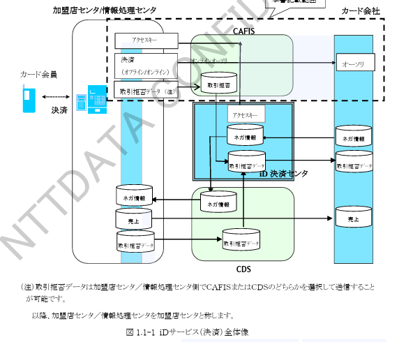

# 1. サービス概要

本章では、CAFISが提供するiDサービス概要について記述します。\
「iDサービス」のサービス仕様全体については、「iDサービス仕様書＜決済サービス編＞（株式会社NTTドコモ）」を参照してください。

## 1.1 iDサービス全体像

iDサービスとは、FeliCaチップにダウンロードしたカード情報を利用した決済サービスです。\
iDサービス（決済）全体像を図1.1-1に示します。

CAFISでは、「iD決済センタ」と連携する、
iDサービスに必要となる「アクセスキー」の配信および、オンラインオーソリが発生した場合に必要となる加盟店様とカード会社様との間のオーソリ電文中継インタフェースを提供します。

（注）取引拒否データは加盟店センタ／情報処理センタ側でCAFISまたはCDSのどちらかを選択して送信することが可能です。\
以降、加盟店センタ／情報処理センタを加盟店センタと称します。

図1.1-1　iDサービス（決済）全体像

