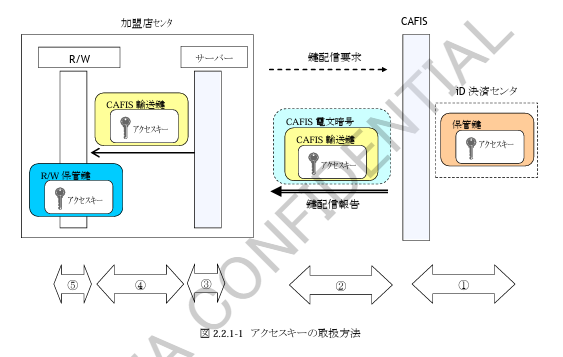

# 2. 業務仕様

## 2.1 対象業務

iDサービスの決済を行なうためにCAFISで提供する対象業務について表2.1-1に示します。

**表２．１－１　対象業務**

| No | 機能名 | 概要 | 参照 |
| --- | --- | --- | --- |
| 1 | アクセスキーの配信 | リーダライタ端末で必要となるアクセスキーを、その他端末を利用してCAFISから配信します。 | 2.2.1 |
| 2 | オンラインオーソリ | 決済時、カード会社へのオンラインオーソリが必要となった場合、売上要求または取消要求を利用してオーソリを行います。 | 2.2.2 |
| 3 | 売上（ギャザリング） | CAFISとのオンライン電文のみで売上を確定させる場合、売上要求または取消要求を利用してギャザリングを行います。 | 2.2.3 |
| 4 | 取引拒否データ還元 | ネガデータによりカードの有効性フラグの更新を行った場合、取引の情報を還元するためにその電文を利用して加盟店センタからデータを還元します。 | 2.2.4 |
| 5 | ネット決済オンラインオーソリ | ネット決済（仮想店舗からのインターネット決済）時のオンラインオーソリを行います。 | 2.2.5 |

## 2.2 業務概要

### 2.2.1 アクセスキー配信業務

本業務では、リーダライタ端末（以降、R/W）で必要となるアクセスキーについて、オンライン電文による配信を行います。

CAFISでは、加盟店センタより受信した鍵配信要求電文の内容に基づき、該当するアクセスキーを配信します。

### （1）アクセスキーの取扱方法

CAFISで保有するアクセスキーを加盟店センタへ配信するまでのアクセスキーの取扱方法について以下に示します。

図2.2.1-1　アクセスキーの取扱方法

①　iD決済センタで保有されているアクセスキーは、CAFISを通じて配信されます。  

②　加盟店センタからの鍵配信要求を受信した場合、CAFISは鍵配信報告にてアクセスキーを報告電文にセットして応答します。その後、加盟店センタとの回線断後、CAFISは鍵配信報告にて復号したアクセスキーを加盟店様で利用可能な伝送手順によって暗号化した状態で再送します。  

③　加盟店センタ内のサーバでは、CAFIS電文からR/Wで設定が必要な状態に復号を行います。  

④　加盟店センタ内のサーバとR/Wとの間は、CAFIS輸送鍵で暗号化された状態で配信します。  

⑤　R/Wでは、CAFIS輸送鍵で復号し、R/W独自の方式でアクセスキーを格納します。  

### （2）鍵の種類

アクセスキーの取扱の中で加盟店センタが利用する鍵の内容について表2.2.1-1に示します。

**表２．２．１－１　アクセスキーの取扱で使用する鍵**

| No. | 鍵の種類 | 内容 |
| --- | --- | --- |
| 1 | アクセスキー | 決済時にカードとR/W間の認証に使用するiDブランドが提供する鍵。 |
| 2 | CAFIS輸送鍵 | CAFISからアクセスキーを配信する際に、アクセスキーを暗号化するために使用する鍵。  iDサービスを提供するR/Wメーカー単位に設定可能であり、事前にR/WメーカーがCAFISに登録することが必要となります。  ■ CAFIS輸送鍵利用に対して事前に必要な作業  ① R/Wメーカーコード取得 CAFIS輸送鍵登録に伴い、事前にCAFISへ申込書を送付することにより、メーカーコード（3桁）がCAFISから払い出されます。 メーカーコードはCAFISと接続する加盟店単位で取得することは不要であり、複数加盟店で同一R/Wメーカーの場合には同一メーカーコードを利用することができます。  ② CAFIS輸送鍵登録 CAFISより事前に配布された登録ツール（プログラム）を利用して、CAFIS輸送鍵登録ファイルを作成し、当該ファイルをCAFISセンタへ持ち込んで頂くことにより登録することができます。 |

### （3）電文仕様

アクセスキー配信業務は、「その他要求（電文種別=3510）」を利用して取り扱います。

業務判定条件について表2.2.1-2に示します。

**表２．２．１－２　アクセスキー配信業務判定条件**

| No | 電文種別 | 取扱区分（データ部1-4） | 備考 |
| --- | --- | --- | --- |
| 1 | その他要求（3510） | D1：鍵配信要求 | 鍵配信電文用のデータ部「9-6-4」を利用します。 |

