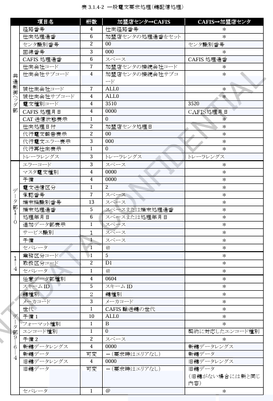
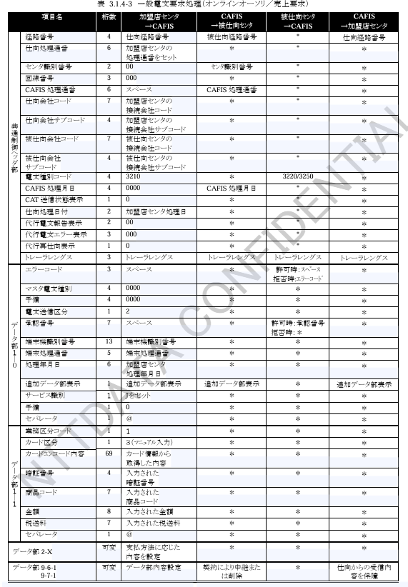
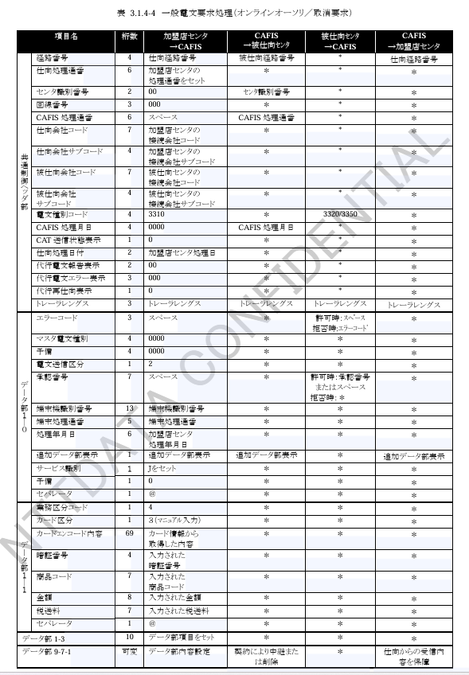
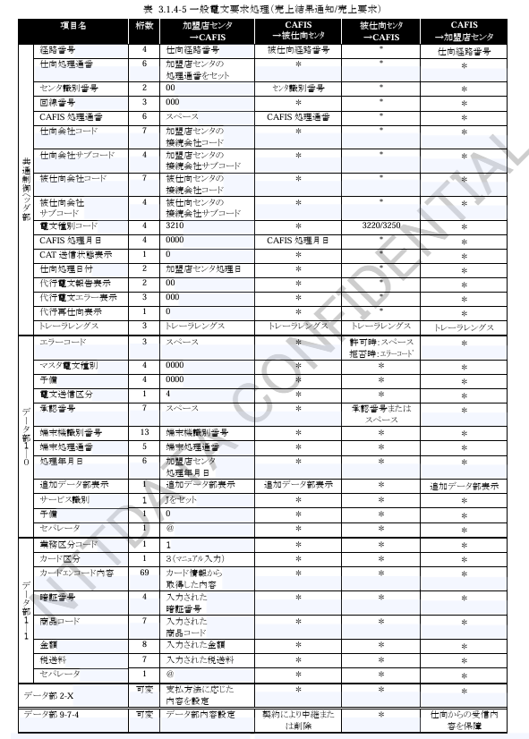
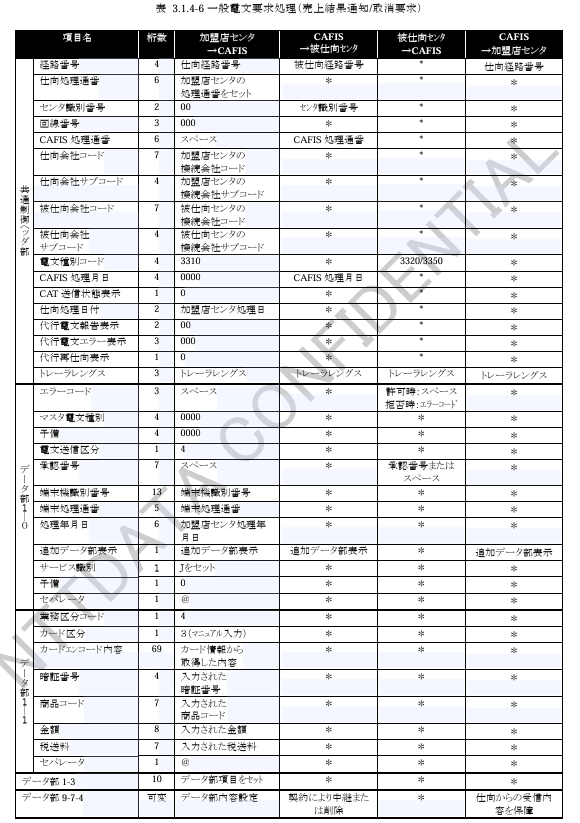
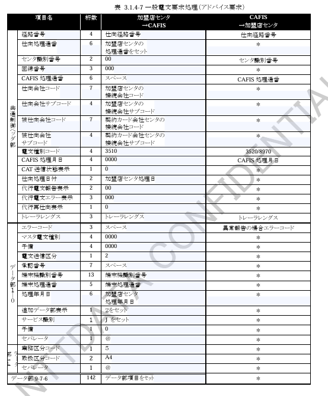
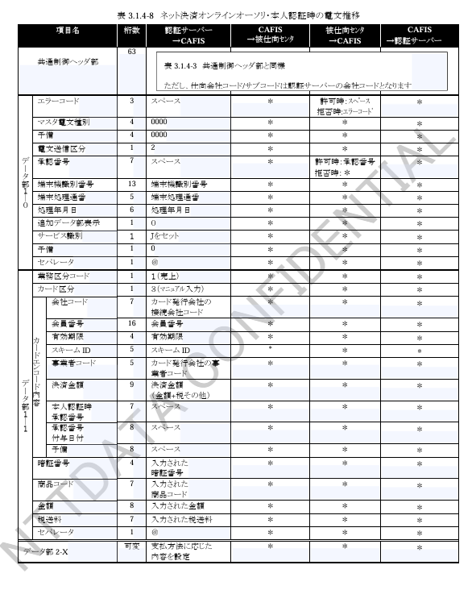
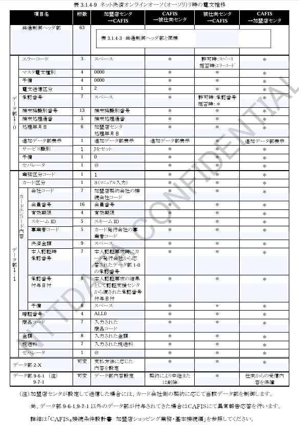

### 3.1.3 電文様式

本業務で使用する各種データフォーマットの図番、および項目説明の表番号を表3.1.3-1に示します。  

なお、本サービスで使用するデータ部の内容は、「CAFIS 接続条件設計書 加盟店ショッピング業務・基本接続編」に準拠するとともに、本章で記載する内容は「加盟店ショッピング業務・基本接続編」と変更または追加のあったデータ部についてのみ記載します。  

**表３．１．３－１　データ部内容の図番号・項目説明表番号の一覧**

| 項番 | データ部 | フォーマット図番号 | 項目説明表番号 | 使用業務 |
| --- | --- | --- | --- | --- |
| 1 | データ部1-0 | 図3.1.3-1 | 表3.1.3-2 | 鍵配信 オンラインオーソリ 売上（キャッシュリング） 取引拒否データ還元 ネット決済オンラインオーソリ |
| 2 | データ部1-1 | 図3.1.3-2 | 表3.1.3-3 | オンラインオーソリ 売上（キャッシュリング） ネット決済オンラインオーソリ |
| 3 | データ部1-4 | 図3.1.3-3 | 表3.1.3-4 | 鍵配信 取引拒否データ還元 |
| 4 | データ部9-6-4 | 図3.1.3-4 | 表3.1.3-5 | 鍵配信 |
| 5 | データ部9-7-6 | 図3.1.3-5 | 表3.1.3-6 | 取引拒否データ還元 |

#### （1）データ部1-0

図3.1.3-1　データ部1-0のフォーマット

**表３．１．３－２　データ部1-0の項目説明**

| 項番 | 項目 | 桁数 | 内容 |
| --- | --- | --- | --- |
| 1 | エラーコード | 3 | 許可報告時：スペース 拒否報告または異常報告時：エラーコードを付与 |
| 2 | マスタ電文種別コード | 4 | 要求時は「0000」固定 取消確認（再）指令時は要求電文の電文種別 取消（再）指令時は応答電文の電文種別 |
| 3 | 予備 | 4 | 「0000」固定 |
| 4 | 電文送信区分 | 1 | 「2」オンライン処理電文 「4」売上結果通知電文 |
| 5 | 承認番号 | 7 | 要求のときはALLスペース 許可報告のときは承認番号をセット |
| 6 | 設置会社コード | 5 | 設置／取扱カード会社コード |
| 7 | メーカーコード | 2 | メーカーコード |
| 8 | 機種コード | 1 | 機種コード |
| 9 | 端末通番 | 5 | メーカーコード・機種コード単位の通番 |
| 10 | 端末処理通番 | 5 | 端末で行った作業の通番（伝票番号） |
| 11 | 処理年月日 | 6 | YYMMDD |
| 12 | 追加データ部表示 | 1 | 「0」初期値 「2」任意データ部が存在 |
| 13 | サービス識別 | 1 | 「J」（ポストペイ業務） |
| 14 | 予備 | 1 | 「0」固定 |
| 15 | セパレータ | 1 | 「@」データ区切り |

※ 5~13 は 未使用の場合はスペースをセット

#### （2）データ部1-1

図3.1.3-2　データ部1-1 フォーマット

**表３．１．３－３　データ部1-1 項目説明（1/2）**

| 項番 | 項目 | 桁数 | 内容 |
| --- | --- | --- | --- |
| 1 | 業務区分コード | 1 | 処理する業務の区分 「1」売上　「4」取消 |
| 2 | カード区分 | 1 | 入力されたカードの種類の区分 「3」マニュアル入力 |
| 3 | 会社コード | 7 | 被仕向となるカード会社のCAFIS接続会社コード |
| 4 | 会員番号 | 16 | カード情報より取得した会員番号を10進変換 |
| 5 | 有効期限 | 4 | カード情報より取得したカード有効期限（YYMM） |
| 6 | スキームID | 5 | カード情報より取得した会員番号中のスキームIDを10進変換 |
| 7 | 業務コード | 5 | カード情報より取得したインタフェース管理番号－業務コード（5桁）を10進変換 （加盟店センタにて取得可能な場合に設定し、設定できない場合はスペース） |
| 8 | 決済金額 | 9 | ネット決済オンラインオーソリ（本人認証）の場合 決済金額（税抜）をセット 上記以外：初期値スペース |
| 9 | 本人認証番号 | 7 | ネット決済オンラインオーソリ（本人認証）の場合 本人認証で付与された番号 上記以外：初期値スペース |
| 10 | 承認番号 | 8 | ネット決済オンラインオーソリ（オーソリ）の場合 本人認証番号が付与された取引の処理年月日（YYYYMMDD） 上記以外：初期値スペース |
| 11 | 予備 | 8 | スペース |

**表３．１．３－３　データ部1-1 項目説明（2/2）**

| 項番 | 項目 | 桁数 | 内容 |
| --- | --- | --- | --- |
| 4 | 暗証番号 | 4 | 入力された暗証番号（一般要求電文時） 入力された暗証番号と異なる値（ALL0 など）（障害電文時） |
| 5 | 商品コード | 7 | 入力された商品コード |
| 6 | 金額 | 8 | 入力された金額 |
| 7 | 税送料 | 7 | 入力された税送料 |
| 8 | セパレータ | 1 | 「@」データの区切りを示す |

#### （3）データ部1-4

図3.1.3-3　データ部1-4のフォーマット

**表３．１．３－４　データ部1-4の項目説明**

| 項番 | 項目 | 桁数 | 内容 |
| --- | --- | --- | --- |
| 1 | 業務区分コード | 1 | 処理する業務区分のコード その他の区分コード＝5 |
| 2 | 取扱区分コード | 2 | 「D1」鍵配信要求 「A4」iDアドバイス要求 |
| 3 | セパレータ | 1 | 「@」データの区切りを示す |

#### （4）データ部9-6-4

図3.1.3-4　データ部9-6-4のフォーマット

**表３．１．３－５　データ部9-6-4の項目説明**

| 項番 | 項目 | 桁数 | 内容 |
| --- | --- | --- | --- |
| 1 | 任意データ部識別 | 4 | 任意データ部の使用目的を区別する管理番号を示す 「0604」鍵情報内容 |
| 2 | スキームID | 5 | 配信対象とするiDサービスのスキームID |
| 3 | 鍵種別 | 2 | 鍵の種別 01：iDクレジット 02：iDキャッシュ |
| 4 | メーカーコード | 3 | リーダライタ端末のメーカーを識別するコード（CAFISより提示した値） |
| 5 | 世代 | 1 | CAFIS輸送鍵の世代（1～9） 重複しないように単位で世代管理を行い、CAFIS輸送鍵の登録時に対応させて設定される番号 |
| 6 | 予備1 | 10 | ALL0 |
| 7 | フォーマット種別 | 1 | 鍵データのフォーマット種別を表す 「B」バイナリ（固定） |
| 8 | エンコード種別 | 1 | 鍵データをエンコードした種別 「0」エンコードなし（鍵データがバイナリ） 「1」Base64によるエンコード有（鍵データがBase64にてエンコード） |
| 9 | 予備2 | 2 | スペース |
| 10 | 新鍵データレングス | 4 | 新鍵データのレングス（エンコードを実施している場合はエンコード後のレングス） |
| 11 | 新鍵データ | 可変 | 最新のアクセスキーに対して暗号化された内容（エンコード種別＝1の場合はエンコード後の内容） |
| 12 | 旧鍵データレングス | 4 | 旧鍵データのレングス（エンコードを実施している場合はエンコード後のレングス） |
| 13 | 旧鍵データ | 可変 | 1世代前のアクセスキーに対して暗号化された内容（エンコード種別＝1の場合はエンコード後の内容） |
| 14 | セパレータ | 1 | 「@」データの区切りを示す |

※ 7 ~ 13 ：鍵情報

（注1）
鍵データは、アクセスキーのチェックディジットとCAFIS輸送鍵で暗号化されたアクセスキーの情報で構成されます。  
また、鍵データエリアは加盟店センタで利用する伝送手順によりBASE64でエンコードする必要があります。  

CAFIS輸送鍵での暗号化方式については、別紙「CAFIS 接続条件設計書・加盟店ショッピング業務編 別冊 iDサービス CAFIS輸送鍵の取扱」を参照してください。

**表３．１．３－５（補足）**

| 項目名 | バイト数 | 属性 | 内容 |
| --- | --- | --- | --- |
| カード1 鍵バージョン | 2 | BIN | カード1用アクセスキーの鍵バージョン |
| カード1 チェックディジット | 2 |  | カード1用アクセスキーのチェックディジット（16バイトの先頭2バイト） |
| カード1 暗号化済アクセスキー | 16 |  | カード1用アクセスキーをCAFIS輸送鍵で暗号化した内容 |
| カード2 鍵バージョン | 2 |  | カード2用アクセスキーの鍵バージョン |
| カード2 チェックディジット | 2 |  | カード2用アクセスキーのチェックディジット（16バイトの先頭2バイト） |
| カード2 暗号化済アクセスキー | 16 |  | カード2用アクセスキーをCAFIS輸送鍵で暗号化した内容 |

（注2）Base64によるエンコード

新旧の鍵データはバイナリ項目です。  
CAFIS伝送上使用するコードにおいてはバイナリ項目が使用できないため、バイナリ伝送不可である文字コードを利用する場合には、Base64にてエンコードを施した後に伝送を行います。  

（バイナリ伝送が行えない文字コード：EBCDICコード、JISコード）  

Base64に際しては、RFC2045の符号化仕様およびパディング仕様のみを使用します。  
エンコードされたデータには復帰や改行（CR,LF等）のキャラクタは使用しません。  
また、エンコードの仕様で示すヘッダデータについても使用しません。  

エンコードされたデータで使用可能な文字を下表に示します。

**表３．１．３－５（補足） エンコードデータで使用可能文字**

| 項番 | 使用可能文字 | 対応値 |
| --- | --- | --- |
| 1 | 数字 0123456789 | 52～61 |
| 2 | 英大文字 ABCDEFGHIJKLMNOPQRSTUVWXYZ | 0～25 |
| 3 | 英小文字 abcdefghijklmnopqrstuvwxyz | 26～51 |
| 4 | 記号 + / | 62～63 |
| 5 | 穴埋め（パディング） = | ― |

### （5）データ部9-7-6

図3.1.3-5　データ部9-7-6のフォーマット

**表３．１．３－６　データ部9-7-6の項目説明**

| 項番 | 項目 | 桁数 | 内容 |
| --- | --- | --- | --- |
| 1 | データ部識別 | 4 | データ部の使用目的を区別する管理番号を示す 「0706」：iDアドバイス要求 |
| 2 | 後続データレングス | 4 | データ部9-7-6のデータレングス－4（任意データ部識別長） 「0138」 |
| 3 | 端末機識別番号 | 13 | 端末機識別番号 |
| 4 | 端末処理通番 | 5 | 端末で行った処理の通番 |
| 5 | 処理年月日 | 6 | 端末で処理した日付（YYMMDD） |
| 6 | 業務区分 | 1 | 処理する業務の区分 「1」：売上　「4」：取消 |
| 7 | カード区分 | 1 | 「3」マニュアル入力の固定 |
| 8 | カードエンコード内容 | 69 | 取扱われたカードおよび取引の情報（表3.1.3-3参照） |
| 9 | 商品コード | 7 | 入力された商品コード（データ部1-1と同様） |
| 10 | 金額 | 8 | 入力された金額（データ部1-1と同様） |
| 11 | 税送料 | 7 | 入力された税送料（データ部1-1と同様） |
| 12 | 支払区分 | 2 | 支払方法を示す区分 |
| 13 | 拒否理由 | 4 | オフライン拒否の理由 |
| 14 | 予備 | 10 | SPACE |
| 15 | セパレータ | 1 | 「@」データの区切りを示す |

（注）拒否理由（エラーコード）の設定内容については、「3.2.6」を参照してください。

※ 3 ~ 12 ： アドバイス対象となった取引情報

### 3.1.4　電文変換仕様

加盟店様・CAFIS・カード会社様間における電文内容の推移を次ページ以降に示します。  
なお、表中の※印は受信した内容を保障しなければならない項目です。  

障害電文および異常報告に対する電文変換仕様は、「CAFIS接続条件設計書 加盟店ショッピング業務・基本接続編」に準拠することとし、本書では一般要求に対する変換仕様を記載します。  

**表３．１．４－１　電文内容の推移の表番号一覧**

| 項番 | 区分 | 対象取引 | 表番号 | 備考 |
| --- | --- | --- | --- | --- |
| 1 | 鍵配信処理 | その他要求 | 表3.1.4-2 |  |
| 2 | オンラインオーソリ | 売上要求 | 表3.1.4-3 |  |
| 3 | オンラインオーソリ | 取消要求 | 表3.1.4-4 | ネット決済オンラインオーソリを含む |
| 4 | 売上結果通知 | 売上要求 | 表3.1.4-5 |  |
| 5 | 売上結果通知 | 取消要求 | 表3.1.4-6 |  |
| 6 | 取引拒否データ還元 | アドバイス | 表3.1.4-7 |  |
| 7 | ネット決済オンラインオーソリ | 売上要求（本人認証） | 表3.1.4-8 |  |
| 8 | ネット決済オンラインオーソリ | 売上要求（オーソリ） | 表3.1.4-9 |  |

