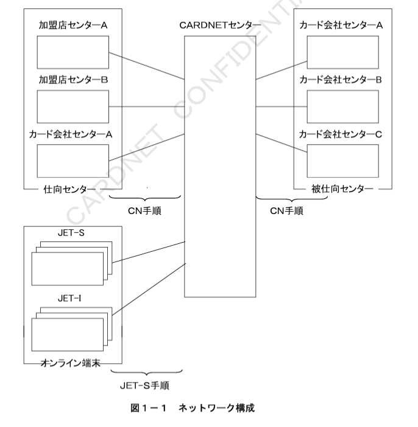
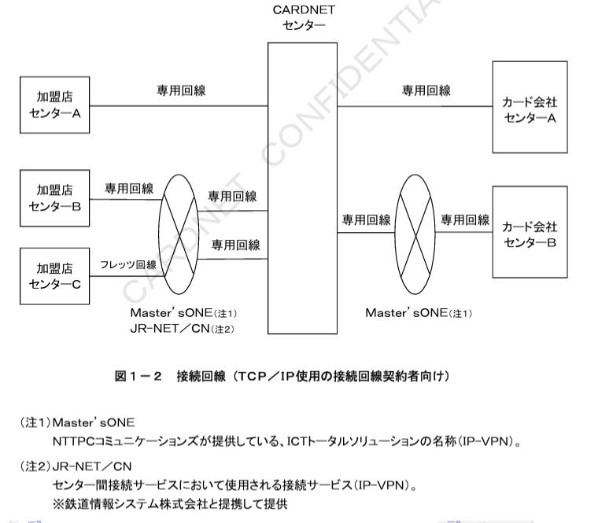

# 第１章　ダイレクト接続概要

本章では、CARDNETセンターとダイレクト接続を行う際の概要として、CARDNETセンターの概要、および接続手順であるCARDNET手順（以降CN手順と示す）の概要について定義する。

## １．１　CARDNETセンター概要

CARDNETセンターは、加盟店センター、オンライン端末、およびカード会社センターと接続することでクレジット関連業務処理をオンラインで提供する。

### １．１．１　ネットワーク構成

CARDNETセンターと加盟店センター、およびカード会社センターの接続にはCN手順を使用する。また、CARDNETセンターとオンライン端末の接続には、株式会社日本カードネットワーク独自のJET-S手順を使用する。CARDNETセンターを中心とするネットワーク構成を図１－１に示す。

**表１－１　基本サービス概要**

| 名称 | 内容 |
| --- | --- |
| オーソリ電文中継 | 加盟店センター、オンライン端末、およびカード会社センターが送信したオーソリ電文を、カード会社センターへ中継する。売上データは、加盟店より直接、各カード会社に持ち込まれる。 |
| 売上電文中継 | 加盟店センターやオンライン端末が送信した売上電文を、カード会社センターへ中継する。売上データのキャプチャリングは、カード会社センターにて行う。ただし、カード会社センターへCAFIS経由にて中継する場合には、CARDNETセンターにて行う。 |
| オンライン精査 | オンライン業務における取引金額の整合性を確認する。 |

### １．１．３　接続回線（TCP／IP使用の接続回線契約者向け）

CARDNETセンターとTCP／IPを使用しての接続回線について解説する。（X.25を使用しての接続回線については2018年5月にサービス提供を終了）  
加盟店センターとCARDNETセンターとの接続には、専用回線接続、またはMaster’s ONEもしくはJR-NET／CNの専用回線のいずれかを利用する。  
カード会社センターとCARDNETセンターとの接続には、専用回線接続、またはMaster’s ONEの専用回線のいずれかを利用する。  
回線種別、およびデータ通信速度は、接続先センターの規模やトランザクション量により決定する。また、トランザクション量によっては複数回線を使用して接続する。システム構成を図１－２に示す。  

※CARDNETセンターとTCP／IPを使用しての接続に関しての詳細は、第２章「伝送制御仕様」を参照。

### １．１．４　CARDNETセンターID

CARDNETセンターのダイレクト接続におけるセンターIDを図１－３に示す。

| 会社コード | サブコード |
| --- | --- |
| 3J021000 | 0000 |

図１－３　CARDNETセンターID

## １．２　CN手順概要

CARDNETセンターと接続先センターとの接続手順にはCN手順を使用する。CN手順は株式会社日本カードネットワークが独自に開発したセンター間接続手順である。CN手順の特徴を表１－２に、また、CN手順で定義する適用範囲を表１－３に示す。

**表１－２　CN手順の特徴**

| 特徴 | 内容 |
| --- | --- |
| 国際標準仕様の採用 | 電文構成（電文形式、電文体系）は、国際標準であるISO8583（93年度版）に準拠し、国際化へ対応する。 |
| 国内業務への対応 | 国際標準で規定されていない、日本国内独自のカード業務への対応を考慮する。 |
| 取引整合性の確認 | 取引金額の整合性を確保する為に、オンライン精査機能を装備する。 |
| データセキュリティの確保 | データの機密保持を目的とした電文の暗号化機能、および電文の改ざん防止を目的とした電文の認証機能を実装する。 |

**表１－３　CN手順の適用範囲**

| 項目 | 内容 |
| --- | --- |
| 伝送制御仕様 | TCP／IPの接続条件を定義。 |
| 電文構成仕様 | 電文形式（電文構成、電文種別、電文項目）、および電文体系を定義。 |
| センター制御仕様 | オンライン状態による送受信電文の制御仕様、開閉局の処理仕様、および時間監視の処理仕様を定義。 |
| 業務処理仕様 | 業務系電文の処理仕様、および業務処理上の考慮事項を定義。 |
| オンライン精査仕様 | オンライン精査に関するカットオーバー（日替わり）の処理仕様、および精査カウンターの管理仕様を定義。 |
| セキュリティ制御仕様 | セキュリティ基準として電文番号（電文本体、暗証番号）の処理仕様、および電文認証の処理仕様を定義。 |

### １．２．１　業務概要

CN手順がオンライン処理でサポートする業務の概要を表１－４に示す。

**表１－４　オンライン処理一覧**

**業務系**
| 処理種別 | 種別２ | 内容 |
| --- | --- | --- |
| オーソリ | | 売上処理を伴わないカード取引の判定 |
| | オーソリ（カード取引判定） | カード取引の判定を行う業務 |
| | オーソリ取消／返品 | オーソリに対する取消業務 |
| | 海外キャッシング | 海外キャッシング取引の判定を行う業務（オーソリとして扱う） |
| | 事前承認 | 将来的なカード取引を事前に判定し、与信額の枠取りを行う業務 |
| | 事前承認取消 | 事前承認に対する取消／返品業務 |
| | 承認後オーソリ | 仕向センターにて承認後売上取引をオーソリ処理として中継する業務（オンライン端末では発生しない） |
| | 承認後オーソリ取消／返品 | 承認後オーソリに対する取消／返品業務 |
| | 無効カード照会 | カードの有効性を確認する業務 |
| オーソリアドバイス | オーソリ専後一括送信 | 売上処理を伴わないカード取引の判定結果通知 |
| 売上 | | 売上処理を伴うカード取引の判定 |
| | 売上 | カード取引の判定を行う業務 |
| | 売上取消／返品 | 売上に対する取消／返品業務 |
| | 承認後売上 | 電話等でカード会社から承認を得た後に売上処理を行う業務 |
| | 承認後売上取消／返品 | 承認後売上に対する取消／返品業務 |
| 売上アドバイス | 売上専後一括送信 | 売上処理を伴うカード取引の判定結果通知 |
| 障害取消アドバイス | | オーソリ、売上取引のシステム的な取消を行う業務 |

**制御系**
| 処理種別 | 種別２ | 内容 |
| --- | --- | --- |
| オンライン精査 | | 取引金額の整合性を確認する業務 |
| 汎用通知 | 障害電文通知 | 異常電文受信時に通知を行う業務 |
| | カットオーバー依頼 | 日替処理の依頼を行う業務 |
| ネットワーク制御 | 開局 | オンライン業務の開始を行う業務 |
| | 閉局 | オンライン業務の終了を行う業務 |
| | キー交換 | 暗号化キーの交換を行う業務 |
| | カットオーバー | 日替処理を行う業務 |
| | エコーテスト | 相手センターの稼働状況を確認する業務 |

## １．３　JET-S手順概要

CARDNETセンターとオンライン端末との接続手順にはJET-S手順を使用する。JET-S手順は、株式会社日本カードネットワークが独自に開発したオンライン端末間接続手順であり、CN手順への変換はCARDNETセンターにて行う。

### １．３．１　業務概要

JET-S手順がオンライン処理でサポートする業務の概要を表１－５に示す。

**表１－５　オンライン処理一覧**

| 端末処理種別 | 種別2 | 内容 | CN手順への変換 |
| --- | --- | --- | --- |
| オーソリ |  | オーソリ端末によるカード取引の判定要求 | オーソリ |
|  | オーソリ | カード取引の判定を行う業務 | オーソリ |
|  | オーソリ取消／返品 | オーソリに対する取消／返品業務 | オーソリ取消／返品 |
|  | 事前承認 | 将来的なカード取引を事前に判定し、与信額の枠取りを行う業務 | 事前承認 |
|  | 事前承認取消 | 事前承認に対する取消業務 | 事前承認取消 |
|  | 無効カード照会 | カードの有効性を確認する業務 | 無効カード照会 |
| オーソリアドバイス | オーソリ事後一括送信 | 売上処理を伴わないカード取引の判定結果通知 | オーソリアドバイス |
| 売上 |  | ギャザリング端末によるカード取引の判定要求 | 売上 |
|  | 売上 | カード取引の判定を行う業務 | 売上 |
|  | 売上取消／返品 | 売上に対する取消／返品業務 | 売上取消／返品 |
|  | 承認後売上 | 電話等でカード会社から承認を得た後に売上処理を行う業務 | 承認後売上 |
|  | 承認後売上取消／返品 | 承認後売上に対する取消／返品業務 | 承認後売上取消／返品 |
| 売上アドバイス | 売上事後一括送信 | 売上処理を伴うカード取引の判定結果通知 | 売上アドバイス |
| 自動取消／取引通信リカバリー |  | 障害時の取消やリカバリーをする業務 | 障害取消 |

## １．４　ISO8583との関連

ISO8583は、オンラインカード業務における国際標準として電文構造や電文体系、および電文処理仕様などを規定している。CN手順は、ISO8583（93年度版）をその基本体系として、接続の容易性や拡張性、国内業務への対応等を考慮した手順である。ISO8583の適用範囲を以下に示す。

### （１）電文形式の定型化

ISO8583電文は、電文のフォーマット、および電文項目のレングスが可変であるため、業務処理の不可が大きい。CN手順では、取引タイプ毎に電文フォーマットの定型化と電文項目レングスの固定化を必要な限り実施して、接続先センターの対応を容易にした。

### （２）国内業務の対応

ISO8583に規定のない日本国内固有のデータ項目は、予備項目である国内使用予約域、および国内用追加データの各項目を拡張し定義した。

### （３）アクワイアラとイシュアの考え方

CN手順では、国内の業務形態を考慮して、ISOにおけるアクワイアラを仕向センター、イシュアを被仕向センターとして定義した。

### （４）ISO8583定義範囲外の機能仕様

ISO8583で定義範囲外の機能仕様については、オンライン業務処理の効率性や拡張性を考慮して、CN手順として独自に定義した。

## １．５　CAFIS手順との関連

CN手順は、CARDNETセンターとのセンター間接続を行うための独自手順である。CAFIS手順とは独立した手順であるが、現行業務との互換性維持や、接続先センターとのCAFISセンター経由接続への対応として、以下の点を考慮した。

### （１）センターIDの識別

CN手順においてセンターを識別するコードは、CAFIS手順で使用されているコード体系と同様とする。センターIDは、会社コード7桁＋サブコード4桁の合計11桁で構成される。

### （２）エラーコードの設定

CN手順における取引結果は、ISO8583体系エラーコードであるアクションコードを基本とする。但し、国内レスポンスコードを補足情報として設定する。

### （３）カード業務の関連

CN手順でサポートするカード業務とCAFIS手順電文の関連を表１－６に示す。

**表１－６　カード業務の関連**

| CN手順（区分） | CN手順 電文名称 | CN電文種別コード | CAFIS手順 電文名称 | CAFIS電文種別 |
| --- | --- | --- | --- | --- |
| オーソリ／オーソリアドバイス | オーソリ | C100 / C120 | 売上要求 | 3210 |
| オーソリ／オーソリアドバイス | オーソリ取消／返品 | C100 / C120 | 取消要求 | 3310 |
| オーソリ／オーソリアドバイス | 事前承認 | C100 / C120 | 与信要求 | 3110 |
| オーソリ／オーソリアドバイス | 事前承認取消 | C100 / C120 | 取消要求 | 3310 |
| オーソリ／オーソリアドバイス | 承認後オーソリ | C100 / C120 | 売上要求 | 3210 |
| オーソリ／オーソリアドバイス | 承認後オーソリ取消／返品 | C100 / C120 | 取消要求 | 3310 |
| オーソリ／オーソリアドバイス | 無効カード照会 | C100 / C120 | 与信要求 | 3110 |
| 売上／売上アドバイス | 売上 | C200 / C220 | 売上要求 | 3210 |
| 売上／売上アドバイス | 売上取消／返品 | C200 / C220 | 取消要求 | 3310 |
| 売上／売上アドバイス | 承認後売上 | C200 / C220 | 売上要求 | 3210 |
| 売上／売上アドバイス | 承認後売上取消／返品 | C200 / C220 | 取消要求 | 3310 |
| 障害取消アドバイス | 障害取消 | C420 | 取消指令 | 8910 |
| 障害取消アドバイス | 障害取消（確認） | C420 | 取消確認指令 | 8930 |

注：電文種別コードの詳細は、３．１．３「MTI（Message Type ID）」を参照。

