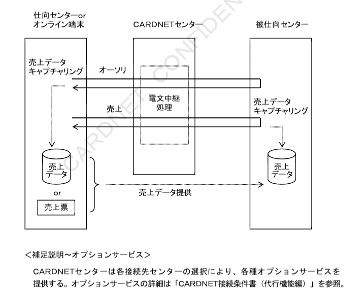

# 第１章　ダイレクト接続概要

本章では、CARDNETセンターとダイレクト接続を行う際の概要として、CARDNETセンターの概要、および接続手順であるCARDNET手順（以降CN手順と示す）の概要について定義する。

## １．１　CARDNETセンター概要

CARDNETセンターは、加盟店センター、オンライン端末、およびカード会社センターと接続することでクレジット関連業務処理をオンラインで提供する。

### １．１．１　ネットワーク構成

CARDNETセンターと加盟店センター、およびカード会社センターの接続にはCN手順を使用する。また、CARDNETセンターとオンライン端末の接続には、株式会社日本カードネットワーク独自のJET-S手順を使用する。CARDNETセンターを中心とするネットワーク構成を図１－１に示す。

**表１－１　基本サービス概要**

| 名称 | 内容 |
| --- | --- |
| オーソリ電文中継 | 加盟店センター、オンライン端末、およびカード会社センターが送信したオーソリ電文を、カード会社センターへ中継する。売上データは、加盟店より直接、各カード会社に持ち込まれる。 |
| 売上電文中継 | 加盟店センターやオンライン端末が送信した売上電文を、カード会社センターへ中継する。売上データのキャプチャリングは、カード会社センターにて行う。ただし、カード会社センターへCAFIS経由にて中継する場合には、CARDNETセンターにて行う。 |
| オンライン精査 | オンライン業務における取引金額の整合性を確認する。 |

