# 第２章　伝送制御仕様

本章では、CN手順におけるTCP／IPの接続条件を定義する。  
仕向センター／被仕向センターのCARDNETセンターへの接続条件はTCP／IP接続となる。  
※X.25を使用した接続回線は2018年5月でサービス提供を終了し、以降TCP／IPを使用した接続回線へ切換え済。  

仕向業務も被仕向業務も行っている場合は、２．２被仕向センター接続を参照ください。

## ２．１　仕向センター接続

### ２．１．１　接続概要

TCP／IPを使用する場合の接続概要について記述します。

### ２．１．１．１　ネットワーク構成

CARDNETセンターとの接続にTCP／IPを使用する場合には、以下のネットワークのいずれかを利用して接続します。  
各ネットワークの詳細につきましては、２．１．５以降をご参照ください。

- Master’s ONE網（以降「Master’s ONE」と記す）  
- Master’s ONE網＋セキュアインターネットVPN（以降「SIV」と記す）  
  ※株式会社NTTPCコミュニケーションズ社が提供  
- JR-NET／CN  
  ※鉄道情報システム株式会社が提供

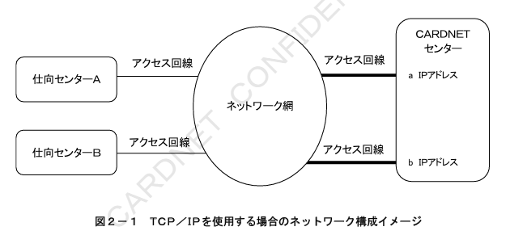

### ２．１．１．２　接続回線

仕向センターと各ネットワークの接続およびCARDNETセンターと各ネットワークの接続は、各ネットワーク用のアクセス回線をラウンドロビン方式で使用します。  
ネットワーク毎に使用可能なアクセス回線につきましては、２．１．５以降をご参照ください。

### ２．１．２　プロトコル仕様

TCP／IPを使用してCARDNETセンターと接続する際のプロトコル仕様について記述します。

#### ２．１．２．１　IP（Internet Protocol）レイヤ

IPレイヤにおける仕様は以下のとおりです。

##### ２．１．２．１．１　仕様基準

IPの仕様については、RFC791に準拠します。  
仕様の詳細については、同ドキュメントをご参照ください。

##### ２．１．２．１．２　IPアドレスの管理

IPアドレスは、各ネットワークより付与されたIPアドレスを使用します。  
また、仕向センターとCARDNETセンターはお互いのIPアドレスを事前に交換します。  
CARDNETセンターでは、本番業務で使用するIPアドレスとは別に、試験用のIPアドレスを保有しています。  
試験を実施する際には仕向センター側で宛先のIPアドレスを変更する必要があります。  

CARDNETセンターは各ネットワークとの接続回線障害などに備えて、複数回線で接続し、回線毎に異なるIPアドレスを保有します。

#### ２．１．２．２　TCP（Transmission Control Protocol）レイヤ

TCPレイヤにおける仕様は以下のとおりです。

##### ２．１．２．２．１　仕様基準

TCPの仕様については、RFC793に準拠します。  
仕様の詳細については、同ドキュメントをご参照ください。

##### ２．１．２．２．２　ポート番号

仕向センター及びCARDNETセンターが使用するポート番号について以下に示します。

（１）仕向センターがコネクション発行を行う場合

仕向センターからコネクションを発行する場合は、「自ポート番号は任意」、「宛先ポート番号は2200 or 5100」でコネクション確立を行います。  
CARDNETセンターは、待ちポート番号を2200 or 5100にてコネクション要求を待ちます。  

図２－２に「仕向センター発行コネクションのポート番号」を示します。  

※CARDNETセンター接続申込時に、2200と5100より宛先ポート番号をご選択いただきます。CARDNETセンターはご選択いただいたポート番号を待ちポート番号に設定します。

（２）CARDNETセンターがコネクション発行を行う場合

CARDNETセンターからコネクションを発行する場合は、「自ポート番号は任意」、「宛先ポート番号は2200 or 5100」にてコネクション確立を行います。  
仕向センターは、待ちポート番号を2200 or 5100にてコネクション要求を待ちます。  

図２－３に「CARDNETセンター発行コネクションのポート番号」を示します。  

※仕向センターがCARDNETセンター接続申込時にご選択いただいた、2200 or 5100を宛先ポート番号として使用します。ご選択いただいたポート番号を待ちポート番号に設定してください。

##### ２．１．２．３　TCP／IPパケットの送受信方法

パケット送信側および受信側共に、ソケットインターフェースによるストリーム通信を行う仕様とします。  

パケット送信側は、CARDNET手順の電文を送信することとし、パケット受信側は、CARDNET手順の共通制御ヘッダ「全体電文長」によりデータの受信完了を確認します。  

「全体電文長」と受信したデータ長を比較した結果、受信した電文長が全体電文長より短い場合には、残るデータの受信を行います。  

また、「全体電文長」と受信したデータ長を比較した結果、受信した電文長が全体電文長を超える場合には、「全体電文長」分のデータまでを1つの電文として処理し、継続するデータを2つ目の電文として処理を行います。

### ２．１．３　コネクションの方式

コネクションの方式について記述します。

#### ２．１．３．１　コネクションの確立

コネクションは、はじめにCARDNETセンターからのコネクションを確立し、その後仕向センターから確立してください。CARDNETコネクションは接続申込書に記載いただいた業務開始日より接続を開始します。

CARDNETセンターは、CARDNETセンターからのコネクションが確立した仕向センターのみ、仕向センターからのコネクションを確立します。よってコネクション確立の際は、CARDNETセンターからのコネクション確立を優先してください。

##### ２．１．３．１．１　CARDNETセンターからのコネクションの確立

CARDNETセンターから確立したコネクション（以降「CARDNETコネクション」と記す）は、CARDNETセンターから発行する電文、およびKeep Aliveの送信に使用します。CARDNETセンターからCARDNETコネクションを使用して送信する電文を以下に示します。

- 開局要求  
- 閉局要求  
- キー交換要求  
- カットオーバー要求  
- オンライン精査要求  
- エコーテスト要求  
- 障害電文通知  

CARDNETセンターからの要求電文に対する仕向センターからの応答電文の送信は、CARDNETコネクションおよび仕向コネクションのどちらからでも送信を可能とします。  
ただしCARDNETコネクションに、仕向センターより要求電文および通知電文が送信された場合、電文を破棄します。  

図２－４に１コネクションでの確立シーケンスを示します。

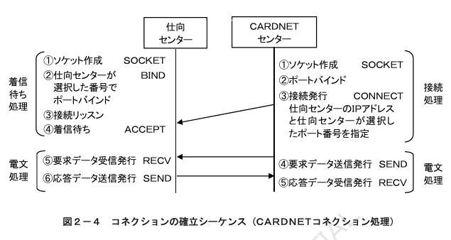

CARDNETセンターからのコネクション確立が失敗した場合は、一定間隔毎にConnect要求を送信し、コネクション確立を試みます。

図２－５にコネクション確立要求のリトライシーケンスを示します。

##### ２．１．３．１．２　仕向センターからのコネクションの確立

仕向センターから確立したコネクション（以降「仕向コネクション」と記す）は、仕向センターから発行する電文の送信に使用します。  

仕向コネクションの確立は任意のタイミングで実施することができます。コネクションの確立方法は、取引の発生都度、仕向コネクションを確立する方式および、予め複数のコネクションを確立しておく方式のいずれも可能です。ただし、いずれの場合でも、CARDNETセンターからの応答電文を受信するまでは仕向コネクションの接続を維持してください。  

図２－６に１コネクションでの確立シーケンスを示します。

#### ２．１．３．２　最大コネクション数

仕向センターおよびCARDNETセンターから確立できる最大コネクション数について以下に示します。

##### ２．１．３．２．１　CARDNETコネクション数

CARDNETコネクションは、仕向センター側のIPアドレス１に対してCARDNETセンター側のIPアドレス毎に１コネクションを確立し、合計２コネクションを使用します。

図２－７、図２－８にCARDNETセンターからのコネクションを示します。

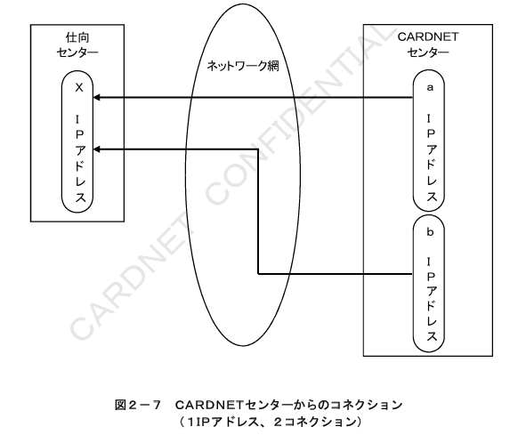

##### ２．１．３．２．２　仕向コネクション数

仕向コネクションは、トランザクション量に基づきCARDNETセンターと事前に調整の上、最大数を決定します。  

IPアドレス設定時は、仕向センター側のIPアドレスがCARDNETセンターの２つのIPアドレスを指定できるようにします。  

図２－９に１IPアドレス２コネクション、図２－１０に複数IPアドレス複数コネクション時の仕向センターからのコネクションを示します。

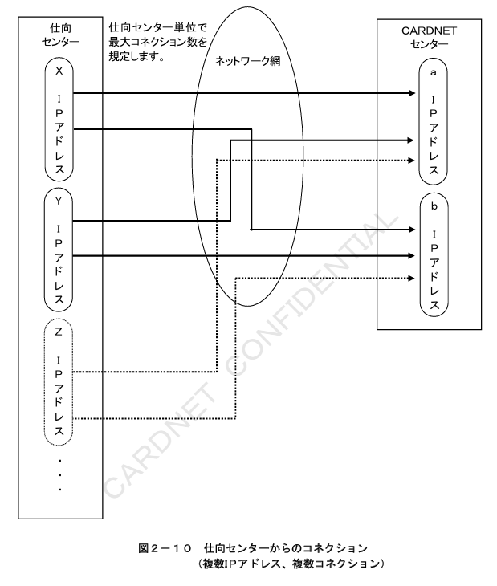

#### ２．１．３．３　コネクション選択

CARDNETセンターでは、要求電文を受信したコネクションと応答電文を送信するコネクションの関連付けをしません。  
従って、仕向センターでの要求と応答の紐付けは、コネクションではなく、CARDNET手順における要求／応答電文の取引特定条件に基づいて行う必要があります。  
CARDNETセンターにおける応答電文送信コネクションの選択方式および仕向コネクション未確立時の処理方式について、以下に示します。

##### ２．１．３．３．１　コネクション選択方式（CARDNETコネクション）

要求電文は送信可能なCARDNETコネクションをラウンドロビンに使用して送信します。  
また、仕向センターに複数のIPアドレスが存在する場合においても、仕向センターのIPアドレスを意識せず、ラウンドロビンに使用して送信します。  

ラウンドロビン方式によるCARDNETコネクションの選択方式を図２－１１に示します。

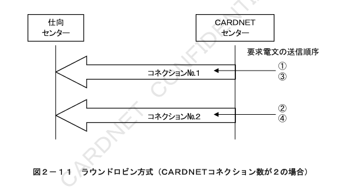

##### ２．１．３．３．２　コネクション選択方式（仕向コネクション）

仕向センターからCARDNETセンターへの要求電文は、複数コネクション接続の場合、送信可能な仕向コネクションをラウンドロビン方式で送信することを推奨します。  
仕向コネクションの一部が断、または未確立の場合、確立済みの仕向コネクションを使用して取引を継続します。  

ラウンドロビン方式による仕向コネクションの選択方式を図２－１２に示します。

CARDNETセンターから応答電文を送信する際に、仕向コネクションが全て切断されている場合、CARDNETセンター内にて応答電文を破棄します。  

仕向コネクションが全て切断されている場合の処理を図２－１３に示します。

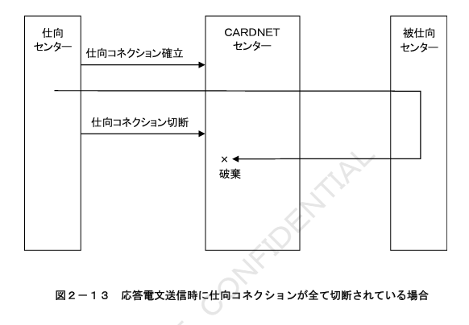

#### ２．１．３．４　コネクション切断方式

コネクションの切断は、コネクションを確立したセンター側にて任意のタイミングで行います。  
ただし、CARDNETセンターの計画停止時、およびCARDNETセンターでのKeep Alive監視による回線障害の検知時には、CARDNETセンターから全てのコネクションを切断します。

##### ２．１．３．４．１　CARDNETセンター計画停止時のコネクション切断方式

CARDNETセンター計画停止時のコネクション切断シーケンスを図２－１４に示します。  
（例：コネクション数が３の仕向センターの場合）

##### ２．１．３．４．２　回線障害検知時のコネクション切断方式

CARDNETセンターにてコネクションのエラーが検知された場合のコネクション切断シーケンスを図２－１５に示します。  

仕向センター側のIPアドレス１に対してCARDNETコネクションにてエラーが検知された場合、CARDNETコネクションが確立できない仕向センター側のIPアドレスからCARDNETセンター側のIPアドレス単位で全ての仕向コネクションを切断します。  

（例：X IPアドレスの仕向コネクション数が２、Y IPアドレスの仕向コネクション数が２の仕向センターの場合）

#### ２．１．３．５　コネクション数超過時の処理

CARDNETセンターは、事前に取り決めた最大コネクション数を超えるコネクション要求を受信した場合、既存の仕向コネクションを全て切断し、新たに確立されたコネクションで通信を行います。  

仕向コネクション数が２つの仕向センターから３つ目のコネクション要求を受信した場合のシーケンスを図２－１６に示します。

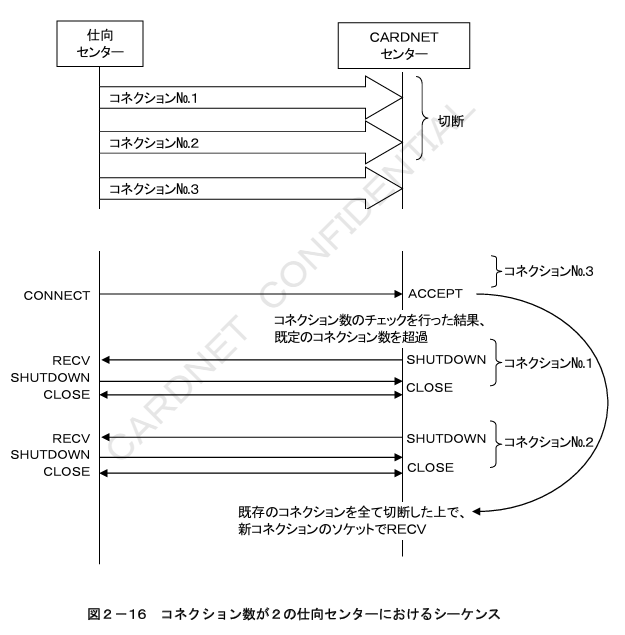

#### ２．１．４　エラー検知

コネクションのエラーが発生した場合の対応について記述します。

##### ２．１．４．１　エラー検知の方法

エラーの検知は、各センターが、それぞれ確立したコネクションについて行うものとし、コネクションからのCLOSE要求受信、RESET要求受信、データ送信リトライ機能およびKeep Alive機能を使用して行います。  
Keep Aliveの送信は無通信状態においてのみ行い、データの通信中にはKeep Aliveの送信を行いません。  

※Keep Alive機能の詳細については、RFC1122をご参照ください。

###### ２．１．４．１．１　仕向センターでの状態監視方法

仕向コネクションを長時間にわたって維持する場合は、Keep Alive機能により仕向コネクションの状態監視を行うことができます。Keep Aliveの送信におけるタイマー値およびカウンター値は仕向センターにて任意に設定できます。

###### ２．１．４．１．２　CARDNETセンターでの状態監視方法

CARDNETセンターは、Keep Alive機能により、CARDNETコネクションの状態監視を行います。Keep Aliveの送信におけるタイマー値およびカウンター値を表２－１および表２－２に示します。

**表２－１　Keep Aliveの送信タイマー**

| タイマー名称 | 内容 | タイマー値 | タイムアウト時の処理 |
| --- | --- | --- | --- |
| T011 無通信監視タイマー | 直近のAck送受信からの無通信状態監視時間 | 15秒 | Keep Aliveパケットを送信する |
| T012 Keep AliveのAck応答待ちタイマー | Keep Aliveパケット送信後のAck応答待ち監視時間 | 15秒 | Keep Aliveパケットを再度送信する |

**表２－２　Keep Aliveの送信カウンター**

| カウンター名称 | 内容 | カウンター値 | リトライアウト時の処理 |
| --- | --- | --- | --- |
| C011 Keep Alive送信カウンター | Keep Aliveパケットの送信回数 | 3回 | コネクションを切断する |

Keep Alive送信から45秒間無応答の場合には、コネクションを切断します。

##### ２．１．４．２　CARDNETセンターでのエラー検出時の対応

CARDNETセンターから確立したコネクションが切断されたことを検知した場合は、Connect要求を送信しコネクション確立を試みます。

#### ２．１．５　Master’s ONE接続

CARDNETセンターとの接続にMaster’s ONEを使用する場合の補足事項について記述します。

##### ２．１．５．１　ネットワーク構成

Master’s ONEを使用する場合のネットワーク構成を図２－１８に示します。

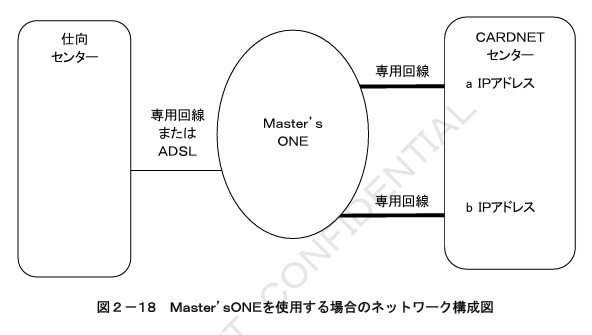

##### ２．１．５．２　接続回線

仕向センターとMaster’s ONEとの接続は専用回線またはADSLを使用します。  
CARDNETセンターとMaster’s ONEとの接続は専用線（２回線）を使用します。  

なお、ダイアルアップ接続が必要となるISDN回線については、CARDNETセンターからのコネクション確立を安定して行うことが出来ないため、使用不可となります。

#### ２．１．６　SIV併用接続

CARDNETセンターとの接続にMaster’s ONEとSIVを併用する場合の補足事項について記述します。  

※SIVによる接続は、Master’s ONEとの併用時にのみご利用可能です。

##### ２．１．６．１　ネットワーク構成

Master’s ONEとSIVを併用する場合のネットワーク構成を図２－１９に示します。

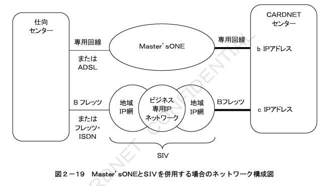

##### ２．１．６．２　SIVとの接続回線

仕向センターとSIVとの接続はBフレッツまたはフレッツ・ISDNを使用します。  
CARDNETセンターとSIVとの接続はBフレッツを使用します。

##### ２．１．６．３　CARDNETコネクション確立

CARDNETコネクションは、仕向センター側のIPアドレス１に対してCARDNETセンター側のIPアドレス毎に１コネクションを確立し、合計２コネクションを使用します。  

図２－２０にCARDNETセンターからのコネクションを示します。

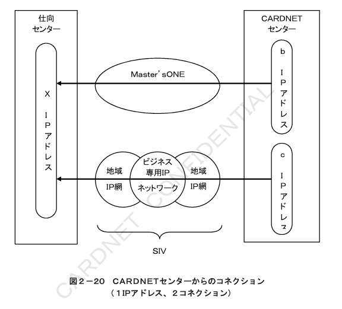

##### ２．１．６．４　仕向コネクション確立

仕向コネクションは、CARDNETセンター側のIPアドレス２つに対して仕向センター側のIPアドレス毎にMaster’s ONEおよびSIVを使用してコネクションを確立できるようにします。  

CARDNETセンターから仕向センターへの応答電文は、ネットワークを意識せずに、送信可能な仕向コネクションをラウンドロビンに使用して送信します。  

図２－２１に１IPアドレス２コネクション時の仕向センターからのコネクションを示します。

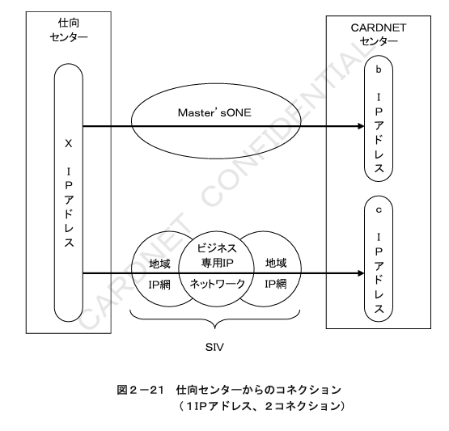

#### ２．１．７　JR‑NET／CN接続

CARDNETセンターとの接続にJR‑NET／CNを使用する場合の補足事項について記述します。  

##### ２．１．７．１　ネットワーク構成

JR‑NET／CNを使用する場合のネットワーク構成を図２－２２に示します。  
JR‑NET／CNを使用する場合は、バックアップ回線としてTINS回線またはデータコネクトが利用可能です。

##### ２．１．７．２　JR‑NET／CNとの接続回線およびバックアップ回線

仕向センターとJR‑NET／CNとの接続、CARDNETセンターとJR‑NET／CNとの接続にて使用可能な接続回線、およびバックアップ回線の組合せパターンを表２－３に示します。  

JR‑NET／CNとの接続にフレッツ・ISDNを使用される場合、バックアップ回線は同一回線を併用します。

**表２－３　JR-NET／CNとの接続回線およびバックアップ回線の組合せパターン**

| パターン | 仕向センター〜JR-NET／CN 接続回線 | 仕向センター〜JR-NET／CN バックアップ回線 | JR-NET／CN〜CARDNETセンター 接続回線 | JR-NET／CN〜CARDNETセンター バックアップ回線 |
|---|---|---|---|---|
| 1 | 専用回線 | なし | 専用回線（2回線） | なし |
| 2 | 専用回線 | INS回線 データコネクト | 専用回線（2回線） | INS回線（2回線） データコネクト（2回線） |
| 3 | フレッツ・ISDN | INS回線（接続回線と併用） データコネクト | 専用回線（2回線） | INS回線（1回線） データコネクト（1回線） |

#### ２．１．７．３　バックアップ回線切替方式

##### ２．１．７．３．１　JR-NET／CNとの接続に専用回線を使用する場合

JR-NET／CNからバックアップ回線への切替および切戻しは、仕向センター側のルーターとCARDNETセンター側のルーター間で自動的に実施いたします。  
ルーター間での切替および切戻しは、ルーター（IPアドレス）単位で実施いたします。  
バックアップ回線のINSまたはデータコネクトの発呼および切断は、仕向センター側のルーターにて実施いたします。  

バックアップ回線への切替および切戻しに伴うコネクションの切断は実施いたしません。  

仕向センターおよびCARDNETセンターは、ネットワーク（回線）の切替および切戻しを意識せずに、電文の送受信が可能です。  

図２－２３、２－２４にJR-NET／CNからバックアップ回線への切替例を示します。

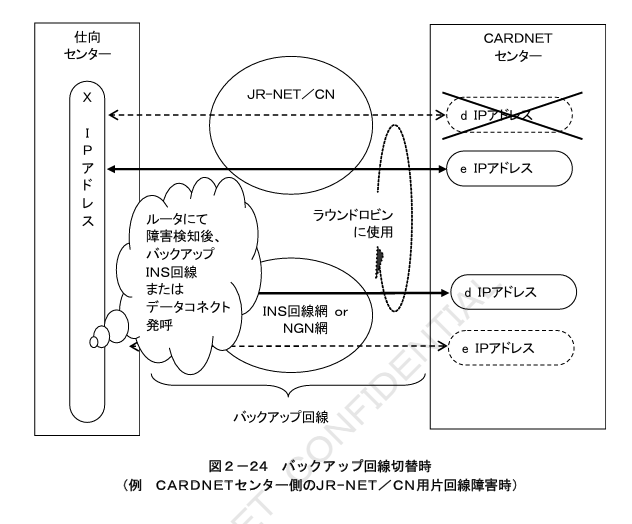

##### ２．１．７．３．２　JR-NET／CNとの接続にフレッツ・ISDNを使用する場合

JR-NET／CNからバックアップ回線への切替および切戻しは、仕向センター側のルーターとCARDNETセンター側のルーター間で自動的に実施いたします。  
ルーター間での切替および切戻しは、ルーター（IPアドレス）単位で実施いたします。  
バックアップ回線への切替は、CARDNETセンター側IPアドレスの１アドレスに対してのみ実施です。  
バックアップ回線のINSまたはデータコネクトの発呼および切断は、仕向センター側のルーターにて実施いたします。  

バックアップ回線への切替および切戻しに伴うコネクションの切断は実施いたしません。  

仕向センターおよびCARDNETセンターは、ネットワーク（回線）の切替および切戻しを意識せずに、電文の送受信が可能です。  

図２－２５、２－２６、２－２７、２－２８にJR-NET／CNからバックアップ回線への切替例を示します。

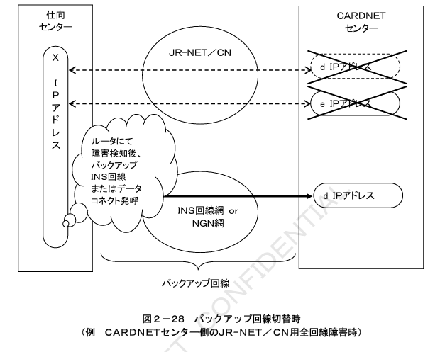

