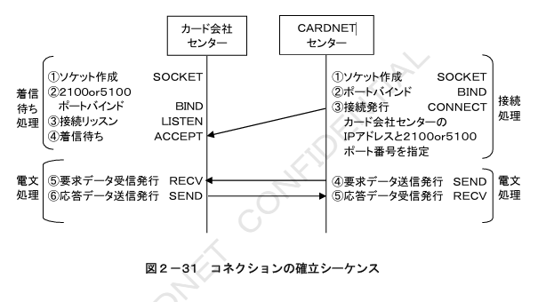
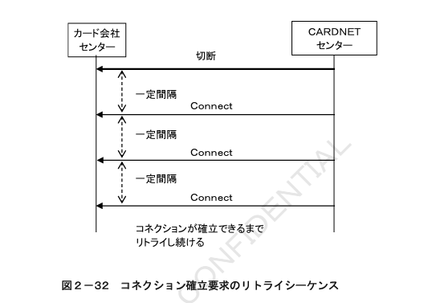

#### ２．２　被仕向センター接続

##### ２．２．１　接続概要

TCP／IPを使用する場合の接続概要について記述します。

###### ２．２．１．１　ネットワーク構成

CARDNETセンターとの接続にTCP／IPを使用する場合には、「Master’s ONEサービス」を利用して接続します。  

TCP／IPを使用する場合のネットワーク構成を図２－２９に示します。

###### ２．２．１．２　接続回線

CARDNETセンターとの接続はMaster’s ONEの専用回線を使用します。  
カード会社センターとMaster’s ONEとの接続はMaster’s ONEの専用回線を使用します。

#### ２．２．２　プロトコル仕様

TCP／IPを使用してCARDNETセンターと接続する際のプロトコル仕様について記述します。

##### ２．２．２．１　IP（Internet Protocol）レイヤ

IPレイヤにおける仕様は以下のとおりです。

###### ２．２．２．１．１　仕様基準

IPの仕様については、RFC791に準拠します。  
仕様の詳細については、同ドキュメントをご参照ください。

###### ２．２．２．１．２　IPアドレスの管理

IPアドレスは、Master’s ONEより付与されたMaster’s ONEグローバルアドレス（ホストIPアドレス）を使用します。  
また、カード会社センターとCARDNETセンターはお互いのIPアドレスを事前に交換します。  
CARDNETセンターでは、本番業務で使用するIPアドレスとは別に試験用のIPアドレスを保有しています。試験を実施する際にはカード会社センター側で宛先のIPアドレスを変更する必要があります。  

CARDNETセンターはMaster’s ONEとの接続回線障害などに備えて、Master’s ONEと複数回線で接続し、回線毎に異なるIPアドレスを保有します。

##### ２．２．２．２　TCP（Transmission Control Protocol）レイヤ

TCPレイヤにおける仕様は以下のとおりです。

###### ２．２．２．２．１　仕様基準

TCPの仕様については、RFC793に準拠します。  
仕様の詳細については、同ドキュメントをご参照ください。

###### ２．２．２．２．２　ポート番号

CARDNETセンターからは、「自ポート番号は任意」「宛先ポート番号は2100 or 5100」にてコネクション確立を行います。  
カード会社センターは、待ちポート番号を2100 or 5100でコネクション要求を待ちます。  

図２－３０にコネクションのポート番号を示します。  

※CARDNETセンター接続申込時に、2100と5100より宛先ポート番号をご選択いただきます。ご選択いただいたポート番号を待ちポート番号に設定してください。

＜ご留意事項＞

CARDNETセンター以外とのTCP／IP接続がある場合は、待ちポート番号「2100 or 5100」以外を指定するようカード会社センターにて調整してください。  

TCPコネクションの確立方式については、「２．２．３　コネクション方式」をご参照ください。

##### ２．２．２．３　TCP／IPパケットの送受信方法

パケット送信側および受信側共に、ソケットインターフェースによるストリーム通信を行う仕様とします。  
パケット送信側は、CARDNET手順の電文を送信することとし、パケット受信側は、CARDNET手順の共通制御ヘッダ「全体電文長」によりデータの受信完了を確認します。  

「全体電文長」と受信したデータ長を比較した結果、受信した電文長が全体電文長より短い場合には、残るデータの受信を行います。  

また、「全体電文長」と受信したデータ長を比較した結果、受信した電文長が全体電文長を超える場合には、「全体電文長」分のデータまでを１つの電文として処理し、継続するデータを２つ目の電文として処理を行います。

#### ２．２．３　コネクションの方式

コネクションの方式について記述します。

##### ２．２．３．１　コネクションの確立

TCPコネクションの確立は、CARDNETセンターからカード会社センターに向けてコネクション確立要求を発行することにより行います。  

図２－３１に１コネクションの確立シーケンスを示します。

CARDNETセンターからのコネクション確立が失敗した場合は、一定間隔毎にConnect要求を送信し、コネクション確立を試みます。  

図２－３２にコネクション確立要求のリトライシーケンスを示します。

##### ２．２．３．２　最大コネクション数

コネクション数は、トランザクション量に基づきCARDNETセンターと事前に調整の上、最大数を決定します。  

図２－３３に１IPアドレス４コネクション、図２－３４に複数IPアドレス複数コネクション時のCARDNETセンターからのコネクションを示します。

