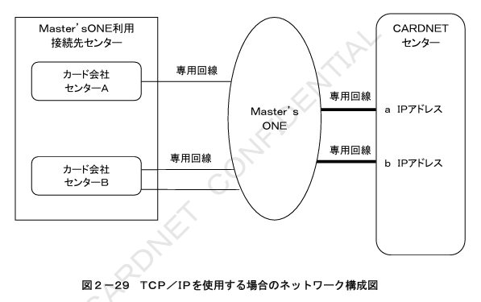
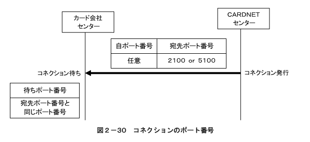
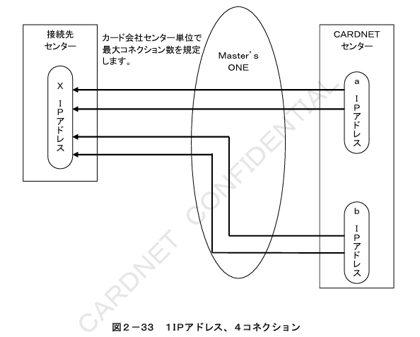
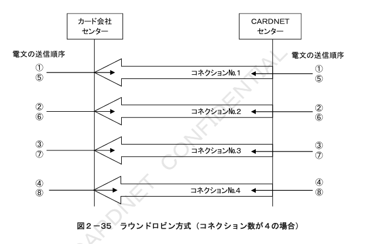

#### ２．２　被仕向センター接続

##### ２．２．１　接続概要

TCP／IPを使用する場合の接続概要について記述します。

###### ２．２．１．１　ネットワーク構成

CARDNETセンターとの接続にTCP／IPを使用する場合には、「Master’s ONEサービス」を利用して接続します。  

TCP／IPを使用する場合のネットワーク構成を図２－２９に示します。

###### ２．２．１．２　接続回線

CARDNETセンターとの接続はMaster’s ONEの専用回線を使用します。  
カード会社センターとMaster’s ONEとの接続はMaster’s ONEの専用回線を使用します。

#### ２．２．２　プロトコル仕様

TCP／IPを使用してCARDNETセンターと接続する際のプロトコル仕様について記述します。

##### ２．２．２．１　IP（Internet Protocol）レイヤ

IPレイヤにおける仕様は以下のとおりです。

###### ２．２．２．１．１　仕様基準

IPの仕様については、RFC791に準拠します。  
仕様の詳細については、同ドキュメントをご参照ください。

###### ２．２．２．１．２　IPアドレスの管理

IPアドレスは、Master’s ONEより付与されたMaster’s ONEグローバルアドレス（ホストIPアドレス）を使用します。  
また、カード会社センターとCARDNETセンターはお互いのIPアドレスを事前に交換します。  
CARDNETセンターでは、本番業務で使用するIPアドレスとは別に試験用のIPアドレスを保有しています。試験を実施する際にはカード会社センター側で宛先のIPアドレスを変更する必要があります。  

CARDNETセンターはMaster’s ONEとの接続回線障害などに備えて、Master’s ONEと複数回線で接続し、回線毎に異なるIPアドレスを保有します。

##### ２．２．２．２　TCP（Transmission Control Protocol）レイヤ

TCPレイヤにおける仕様は以下のとおりです。

###### ２．２．２．２．１　仕様基準

TCPの仕様については、RFC793に準拠します。  
仕様の詳細については、同ドキュメントをご参照ください。

###### ２．２．２．２．２　ポート番号

CARDNETセンターからは、「自ポート番号は任意」「宛先ポート番号は2100 or 5100」にてコネクション確立を行います。  
カード会社センターは、待ちポート番号を2100 or 5100でコネクション要求を待ちます。  

図２－３０にコネクションのポート番号を示します。  

※CARDNETセンター接続申込時に、2100と5100より宛先ポート番号をご選択いただきます。ご選択いただいたポート番号を待ちポート番号に設定してください。

＜ご留意事項＞

CARDNETセンター以外とのTCP／IP接続がある場合は、待ちポート番号「2100 or 5100」以外を指定するようカード会社センターにて調整してください。  

TCPコネクションの確立方式については、「２．２．３　コネクション方式」をご参照ください。

##### ２．２．２．３　TCP／IPパケットの送受信方法

パケット送信側および受信側共に、ソケットインターフェースによるストリーム通信を行う仕様とします。  
パケット送信側は、CARDNET手順の電文を送信することとし、パケット受信側は、CARDNET手順の共通制御ヘッダ「全体電文長」によりデータの受信完了を確認します。  

「全体電文長」と受信したデータ長を比較した結果、受信した電文長が全体電文長より短い場合には、残るデータの受信を行います。  

また、「全体電文長」と受信したデータ長を比較した結果、受信した電文長が全体電文長を超える場合には、「全体電文長」分のデータまでを１つの電文として処理し、継続するデータを２つ目の電文として処理を行います。

#### ２．２．３　コネクションの方式

コネクションの方式について記述します。

##### ２．２．３．１　コネクションの確立

TCPコネクションの確立は、CARDNETセンターからカード会社センターに向けてコネクション確立要求を発行することにより行います。  

図２－３１に１コネクションの確立シーケンスを示します。

CARDNETセンターからのコネクション確立が失敗した場合は、一定間隔毎にConnect要求を送信し、コネクション確立を試みます。  

図２－３２にコネクション確立要求のリトライシーケンスを示します。

##### ２．２．３．２　最大コネクション数

コネクション数は、トランザクション量に基づきCARDNETセンターと事前に調整の上、最大数を決定します。  

図２－３３に１IPアドレス４コネクション、図２－３４に複数IPアドレス複数コネクション時のCARDNETセンターからのコネクションを示します。

##### ２．２．３．３　コネクション選択

CARDNETセンター及びカード会社センターは、送信可能なコネクションをラウンドロビンに使用して電文を送信します。  
送信先センターに複数のIPアドレスが存在する場合においても、送信先センターのIPアドレスを意識せずにコネクションをラウンドロビンに使用して送信します。  

ラウンドロビン方式によるコネクションの選択方式を図２－３５に示します。

##### ２．２．３．４　コネクションの切断

カード会社センターからコネクションの切断が行われた場合には、CARDNETセンターから新たなコネクションの確立を行います。  

また、CARDNETセンターの計画停止時、およびCARDNETセンターでのKeep Alive監視による全国障害の検知時には、CARDNETセンターから全てのコネクションを切断します。  

CARDNETセンター計画停止時のコネクション切断シーケンスを図２－３６に示します。  
（例：コネクション数が２の場合）

### 2.2.3.5 コネクション数超過時の処理

カード会社センターは、事前に取り決めた最大コネクション数を超えるコネクション要求を受信した場合、該当IPアドレスにおける既存のコネクションを全て切断し、新たに確立されたコネクションで通信を行います。

従って、カード会社センター側では決められた数に対して、（n+1）コネクションまで受け付けることが必要となります。

コネクション数が２つの取り決めに対して、CARDNETセンターから３つ目のコネクション要求を受信した場合のシーケンスを図２−３７に示します。

## 2.2.4 エラー検知

コネクションのエラーが発生した場合の対応について記述します。

### 2.2.4.1 エラー検知の方法

エラーの検知は、各センターが行うものとし、コネクションからのCLOSE要求受信、RESET要求受信、データ送信リトライ機能およびKeep
Alive機能を使用して行います。Keep
Aliveの送信は無通信状態においてのみ行い、データの通信中にはKeep
Aliveの送信を行いません。

※Keep Alive機能の詳細については、RFC1122をご参照ください。

#### 2.2.4.1.1 カード会社センターでの状態監視方法

Keep Alive機能によりコネクションの状態監視を行うことができます。Keep
Aliveの送信におけるタイマー値およびカウンター値はカード会社センターにて任意に設定できます。

#### 2.2.4.1.2 CARDNETセンターでの状態監視方法

CARDNETセンターは、Keep
Alive機能により、コネクションの状態監視を行います。Keep
Aliveの送信におけるタイマー値およびカウンター値を表2-4および表2-5に示します。
**表2-4 Keep Aliveの送信タイマー**

| タイマー名称 | 内容 | タイマー値 | タイムアウト時の処理 |
|---|---|---|---|
| T011 無通信監視タイマー | 直近の送受信からの無通信状態監視時間 | 15秒 | Keep Aliveパケットを送信する |
| T012 Keep AliveのAck応答待ちタイマー | Keep Aliveパケット送信後のAck応答待ち監視時間 | 15秒 | Keep Aliveパケットを再度、送信する |

**表2-5 Keep Aliveの送信カウンター**

| カウンター名称 | 内容 | カウンター値 | リトライアウト時の処理 |
|---|---|---|---|
| C011 Keep Alive送信カウンター | Keep Aliveパケットの送信回数 | 3回 | コネクションを切断する |

Keep Alive送信から45秒間無応答の場合には、コネクションを切断します。

### 2.2.4.2 CARDNETセンターでのエラー検出時の対応

CARDNETセンターでコネクションが切断されたことを検知した場合は、Connect要求を送信しコネクション確立を試みます。
