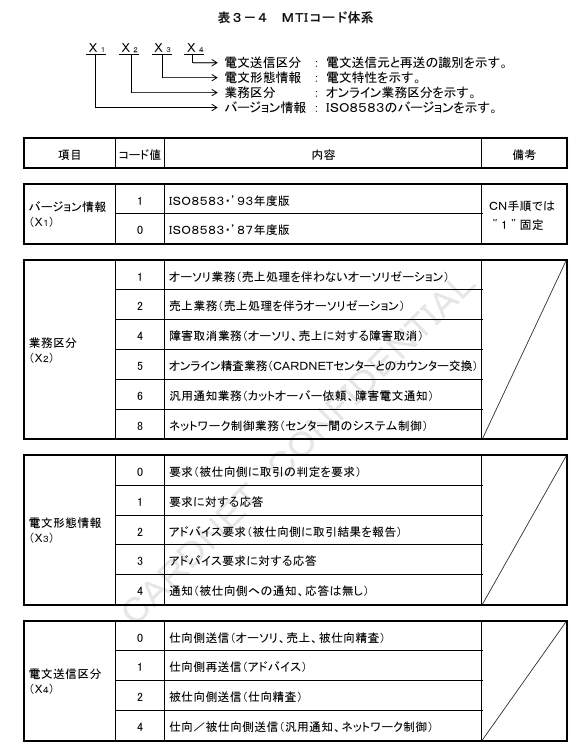
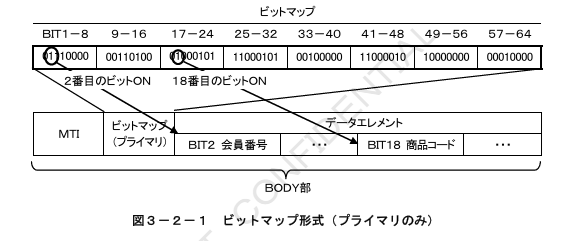

# 第3章 電文構成仕様

本章では、CN手順で使用する電文について、電文形式、電文体系、データコード、および表記方法を定義する。

## 3.1 電文形式

CN手順で定義するメッセージは、ヘッダー部とBODY部より構成される。ヘッダー部は、共通制御ヘッダーと業務共通ヘッダーにて構成する。BODY部は、ISO8583（’93年度版）で規定されたMTI（電文タイプ）、ビットマップ、およびデータエレメントにて構成する。

★【図3-1】

### 3.1.1 共通制御ヘッダー

共通制御ヘッダーは、ルーティング情報やレングス情報等が設定される。共通制御ヘッダーの形式および各フィールドの内容を表3-1に定義する。

**表3-1 共通制御ヘッダー形式**

| 項番 | 項目 | 属性・桁数 | 説明 |
|---|---|---|---|
| 1 | ヘッダータイプ | JIS8, an2 2バイト | ヘッダー形式とバージョン情報。ヘッダータイプによりヘッダーレイアウトが決定。 |
| 2 | 全体電文長 | BCD, n4 2バイト | 暗号化後の送信電文全体の長さ。 |
| 3 | 差出センターID | JIS8, anp11 11バイト | 電文の送信元センターID。ただし、オンライン端末取引の要求電文の場合はカードネットセンターID固定となる。 |
| 4 | 宛先センターID | JIS8, anp11 11バイト | 電文の送信先センターID。 |
| 5 | 加盟店契約会社コード | JIS8, anp11 11バイト | 加盟店が加盟契約をしているカード会社を識別するコード。 |
| 6 | 送信日時 | BCD, n14 7バイト | 電文を送信した時間（YYYYMMDDhhmmss）。 |
| 7 | モードフラグ | BCD, n2 1バイト | システムの稼働モード（本番モード／試験モード）。 |
| 8 | 予備 | JIS8, anp2 2バイト | 予備フィールド。 |

注1：各項目の属性は、3.4「データコード」、3.5「表記方法」を参照。  
注2：各項目の詳細説明は、第8章「電文項目説明」を参照。

### 3.1.2 業務共通ヘッダー

業務共通ヘッダーは、電文種別、暗号化情報、認証情報、ユーザ情報等が設定される。業務共通ヘッダーの形式および各フィールドの内容を表3-2に定義する。

**表3-2 業務共通ヘッダー形式**

| 項番 | 項目 | 属性・桁数 | 説明 |
|---|---|---|---|
| 1 | ヘッダータイプ | JIS8, an2 2バイト | ヘッダー形式とバージョン情報。ヘッダータイプによりレイアウトが決定。 |
| 2 | 電文種別コード | JIS8, an4 4バイト | 送信電文の種別を識別するコード。上1桁目の「C」「E」でCN手順の電文を表す。 |
| 3 | 電文認証値 | 32ビット列 4バイト | 電文の認証値。メッセージの改ざん防止に使用。 |
| 4 | チェックディジット | 32ビット列 4バイト | 電文暗号化および認証計算キーに対するチェックディジット。キーの妥当性確認に使用。 |
| 5 | 仕向区分 | BCD, n2 1バイト | 電文仕向先の接続形態（端末－センター間接続）。 |
| 6 | カット対象日付 | BCD, n8 4バイト | 電文送信時のカットオーバー日付（YYYYMMDD）。 |
| 7 | BODY部電文長 | BCD, n4 2バイト | 暗号化前のBODY部の長さ。電文内容の有効電文長判断に使用。 |
| 8 | カードネット取引識別 | BCD, n4 2バイト | 送信電文のCARDNETセンターでの処理を識別するコード。 |
| 9 | カードネット取引通番 | BCD, n12 6バイト | CARDNETセンターの取引通番。CARDNETセンターより送信する取引毎にユニーク。 |
| 10 | カードネット使用域 | 16ビット列 2バイト | CARDNETセンターで使用するフィールド。 |
| 11 | 予備 | JIS8, anp2 2バイト | 予備フィールド。 |

注1：各項目の属性は、3.4「データコード」、3.5「表記方法」を参照のこと。  
注2：各項目の詳細説明は、第8章「電文項目説明」を参照のこと。

### 3.1.3 MTI（Message Type ID）

CN手順におけるISO8583（’93年度版）の規約に準拠したMTI（電文タイプ）の一覧を表3-3に、コード体系を表3-4に定義する。CN手順では、MTIに対応した独自のコードを業務共通ヘッダー部の電文種別コードとして採用する。

**表3-3 電文タイプ一覧**

| MTI | 内容 | 区分 | 電文種別コード |
|---|---|---|---|
| 1100 | オーソリ | 要求 | C100 |
| 1110 | オーソリ | 応答 | C110 |
| 1120(1121) | オーソリアドバイス | 要求 | C120(C121) |
| 1130 | オーソリアドバイス | 応答 | C130 |
| 1200 | 売上 | 要求 | C200 |
| 1210 | 売上 | 応答 | C210 |
| 1220(1221) | 売上アドバイス | 要求 | C220(C221) |
| 1230 | 売上アドバイス | 応答 | C230 |
| 1420(1421) | 障害取消アドバイス | 要求 | C420(C421) |
| 1430 | 障害取消アドバイス | 応答 | C430 |
| 1522 | 仕向精査 | 要求 | C522 |
| 1532 | 仕向精査 | 応答 | C532 |
| 1520 | 被仕向精査 | 要求 | C520 |
| 1530 | 被仕向精査 | 応答 | C530 |
| 1604 | DCCレート変換 | 要求 | C600 |
| 1614 | DCCレート変換 | 応答 | C610 |
| 1644 | 汎用通知（カットオーバー依頼） | － | C644 |
| 1644 | 汎用通知（障害電文通知） | － | E644 |
| 1804 | ネットワーク制御 | 要求 | C804 |
| 1814 | ネットワーク制御 | 応答 | C814 |

### 3.1.4 ビットマップ

#### （1）ビットマップ形式

ビットマップは、データエレメントのフィールドレイアウトを表すビット列で、各ビットがデータエレメント内の各フィールドと1対1で対応する。ビットがオン（“1”）の場合、対応するフィールドが存在する。プライマリビットマップ（64ビット列）でBIT2～64、セカンダリビットマップ（64ビット列）でBIT65～128の存在を表す。

セカンダリビットマップはBIT65以降のフィールドが存在する場合のみ設定される。BIT1がオン（“1”）の場合、セカンダリビットマップが存在する。ビットマップの形式を図3-2に定義する。

#### （2）電文フォーマット

ヘッダー部は、全ての電文種別において共通な固定フォーマットで構成される。BODY部は、電文種別、カード入力種別、暗証番号の設定有無により、ビットマップパターンが決定される。ヘッダー部のフォーマットを表3-5に、BODY部のビットマップパターンを表3-6に示す。

**表3-5 ヘッダー部・共通**

| 区分 | 項目 | 属性 | 桁数 | バイト | 仕向側要求 | 仕向側応答 | 被仕向側要求 | 被仕向側応答 |
|---|---|---|---|---|---|---|---|---|
| 共通制御 | ヘッダータイプ | JIS8 | an2 | 2 | M | M | M | M |
| 共通制御 | 全体電文長 | BCD | n4 | 2 | M | M | M | M |
| 共通制御 | 差出センターID | JIS8 | anp11 | 11 | M | M | M | M |
| 共通制御 | 宛先センターID | JIS8 | anp11 | 11 | M | M | M | M |
| 共通制御 | 加盟店契約会社コード | JIS8 | anp11 | 11 | M | M | M | ME |
| 共通制御 | 送信日時 | BCD | n14 | 7 | M | M | M | M |
| 共通制御 | モードフラグ | BCD | n2 | 1 | M | M | M | M |
| 共通制御 | 予備 | JIS8 | anp2 | 2 | M | M | M | M |
| 業務共通 | ヘッダータイプ | JIS8 | an2 | 2 | M | M | M | M |
| 業務共通 | 電文種別コード | JIS8 | an4 | 4 | M | M | M | M |
| 業務共通 | 電文認証値 | b | b32 | 4 | M | M | M | M |
| 業務共通 | チェックディジット | b | b32 | 4 | M | M | M | M |
| 業務共通 | 仕向区分 | BCD | n2 | 1 | M | M | M | ME |
| 業務共通 | カット対象日付 | BCD | n8 | 4 | M | M | M | M |
| 業務共通 | BODY部電文長 | BCD | n4 | 2 | M | M | M | M |
| 業務共通 | カードネット取引識別 | BCD | n4 | 2 | M | M | M | ME |
| 業務共通 | カードネット取引通番 | BCD | n12 | 6 | M | M | M | ME |
| 業務共通 | カードネット使用域 | b | b16 | 2 | M | M | M | ME |
| 業務共通 | 予備 | JIS8 | anp2 | 2 | M | M | M | M |

「表3-6：BODY部 ビットマップパターン参照」

注：各項目の属性は、3.4「データコード」、3.5「表記方法」を参照のこと。
**表3-6-1 BODY部・オーソリ＜暗証番号入力なし＞**

| DE | 項目 | 属性 | 桁数 | バイト | JIS1要求 | JIS1応答 | JIS2要求 | JIS2応答 | 手入力要求 | 手入力応答 |
|---|---|---|---|---|---|---|---|---|---|---|
| - | MTI | JIS8 | n4 | 4 | 1100 | 1110 | 1100 | 1110 | 1100 | 1110 |
| - | ビットマップ(プライマリ) | b | b64 | 8 | M | M | M | M | M | M |
| 2 | 会員番号 | JIS8 | n19 | LLVAR Max21 | M | ME | M | ME | M | ME |
| 3 | プロセッシングコード | JIS8 | n6 | 6 | M | ME | M | ME | M | ME |
| 4 | 取引金額 | JIS8 | n12 | 12 | M | M | M | M | M | M |
| 11 | システムトレースNo | JIS8 | n6 | 6 | M | ME | M | ME | M | ME |
| 12 | 現地取引日時 | JIS8 | n12 | 12 | M | M | M | M | M | M |
| 14 | 有効期限 | JIS8 | n4 | 4 | M | ME | M | ME | M | ME |
| 18 | 商品コード | JIS8 | n4 | 4 | M | M | M | M | M | M |
| 22 | POSデータコード | JIS8 | an12 | 12 | M | M | M | M | M | M |
| 24 | ファンクションコード | JIS8 | n3 | 3 | M | ME | M | ME | M | ME |
| 25 | メッセージ理由コード | JIS8 | n4 | 4 | M | M | M | M | M | M |
| 26 | 加盟店業種コード | JIS8 | n4 | 4 | M | M | M | M | M | M |
| 28 | 精査日 | JIS8 | n6 | 6 | M | M | M | M | M | M |
| 30 | オーソリ金額 | JIS8 | n24 | 24 | M | ME | M | ME | M | ME |
| 32 | 加盟店会社コード | JIS8 | anp11 | LLVAR13 | M | ME | M | ME | M | ME |
| 35 | 第2トラック | JIS8 | ans37 | LLVAR39 | M | M | M | M | M | M |
| 37 | RRN | JIS8 | anp12 | 12 | M | M | M | M | M | M |
| 38 | 承認コード | JIS8 | anp6 | 6 | M | M | M | M | M | M |
| 39 | アクションコード | JIS8 | n3 | 3 | M | M | M | M | M | M |
| 41 | 端末番号 | JIS8 | n8 | 8 | M | M | M | M | M | M |
| 42 | 加盟店番号 | JIS8 | anp15 | 15 | M | M | M | M | M | M |
| 47 | 第1トラック | JIS8 | ans69 | LLLVAR72 | M | M | M | M | M | M |
| 48 | 国内EPコード | JIS8 | anp5 | LLLVAR8 | M | M | M | M | M | M |
| 49 | 通貨コード | JIS8 | n3 | 3 | M | M | M | M | M | M |
| 58 | 判定センターID | JIS8 | anp11 | LLVAR13 | M | M | M | M | M | M |
| 59 | 端末出力 | JIS8 | ans147 | LLLVAR150 | M | M | M | M | M | M |
| 60 | 国内予約域 | JIS8 | ans121 | LLVAR124 | M | M | M | M | M | M |
| 62 | 個社予約域 | b | b..968 | LLVAR124 | O | O | O | O | O | O |
| 63 | カード会社域 | b | b..1576 | LLVAR200 | O | O | O | O | O | O |

注1：各項目の属性は、3.4「データコード」、3.5「表記方法」を参照のこと。

注2：タグ「A03」（3-D Secure関連情報）および、タグ「A07」（3-D Secure2.0関連情報）は、マニュアル入力電文（取消および返金を除く）のみ設定可能。タグ「A04」（ID取引用情報データ（オンライン／許可／ネット決済オンライン））は、マニュアル入力電文のみ設定可能。また桁数については、外貨取引決済タグ「DXX」使用時またはタグ「A07」使用時のみMax200バイトまで利用可能とし、その他取引の場合はMax124バイトまで利用可能とする。

**表3-6-2 BODY部・オーソリ＜暗証番号入力あり＞**

（※列構成は原文どおり：JIS1 / JIS2 / マニュアル × 要求・応答）

| DE | 項目 | 属性 | 桁数 | 長さ | JIS1_REQ | JIS1_RES | JIS2_REQ | JIS2_RES | MAN_REQ | MAN_RES |
|---|---|---|---|---|---|---|---|---|---|---|
| - | MTI | JIS8 | n4 | 4 | 1100 | 1110 | 1100 | 1110 | 1100 | 1110 |
| - | ビットマップ | b | b64 | 8 | M | M | M | M | M | M |
| 2 | 会員番号 | JIS8 | n19 | LLVAR Max21 | M | ME | M | ME | M | ME |
| 3 | プロセッシングコード | JIS8 | n6 | 6 | M | ME | M | ME | M | ME |
| 4 | 取引金額 | JIS8 | n12 | 12 | M | M | M | M | M | M |
| 11 | STAN | JIS8 | n6 | 6 | M | ME | M | ME | M | ME |
| 12 | 現地取引日時 | JIS8 | n12 | 12 | M | ME | M | ME | M | ME |
| 14 | 有効期限 | JIS8 | n4 | 4 | M | ME | M | ME | M | ME |
| 18 | 商品コード | JIS8 | n4 | 4 | M | M | M | M | M | M |
| 22 | POSデータコード | JIS8 | an12 | 12 | M | M | M | M | M | M |
| 24 | ファンクションコード | JIS8 | n3 | 3 | M | ME | M | ME | M | ME |
| 25 | 理由コード | JIS8 | n4 | 4 | M | M | M | M | M | M |
| 26 | 業種コード | JIS8 | n4 | 4 | M | M | M | M | M | M |
| 28 | 精査日 | JIS8 | n6 | 6 | M | M | M | M | M | M |
| 30 | オーソリ金額 | JIS8 | n24 | 24 | M | ME | M | ME | M | ME |
| 32 | 加盟店会社コード | JIS8 | anp11 | LLVAR13 | M | ME | M | ME | M | ME |
| 35 | 第2トラック | JIS8 | ans37 | LLVAR39 | M | M | M | M | M | M |
| 37 | RRN | JIS8 | anp12 | 12 | M | M | M | M | M | M |
| 38 | 承認コード | JIS8 | anp6 | 6 | M | M | M | M | M | M |
| 39 | アクションコード | JIS8 | n3 | 3 | M | M | M | M | M | M |
| 41 | 端末番号 | JIS8 | n8 | 8 | M | M | M | M | M | M |
| 42 | 加盟店番号 | JIS8 | anp15 | 15 | M | M | M | M | M | M |
| 47 | 第1トラック | JIS8 | ans69 | LLLVAR72 | M | M | M | M | M | M |
| 48 | EPコード | JIS8 | anp5 | LLLVAR8 | M | M | M | M | M | M |
| 49 | 通貨コード | JIS8 | n3 | 3 | M | M | M | M | M | M |
| 52 | PINブロック | b | b64 | 8 | M | M | M | M | M | M |
| 53 | セキュリティ関連 | JIS8 | an14 | LLVAR16 | M | M | M | M | M | M |
| 58 | 判定センターID | JIS8 | anp11 | LLVAR13 | M | M | M | M | M | M |
| 59 | 端末出力 | JIS8 | ans147 | LLLVAR150 | M | M | M | M | M | M |
| 60 | 国内予約域 | JIS8 | ans121 | LLVAR124 | M | M | M | M | M | M |
| 62 | 個社予約域 | b | b..968 | LLVAR124 | O | O | O | O | O | O |
| 63 | カード会社域 | b | b..1576 | LLVAR200 | O | O | O | O | O | O |
