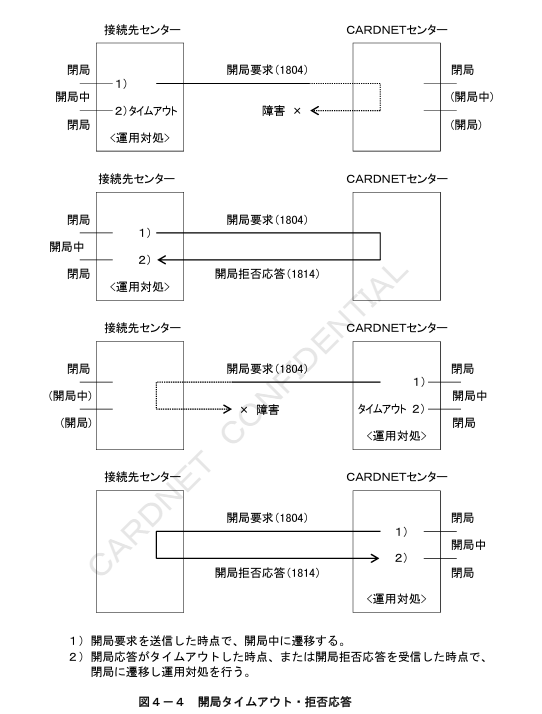
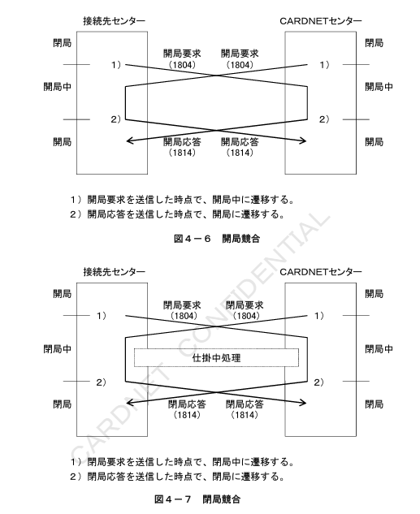
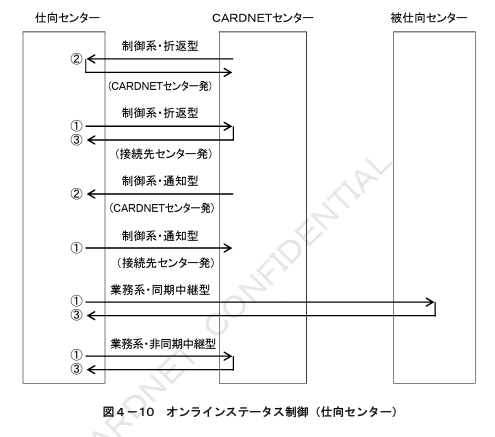
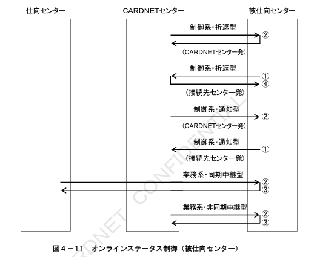
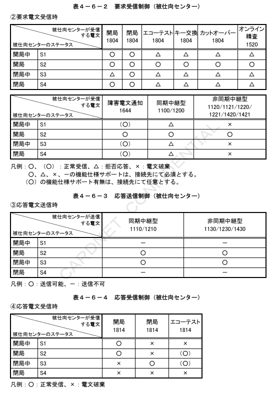
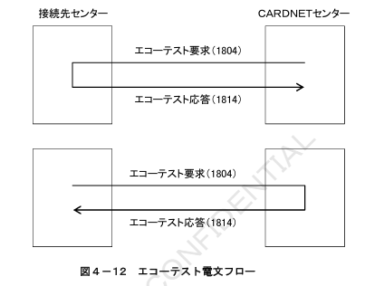

# 第4章 センター制御仕様

本章では、オンライン状態管理、開局および閉局手順、時間監視の処理仕様を定義する。

## 4.1 オンラインステータス管理

CARDNETセンターと接続先センターは、それぞれオンライン状態を示すステータスを管理し、電文送受信の制御を行う。オンラインステータス管理は、システムが稼働中で電文の送受信が可能な状態での制御を対象とする。したがって、下位レイヤーの回線ステータスとは非同期に管理される。

オンラインステータスの一覧を表4-1に示す。

### 表4-1 オンラインステータス一覧

| ステータス | 状態 | 説明 |
|---|---|---|
| 開局中 | オンラインサービス開始処理中 | 開局処理が仕掛中でサービス不可の状態 |
| 開局 | オンラインサービス中 | サービス可能な状態 |
| 閉局中 | オンラインサービス終了処理中 | 閉局処理が仕掛中で新たなサービスは不可の状態 |
| 閉局 | オンラインサービス停止中 | サービス不可の状態 |

## 4.1.1 オンラインステータス遷移

オンラインステータスは、開局電文と閉局電文の送受信により遷移される。オンラインステータスの遷移条件を以下に示す。

1. **開局中**  
   相手センターに開局要求を送信した時点、または相手センターから開局要求を受信した時点でステータスを開局中に遷移する。

2. **開局**  
   相手センターに開局応答を送信した時点、または相手センターから開局応答を受信した時点でステータスを開局に遷移する。

3. **閉局中**  
   相手センターに閉局要求を送信した時点、または相手センターから閉局要求を受信した時点でステータスを閉局中に遷移する。

4. **閉局**  
   相手センターに閉局応答を送信した時点、または相手センターから閉局応答を受信した時点でステータスを閉局に遷移する。  
   ただし、相手センターから開局／閉局の拒否応答を受信した場合、または開局／閉局応答がタイムアウトした場合は、ステータスを強制的に閉局に遷移する。

## 4.1.2 開閉局処理

開閉局はCARDNETセンターと接続先センターの隣接２センター間で行われる。開閉局処理にて遷移されるオンラインステータスについても２センター間においてのみ有効とする。開閉局の処理フローとオンラインステータスの遷移を図4-2～図4-8に定義する。

### 表4-2 開閉局処理フロー一覧

| 項番 | 内容 | 図番 |
|---|---|---|
| 1 | 通常開局 | 図4-2 |
| 2 | 通常開局 | 図4-3 |
| 3 | 開局タイムアウト・拒否応答 | 図4-4 |
| 4 | 開局タイムアウト・拒否応答 | 図4-5 |
| 5 | 開局競合 | 図4-6 |
| 6 | 開局競合 | 図4-7 |
| 7 | 開閉局競合 | 図4-8 |

＜補足説明～運用上の考慮事項＞

・開閉局処理は、接続先センターより行う事を基本とする。  
・24時間運用を行う接続先センターは、日次運用として開閉局処理を実施する必要は無い。  
・CARDNETセンターの計画停止による運用対処として、CARDNETセンターより強制的に閉局を行う場合がある。

＜補足説明～仕掛中処理＞

CARDNETセンターは、開局処理時に仕掛中取引が行われている場合に取引を完了する為、
開局要求受信と開局応答送信の間にインターバルを設定する。
応答電文監視タイマーの最大値より長いインターバルをおくことで、全ての仕掛中取引が完了する。

※タイマーに関しては表4-7、表4-8参照

＜補足説明～運用対処＞

タイムアウト、拒否応答による開局処理の失敗時は、接続先センターとCARDNETセンター間で
オンラインステータスが不一致となる可能性がある。
運用対処として、再度開局処理を実施し、ステータスの同期を回復する。

＜補足説明～運用対処＞

タイムアウト、拒否応答による開局処理の失敗時は、接続先センターとCARDNETセンター間でオンラインステータスが不一致となる可能性がある。  
運用対処として、再度開局処理を実施し、ステータスの同期を回復する。

## 4.1.3 オンラインステータス制御

CARDNETセンターと接続先センターは、オンラインステータスにより電文送受信の制御を行う。制御仕様を定義する前提として、CN手順におけるオンライン処理方式と対象電文の一覧を表4-3に示す。各センターは処理方式と対象電文毎に、ステータスによる制御を実施する。

### 表4-3 オンライン処理方式

| 区分 | 処理方式 | 電文送信元 | 対象電文 |
|---|---|---|---|
| 制御系 | 折返型 | CARDNETセンター | 開局、閉局、エコーテスト、キー交換、カットオーバー、オンライン精査 |
| 制御系 | 折返型 | 接続先センター | 開局、閉局、エコーテスト |
| 制御系 | 通知型 | CARDNETセンター | 障害電文通知 |
| 制御系 | 通知型 | 接続先センター | 障害電文通知、カットオーバー依頼 |
| 業務系 | 同期中継型 | ― | オーソリ、売上 |
| 業務系 | 非同期中継型 | ― | オーソリアドバイス、売上アドバイス、障害取消アドバイス |

### （1）CARDNETセンターの制御仕様

CARDNETセンターは、①要求電文送信時、②要求電文受信時、③応答電文送信時、④応答電文受信時に、オンラインステータスにより制御を行う。処理方式毎の制御ポイントを図4-9に、各ポイント毎の制御仕様を表4-4に定義する。

### （2）仕向センターの制御仕様

仕向センターは、①要求電文送信時、②要求電文受信時、③応答電文受信時に、オンラインステータスにより制御を行う。  
①～③の制御ポイントを図4-10に、制御仕様を表4-5に定義する。

### （3）被仕向センターの制御仕様

被仕向センターは、①要求電文送信時、②要求電文受信時、③応答電文送信時、④応答電文受信時に、オンラインステータスにより制御を行う。  
処理方式毎の制御ポイントを図4-11に、各ポイント毎の制御仕様を表4-6に定義する。

## 4.2 エコーテスト処理

エコーテストは、相手先システムと一定時間内に無通信状態の場合、相手先システムの稼働状況を確認する為に使用される。  
エコーテストに対して無応答の場合、その相手先は障害状況と判断される。  
電文フローを図4-12に示す。

＜補足説明～エコーテスト送信契機＞

・CARDNETセンターは、任意のタイミングでエコーテストを送信する場合がある。  
・接続先センターのエコーテスト送信有無は、各接続先で任意とする。

# 4.3 タイマー監視

CN手順における電文監視タイマーとインターバルタイマーの設定基準を以下に定義する。

## 4.3.1 電文監視タイマー

仕向センターおよびCARDNETセンターは、要求電文の送信を契機として、応答電文を受信するまでのタイマー監視を行う。電文タイプ毎の電文監視タイマー値を表４－７に定義する。

**表4-7　電文監視タイマー**

| タイマー名称 | 内容 | 対象MTI | 仕向センター設定値 | CARDNETセンター設定値 |
|---|---|---|---|---|
| T100 | オーソリ応答待ちタイマー | 1110 | 60秒 | 58秒 |
| T120 | オーソリアドバイス応答待ちタイマー | 1130 | 30秒 | 30秒 |
| T200 | 売上応答待ちタイマー | 1210 | 60秒 | 58秒 |
| T220 | 売上アドバイス応答待ちタイマー | 1230 | 30秒 | 30秒 |
| T420 | 障害取消アドバイス応答待ちタイマー | 1430 | 30秒 | 30秒 |
| T500 | オンライン精査応答待ちタイマー | 1530/1532 | ― | 30秒 |
| T800 | 制御応答待ちタイマー（開局、キー交換、カットオーバー） | 1814 | 45秒 | 45秒 |
| T801 | 閉局応答待ちタイマー | 1814 | 70秒 | 70秒 |
| T802 | エコーテスト応答待ちタイマー | 1814 | 90秒 | 90秒 |

## 4.3.2 インターバルタイマー

CARDNETセンターは、オンライン精査および開局の仕掛中処理の為に、タイマー監視を行う。各処理毎のインターバルタイマー値を表４－８に定義する。

**表4-8　インターバルタイマー**

| タイマー名称 | 内容 | 対象MTI | タイマー値 |
|---|---|---|---|
| T501 | オンライン精査インターバルタイマー | CARDNETセンターで設定。カットオーバー応答受信（リトライアウト）からオンライン精査要求送信の間。 | 1520/1522 | 5分 |
| T803 | 開局インターバルタイマー | CARDNETセンターで設定。開局要求送信から開局応答受信の間。 | 1804 | 65秒 |

