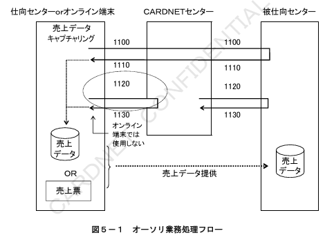
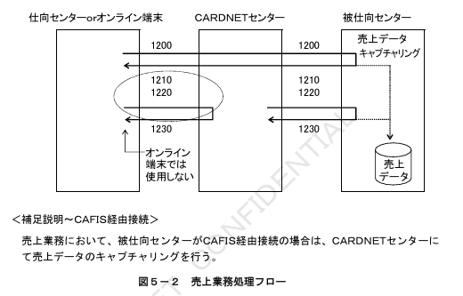
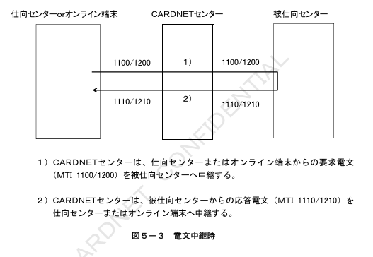
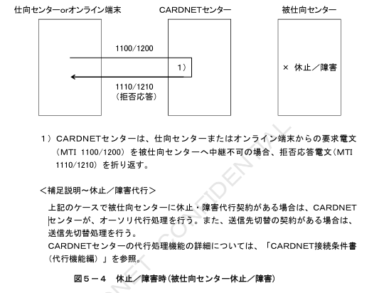
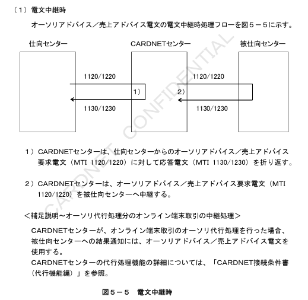
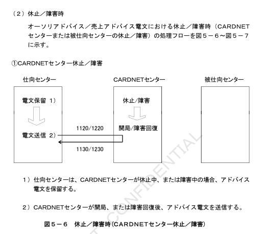
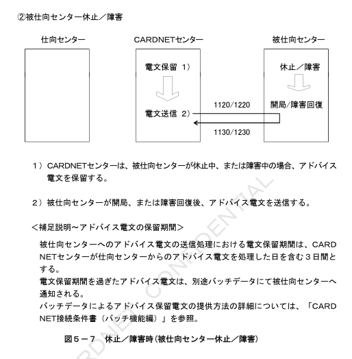
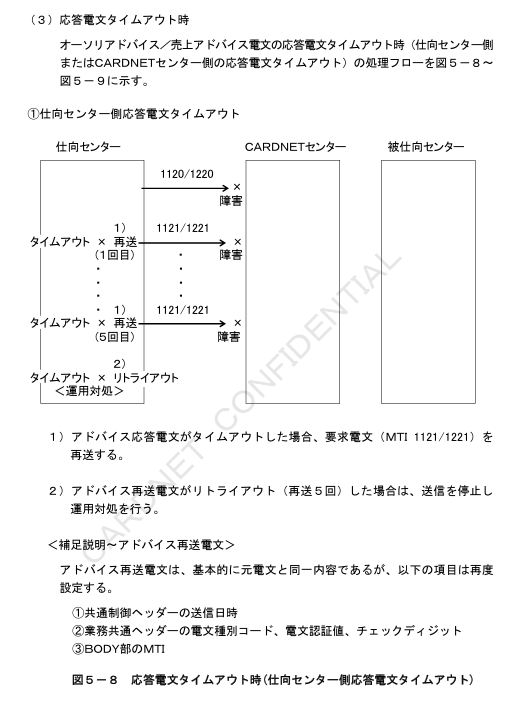
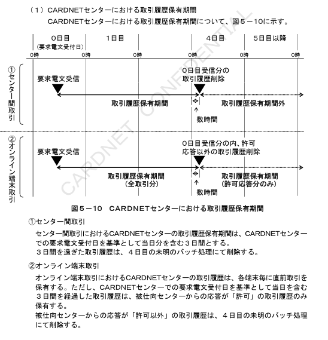

# 第5章　業務処理仕様

本章では、オーソリ／売上業務（MTI 11XX/12XX）および障害取消業務（MTI 14XX）について、業務処理方式およびオンライン処理方式を定義する。

## 5.1　オーソリ／売上業務

（1）オーソリ業務（MTI 11XX）

オーソリ業務は、売上処理を伴わないカード取引の判定要求および結果通知を行う際に使用し、オーソリ電文（MTI 1100/1110）およびオーソリアドバイス電文（MTI 1120/1130）が使用される。

売上データのキャプチャリングは、仕向センターにて行う。処理フローを図5－1に示す。

（2）売上業務（MTI 12XX）

売上業務は、売上処理を伴うカード取引の判定要求および結果通知を行う際に使用し、売上電文（MTI 1200/1210）および売上アドバイス電文（MTI 1220/1230）が使用される。

売上データのキャプチャリングは、被仕向センターにて行う。処理フローを図5－2に示す。

## 5.1.1　オーソリ／売上電文

オーソリ電文（MTI 1100/1110）および売上電文（MTI 1200/1210）は、カード会社（カード会社の代行会社含む）に対してリアルタイムにてカード取引の判定を要求する場合に使用し、同期型処理方式で処理される。

オーソリ／売上電文の処理フロー例を以下に示す。

（1）電文中継時

オーソリ／売上電文の電文中継処理フローを図5－3に示す。

（2）休止／障害時

オーソリ／売上電文における休止／障害時（被仕向センター休止／障害）の処理フローを図5－4に示す。

## 5.1.2　オーソリアドバイス／売上アドバイス電文

オーソリアドバイス電文（MTI 1120/1130）および売上アドバイス電文（MTI 1220/1230）は、カード会社（カード会社の代行会社含む）に対して、カード取引の代行判定結果を事後に通知する場合に使用し、非同期中継処理方式で処理される。

オーソリアドバイス／売上アドバイス電文（MTI 1120/1220）に対して拒否応答を行うことはできない。

なお、オンライン端末は、オーソリアドバイス／売上アドバイス電文（MTI 1120/1220）を使用しない。

オーソリアドバイス／売上アドバイス電文の処理フロー例を以下に示す。

## 5.2　障害取消業務

障害取消業務は、オーソリ／売上電文（MTI 1100/1200）および、オーソリアドバイス／売上アドバイス電文（MTI 1120/1220）のシステム的な取消を行う際に使用し、障害取消アドバイス電文（MTI 1420）が使用される。

なお、オンライン精査では、障害取消アドバイス電文（MTI 1420）を使用せず、代わりに自動取消電文を使用する。CARDNETセンターでは、オンライン精査からの自動取消電文を障害取消アドバイス電文（MTI 1420）に変換し、被仕向センターへ送信する。

### 5.2.1　CARDNETセンターにおける障害取消アドバイス電文の処理方式

CARDNETセンターは、障害取消アドバイス電文を処理する場合、過去の取引履歴を参照し、取消対象元取引の処理結果に応じた対処を行う。

CARDNETセンターにおける取引履歴保持期間および障害取消アドバイス電文に
対する対処について、以下に示す。

（1）CARDNETセンターにおける取引履歴保持期間

CARDNETセンターにおける取引履歴保持期間について、図5－10に示す。

（2）CARDNETセンターにおける障害取消アドバイス電文に対する対処

①取消対象元取引がCARDNETセンターの取引履歴保持期間内の場合

CARDNETセンターは、過去の取引履歴を参照した上で、以下のとおり仕向センターへ応答する。

・取消対象元取引にて金額カウンターの計上をした場合：
「アクションコード 400」を応答電文中に設定

・取消対象元取引にて金額カウンターの計上をしなかった場合：
「アクションコード 480」を応答電文中に設定

注1：金額カウンターの計上対象については、6.3.5「カウンター項目集計方法」を参照。

注2：「アクションコード 400および480」は、障害取消の結果を示すために障害取消アドバイス電文にて使用するコードであり、以下のとおり設定する。
・アクションコード 400：取消完了（元取引が金額カウンターの計上有り）
・アクションコード 480：取消完了（元取引が金額カウンターの計上無し）

アクションコードの詳細は、8.3.2.1「BIT39：アクションコード」を参照。

②元取引が特定出来ない場合

取消対象元取引をCARDNETセンターが受信していない場合、または取消対象元取引がCARDNETセンターの取引履歴保持期間外である場合には、CARDNETセンターは以下のとおり仕向センターへ応答または対処を行う。

・オーソリ／売上電文（同期中継型）に対する障害取消：
拒否応答

・オーソリアドバイス／売上アドバイス電文（非同期中継型）に対する障害取消：
電文破棄

## 5.2.2　仕向センターにおける障害取消アドバイス電文の処理方式

（1）仕向センターにおける障害取消アドバイス電文送信可能期間

センター間取引における仕向センターからCARDNETセンターへの障害取消アドバイス電文の送信可能期間は、CARDNETセンターでの要求電文受付日を基準として当日分を含む3日目とする。

（2）仕向センターにおける障害取消アドバイス電文に対する対処

仕向センターは、CARDNETセンターから障害取消アドバイス電文に対する拒否応答を受信した場合、およびリトライアウトした場合には、別途、運用対処を行う。

## 5.2.3　被仕向センターにおける障害取消アドバイス電文の処理方式

被仕向センターは、CARDNETセンターから障害取消アドバイス電文（MTI 1420）を受信した場合には、被仕向センターにて保有する過去の取引履歴を参照し、取消対象元取引の処理結果に応じた対処を行う。

被仕向センターにおける取引履歴保持期間および障害取消アドバイス電文に対する対処について、以下に示す。

（1）被仕向センターにおける取引履歴保持期間

被仕向センターは、障害取消アドバイス電文（MTI 1420）を受信した場合には、被仕向センターにて保有する過去の取引履歴を参照し、取消対象元取引の金額カウンター計上結果に応じたアクションコードを応答電文に設定する必要がある。

したがって、被仕向センターは、CARDNETセンターにおける取引履歴保持期間を超える期間（最低４日間）の取引履歴を保持する必要がある。

（2）CARDNETセンターから被仕向センターへの障害取消アドバイス電文送信期間

①センター間取引
センター間取引における障害取消アドバイス電文は、CARDNETセンターでの取引履歴保持期間内の電文のみ被仕向センターへ送信する。

②オンライン端末取引
オンライン端末取引における障害取消アドバイス電文は、取消対象元取引の要求電文受付日から被仕向センターへ送信する。

ただし、取消対象元取引が要求電文受付日から４日目以降（CARDNETセンターでの許可応答分のみの取引履歴保持期間内）の場合には、取消対象元取引に対する被仕向センターからの応答が「許可」の取引についてのみ、被仕向センターへ障害取消アドバイス電文を送信する。

（3）被仕向センターにおける障害取消アドバイス電文受信時の対処

①取消対象元取引が被仕向センターの取引履歴保持期間内の場合
被仕向センターは、過去の取引履歴を参照した上で、以下のとおりCARDNETセンターへ応答する。

・取消対象元取引にて金額カウンターの計上をした場合：
「アクションコード 400」を応答電文中に設定

・取消対象元取引にて金額カウンターの計上をしなかった場合：
「アクションコード 480」を応答電文中に設定

②元取引が特定出来ない場合

取消対象元取引を被仕向センターが受信していない場合、または取消対象元取引が被仕向センターの取引履歴保持期間外である場合には、被仕向センターは以下のとおりCARDNETセンターへ応答、または対処を行う。

＜センター間取引＞
・オーソリ／売上電文（同期中継型）に対する障害取消：
「アクションコード 480」を応答電文中に設定

・オーソリアドバイス／売上アドバイス電文（非同期中継型）に対する障害取消：
電文破棄

＜オンライン端末取引＞
・オーソリ／売上電文（同期中継型）に対する障害取消
（被仕向センターの取引履歴保持期間内）：
「アクションコード 480」を応答電文中に設定

・オーソリ電文（同期中継型）に対する障害取消
（被仕向センターの取引履歴保持期間外）：
「アクションコード 480」を応答電文中に設定

・売上電文（同期中継型）に対する障害取消
（被仕向センターの取引履歴保持期間外）：
「アクションコード 400」を応答電文中に設定

注1：金額カウンターの計上対象については、6.3.5「カウンター項目集計方法」を参照。

注2：「アクションコード 400および480」は、障害取消の結果を示すために障害取消アドバイス電文にて使用するコードであり、以下のとおり設定する。
・アクションコード 400：取消完了（元取引が金額カウンターの計上有り）
・アクションコード 480：取消完了（元取引が金額カウンターの計上無し）

アクションコードの詳細は、8.3.2.1「BIT39：アクションコード」を参照。

注3：CARDNETセンターが、オンライン端末取引のオーソリ代行処理を行った場合、被仕向センターへの結果通知には、オーソリアドバイス／売上アドバイス電文を使用する。

この時、元取引が特定出来ない場合には、被仕向センターは、以下のとおりCARDNETセンターへ応答または対処を行う。

・オーソリアドバイス／売上アドバイス電文（非同期中継型）に対する障害取消
（被仕向センターの取引履歴保持期間内）：
電文破棄

・オーソリアドバイス電文（非同期中継型）に対する障害取消
（被仕向センターの取引履歴保持期間外）：
「アクションコード 480」を応答電文中に設定

・売上アドバイス電文（非同期中継型）に対する障害取消
（被仕向センターの取引履歴保持期間外）：
「アクションコード 400」を応答電文中に設定

CARDNETセンターの代行処理機能の詳細については、「CARDNET接続条件書（代行機能編）」を参照。
