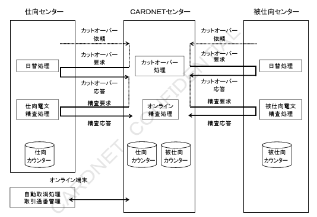
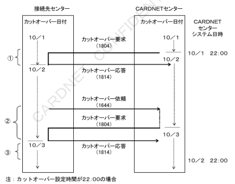
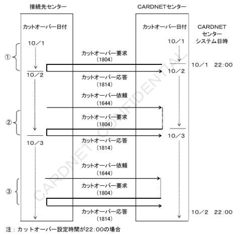
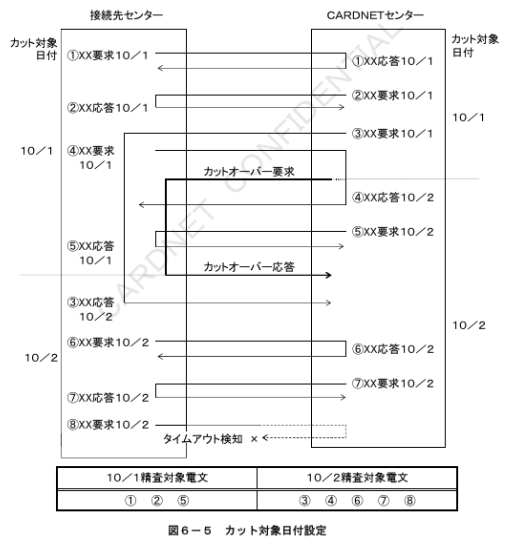
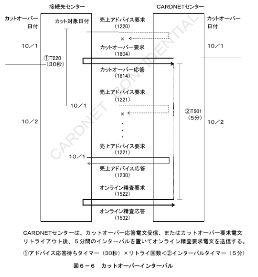
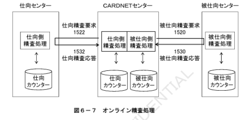
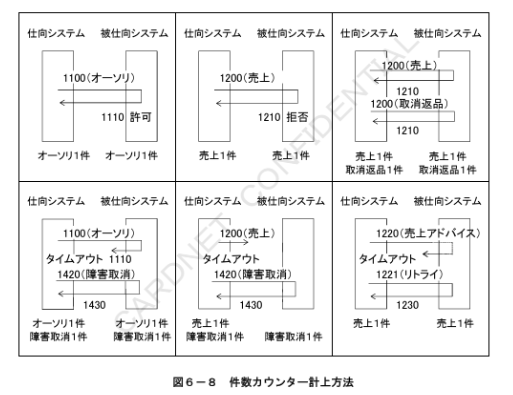
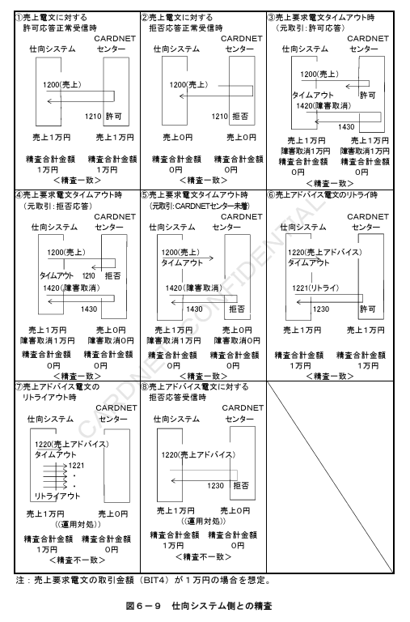
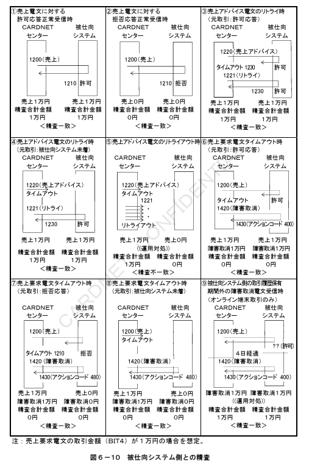

# 第6章　オンライン精査仕様

本章では、CN手順におけるオンライン精査について、カットオーバーによる日替処理、およびカウンター管理の処理仕様を定義する。

## 6.1　オンライン精査処理

オンライン精査は、接続先センターとCARDNETセンターの２センター間で売上取引に関する金額の整合性を確認するために実施される。オンライン精査処理は、カットオーバー処理に連動して１日１回実施される。カットオーバー処理からオンライン精査処理までの処理フローを図６－１に示す。

注1：仕向処理、かつ被仕向処理を行う接続先センターは、仕向精査処理、および被仕向精査処理を両方実施する。

注2：仕向センター精査処理と被仕向センター精査処理は連動しない。オンライン精査は、あくまで各接続先センター毎に設定された時間、もしくは接続先センターからのカットオーバー依頼を契機として実施される。

注3：オンライン端末とCARDNETセンター間は、自動取消機能、取引通番管理機能にて、取引の整合性を確認するためオンライン精査は行わない。被仕向センターとの被仕向カウンターでは仕向センターとの取引、オンライン端末との取引とを合算して計上される。

## 6.2　カットオーバー処理

接続先センターとCARDNETセンターは、オンライン精査時の対象電文を特定するためにカットオーバー日付を管理する。カットオーバー日付は、CARDNETセンターから送信するカットオーバー電文にて更新、および通知される。

### 6.2.1　カットオーバー日付更新

カットオーバー日付の更新を伴うカットオーバー処理は、各接続先センター毎に設定されたカットオーバー時間を１日の境界として、１日１回実行される。以下にその手順を示す。

1　接続先センターからのカットオーバー依頼電文（MTI 1644）、あるいは各接続先センター毎に設定された時間を契機に、CARDNETセンターはカットオーバー処理を行う。

2　CARDNETセンターは、カットオーバー要求電文（MTI 1804）を接続先センターへ送信するタイミングで、カットオーバー日付を更新する。

3　接続先センターは、カットオーバー応答電文（MTI 1814）をCARDNETセンターへ送信するタイミングでカットオーバー日付を更新する。

①設定時間を契機としたCARDNETセンター起動によるカットオーバー日付の更新処理。
②接続先センターからのカットオーバー依頼を契機としたカットオーバー日付の更新処理。
③カットオーバー日付の更新処理が完了しているため、設定時間を契機としたCARDNETセンター起動によるカットオーバー日付の更新処理は行わない。

### 6.2.2　カットオーバー日付通知

カットオーバー日付の通知を目的としたカットオーバー処理は、１日複数回実行可能とする。

1）接続先センターからのカットオーバー依頼電文（MTI 1644）を契機に、CARDNETセンターはカットオーバー要求電文（MTI 1804）を送信し、カットオーバー日付を通知する。

注：カットオーバー設定時間が22:00の場合
①設定時間を契機としたCARDNETセンター起動によるカットオーバー日付の更新処理。
②接続先センターからのカットオーバー依頼を契機としたカットオーバー日付の更新処理。
③カットオーバー日付の更新を伴わないカットオーバー日付の通知処理。②にて１日のカットオーバー更新処理を実施しているため、接続先センターからの以降のカットオーバー依頼に対しては通知のみとする。

### 6.2.3　カットオーバー要求リトライ

CARDNETセンターは、カットオーバー要求のタイムアウト時に、要求電文をリトライする。ただし、カットオーバー日付は更新している為、カットオーバー日付通知の形式をとる。リトライ上限（5回）を超えた場合は、送信を停止し強制的に精査処理を行う。

---

### 6.2.4　カットオーバー日付設定基準

CARDNETセンターが、接続先センターへの更新、および通知を行なうカットオーバー日付は、カットオーバー要求電文（MTI 1804）の精査日（BIT28）フィールドへ設定される。カットオーバー更新処理、および通知処理時のカットオーバー電文（MTI 1804）に関する日付設定基準を表6－1に示す。

**表6-1　カットオーバー日付設定**

| 処理種別 | カットオーバー更新処理 | カットオーバー通知処理 |
|---|---|---|
| 精査日（BIT28） | 更新後のカットオーバー日付 | 現在のカットオーバー日付 |

＜補足説明～カット対象日付の設定基準＞

各センターにて電文を送信する場合、業務共通ヘッダー部のカット対象日付には各センターで管理するカット対象日付を設定する。上記のカットオーバー電文を送信する場合、①カットオーバー更新処理時は更新前のカットオーバー日付（精査日フィールド設定日より1日前）を、②カットオーバー通知処理時には現在のカットオーバー日付（精査日フィールド設定日と同一）が設定される。

### 6.2.5　カット対象日付設定基準

オンライン精査の対象となる業務電文は、業務共通ヘッダー内のカット対象日付で特定される。業務電文送信時におけるカット対象日付の設定基準を以下に定義する。

・カット対象日付は全ての送信電文に対して、要求／応答の区別なく電文送信時のカットオーバー日付を設定する。ただし、アドバイス要求、および応答の再送電文は再送中にカットオーバー日付が更新した場合も要求、および応答電文を送信した時点の日付をセットする。

・応答電文のカット対象日付を精査対象日とする。ただし、応答電文がタイムアウトした場合は要求電文のカット対象日付を精査日とする。

### 6.2.6　カットオーバーインターバル

オンライン精査処理では、CARDNETセンターと、接続先センターで、精査対象電文の特定が一致する必要がある。カットオーバー日付更新処理のタイミングによって、以下のケースの場合にCARDNETセンターと接続先センターの間で不整合が発生する。

・アドバイス電文再送中にカットオーバーが発生した場合
・複数回線（論理チャネル）を使用して接続している場合

したがって、精査対象電文を正確に特定し確実なオンライン精査を成立させる為に、カットオーバー処理とオンライン精査処理の間にインターバル（５分）を設定する。

インターバルによりアドバイス再送を含む全ての仕掛処理が完了する。

## 6.3　カウンター管理処理

接続先センターとCARDNETセンターは、カットオーバー処理に連動して、各種精査カウンターを管理する。仕向精査電文（MTI 1522）にて仕向センターの仕向カウンターを、被仕向精査電文（MTI 1520）にて被仕向センターの被仕向カウンターを交換する。

### 6.3.1　精査対象電文種別

オンライン精査の対象となる電文種別はオーソリ、売上に関連する全トランザクションとする。精査対象の電文種別と対象精査項目（件数、金額）を表6－2に定義する。

**表6-2　精査対象電文種別**

| 対象業務 | MTI | 件数 | 金額 |
|---|---|---|---|
| オーソリ | 1100/1110 | 対象 | 対象外 |
| オーソリアドバイス | 1120(1121)/1130 | 対象 | 対象外 |
| 売上 | 1200/1210 | 対象 | 対象 |
| 売上アドバイス | 1220(1221)/1230 | 対象 | 対象 |
| 障害取消アドバイス（対オーソリ、オーソリアドバイス） | 1420(1421)/1430 | 対象 | 対象外 |
| 障害取消アドバイス（対売上、売上アドバイス） | 1420(1421)/1430 | 対象 | 対象 |

### 6.3.2　精査カウンター内容

オンライン精査処理にて管理される、精査カウンターの内容を表6－3に定義する。

**表6-3　精査カウンター内容**

| 項番 | カウンター名称 | BIT | 内容 |
|---|---|---|---|
| 1 | 精査合計金額 | 97 | 精査金額総計（項番2～5）の相殺金額 |
| 2 | 売上金額 | 88 | 売上、承認後売上の金額 |
| 3 | 売上取消／返品金額 | 86 | 売上取消／返品、承認後売上取消／返品の金額 |
| 4 | 売上障害取消金額 | 87 | 売上、承認後売上の障害取消金額 |
| 5 | 売上取消／返品障害取消金額 | 89 | 売上取消／返品、承認後売上取消／返品の障害取消金額 |
| 6 | オーソリ件数 | 81 | オーソリ、オーソリ取消／返品、海外キャッシング事前承認、事前承認取消の件数 |
| 7 | 照会件数 | 80 | 無効カード照会の件数 |
| 8 | 売上件数 | 76 | 売上、承認後売上の件数 |
| 9 | 売上取消／返品件数 | 74 | 売上取消／返品、承認後売上取消／返品の件数 |
| 10 | オーソリ障害取消件数 | 90 | オーソリ、オーソリ取消／返品、海外キャッシング事前承認、事前承認取消の障害取消件数 |
| 11 | 照会障害取消件数 | 82 | 無効カード照会の障害取消件数 |
| 12 | 売上障害取消件数 | 75 | 売上、承認後売上の障害取消件数 |
| 13 | 売上取消／返品障害取消件数 | 77 | 売上取消／返品、承認後売上取消／返品の障害取消件数 |

### 6.3.3　件数カウンター計上条件

オンライン精査での件数カウンターの計上における基本条件を以下に定義する。

・件数カウンターはトランザクション単位で計上する。つまり、要求と応答の組み合わせで1件として計上する。

・トランザクションの成立・不成立を問わず、発生ベースで計上する。したがって拒否応答電文の送受信時や応答電文のタイムアウト時も1件として計上する。

・元取引に対する取消／返品や障害取消が発生した場合も、それぞれ1件として計上する。

・アドバイス電文は再送が発生した場合も1件と計上する。

・アドバイス電文は再送リトライアウトした場合も1件と計上する。

### 6.3.4　金額カウンター計上条件

オンライン精査での金額カウンターの計上における基本条件を以下に定義する。金額カウンターの計上は、売上／売上アドバイス電文、および売上／売上アドバイス電文に対する障害取消電文を対象とする。

したがって、オーソリ／オーソリアドバイス電文、およびオーソリ／オーソリアドバイス電文に対する障害取消は対象外とする。

（1）仕向システム側の金額計上条件（図6－9参照）

・許可応答電文の受信時には、応答電文の取引金額（BIT4）を使用し、要求電文のタイムアウト時には、要求電文の取引金額（BIT4）を使用してカウンターの計上を行う。要求電文がタイムアウト時は、障害取消電文を送信する為、精査合計金額は相殺される。（図6－9①～⑤参照）

・アドバイス電文のタイムアウト時に再送された場合（再送リトライアウト含む）は、初回送信分のみ金額カウンターを計上する。（リトライは金額カウンターを計上しない）（図6－9⑥参照）

・アドバイス電文のリトライアウト時、および取消受信時については金額計上の対象とし、別途運用対処を行う。（図6－9⑦～⑧参照）

（2）被仕向システム側の金額計上条件（図6－10参照）

・取引の成立、つまり許可応答電文を送信した場合に、応答電文の取引金額（BIT4）を使用して金額カウンターを計上する。（図6－10①～②参照）

・アドバイス電文の再送を受信した場合は、初回受信分のみ金額カウンターを計上する。（リトライ受信分は金額カウンターを計上しない）（図6－10③～④参照）

・アドバイス電文のリトライアウト時については金額計上の対象とし、別途運用対処を行う。（図6－10⑤参照）

・障害取消電文においては、元取引の履歴を参照する必要がある。元取引の履歴を参照した結果により、以下のとおり対処する。

a．元取引にて金額の計上をしている場合（図6－10⑥参照）
金額を計上する（アクションコード400で応答する）

b．元取引にて金額の計上をしていない場合（図6－10⑦参照）
金額を計上しない（アクションコード480で応答する）

c．元取引を受信していないため元取引が特定できない場合（図6－10⑧参照）
金額を計上しない（以下のとおり対処）
・元取引がオーソリ／売上電文の場合：アクションコード480で応答
・元取引がオーソリアドバイス／売上アドバイス電文の場合：電文破棄

d．元取引が被仕向システムの取引履歴保持期間外であるため元取引の履歴を参照できない場合（オンライン端末取引のみ）（図6－10⑨参照）
・元取引が金額計上対象の場合：
金額を計上する（アクションコード400で応答する）
・元取引が金額計上対象外の場合：
金額を計上しない（アクションコード480で応答する）

ただし、上記のいずれの場合にも、被仕向システム側にて運用対処が必要。

### 6.3.5　カウンター項目集計方法

オンライン精査での各カウンター項目単位の集計方法を、仕向システムと被仕向システムそれぞれについて定義する。各集計項目は、MTI、プロセシングコード（BIT3）、アクションコード（BIT39）毎に、表6－4の定義に従って各カウンター項目に計上される。

なお、仕向システムとは、仕向精査処理は仕向センターを示し、被仕向精査処理はCARDNETセンターを示す。また、被仕向システムとは、仕向精査処理はCARDNETセンターを示し、被仕向精査処理は被仕向センターを示す。

**表6-4-1　仕向側システム集計方法**

| MTI | プロセシングコード | アクションコード | BIT | 名称 | 操作 |
|---|---|---|---|---|---|
| 1100&1110 / 1120&1130 | 000000 / 010000 / 200000 | すべて | 81 | オーソリ件数・海外キャッシング | 件数加算 |
| 1100&1110 / 1120&1130 | 360000 | すべて | 80 | 照会件数 | 件数加算 |
| 1200&1210 | 000000 | 000 / タイムアウト | 76 | 売上件数 | 件数加算 |
| 1200&1210 | 000000 | 000 / タイムアウト | 88 | 売上金額 | 金額加算 |
| 1200&1210 | 000000 | 000 / タイムアウト | 97 | 精査合計金額 | 金額減算 |
| 1200&1210 | 000000 | 上記以外 | 76 | 売上件数 | 件数加算 |
| 1200&1210 | 200000 | 000 / タイムアウト | 74 | 売上取消／返品件数 | 件数加算 |
| 1200&1210 | 200000 | 000 / タイムアウト | 86 | 売上取消／返品金額 | 金額加算 |
| 1200&1210 | 200000 | 000 / タイムアウト | 97 | 精査合計金額 | 金額減算 |
| 1200&1210 | 200000 | 上記以外 | 74 | 売上取消／返品件数 | 件数加算 |
| 1220&1230 | 000000 | すべて | 76 | 売上件数 | 件数加算 |
| 1220&1230 | 000000 | すべて | 88 | 売上金額 | 金額加算 |
| 1220&1230 | 000000 | すべて | 97 | 精査合計金額 | 金額減算 |
| 1220&1230 | 200000 | すべて | 74 | 売上取消／返品件数 | 件数加算 |
| 1220&1230 | 200000 | すべて | 86 | 売上取消／返品金額 | 金額加算 |
| 1220&1230 | 200000 | すべて | 97 | 精査合計金額 | 金額減算 |
| 1420&1430（元要求が1200番台） | 000000 | すべて | 75 | 売上障害取消件数 | 件数加算 |
| 1420&1430（元要求が1200番台） | 000000 | すべて | 87 | 売上障害取消金額 | 金額加算 |
| 1420&1430（元要求が1200番台） | 200000 | すべて | 77 | 売上取消／返品障害取消件数 | 件数加算 |
| 1420&1430（元要求が1200番台） | 200000 | すべて | 89 | 売上取消／返品障害取消金額 | 金額加算 |
| 1420&1430（元要求が1100番台） | 000000 / 010000 / 200000 | すべて | 90 | オーソリ障害取消件数 | 件数加算 |
| 1420&1430（元要求が1100番台） | 360000 | すべて | 82 | 照会障害取消件数 | 件数加算 |

**表６－４－２　被仕向側システム集計方法**

| MTI | プロセシングコード | アクションコード | BIT | 名称 | 操作 |
|---|---|---|---|---|---|
| 1110 / 1130 | 000000 / 010000 / 200000 | すべて | 81 | オーソリ件数（海外キャッシング） | 件数加算 |
| 1110 / 1130 | 360000 | すべて | 80 | 照会件数 | 件数加算 |
| 1210 / 1230 | 000000 | 000 | 76 / 88 / 97 | 売上件数 / 売上金額 / 精査合計金額 | 件数加算 / 金額加算 / 金額減算 |
| 1210 / 1230 | 000000 | 上記以外 | 76 | 売上件数 | 件数加算 |
| 1210 / 1230 | 200000 | 000 | 74 / 86 / 97 | 売上取消・返品件数 / 売上取消・返品金額 / 精査合計金額 | 件数加算 / 金額加算 / 金額減算 |
| 1210 / 1230 | 200000 | 上記以外 | 74 | 売上取消・返品件数 | 件数加算 |
| 1430（元要求が1200番台） | 000000 | 400 | 75 / 87 / 97 | 売上障害取消件数 / 売上障害取消金額 / 精査合計金額 | 件数加算 / 金額加算 / 金額減算 |
| 1430（元要求が1200番台） | 000000 | 上記以外 | 75 | 売上取消・返品障害取消件数 | 件数加算 |
| 1430（元要求が1200番台） | 200000 | 400 | 77 / 79 / 97 | 売上取消・返品障害取消件数 / 売上取消・返品障害取消金額 / 精査合計金額 | 件数加算 / 金額加算 / 金額減算 |
| 1430（元要求が1200番台） | 200000 | 上記以外 | 77 | 売上取消・返品障害取消件数 | 件数加算 |
| 1430（元要求が1100番台） | 000000 / 010000 / 200000 | すべて | 90 | オーソリ障害取消件数（海外キャッシング） | 件数加算 |
| 1430（元要求が1100番台） | 360000 | すべて | 82 | 照会障害取消件数 | 件数加算 |

## 6.3.6　精査成立条件

オンライン精査の成立は、精査合計金額の一致により判断する。CNF項目ではシステム障害によるタイムアウト時に、仕向システム側で障害取消電文を送信し、元取引を相殺する為、各カウンター項目に不一致発生した場合でも、結果として精査金額は一致する。
精査成立条件と精査不成立時の対応を表６－５に定義する。

**表６－５　精査成立条件**

|  | 精査条件 | 精査結果 |
|---|---|---|
| 1 | 精査合計金額一致 | 金額一致により精査成立 |
| 2 | 精査合計金額不一致 | 精査不成立、オフライン精査により運用対処 |
