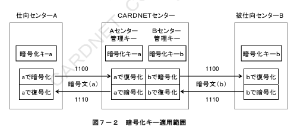
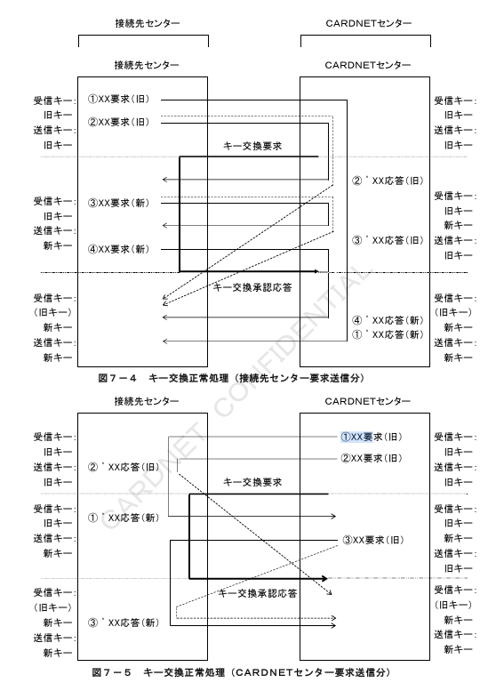

# 第７章　セキュリティ制御仕様

本章では、CNF手順におけるセキュリティ基準について、電文の暗号化・認証に関する処理仕様を定義する。

## 7.1　セキュリティ制御機能

「接続条件書（ダイレクト編）別冊　電文暗号化仕様」を参照。

## 7.2　対象電文種別

各セキュリティ制御機能における対象MTI（電文種別）、および対象データ項目を表７－１に定義する。PIN暗号化の対象は暗証番号付きオーソリ売上電文、また、電文暗号化、および電文認証の対象は業務系の全電文と制御系の精査電文とする。制御系電文は、当該機能の対象外とする。

**表７－１　対象電文種別・対象データ項目**

| セキュリティ機能 | 対象MTI | 対象データ項目 | 備考 |
|---|---|---|---|
| PIN暗号化 | 1100　1200 | PINデータ（BIT52） | 暗証番号有りの電文のみが対象 |
| 電文暗号化 | 1100/1110　1120(1121)/1230　1200/1210　1220(1221)/1230　1420(1421)/1430　1520/1530　1522/1532　1604/1614 | BODY部（MTI、ビットマップ、データエレメント） |  |
| 電文認証 | 1100/1110　1120(1121)/1230　1200/1210　1220(1221)/1230　1420(1421)/1430　1520/1530　1522/1532　1604/1614 | BODY部（MTI、ビットマップ、データエレメント） | 入力暗証番号は暗号化後の状態 |
|  |  |  |  |

※1604/1614（DCLレート整備MTI）について詳細は「接続条件書別冊DCC拡張仕様」を参照。

## 7.3　暗号化キー管理

CNF手順のセキュリティ制御処理は、秘密キーによる暗号化方式を採用する。CARDNETセンターと接続先センターは、オンライン業務のセキュリティ制御機能で使用する暗号化キーを管理する。CNF手順で使用する暗号化キーの一覧を表７－２に定義する。

**表７－２　暗号化キー一覧**

| 項番 | キー名称 | 内容 |
|---|---|---|
| 1 | KPE　PIN Encryption KEY | 入力暗証番号（BIT52）の暗号化に使用 |
| 2 | KC　DATA Encryption KEY | 電文本体（BODY部）の暗号化に使用 |
| 3 | KMAC　Message Authentication Control KEY | 電文本体（BODY部）の認証に使用 |
| 4 | KEK　KEY Exchange KEY | キー交換時に、暗号化キー（項番1～3）自体の暗号化に使用 |
| 5 | MFK　Master File KEY | 暗号化キーの管理マスターとして内部的に使用 |

＜補足説明－暗号化キーの適用範囲＞

暗号化キーは、CARDNETセンターと各接続先センターの隣接２センターにおいてそれぞれユニークに管理される。暗号化キーの適用範囲を図７－２に示す。

### 7.3.1　暗号化キー作成基準

「CARDNET接続条件書（ダイレクト接続編）別冊　電文暗号化仕様」を参照。

### 7.3.2　暗号化キー交換方法／サイクル

「CARDNET接続条件書（ダイレクト接続編）別冊　電文暗号化仕様」を参照。

### 7.3.3　キー交換電文識別方法

「CARDNET接続条件書（ダイレクト接続編）別冊　電文暗号化仕様」を参照。

### 7.3.4　チェックディジット設定基準

「CARDNET接続条件書（ダイレクト接続編）別冊　電文暗号化仕様」を参照。

### 7.3.5　チェックディジット算出方法

「CARDNET接続条件書（ダイレクト接続編）別冊　電文暗号化仕様」を参照。

### 7.3.6　チェックディジットエラー処理

それぞれの暗号化キーについて、チェックディジットエラーを検出した場合の通知方法を表７－６に定義する。KPEの同期エラーは業務電文の拒否応答、KCとKMACの同期エラーは障害電文通知の形式で処理される。

**表７－６　チェックディジットエラー処理**

| 暗号化キー | チェックディジットエラー時の処理 | アクションコード（BIT 39） |
|---|---|---|
| PIN暗号化キー（KPE） | 拒否応答（MTI 1110 or 1210） | 919（暗号化キー同期エラー） |
| 電文暗号化キー（KC） | 障害電文通知（MTI 1644） | 919（暗号化キー同期エラー） |
| 電文認証キー（KMAC） | 障害電文通知（MTI 1644） | 917（MACキー同期エラー） |

＜補足説明－障害検知＞

チェックディジットエラーを検知した場合は、CARDNETセンターより自動でキー交換要求が送信され、回復処理を行う。
その後、チェックディジットエラーが連続５回に到達すると、接続先センターは障害状態と判断される。
CARDNETセンターは、該当接続先センターに対し運用対応にて障害対応を行う。

## 7.4　キー交換処理仕様

キー交換処理時における各センターの処理仕様を定義する。キー交換電文前後の暗号化、および認証対象電文は以下のルールに基づいて処理される。また、契約変更時のキー交換処理についても以下のルールが適用される。

（1）CARDNETセンターのキー交換ルール

①電文受信時に有効なキー  
・キー交換要求を送信した時点で新旧２つのキーを有効とする。  
・キー交換承認応答を受信した時点でキーを有効とする。但し、電文送信のタイミングにより旧キーの電文を受信する可能性がある為、一定時間は、２世代のキーを有効とする。  
・キー交換拒否応答を受信した場合、またはキー交換応答がタイムアウトした場合は旧キーを有効とし新キーを無効にする。  

②電文送信時に適用するキー  
・キー交換の承認応答を受信した時点で新キーを適用する。  
・キー交換拒否応答を受信した場合、またはキー交換応答がタイムアウトした場合は適用するキーは旧キーのままとする。  

③キー交換失敗時の処理  
・キー交換失敗時は、キー交換サイクルの処理件数カウンターおよび経過時間タイマーをリセットする。  
・キー交換失敗時は、自動でキー交換要求が送信される。また、キー交換の失敗は、セキュリティ重大な障害がシステム間に発生している可能性がある為、運用監視端末へキー交換失敗のメッセージと自動でキー交換要求を送信した結果を出力する。  
・キー交換を連続５回失敗した場合は障害状態とみなし、アラームをCARDNETシステム管理者へ鳴動し、運用対処を行う。  

（2）接続先センターのキー交換ルール

①電文受信時に有効なキー  
・キー交換承認応答を送信した時点で新キーを有効とする。但し、電文送信のタイミングにより旧キーの電文を受信する可能性がある為、一定時間は、２世代のキーを有効とする。  

②電文送信時に適用するキー  
・キー交換の要求電文を受信した時点で新キーを適用する。  

**表７－７　キー交換処理フロー一覧**

| 項番 | 内容 | 図番 |
|---|---|---|
| 1 | 接続先センター要求送信時 | 図7－4 |
| 2 | キー交換正常処理　CARDNETセンター要求送信時 | 図7－5 |
| 3 | キー交換異常処理 | 図7－6 |

## 7.5　電文暗号化処理

「CARDNET接続条件書（ダイレクト接続編）別冊　電文暗号化仕様」を参照。

## 7.6　電文認証処理

「CARDNET接続条件書（ダイレクト接続編）別冊　電文暗号化仕様」を参照。

## 7.7　PIN暗号化処理

「CARDNET接続条件書（ダイレクト接続編）別冊　電文暗号化仕様」を参照。
