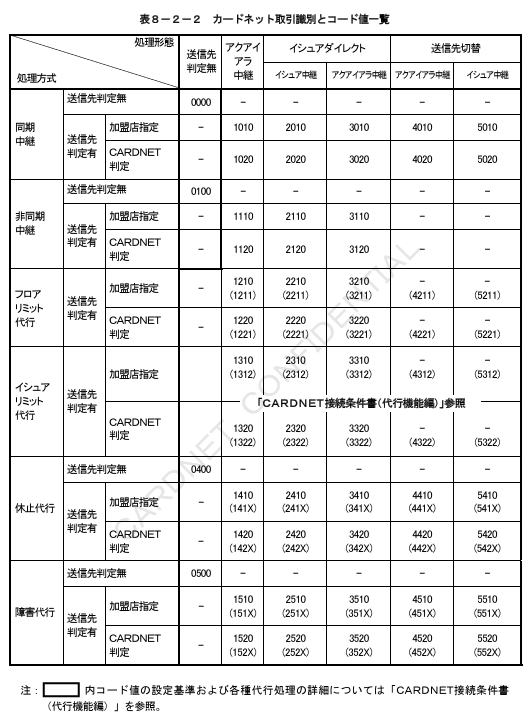

# 第８章　電文項目説明

本章では、共通制御ヘッダー、業務共通ヘッダー、およびBODY部の各項目について、項目内容、設定基準を定義する。

## 8.1　共通制御ヘッダー

共通制御ヘッダーに関する各項目の内容、および設定基準を定義する。

### 8.1.1　ヘッダータイプ

①データ定義

| データ項目名 | 内容 | 属性／桁数 |
|---|---|---|
| ヘッダータイプ | ヘッダー形式とバージョン情報 | JIS8、an2、2バイト |

②本手順での規定

共通制御ヘッダーの形式とバージョンを示す。ヘッダータイプによりヘッダーレイアウトが決定される。

コード値
F1　－　CNF手順・共通制御ヘッダー　バージョン１。

＜補足説明＞

ヘッダータイプは、将来的にフィールドの追加等で、ヘッダーレイアウトが拡張された場合の考慮として定義する。現状では、サポートするヘッダータイプは、上記のコード値のみとする。

### 8.1.2　全体電文長

①データ定義

| データ項目名 | 内容 | 属性／桁数 |
|---|---|---|
| 全体電文長 | 送信電文のレングス情報 | BCD、4n、2バイト |

②本手順での規定

ヘッダー部＋BODY部の実際に送信する電文全体の長さを設定する。暗号化対象の電文は、暗号化済みのBODY部を対象とする。

＜補足説明＞

電文暗号化処理方式についての詳細は、第７章「セキュリティ制御仕様」を参照。

### 8.1.3　差出センターID

①データ定義

| データ項目名 | 内容 | 属性／桁数 |
|---|---|---|
| 差出センターID | 電文送信元センターID | JIS8、anp11、11バイト |

②本手順での規定

センター間取引
要求電文送信時に仕向センターIDが設定される。応答電文送信時に被仕向センターIDが設定される。会社コード7桁＋サブコード4桁の合計11桁で構成される。

オンライン端末取引
要求電文送信時に「3J021000000」がセットされる。応答電文送信時は、被仕向センターIDが設定される。会社コード7桁＋サブコード4桁の合計11桁で構成される。

3桁目～7桁目までの5バイトが取引特定キー（トランザクションID）の1項目として使用される。

### 8.1.4　宛先センターID

①データ定義

| データ項目名 | 内容 | 属性／桁数 |
|---|---|---|
| 宛先センターID | 電文送信先センターID | JIS8、anp11、11バイト |

②本手順での規定

要求電文送信時に被仕向センターIDが設定される。応答電文送信時に仕向センターIDが設定される。会社コード7桁＋サブコード4桁の合計11桁で構成される。

＜補足説明＞

仕向センターにて要求電文送信時のデフォルト値は、「3J021000000」（CARDNETセンターID）を設定する。

### 8.1.5　加盟店契約会社コード

①データ定義

| データ項目名 | 内容 | 属性／桁数 |
|---|---|---|
| 加盟店契約会社コード | 加盟店契約カード会社コード | JIS8、anp11、11バイト |

②本手順での規定

加盟店が支払契約をしているカード会社を識別するコードが設定される。会社コード7桁＋サブコード4桁の合計11桁で構成される。

サブコードは、デフォルト値として常にALL"0"を設定する（サブコードは使用しない）。

制御系電文（MTI 15XX、16XX、18XX）を送信する場合は、デフォルト値として、"ALL 0"を設定する。

＜補足説明＞

・加盟店センターにてアクワイアラ判定代行サービスを利用する場合、デフォルト値として「3J021000000」（CARDNETセンターID）を設定する。
・マニュアル入力の業務電文を送信する場合は、加盟店センターにて判定した加盟店契約カード会社コードを設定する。
・アクワイアラ判定代行サービスの詳細については「CARDNET接続条件書（代行機能編）」を参照。

### 8.1.6　送信日時

①データ定義

| データ項目名 | 内容 | 属性／桁数 |
|---|---|---|
| 送信日時 | 電文送信日時 | BCD、n14、7バイト |

②本手順での規定

各センターで電文を送信した日時を設定する。YYYYMMDDhhmmssの形式とする。

### 8.1.7　モードフラグ

①データ定義

| データ項目名 | 内容 | 属性／桁数 |
|---|---|---|
| モードフラグ | システムの稼働モード | BCD、n2、1バイト |

②本手順での規定

システム稼働モードを示す。本番モードと試験モードを識別する。

コード値
00 → 本番モード
10 → 試験モード

### 8.1.8　予備

①データ定義

| データ項目名 | 内容 | 属性／桁数 |
|---|---|---|
| 予備 | 予備フィールド | JIS8、anp2、2バイト |

②本手順での規定

共通制御ヘッダーの予備フィールド。デフォルト値としてスペースを設定する。

## 8.2　業務共通ヘッダー

業務共通ヘッダーに関する各項目の内容、および設定基準を定義する。

### 8.2.1　ヘッダータイプ

①データ定義

| データ項目名 | 内容 | 属性／桁数 |
|---|---|---|
| ヘッダータイプ | ヘッダー形式とバージョン情報 | JIS8、an2、2バイト |

②本手順での規定

業務共通ヘッダーの形式とバージョンを示す。ヘッダータイプによりヘッダーレイアウトが決定される。

コード値
A1 － CNF手順・業務共通ヘッダー　バージョン１。

＜補足説明＞

ヘッダータイプは、将来的にフィールドの追加等で、ヘッダーレイアウトが拡張された場合の考慮として定義する。現状では、サポートするヘッダータイプは、上記のコード値のみとする。

### 8.2.2　電文種別コード

①データ定義

| データ項目名 | 内容 | 属性／桁数 |
|---|---|---|
| 電文種別コード | CNF手順の電文種別情報 | JIS8、an4、4バイト |

②本手順での規定

電文種別を識別するコード。上1桁目の「C」と「E」は、CNF手順で規定した電文を示す。「C」は通常電文を表す。また、「E」は障害通知電文を表す。

**表８－１　電文種別コード一覧**

| コード値 | 内容 | 要求／応答 | コード値 | 内容 | 要求／応答 |
|---|---|---|---|---|---|
| C100 | オーソリ | 要求 | C522 | 仕向精査 | 要求 |
| C110 | オーソリ | 応答 | C532 | オンライン精査 | 応答 |
| C120（C121） | オーソリアドバイス | 要求 | C520 | 被仕向精査 | 要求 |
| C130 | オーソリアドバイス | 応答 | C530 | 被仕向精査 | 応答 |
| C200 | 売上 | 要求 | C644 | 汎用通知 | 通知 |
| C210 | 売上 | 応答 | E644 | 障害電文通知 | 通知 |
| C220（C221） | 売上アドバイス | 要求 | C804 | カットオーバ依頼 | 要求 |
| C230 | 売上アドバイス | 応答 | C814 | ネットワーク制御 | 応答 |
| C420（C421） | 障害取消アドバイス | 要求 |  |  |  |
| C430 | 障害取消アドバイス | 応答 |  |  |  |

### 8.2.3　電文認証値

①データ定義

| データ項目名 | 内容 | 属性／桁数 |
|---|---|---|
| 電文認証値 | 送信電文の認証値 | 32ビット列、4バイト |

②本手順での規定

業務系電文（11XX、12XX、14XX、15XX）送信時に、DES CBC方式にて算出した電文認証値を設定する。

制御系電文（16XX、18XX）送信時には、デフォルト値として、LOW VALUE（Hex 00000000）を設定する。

＜補足説明＞

電文認証方式の詳細については、第７章「セキュリティ制御仕様」を参照。

### 8.2.4　チェックディジット

①データ定義

| データ項目名 | 内容 | 属性／桁数 |
|---|---|---|
| チェックディジット | 電文暗号化キー／電文認証キーのチェックディジット | 32ビット列、4バイト |

②本手順での規定

業務系電文（11XX、12XX、14XX、15XX）送信時に、電文暗号化、および電文認証に使用しているKC、KMACのチェックディジットを設定する。

キー交換電文送信時に、交換する暗号化キー自体のチェックディジットを設定する。交換対象キー以外のチェックディジットは、デフォルト値として、LOW VALUE（Hex 0000）を設定する。

・電文暗号化キー（KC）のチェックディジットは、1ビット～16ビットに設定される。
・電文認証キー（KMAC）のチェックディジットは、17ビット～32ビットに設定される。

キー交換電文以外の制御系電文（16XX、18XX）送信時は、デフォルト値として、LOW VALUE（Hex 00000000）を設定する。

＜補足説明＞

チェックディジット算出方式の詳細は、第７章「セキュリティ制御仕様」を参照。

### 8.2.5　仕向区分

①データ定義

| データ項目名 | 内容 | 属性／桁数 |
|---|---|---|
| 仕向区分 | 電文送信元センターの接続形態 | BCD、n2、1バイト |

②本手順での規定

加盟店センターまたはオンライン端末の識別を示す。

コード値
10 ：【予備】
11 ：オンライン端末取引
20 ：センター間取引（送信先判定代行なし）
21 ：センター間取引（送信先判定代行あり）
30 ：【予備】
31 ：情報処理センター間接続のCCT取引
40 ：【予備】
41 ：情報処理センター間接続のセンター間取引

＜補足説明＞

仕向区分「31」、および「41」の仕様については、CARDNET接続条件書（ダイレクト接続編）別冊「情報処理センター接続仕様」を参照。

### 8.2.6　カット対象日付

①データ定義

| データ項目名 | 内容 | 属性／桁数 |
|---|---|---|
| カット対象日付 | カットオーバー日付 | BCD、n8、4バイト |

②本手順での規定

要求／応答の区別なく、各センターにて認識しているカットオーバー日付を設定する。YYYYMMDDの形式とする。ただし、アドバイス要求・応答電文は、再送中にカットオーバー日付が更新した場合でも、元要求・元応答を送信した時点での日付を設定する。

＜補足説明＞

カット対象日付設定基準の詳細は、第６章「オンライン精査仕様」を参照。

### 8.2.7　BODY部電文長

①データ定義

| データ項目名 | 内容 | 属性／桁数 |
|---|---|---|
| BODY部電文長 | BODY部のレングス情報 | BCD、n4、2バイト |

②本手順での規定

BODY部の長さを設定する。暗号化対象電文については、暗号化前（平文）のBODY部を対象とする。

### 8.2.8　カードネット取引識別

①データ定義

| データ項目名 | 内容 | 属性／桁数 |
|---|---|---|
| カードネット取引識別 | CARDNETセンターの処理識別情報 | BCD、n4、2バイト |

②本手順での規定

CARDNETセンターの処理内容（電文中継処理、各種代行処理等）を識別するコードとして処理機能と処理方式の組み合わせによる４桁のコード値が設定される。カード会社にてCARDNETセンターの各種代行サービスを利用する場合は、上記コード値の識別が必要になる。仕向センターが要求電文に設定する値は"0000"とする。

X1 ：送信先判定区分
X2 ：中継代行区分
X3 ：アクワイアラ判定区分
X4 ：累積利用区分

**表８－２－１　カードネット取引識別・コード体系**

| 項目 | コード値 | 内容 | 備考 |
|---|---|---|---|
| 送信先判定区分（X1） | 0 | 送信先判定処理無し |  |
|  | 1 | 通常中継処理のアクワイアラ向電文 |  |
|  | 2 | イシュアダイレクト処理のイシュア向電文 | 注1 |
|  | 3 | フロアリミット判定処理のアクワイアラ向電文 | 注1 |
|  | 4 | 送信先切替処理のアクワイアラ向電文 | 注1 |
|  | 5 | イシュア向電文 | 注1 |
| 中継代行区分（X2） | 0 | 同期中継処理（要求電文） |  |
|  | 1 | 非同期中継処理（アドバイス電文） |  |
|  | 2 | フロアリミット判定代行処理 | 注1 |
|  | 3 | イシュアリミット判定代行処理 | 注1 |
|  | 4 | 被仕向センター代行処理 | 注1 |
|  | 5 | 被仕向センター障害代行処理 | 注1 |
| アクワイアラ判定区分（X3） | 0 | 送信先判定処理無し |  |
|  | 1 | 加盟店センターでアクワイアラを指定 | 注1 |
|  | 2 | CARDNETセンターでアクワイアラを判定 | 注1 |
| 累積利用区分（X4） | 0 | デフォルト値 |  |
|  | 1 | 累積利用チェックエラー（フロアリミット判定代行） |  |
|  | 2 | 同（イシュアリミット判定代行） |  |

注1：送信先判定処理、オーソリ代行処理の詳細については「CARDNET接続条件書（代行機能編）」を参照。

**表８－２－２　カードネット取引識別コード値一覧**

### 8.2.9　カードネット取引通番

①データ定義

| データ項目名 | 内容 | 属性／桁数 |
|---|---|---|
| カードネット取引通番 | CARDNETセンターの処理通番 | BCD、n12、6バイト |

②本手順での規定

CARDNETセンターにて処理通番を設定する。CARDNETセンターへの取引に関する問い合わせ、照会時に使用される。

仕向センターにて要求電文送信時のデフォルト値は、ALL 0（Hex 000000000000）とする。

### 8.2.10　カードネット使用域

①データ定義

| データ項目名 | 内容 | 属性／桁数 |
|---|---|---|
| カードネット使用域 | CARDNETセンターの使用フィールド | 16ビット列、2バイト |

②本手順での規定

CARDNETセンターで使用するフィールドとする。

仕向センターにて要求電文送信時のデフォルト値は、LOW VALUE（Hex 0000）とする。

### 8.2.11　予備

①データ定義

| データ項目名 | 内容 | 属性／桁数 |
|---|---|---|
| 予備 | 予備フィールド | JIS8、anp2、2バイト |

②本手順での規定

業務共通ヘッダーの予備フィールド。デフォルト値としてスペースを設定する。
