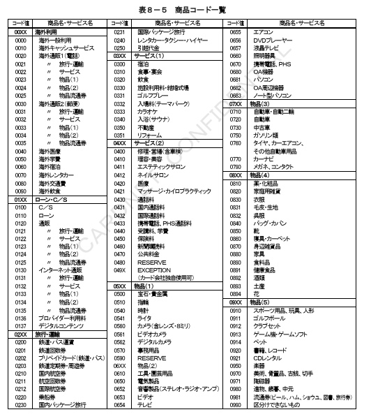

## 8.3　BODY部

BODY部のMTI、ビットマップ、およびデータエレメントに関する各項目の内容および設定基準を定義する。

### 8.3.1　MTI（Message Type ID）

①データ定義

| データ項目名 | 内容 | 属性／桁数 |
|---|---|---|
| MTI | ISO8583の電文種別情報 | JIS8、n4、4バイト |

②本手順での規定

ISO8583（93年度版）に準拠した電文種別を識別するコードが設定される。取引特定キー（トランザクションID）の1項目として使用される。

**表８－３　MTI一覧**

| コード値 | 内容 | 要求／応答 | コード値 | 内容 | 要求／応答 |
|---|---|---|---|---|---|
| 1100 | オーソリ | 要求 | 1522 | 仕向精査 | 要求 |
| 1110 | オーソリ | 応答 | 1532 | オンライン精査 | 応答 |
| 1120（1121） | オーソリアドバイス | 要求 | 1520 | 被仕向精査 | 要求 |
| 1130 | オーソリアドバイス | 応答 | 1530 | 被仕向精査 | 応答 |
| 1200 | 売上 | 要求 | 1644 | 汎用通知 | 通知 |
| 1210 | 売上 | 応答 | 1644 | 障害電文通知 | 通知 |
| 1220（1221） | 売上アドバイス | 要求 | 1804 | カットオーバ依頼 | 要求 |
| 1230 | 売上アドバイス | 応答 | 1814 | ネットワーク制御 | 応答 |
| 1420（1421） | 障害取消アドバイス | 要求 |  |  |  |
| 1430 | 障害取消アドバイス | 応答 |  |  |  |

### 8.3.2　ビットマップ

①データ定義

| データ項目名 | 内容 | 属性／桁数 |
|---|---|---|
| ビットマップ | ビットマップ | b、b64（or b128）、8バイト（or 16バイト） |

②本手順での規定

データエレメントのフィールドレイアウトを表すビット列で、プライマリービットマップとセカンダリービットマップに構成される。

＜補足説明＞

ビットマップ形式の詳細については、第３章「電文構成仕様」を参照。

### 8.3.3　BIT2　会員番号

①データ定義

| BIT | データ項目名 | 内容 | 属性／桁数 |
|---|---|---|---|
| 2 | 会員番号 | カード会員のカード番号 | JIS8、n19、Max21バイト、LLVAR |

②本手順での規定

a）JIS I ストライプ読み込み時
JIS I 第２トラック情報（BIT35）のデータ部先頭バイトから分離符号の前まで最大19バイトを会員番号として設定する。
JIS I 国内カードフォーマット（データ部の先頭バイトから「3932」で始まるカードフォーマット）の場合も、同様に設定する。

b）JIS II ストライプ読み込み時
JIS II トラック情報（BIT47）のデータ部11桁目から26桁目まで最大16バイトを会員番号として設定する。ただし、会員番号ラリアにスペースが存在する場合には、最初の数字から連続した最後の数字までの最大16バイトを会員番号として設定する。

c）マニュアル入力時
入力された会員番号（Max19バイト）を設定する。

＜補足説明＞

CAFIS手順への変換時は、先頭から16バイトを設定する。

### 8.3.4　BIT3：プロセシングコード

①データ定義

| BIT | データ項目名 | 内容 | 属性／桁数 |
|---|---|---|---|
| 3 | プロセシングコード | 取消／返品識別コード | JIS8、n6、6バイト |

②本手順での規定

オーソリ、売上、障害取消業務において取消／返品の識別を示す。CNF手順では、以下に示すコード値のみを有効とする。

障害取消業務においては、取消対象の元取引（オリジナル）と同一コードを設定する。

**表８－４　プロセシングコード一覧**

| MTI | オンライン業務 | コード値 | MTI | 取消対象MTI | 取消対象オンライン業務 | コード値 |
|---|---|---|---|---|---|---|
| 11XX | オーソリ、承認後オーソリ | 000000 | 11XX | オーソリ、承認後オーソリ | 000000 |
| 11XX | オーソリ取消／返品、承認後オーソリ取消／返品 | 200000 | 11XX | オーソリ取消／返品、承認後オーソリ取消／返品 | 200000 |
| 11XX | 海外キャッシング | 010000 | 11XX | 海外キャッシング | 010000 |
| 11XX | 事前承認 | 000000 | 14XX | 事前承認 | 000000 |
| 11XX | 事前承認取消 | 200000 | 14XX | 事前承認取消 | 200000 |
| 11XX | 無効カード照会 | 360000 | 14XX | 無効カード照会 | 360000 |
| 12XX | 売上 | 000000 | 12XX | 売上 | 000000 |
| 12XX | 売上取消／返品 | 200000 | 12XX | 売上取消／返品 | 200000 |
| 12XX | 承認後売上 | 000000 | 12XX | 承認後売上 | 000000 |
| 12XX | 承認後売上／返品 | 200000 | 12XX | 承認後売上／返品 | 200000 |

### 8.3.5　BIT4：取引金額

①データ定義

| BIT | データ項目名 | 内容 | 属性／桁数 |
|---|---|---|---|
| 4 | 取引金額 | 取引金額 | JIS8、n12、12バイト |

②本手順での規定

オーソリ、売上、障害取消業務において取扱金額を設定する。日本円で税・送料を含む金額を設定する。設定可能な金額桁数はMax８桁（上４桁はALL "0"固定）とする。

a）要求電文の指定事項
・対象取引の取扱金額を設定する。
・無効カード照会業務では、0円を設定する。
・オーソリ／売上アドバイス業務では、仕向側システムの代行処理による承認金額を、設定する。拒否結果のアドバイス電文では、0円を設定する。
・障害取消業務では、取消対象元取引の取扱金額を設定する。但し、元取引がタイムアウトした場合は、元取引の要求電文の金額を設定する。

b）応答電文の指定事項
・承認応答の場合は、承認した金額を設定する。
・拒否応答の場合は、0円を設定する。

＜売上データ１２０バイトご利用時の桁数に関するご留意事項＞

仕向センターにて８桁以上の金額を設定された場合、CARDNETセンターの売上データ提供（フォーマット：１２０バイト）をご利用される接続先センターにおいては、売上データの売上金額・売上合計がMax７桁であることにより、桁数オーバーとなり装置の売上データが作成されずエラーとなります。エラーとなった場合は、仕向センターと被仕向センターにて個別にご調整が必要となりますのでご留意ください。
※CARDNETセンターから提供する売上データがエラーとなった場合は、「売上データ作成エラーリスト」を被仕向センターへ送付させていただきます。
詳細は「CARDNET接続条件書（バッチ機能編）別冊　売上データ提供仕様」をご参照ください。

### 8.3.6　BIT11：システムトレースオーディットナンバー

①データ定義

| BIT | データ項目名 | 内容 | 属性／桁数 |
|---|---|---|---|
| 11 | システムトレースオーディットナンバー | 仕向センターの処理通番 | JIS8、n6、6バイト |

②本手順での規定

センター間取引
仕向センターにて、加盟店会社コード（BIT32）毎、現地取引日時（BIT12）毎にユニークに採番し設定される。（下図１）

オンライン端末取引
CARDNETセンターにて採番し設定される。（下図２）

取引特定キー（トランザクションID）の1項目として使用され、要求・応答・再送・結果通知といった一連の取引を通して、フィールド値は変更しない。"000000"は使用不可とする。

【図】図８－３　システムトレースオーディットナンバー採番箇所

### 8.3.7　BIT12：現地取引日時

①データ定義

| BIT | データ項目名 | 内容 | 属性／桁数 |
|---|---|---|---|
| 12 | 現地取引日時 | 仕向センターのシステム日時 | JIS8、n12、12バイト |

②本手順での規定

センター間取引
仕向センターにてシステム日時を設定する。日本時間を標準とし、YYMMDDhhmmssの形式（YYは西暦の下２桁）とする。

オンライン端末取引
CARDNETセンターのシステム日時を設定する。

取引特定キー（トランザクションID）の1項目として使用され、要求・応答・再送・結果通知といった一連の取引を通して、フィールド値は変更しない。

### 8.3.8　BIT14：有効期限

①データ定義

| BIT | データ項目名 | 内容 | 属性／桁数 |
|---|---|---|---|
| 14 | 有効期限 | カードの有効期限 | JIS8、n4、4バイト |

②本手順での規定

マニュアル入力によるオーソリ、売上業務において、入力有効期限を設定する。YYMMの形式（YYは西暦の下２桁）とする。

### 8.3.9　BIT17：収集日

①データ定義

| BIT | データ項目名 | 内容 | 属性／桁数 |
|---|---|---|---|
| 17 | 収集日 | 取引売上日 | JIS8、n4、4バイト |

②本手順での規定

売上業務において、取引の売上日情報としてカードが使用された日（会員控えの印字日）を設定する。MMDDの形式とする。

＜補足説明＞

イシュアダイレクト処理時、およびオーソリ代行処理時は、CARDNETセンターにて当項目を編集する。仕様詳細については「CARDNET接続条件書（代行機能編）」を参照。

### 8.3.10　BIT18：商品コード

①データ定義

| BIT | データ項目名 | 内容 | 属性／桁数 |
|---|---|---|---|
| 18 | 商品コード | 商品コード | JIS8、n4、4バイト |

②本手順での規定

オーソリ、売上業務において、入力された商品コードを設定する。商品コード一覧を表８－５に示す。なお、表８－５に規定のないコードを使用する場合は、仕向センターと被仕向センターとで事前に調整することとする（ただし先頭１桁は０とする）。

**表８－５　商品コード一覧**

＜補足説明＞

①オンライン端末取引において、商品コードの設定がなかった場合（または0000を入力された場合）、かつCARDNETセンターに加盟店ブランド情報テーブルが登録されている場合は、CARDNETセンターにて加盟店ブランド情報テーブルに登録されている該当ブランドの商品コードを設定する。

②オンライン端末取引において、商品コードの設定がなかった場合（または0000を入力された場合）、かつCARDNETセンターに加盟店ブランド情報テーブルが登録されていない場合は、CARDNETセンターにて0090を設定する。「加盟店ブランド情報テーブル」の詳細については、「CARDNET端末情報登録仕様書」を参照。
