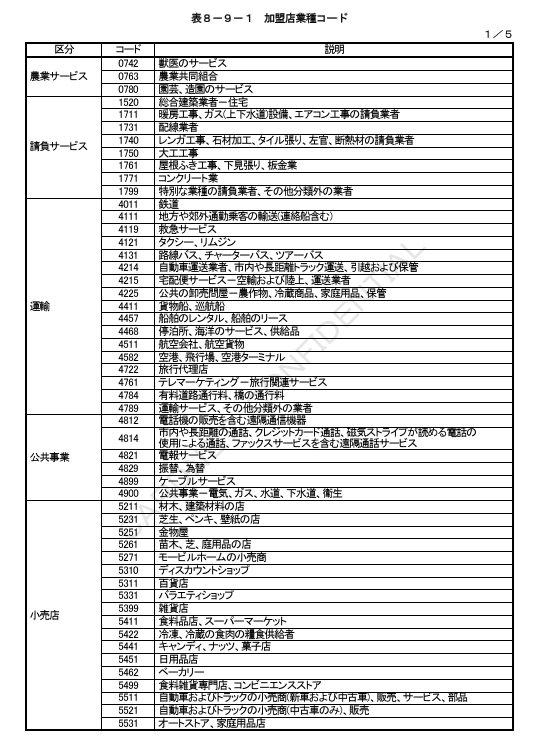
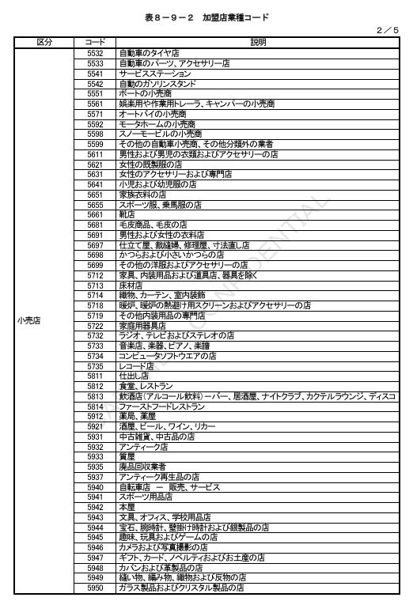
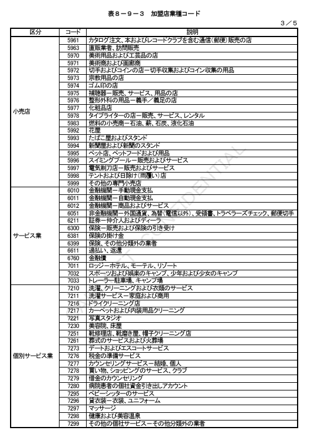
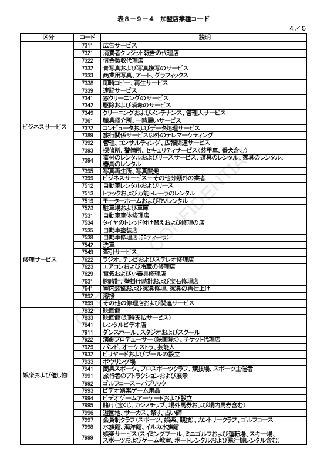
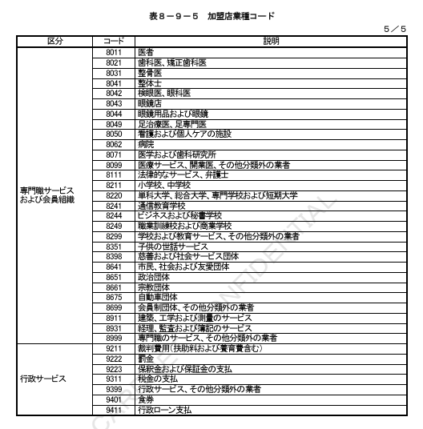

### 8.3.12　BIT24：ファンクションコード

①データ定義

| BIT | データ項目名 | 内容 | 属性／桁数 |
|---|---|---|---|
| 24 | ファンクションコード | 業務識別情報 | JIS8、n3、3バイト |

②本手順での規定

オーソリ、売上、障害取消業務においてオンライン業務の識別を示す。CNF手順では、以下に示すコード値のみを有効とする。

**表８－７　ファンクションコード一覧**

| MTI | オンライン業務 | コード値 | MTI | オンライン業務 | コード値 |
|---|---|---|---|---|---|
| 11XX | オーソリ | 100 | 15XX | オンライン精査 | 500 |
| 11XX | オーソリ取消／返品 | 100 | 16XX | 障害電文通知 | 650 |
| 11XX | 事前承認 | 101 | 16XX | カットオーバー依頼 | 821 |
| 11XX | 事前承認取消 | 100 | 18XX | 開局 | 801 |
| 11XX | 承認後オーソリ | 100 | 18XX | 閉局 | 802 |
| 11XX | 承認後オーソリ取消／返品 | 100 | 18XX | キー交換 | 811 |
| 11XX | 無効カード照会 | 108 | 18XX | カットオーバー | 821 |
| 12XX | 売上 | 200 | 18XX | エコーテスト | 831 |
| 12XX | 売上取消／返品 | 200 |  |  |  |
| 12XX | 承認後売上 | 201 |  |  |  |
| 12XX | 承認後売上／返品 | 201 |  |  |  |
| 14XX | 障害取消 | 400 |  |  |  |

＜補足説明＞

イシュアダイレクト処理時およびオーソリ代行処理時は、CARDNETセンターにて当項目を編集する。仕様詳細については「CARDNET接続条件書（代行機能編）」を参照。

### 8.3.13　BIT25：メッセージ理由コード

①データ定義

| BIT | データ項目名 | 内容 | 属性／桁数 |
|---|---|---|---|
| 25 | メッセージ理由コード | 取引理由、取引目的 | JIS8、n4、4バイト |

②本手順での規定

取引の詳細な理由、および目的を示す。現状では、以下のコード値をサポートする。

**表８－８　メッセージ理由コード一覧**

| コード値 | 内容 | 備考 |
|---|---|---|
| 1511 | カード不正使用の疑い有り | センター間取引：加盟店で判断し設定されるコード。※設定条件はカード会社と協議の上決定する。オンライン端末取引：端末にて商品コード"9999"が入力された場合に設定されるコード |
| 9999 | その他 | センター間取引およびオンライン端末取引のデフォルト値 |

### 8.3.14　BIT26：加盟店業種コード

①データ定義

| BIT | データ項目名 | 内容 | 属性／桁数 |
|---|---|---|---|
| 26 | 加盟店業種コード | 加盟店の業種情報 | JIS8、n4、4バイト |

②本手順での規定

加盟店の業種情報が設定される。加盟店業種コード表を次頁の表８－９に示す。デフォルト値は、"5999"とする。なお、表８－９に規定のないコードを使用する場合は、仕向センターと被仕向センターで事前に調整することとする。

＜補足説明＞

①オンライン端末取引において、CARDNETセンターに加盟店ブランド情報テーブルが登録されている場合は、CARDNETセンターにて、加盟店ブランド情報テーブルに登録されている該当国際ブランドの加盟店業種コードを設定する。

②オンライン端末取引において、CARDNETセンターにて、加盟店ブランド情報テーブルが登録されていない場合は、CARDNETセンターにてデフォルト値（"5999"）を設定する。

「加盟店ブランド情報テーブル」の詳細については、「CARDNET端末情報登録仕様書」を参照。

**表８－９　加盟店業種コード一覧**







### 8.3.15　BIT28：精査日

①データ定義

| BIT | データ項目名 | 内容 | 属性／桁数 |
|---|---|---|---|
| 28 | 精査日 | 精査対象日、カットオーバー日付 | JIS8、n6、6バイト |

②本手順での規定

オンライン精査対象日やカットオーバー日付が設定される。YYMMDDの形式（YYは西暦の下2桁）とする。

a）オンライン精査電文（1520／1522）での指定事項
CARDNETセンターにて、オンライン精査の対象日を設定する。

b）カットオーバー電文（1814）での指定事項
CARDNETセンターにて、カット対象日付の更新処理時に更新する日付を設定する。
CARDNETセンターにて、カット対象日付の通知処理時に現在の日付を設定する。

c）オーソリ、売上電文（1110／1130／1210／1230）での指定事項
オーソリエージェントの判定を行った会社（BIT58「オーソリ判定会社コード」）が任意に設定する。

d）障害取消電文（1420）での指定事項
取消対象の元取引電文の設定値をセットする。元取引がタイムアウトした場合は、電文送信元センターのシステム日付を設定する。

### 8.3.16　BIT30：オリジナル金額

①データ定義

| BIT | データ項目名 | 内容 | 属性／桁数 |
|---|---|---|---|
| 30 | オリジナル金額 | 元取引の取引金額 | JIS8、n24、24バイト |

②本手順での規定

オーソリ／売上業務、オーソリアドバイス（許可）／売上アドバイス（許可）業務の要求電文送信時は、取引金額（BIT4）と同一値を設定する。オーソリアドバイス（拒否）／売上アドバイス（拒否）業務の要求電文送信時は、拒否となった元取引の取引金額を設定する。

応答電文送信時は、要求電文の金額を保証して設定する。応答、取消／返品、障害取消、結果通知といった一連の取引を通じて、フィールド値は変化しない。

オリジナル金額は、取引金額サブフィールドと精算金額サブフィールドより構成される。当手順では、取引金額フィールドのみを使用する。精算金額フィールドは使用しない。また、設定可能なオリジナル取引金額の桁数はMax8桁（上4桁はALL"0"固定）とする。

**表８－１０　サブフィールド構成**

| サブフィールド | オリジナル取引金額（n12） | オリジナル精算金額（n12） |
|---|---|---|
| 設定値（設定金額） | 元取引の取引金額（BIT4）を設定 | デフォルト値（ALL"0"）を設定 |

（各12バイト）

### 8.3.17　BIT32：加盟店会社コード

①データ定義

| BIT | データ項目名 | 内容 | 属性／桁数 |
|---|---|---|---|
| 32 | 加盟店会社コード | 個々の加盟店を識別するコード | JIS8、anp11、13バイト、LLVAR |

②本手順での規定

センター間取引
加盟店センター配下の複数加盟店を識別する１項目として使用される。
実際に加盟店契約カード会社と契約している単位（支店等）で設定される。

・加盟店端末番号（BIT41）との組み合わせで取引発生元の市場や端末を識別する。
・加盟店センターと加盟店が同一の場合は、原則として送出センターID（共通制御ヘッダ）と同一値が設定される。

オンライン端末取引
以下の形式で設定される。

```
02100 + "1" + 端末設置カード会社
```

※「国内使用予約域（BIT60）の端末識別番号の上5桁」を使用

取引特定キー（トランザクションID）の１項目として使用され、要求・応答・再送・結果通知といった一連の取引を通して、フィールド値は変更しない。

障害通知送信時は、原則として元取引の値を保証する。ただし、CARDNETセンターがタイムアウトを検知し被仕向センターへ障害通知を送信する場合は、CARDNETセンターIDが設定される（元取引値は保証されない）。

### 8.3.18　BIT35：JIS I 第2トラック情報

①データ定義

| BIT | データ項目名 | 内容 | 属性／桁数 |
|---|---|---|---|
| 35 | JIS I 第2トラック情報 | JIS I 第2トラック（ABA）データ／JIS I 第2トラック（国内専用）データ | JIS8、ans..37　Max39バイト、LLVAR |

②本手順での規定

オーソリ、売上、障害取消業務において、JIS I ストライプ読込み時に設定される。

・実際のトラック情報から、始め符号、終り符号、LRC符号を除いたMax37桁を設定する。
・フィールド属性はJIS8の為、読込みイメージをキャラクター変換して設定する。

【図】図８－４－１　JIS I 第2トラック情報（ABA）

【図】図８－４－２　JIS I 第2トラック情報（国内専用）

### 8.3.19　BIT37：リトリーバルリファレンスナンバー

①データ定義

| BIT | データ項目名 | 内容 | 属性／桁数 |
|---|---|---|---|
| 37 | リトリーバルリファレンスナンバー | オーソリゼーション判定センターの処理通番 | JIS8、anp12、12バイト |

②本手順での規定

オーソリゼーションの判定を行った会社（BIT58「オーソリ判定会社コード」）が処理通番として設定する。

オフラインで取引照会キーの１項目として使用する為、一定時間内の取引中でユニークに採番する。

【図】図８－５　リトリーバルリファレンスナンバー採番箇所

### 8.3.20　BIT38：承認コード

①データ定義

| BIT | データ項目名 | 内容 | 属性／桁数 |
|---|---|---|---|
| 38 | 承認コード | 承認コード | JIS8、anp6、6バイト |

②本手順での規定

オーソリゼーションの判定を行った会社（BIT58「オーソリ判定会社コード」）が設定する。

拒否応答時は、デフォルト値として"000000"を設定する。

障害取消業務では、元取引応答の値を設定する。但し、元取引がタイムアウトした場合は、"000000"を設定する。

### 8.3.21　BIT39：アクションコード

①データ定義

| BIT | データ項目名 | 内容 | 属性／桁数 |
|---|---|---|---|
| 39 | アクションコード | エラーコード | JIS8、n3、3バイト |

②本手順での規定

取引の処理結果を示すエラーコード情報を設定する。アクションコードの詳細は、9.6「エラーコード設定基準」を参照。

### 8.3.22　BIT41：加盟店端末番号

①データ定義

| BIT | データ項目名 | 内容 | 属性／桁数 |
|---|---|---|---|
| 41 | 加盟店端末番号 | 取引発生元の端末識別番号 | JIS8、n8、8バイト |

②本手順での規定

加盟店の取引発生元端末を特定するための識別番号として使用する。

センター間取引
・加盟店会社コード（BIT32）の詳細情報として使用する場合は、コード体系をカード会社へ通知する。詳細は「CARDNETテーブル情報提供仕様書」を参照。
・1桁～3桁の部分は、オンライン端末の採番範囲である「500～699」は使用不可とする。
・詳細な入力端末の識別が必要な場合は、国内使用領域（BIT60）の中の端末識別番号サブフィールドを使用する。

オンライン端末取引
・国内使用領域（BIT60）の中の端末識別番号の下8桁を設定する。

### 8.3.23　BIT42：加盟店番号

①データ定義

| BIT | データ項目名 | 内容 | 属性／桁数 |
|---|---|---|---|
| 42 | 加盟店番号 | 加盟店の管理番号 | JIS8、anp15、15バイト |

②本手順での規定

カード会社の管理基準で採番された加盟店番号を設定する。番号体系はカード会社各社が加盟店に割り当てたものを使用する。

センター間取引
・デフォルト値は、「スペース × 15」。仕向センターが送信先判定代行利用時に設定値を指定。
・デフォルトの場合は、CARDNETセンターで管理する加盟店番号を編集する。
・センター間取引の障害通知業務では、取消対象取引の応答電文の値を設定する。
・元取引がタイムアウトした場合は、元取引の要求電文の値を設定する。

オンライン端末取引
・CARDNETセンターから被仕向センターへの要求電文には、オンライン端末に登録された値が設定される。
