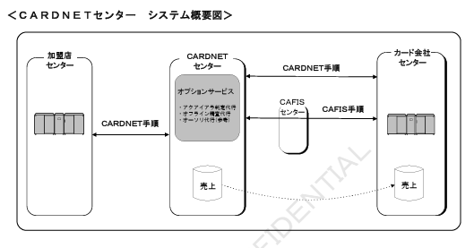

# 1. システム概要

本章では、株式会社日本カードネットワークが提供する「CARDNETオンライン接続サービス」のシステム概要について記述します。

＜CARDNETセンター　システム概要図＞

【図】CARDNETセンター　システム概要図

## 1.1 センターサービス

CARDNETセンターが提供する「センター間接続サービス」には、以下の2種類があります。

### 1.1.1 基本サービス

加盟店様センターからのオーソリ／売上電文の中継、CAFISセンター経由接続カード会社様の売上データのキャプチャリング等を行うサービスです。

加盟店様センターとは、POSサーバーやホスト機等の加盟店様側オンラインクレジット処理センターのことです。

### 1.1.2 オプションサービス

オンライン取引における加盟店契約カード会社様の判定等を加盟店様センターに代わって行うサービスです。
