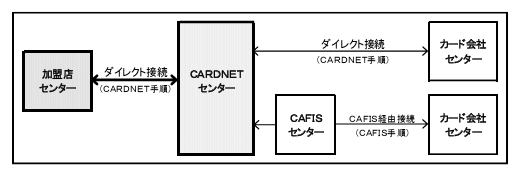
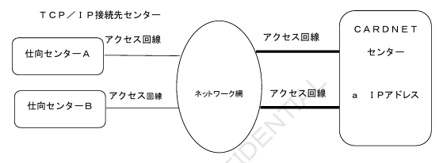
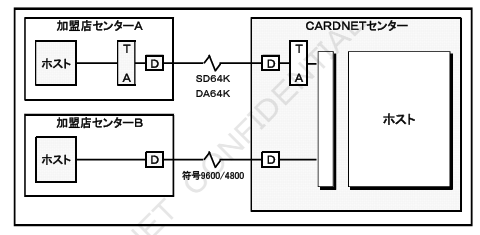

# 2. 接続概要

【図】接続概要図

## 2.1 接続条件

### 2.1.1 接続手順およびネットワーク制御

（1）接続手順

CARDNETセンターとの接続には、CARDNET手順を使用します。  
CARDNET手順とは、株式会社日本カードネットワークがセンター間接続において使用する独自の接続手順で、以下の特徴があります。

| 特徴 | 内容 |
|---|---|
| 国際標準化 | 国際標準（ISO 8583／93年度版）に準拠しています。 |
| セキュリティの確保 | データ機密保持のため、電文および暗証番号の暗号化を行うとともに改ざん防止のため、認証チェックを行います。 |
| 整合性の確保 | 取引の整合性を確認するため、1日1回、オンライン精査を行います。 |
| 業務電文形式の単純化 | 取引タイプとデータ項目により、電文フォーマットを定型化・単純化することにより、接続先センターの対応を容易にします。 |

---

## （2）ネットワーク制御

＜基本的な処理の流れ＞

【図】基本的な処理の流れ

**a．開局**

加盟店様センターとCARDNETセンターとの業務を開始します。
開局要求は、加盟店様センターより行うことを基本とします。
CARDNETセンターからの開局要求をご希望の場合は、あらかじめ加盟店様センターの開局時間をご登録いただきます。

**b．キー交換**

電文中にある暗証番号の暗号化キー、電文自体の暗号化キー、電文の認証キーをオンラインで交換します。
キー交換要求は、あらかじめ加盟店様センターに設定していただいたサイクルごとに、CARDNETセンターより行います。

**c．カットオーバー**

オンライン精査の対象電文を特定するため、1日1回、加盟店様センターの運用時間に合わせて「日替り処理（カットオーバー）」を行います。

カットオーバーは、加盟店様センター起動を基本とします。
CARDNETセンター起動をご希望の場合は、あらかじめ加盟店様センターのカットオーバー時間をご登録いただきます。

**d．閉局**

加盟店様センターとCARDNETセンターとの業務を終了します。
閉局要求は、加盟店様センターから行うことを基本とします。
CARDNETセンターからの閉局要求をご希望される場合は、あらかじめ加盟店様センターの閉局時間をご登録いただきます。

○CARDNETセンターの計画停止時等、CARDNETセンターの都合により、ご登録いただいた時刻以外のタイミングで「開局要求」および「閉局要求」を送信することがあります。
○閉局処理を行わず、常に開局にしておくことも可能です。

※詳細につきましては「CARDNET接続条件書（ダイレクト接続編）」をご参照ください。

---

### 2.1.2 接続回線（TCP／IP使用時）

CARDNETセンターとの接続にTCP／IPを使用する場合のネットワーク構成は下図のとおりです。
ご利用可能な回線およびネットワーク構成の詳細につきましては「CARDNET接続条件書（ダイレクト接続編）」をご参照ください。

＜ネットワーク構成概要＞

【図】TCP／IP接続センター ネットワーク構成概要図

---

### 2.1.3 接続回線（TCP／IP使用時以外）

#### （1）回線種別

CARDNETセンターとの接続にご利用いただく回線は、トランザクション量などにより、以下の中からご選択いただきます。

専用線（4800bps、9600bps、64Kbps）

※詳細につきましては「CARDNET接続条件書（ダイレクト接続編）」をご参照ください。

＜システム構成概要＞

【図】専用線接続時 システム構成概要図

※D：DSU、TA：ターミナルアダプター
※SD64K（専用線）、DA64K（専用線）、符号9600／4800（専用線）は、いずれもNTTの商品名です。
また、PVC接続とは、NTTが提供する通信先を特定の相手に固定するサービスです。

#### （2）回線および通信機器の手配

CARDNETセンターとの接続にご利用いただく回線は、加盟店様側の名義にて手配していただきます。
また、通信機器は、以下のとおり手配していただきます。

| 回線種別 | 回線名義 | 加盟店センター側 通信機器 | 加盟店センター側 手配担当 | CARDNETセンター側 通信機器 | CARDNETセンター側 手配担当 |
|---|---|---|---|---|---|
| 専用線（SD64K／DA64K） | 加盟店様 | TA、DSU | 加盟店様 | TA、DSU | 加盟店様 |
| 専用線（符号品目9600／4800） | 加盟店様 | DSU | 加盟店様 | DSU | 加盟店様 |

#### （3）アクセスポイント

CARDNETセンターのアクセスポイントは、以下のとおりです。

| アクセスポイント | 接続対象 |
|---|---|
| 東京（ホストセンター） | 加盟店様センター、カード会社様センター |
