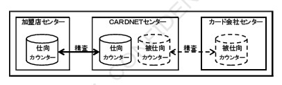
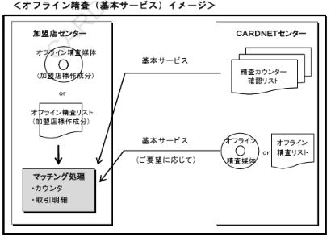
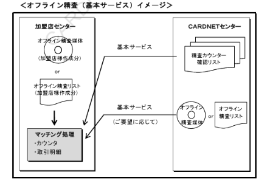
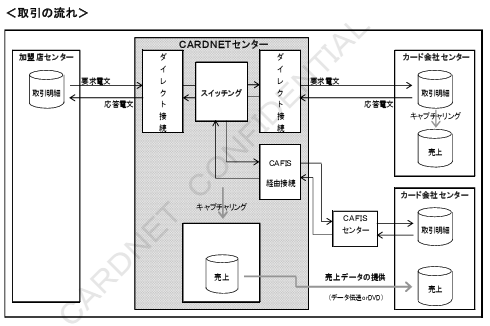
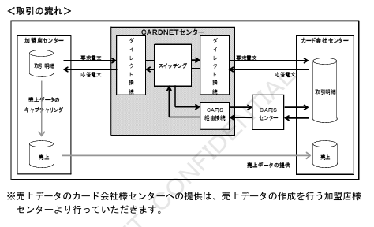

# 4. サービス概要

本章では、基本サービスおよびオプションサービスのサービス概要について記述します。

## 4.1 基本サービス

### 4.1.1 売上電文中継

本業務は、売上データの作成を行わない加盟店様センターのみが対象となります。

オンライン取引において、売上電文を、加盟店様センターからカード会社様センターへ直接またはCAFISセンター経由で中継します。

＜取引の流れ＞

【図】売上電文中継 取引の流れ

＜対象取引一覧＞

| 取引名 | 内容 |
|---|---|
| 売上 | クレジットカード取引の承認と売上処理を同時に行う業務 |
| 売上取消／返品 | 売上処理後の購入申込および購入商品の返品の際に行う業務 |
| 承認後売上 | 電話等によりカード会社様から承認を得た後に、売上処理を行う業務 |
| 承認後売上取消／返品 | 承認後売上処理後の購入申込および購入商品の返品の際に行う業務 |
| 売上事後一括送信 | 加盟店様センター内で折り返して売上処理を行った取引を、事後に一括して送信する業務 |
| 障害取消 | 各業務の要求電文について、タイムアウト等のシステム障害により、当該要求電文を取り消す際の電文 |

---

### 4.1.2 精査

本業務は、売上データの作成を行わない加盟店様センターのみが対象となります。

売上電文中継を行う場合は、加盟店様センターとCARDNETセンターとの2センター間における売上取引金額の整合性を確認するため、1日1回、オンライン精査を行います。
また、万が一オンライン精査が不整合となった場合は、オフライン精査により対象取引を特定することができます。

#### （1）オンライン精査

カットオーバー処理の完了を契機に、加盟店様センターとCARDNETセンターの精査カウンター（仕向カウンター）を交換します。

※詳細につきましては「CARDNET接続条件書（ダイレクト接続編）」をご参照ください。

【図】オンライン精査 概要図  

※各カード会社様センターとのオンライン精査はCARDNETセンターとの間で行いますので、加盟店様センターにご対応いただく必要はありません。

オンライン精査は、加盟店様センターの精査合計金額と、CARDNETセンターの精査合計金額とが同一であれば、精査一致とします。

| 精査カウンター | A 売上金額 | B 左記の障害取消金額 | C 売上取消・返品金額 | D 左記の障害取消金額 | 精査合計金額 |
|---|---|---|---|---|---|
| 加盟店センター | 5,000,000円 | 10,000円 | 50,000円 | 0円 | 4,940,000円 |
| CARDNETセンター | 5,010,000円 | 20,000円 | 50,000円 | 0円 | 4,940,000円 |

※計算式：E = A − B − C + D

#### （2）オフライン精査

**■基本サービス（カウンターサマリー情報の提供）**

オンライン精査が不整合となった場合、CARDNETセンターより以下のリストを送付いたしますので、加盟店様センターにて不整合取引の特定（オフライン精査）を行っていただきます。
※精査不整合の詳細（各精査カウンターの計上条件、等）につきましては「CARDNET接続条件書（ダイレクト接続編）」をご参照ください。

＜オンライン精査不整合時にご提供するリスト＞

| リスト名 | 内容 |
|---|---|
| 精査カウンター確認リスト | CARDNETセンターの精査カウンターとCARDNETセンターにて認識している加盟店様センターの精査カウンターの値（サマリー）を出力。 |
| 接続センター別取引合計表 | 加盟店様より受信した取引をカード会社様毎に、精査カウンター確認リストの値（サマリー）を出力。 |

**■基本サービス（取引明細情報の提供）** ※ご要望に応じて

上記リストでのオフライン精査が困難な場合は、加盟店様センターのご要望に応じて、CARDNETセンターにて認識している取引明細を出力したオフライン精査媒体または、オフライン精査リストをご提供することが可能です。
※オフライン精査リストの詳細につきましては「CARDNET接続条件書（バッチ機能編）」をご参照ください。

＜加盟店様のご要望に応じてご提供するリスト＞

| リスト名 | 内容 |
|---|---|
| オフライン精査リスト（紙・DVD） | CARDNETセンターにて認識している加盟店様センターの該当精査日の全取引明細を出力。 |

＜オフライン精査（基本サービス）イメージ＞

【図】オフライン精査（基本サービス）イメージ図

**■オプションサービス**

オプションサービスとして、CARDNETセンターでマッチング処理を代行することも可能です。
（ご利用いただく場合には、事前にオプションサービス利用契約が必要です。）

CARDNETセンターにてマッチング処理を行った場合には、マッチング結果を出力した以下のリストを加盟店様にご提供します。
※オプションサービス（マッチング代行）の詳細につきましては「CARDNET接続条件書（バッチ機能編）」をご参照ください。

＜オプションサービスご利用時に提供するリスト＞

| リスト名 | 内容 |
|---|---|
| 精査カウンター不一致リスト | 加盟店様センターの精査カウンターとCARDNETセンターの精査カウンターをマッチングし、不一致となったカウンター項目とその値を出力。 |
| 精査明細合計不一致リスト | 加盟店様センターの取引明細とカウンター項目をマッチングし、不一致となったカウンター項目とその値を出力。 |
| 精査不一致明細リスト | 加盟店様センターの取引明細とカウンター項目とのマッチングにおいて、不一致となった明細の内容を出力。 |

＜オフライン精査（オプションサービス）イメージ＞

【図】オフライン精査（オプションサービス）イメージ図

---

### 4.1.3 売上データ提供

本業務は、売上データの作成を行わない加盟店様センターのみが対象となります。

売上電文をCAFISセンター経由で、カード会社様センターへ中継する場合、CARDNETセンターにて売上データのキャプチャリング（蓄積）を行い、媒体またはデータ伝送にて、カード会社様センターに売上データを提供します。

○ダイレクト接続のカード会社様センターは、売上電文より、売上データのキャプチャリングを行います。

＜取引の流れ＞

【図】売上データ提供 取引の流れ図

---

### 4.1.4 オーソリ電文中継

本業務は、CARDNETセンターと接続する全ての加盟店様センターがご利用いただけます。

オンライン取引において、オーソリ電文を加盟店様センターからカード会社様センターへ直接またはCAFISセンター経由で中継します。

＜取引の流れ＞

【図】オーソリ電文中継 取引の流れ図

※売上データのカード会社様センターへの提供は、売上データの作成を行う加盟店様センターより行っていただきます。

＜対象取引一覧＞

| 取引名 | 内容 |
|---|---|
| オーソリ | クレジットカード取引の承認のみを行う業務 |
| オーソリ取消／返品 | オーソリ承認後の購入申込および購入商品の返品の際に行う業務 |
| 事前承認 | 将来的に予想されるクレジットカード取引について事前の承認を行う業務 |
| 事前承認取消 | 事前承認後の購入予定の取消の際に行う業務 |
| オーソリ事後一括送信 | 加盟店様センター内で折り返してオーソリ処理を行った取引を、事後、一括して送信する業務 |
| 無効カード照会 | 提示されたクレジットカードの有効性を確認する業務 |
| 障害取消 | 各業務の要求電文について、タイムアウト等のシステム障害により、当該要求電文を取り消す際の電文 |
