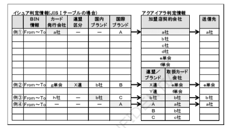
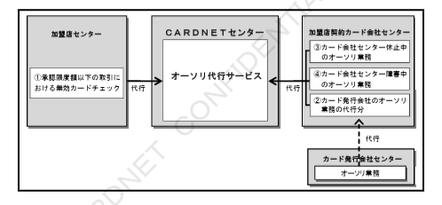

## 4.2 オプションサービス

### 4.2.1 アクワイアラ判定代行サービス

本サービスは、マニュアル入力時にはご利用いただけません。

オンライン取引において、電文中継先となる加盟店様と加盟店契約のあるカード会社様センターを、加盟店様センターに代わって判定するサービスです。
本サービスをご利用いただくことにより、加盟店様センターでの煩雑なカード会社様の判定および判定条件の追加・変更作業が不要となります。

※詳細につきましては「CARDNET接続条件書（代行機能編）」をご参照ください。

#### （1）取引の流れ

加盟店様センターは、加盟店契約カード会社様を指定せずに要求電文を送信していただきます。
CARDNETセンターは、当該取引における加盟店契約カード会社様を判定し、判定結果を要求電文にてカード会社様センターに、また応答電文にて加盟店様センターに通知します。

【図】アクワイアラ判定代行サービス 取引の流れ図

---

#### （2）判定手順

要求電文中の会員番号情報（JIS I の場合）、またはカード会社情報（JIS II の場合）とイシュア判定情報によりカード発行会社様を特定し、その結果とアクワイアラ判定情報により加盟店契約カード会社様を特定します。

##### 判定例

**例①**：
当該加盟店様は、カード発行会社「a社」と加盟店契約があるため、業務要求電文は「a社」に送信されます。

**例②**：
当該加盟店様は、カード発行会社「g単会」とは加盟店契約がないが、「X連」とは加盟店契約があるため、業務要求電文は「X連」の取扱カード会社「g単会」に送信されます。

**例③**：
当該加盟店様は、カード発行会社「h社」とは加盟店契約がないが、国内ブランド「b社」とは加盟店契約があるため、業務要求電文は「b社」に送信されます。

**例④**：
カード発行会社の設定はない（海外発行）が、当該クレジットカードの国際ブランドは「A」であり、「A」の取扱カード会社に「a社」が指定されているため、業務要求電文は「a社」に送信されます。

---

#### （3）判定に必要な情報

本サービスをご利用の際には、あらかじめ下記の情報を登録用紙にて、加盟店様よりご提供いただきます。

| 項目 | 内容 |
|---|---|
| 加盟店情報設定依頼書（JC-0202） | 加盟店様と加盟契約のあるカード会社様、および国内ブランド・国際ブランドにおける取扱カード会社様の会社コードを全てご登録いただきます（加盟店様単位に最大50社までの登録が可能です）。 |

その他に、以下の情報を加盟店契約カード会社様からご提供いただきます。

| 項目 | 内容 |
|---|---|
| JIS I 判定テーブル設定依頼書（JC-0401） | JIS I 判定の処理に必要な情報。 |
| JIS I（国内専用カード）判定テーブル設定依頼書（JC-0402） | JIS I（国内専用カード）判定の処理に必要な情報。 |
| JIS II 判定テーブル設定依頼書（JC-0403） | JIS II 判定の処理に必要な情報。 |
| JIS II 再判定テーブル設定依頼書（JC-0404） | JIS II 再判定の処理に必要な情報。 |

---

#### （4）加盟店様（加盟店契約）の設定レベル

1つの加盟店様センターで複数の加盟店様のシステム処理をひとまとめで行っている場合には、個々の加盟店様（カード会社様との加盟店契約単位）を左記の1～3のレベルで識別できます。

＜設定レベル構成イメージ＞

【図】加盟店様（加盟店契約）の設定レベル構成図

（例）
- レベル3：各店舗単位（例：○○売場 等）
- レベル2：店舗グループ単位（例：△△店 等）
- レベル1：加盟店センター単位

---

### 4.2.2 オーソリ代行サービス（ご参考）

> 本サービスは、加盟店契約カード会社様にご指定いただきます。

加盟店契約カード会社様のご希望により、一定金額以下の無効カードチェック等のオーソリ業務を代行します。
本サービスをご利用いただくことにより、以下のことが可能となります。

1. 加盟店様センターへの応答時間の短縮
2. カード会社様センターの休止・障害中におけるオーソリ業務の継続
3. 加盟店様センターでの無効カード情報管理が不要

※詳細につきましては「CARDNET接続条件書（代行機能編）」をご参照ください。

---

#### （1）サービスのメニュー

オーソリ代行サービスには、以下のメニューがあります。

| 代行メニュー | 機能 | 代行限度額の設定単位 |
|---|---|---|
| フロアリミット判定代行（上記①） | 加盟店契約カード会社が各加盟店様毎および商品コード毎に設定する一定限度額以下の取引について、CARDNETセンターがオーソリ業務を代行する機能。 | 加盟店様ごと・カード会社様ごと・商品コードごと |
| イシュアリミット判定代行（上記②） | 加盟店契約カード会社が発行会社毎および商品コード毎に設定する一定限度額以下の取引について、CARDNETセンターがオーソリ業務を代行する機能。 | カード会社様ごと・商品コードごと |
| 被仕向センター休止代行（前頁③） | 要求電文を受信する被仕向センターが休止中の場合、一定額以下の取引についてCARDNETセンターがオーソリ業務を代行する機能。 | カード会社様ごと |
| 被仕向センター障害代行（前頁④） | 要求電文を受信する被仕向センターが障害中の場合、一定額以下の取引についてCARDNETセンターがオーソリ業務を代行する機能。 | カード会社様ごと |

#### （2）取引の流れ

オーソリ判定をCARDNETセンターで行い、応答電文を加盟店様センターに送信します。
ただし、代行限度額を超えた要求電文については、カード会社様センターにスイッチングします。
また、オーソリ代行結果は取引の発生都度、電文にてカード会社様センターに送信します。

---

#### （3）主なチェック内容

| チェック項目 | 内容 |
|---|---|
| 有効期限チェック | 要求電文中のカード有効期限情報と現在の日付との比較により、カードの有効性を確認します。 エラーの場合は「拒否応答」を行います。 |
| 無効通知情報チェック | カード会社様よりご提供いただいた無効通知情報と要求電文中の会員番号情報との照合により、当該クレジットカードの有効性をチェックします。 該当した場合は「拒否応答（カード回収 or 販売拒否 or 保留）」を行います。 |
| 累積利用チェック | 同一カード（会員番号）のオーソリ代行履歴が1日の中で一定回数または一定金額を超えた場合、カード会社様センターに要求電文をスイッチングします。 カード会社様センターが休止または障害中の場合には「拒否応答」を行います。 |

---

#### （4）代行対象外の取引

下記の取引については、フロアリミット判定代行およびイシュアリミット判定代行をせずに要求電文をカード会社様センターにスイッチングします。

a. マニュアル操作により会員番号を入力した取引
b. 暗証番号（PIN）の入力を伴う取引
c. 承認後売上、および承認後売上取消・返品
d. 売上およびオーソリの事後一括送信
