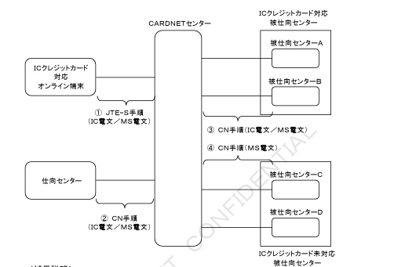
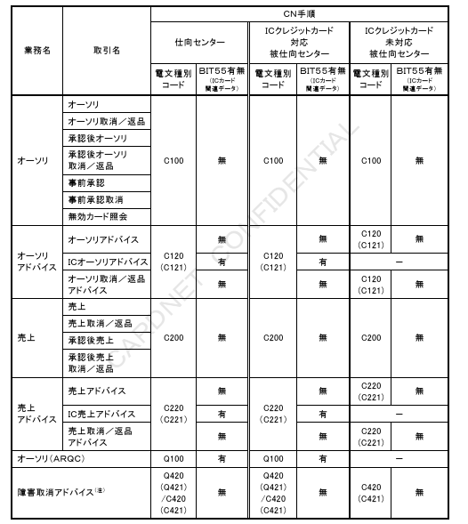

# はじめに

本書は、株式会社日本カードネットワークが提供するCARDNETオンライン接続サービスにおいて、ICクレジットカードの取引を実現するにあたり必要なオンライン処理に関する接続条件を記述したものです。

なお、本書は「CARDNET接続条件書（ダイレクト接続編）」を基に、ICクレジットカード取引に必要な変更点のみを記述した追加仕様書です。

関連事項については、「CARDNETオンライン接続サービス　ドキュメント体系説明書」をご参照のうえ、ご確認ください。

---

# 第１章　接続概要

本章では、ICクレジットカード取引における接続概要について定義する。

## １．１．概要

CARDNETセンターは、ICクレジットカード対応オンライン端末または仕向けセンターからのICクレジットカード取引のIC電文またはHSM電文を被仕向けセンターへ中継する。
ただし、ICクレジットカード未対応仕向センターに対しては、CARDNETセンターにてIC電文をHSM電文に変換した上で電文を中継する。

## １．２．ネットワーク構成

ネットワーク構成を図１－１に示す。

【図】図１－１　ネットワーク構成

＜補足説明＞

①ICクレジットカード対応オンライン端末は、JET-S手順によりCARDNETセンターへIC電文またはMS電文を送信する。

②仕向センターは、CNF手順によりCARDNETセンターへIC電文またはMS電文を送信する。

③CARDNETセンターは、CNF手順によりICクレジットカード対応被仕向センターへIC電文またはMS電文を中継する。

④CARDNETセンターは、CNF手順によりICクレジットカード未対応被仕向センターへMS電文を中継する。なお、ICクレジットカード対応オンライン端末または仕向センターから受信したIC電文についてはMS電文に変換した上で中継する。

## １．３．サービス概要

CARDNETセンターはICクレジットカード取引のIC電文を以下の方法で中継する。

① オーソリ（ARQC）は同期中継を行う。
② IC処理の取引承認結果は、アドバイス電文にて非同期中継を行う。

ただし、アドバイス電文による取引結果の非同期中継は、ICクレジットカード対応オンライン端末においては必須であるが、仕向センターにおいては、仕向センター毎の任意とする。

## １．４．処理種別

ICクレジットカード取引における処理種別を表１－１に示す。

表１－１　処理種別

| 処理種別（注１） | 内容 |
|---|---|
| IC処理 | イシュアに設定されたICクレジットカード上の各パラメータと、アクワイアラに設定されたICクレジットカード対応オンライン端末または仕向センター配下の端末上の各パラメータとを比較・検証し、取引上のリスクをICクレジットカードが判断（リスクマネジメント）する処理 |
| MS相当処理 | ICクレジットカード（ICチップ）上のクレジットアプリケーション内に格納された磁気ストライプ相当のデータ（注２）を利用し、MSクレジットカードと同様の処理を行う処理 |

注１：処理種別の識別はBIT22：POSデータコードにより識別する。詳細については、「第４章　電文項目説明」を参照。

注２：各ブランドのクレジット・アプリケーションには、「JISⅠ第2トラック情報」および「JISⅡ情報」に相当するデータを格納している。

## １．５．業務一覧

ICクレジットカード取引の業務の一覧を表１－２に示す。

表１－２　ICクレジットカード取引の業務一覧

| 業務名 | 取引名 | 処理種別 | 電文 |
|---|---|---|---|
| オーソリ | オーソリ | ―（注1） | MS電文（注2） |
| オーソリ | オーソリ取消／返品 | （注4）MS相当処理 | MS電文 |
| オーソリ | 承認後オーソリ | （注5）MS相当処理 | MS電文 |
| オーソリ | 承認後オーソリ取消／返品 | （注5）MS相当処理 | MS電文 |
| オーソリ | 事前承認 | MS相当処理 | MS電文 |
| オーソリ | 事前承認取消 | MS相当処理 | MS電文 |
| オーソリ | 無効カード照会 | MS相当処理 | MS電文 |
| オーソリアドバイス | オーソリアドバイス | ―（注1） | MS電文（注3） |
| オーソリアドバイス | ICオーソリアドバイス | IC処理 | IC電文（注3） |
| オーソリアドバイス | オーソリ取消／返品アドバイス | （注4）MS相当処理 | MS電文 |
| 売上 | 売上 | ―（注1） | MS電文 |
| 売上 | 売上取消／返品 | （注4）MS相当処理 | MS電文 |
| 売上 | 承認後売上 | MS相当処理 | MS電文 |
| 売上 | 承認後売上取消／返品 | MS相当処理 | MS電文 |
| 売上アドバイス | 売上アドバイス | ―（注1） | MS電文（注3） |
| 売上アドバイス | IC売上アドバイス | IC処理 | IC電文（注3） |
| 売上アドバイス | 売上取消／返品アドバイス | （注4）MS相当処理 | MS電文 |
| オーソリ（ARQC） | ― | IC処理 | IC電文（注2） |
| 障害取消アドバイス | ― | ― | 元取引電文 |

注1：J/SmartおよびD/S（Smartのアプリケーション起動時にICクレジットカードからMS相当処理を要求された場合（ステータスワードが "6E00" の場合のみMS相当処理が行われる。

注2：ICクレジットカード未対応被仕向センターに対して、オーソリ（ARQC）電文はオーソリ電文に変換した上で中継する。

注3：ICクレジットカード未対応被仕向センターに対して、ICオーソリアドバイス／IC売上アドバイス電文は、それぞれオーソリアドバイス／売上アドバイス電文に変換した上で中継する。

注4：ICクレジットカード取引における取消／返品業務は、同期中継型の取引と非同期中継型の取引がある。詳細については、「2.2　電文中継方式」を参照。

注5：承認後オーソリおよび承認後オーソリ取消／返品は、センター直接接続の取引のみ発生する。

## １．６．各業務とCN手順の関連

ICクレジットカード取引の各業務におけるCN手順との関連を表１－３に示す。

表１－３　各業務とCN手順の関連

【図】表１－３　各業務とCN手順の関連

注：Q420（Q421）は、取消対象取引がオーソリ（ARQC）の場合のみ使用される。
