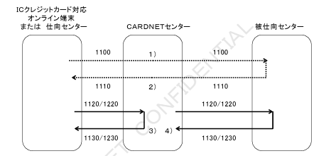
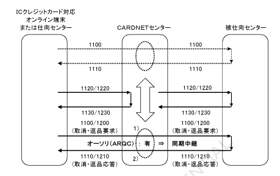
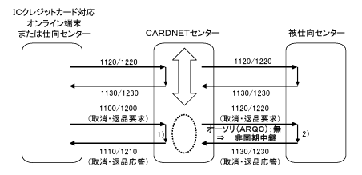

# 第２章　オンライン処理仕様

本章では、ICクレジットカード取引のオンライン処理方式について電文体系、および電文中継の処理仕様を定義する。

## ２．１．電文体系

CN手順にてICクレジットカード取引のオンライン処理でサポートする業務は、電文種別コード、MTI（電文タイプ）、プロセシングコード（BIT3）、ファンクションコード（BIT24）を組み合わせて表現される。
また取引により、ICカード関連情報（BIT55）の有無が決まる。
オンライン処理における電文体系を表２－１に定義する。

表２－１　オンライン処理における電文体系

| 業務名 | 取引名 | 電文種別コード | MTI | プロセシングコード | ファンクションコード | ICカード関連情報 |
|---|---|---|---|---|---|---|
| オーソリ | オーソリ | C100/C110 | 1100/1110 | 000000 | 100 | 無 |
| オーソリ | オーソリ取消／返品 | C100/C110 | 1100/1110 | 200000 | 100 | 無 |
| オーソリ | 承認後オーソリ | C100/C110 | 1100/1110 | 000000 | 100 | 無 |
| オーソリ | 承認後オーソリ取消／返品 | C100/C110 | 1100/1110 | 200000 | 100 | 無 |
| オーソリ | 事前承認 | C100/C110 | 1100/1110 | 000000 | 101 | 無 |
| オーソリ | 事前承認取消 | C100/C110 | 1100/1110 | 200000 | 101 | 無 |
| オーソリ | 無効カード照会 | C100/C110 | 1100/1110 | 360000 | 108 | 無 |
| オーソリアドバイス | オーソリアドバイス | C120（C121）/C130 | 1120（1121）/1130 | 000000 | 100 | 無 |
| オーソリアドバイス | ICオーソリアドバイス | C120（C121）/C130 | 1120（1121）/1130 | 000000 | 100 | 有 |
| オーソリアドバイス | オーソリ取消／返品アドバイス | C120（C121）/C130 | 1120（1121）/1130 | 200000 | 100 | 無 |
| 売上 | 売上 | C200/C210 | 1200/1210 | 200000 | 200 | 無 |
| 売上 | 売上取消／返品 | C200/C210 | 1200/1210 | 200000 | 200 | 無 |
| 売上 | 承認後売上 | C200/C210 | 1200/1210 | 200000 | 201 | 無 |
| 売上 | 承認後売上取消／返品 | C200/C210 | 1200/1210 | 200000 | 201 | 無 |
| 売上アドバイス | 売上アドバイス | C220（C221）/C230 | 1220（1221）/1230 | 200000 | 200 | 無 |
| 売上アドバイス | IC売上アドバイス | C220（C221）/C230 | 1220（1221）/1230 | 000000 | 200 | 有 |
| 売上アドバイス | 売上取消／返品アドバイス | C220（C221）/C230 | 1220（1221）/1230 | 200000 | 200 | 無 |
| オーソリ（ARQC） | ― | Q100/Q110 | 1100/1110 | 000000 | 100 | 有 |
| 障害取消アドバイス | ― | Q420（Q421）/Q430/C420（C421）/C430 | 1420（1421）/1430 | 元取引と同一 | 400 | 無 |

## ２．２．電文中継方式

ICクレジットカード取引のオーソリ（ARQC）電文は、同期中継型の処理方式にて中継される。
また、ICオーソリアドバイス、IC売上アドバイス、および障害取消電文は、非同期中継型の処理方式にて中継される。
なお、取消／返品取引については、同期中継型または非同期中継型のいずれかの処理方式にて中継される。ただし、仕向センターからはICオーソリアドバイス、IC売上アドバイスが送信されない場合がある。

### ２．２．１．IC処理電文中継処理

【図】図２－１　IC処理における電文中継処理

１）CARDNETセンターはICクレジットカード対応オンライン端末または仕向センターからのオーソリ（ARQC）要求電文（MTI 1100）を被仕向センターへ中継する。

２）CARDNETセンターは、被仕向センターからのオーソリ（ARQC）応答電文（MTI 1110）をICクレジットカード対応オンライン端末または仕向センターへ中継する。

３）CARDNETセンターは、ICクレジットカード対応オンライン端末または仕向センターからのICオーソリアドバイス要求電文、またはIC売上アドバイス要求電文（MTI 1120／1220）に対して、応答電文（MTI 1130／1230）を生成する。
なお、ICオーソリアドバイス要求電文、およびIC売上アドバイス要求電文は、ICクレジットカードでの最終取引判定結果であるため、CARDNETセンターはICクレジットカード対応オンライン端末または仕向センターに対して拒否応答はしない。ただし仕向センターに対しては、電文審査エラーにより拒否応答となる場合がある。

４）CARDNETセンターは、ICオーソリアドバイス要求電文、またはIC売上アドバイス要求電文（MTI 1120／1220）を被仕向センターへ中継する。
なお、ICオーソリアドバイス要求電文、およびIC売上アドバイス要求電文は、ICクレジットカードでの最終取引判定結果であるため、被仕向センターは拒否応答することはできない。

### ２．２．２．取消・返品取引電文中継処理

（１）オーソリ（ARQC）検索条件

CARDNETセンターは、ICクレジットカード取引におけるオーソリ取消・返品電文または売上取消・返品電文を受信した際に、以下の検索条件に基づき、オーソリ（ARQC）の有無を検索する。

＜オーソリ（ARQC）の有無検索条件＞

①オーソリ（ARQC）検索における検索項目は、会員番号、取引金額、伝票番号とする。
②オーソリ（ARQC）の検索範囲は、オーソリ取消・返品電文または売上取消・返品電文受信日の１ヶ月前までの取引とする。ただし、オーソリ（ARQC）検索に該当した取引は検索対象外とする。
③仕向け区分20が設定されている場合については、オーソリ（ARQC）検索を実施しない。

（２）取消・返品取引電文中継処理

オーソリ（ARQC）の有無検索実施の結果、CARDNETセンターではオーソリ取消・返品電文または売上取消・返品電文を下記の処理方式にて中継する。

①オーソリ（ARQC）送信済みの場合（元取引：オンライン処理）

被仕向センターへオーソリ（ARQC）が中継されている場合、被仕向センターへオーソリ取消・返品電文および売上取消・返品電文を同期中継する。（図２－２）

②オーソリ（ARQC）未送信の場合（元取引：オフライン処理）

被仕向センターへオーソリ（ARQC）が中継されていない場合、オーソリ取消・返品電文および売上取消・返品電文をオーソリ取消・返品アドバイス電文および売上取消・返品アドバイス電文に変換し、被仕向センターへ非同期中継する。（図２－３）

（注）元取引のICオーソリアドバイス電文またはIC売上アドバイス電文をCARDNETセンターが受信している場合は、オーソリ取消・返品電文および売上取消・返品電文を同期中継する。

【図】図２－２　取消・返品取引電文の同期中継処理（元取引：オンライン処理）

１）CARDNETセンターは、ICクレジットカード対応オンライン端末または仕向センターから取消・返品要求電文を受信した際にオーソリ（ARQC）の有無検索を行い、検索結果に基づき被仕向センターへ同期中継する。

２）CARDNETセンターは、被仕向センターからの取消・返品応答電文をICクレジットカード対応オンライン端末または仕向センターへ中継する。

【図】図２－３　取消・返品取引電文の非同期中継処理（元取引：オフライン処理）

１）CARDNETセンターは、ICクレジットカード対応オンライン端末または仕向センターからの取消・返品要求電文を受信した際にオーソリ（ARQC）の有無検索を行い、検索結果に基づき被仕向センターへ非同期中継する。その際、オンライン端末または仕向センターは、取消・返品応答電文を受信する。

２）CARDNETセンターは、取消・返品アドバイス要求電文へ変換し、被仕向センターへ非同期中継する。なお、取消・返品アドバイス要求電文は、ICクレジットカードでの最終判定結果であるため、被仕向センターは拒否応答することはできない。
